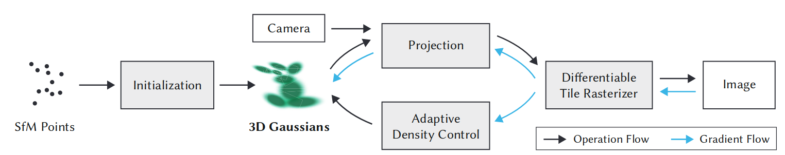
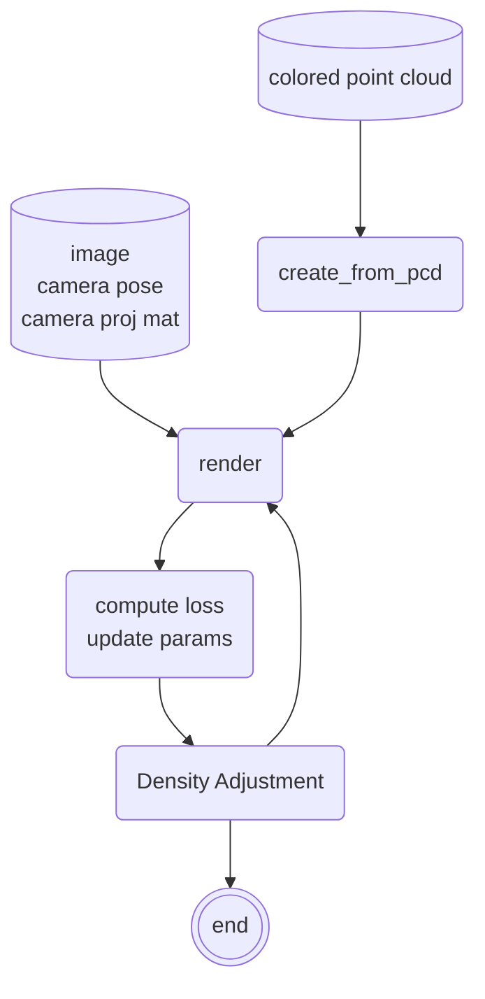
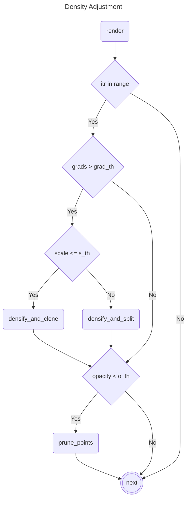

# Gaussian Splatting

## Data Structure
3d gaussian如何表示一个场景(数据结构).

| name | type | description |
| --- | --- | --- |
| xyz | $n \times 3$ floats | position |
| feature_dc | $n \times 3$ floats | dc component of spherical harmonics(最低的信号分量-均值, RGB每个分量一个) |
| features_rest | $n \times 4$ | rest component of spherical harmonics. |
| scaling | $n \times 3$ floats | xyz方向上的scale |
| rotation | $n \times 4$ floats | 四元数表示的旋转 |
| opacity | $n \times 1$ floats | $\mathrm{inv\_sigmoid}(\alpha)$, $\alpha$是真正的透明度. |
| max_radii2D | $n \times 1$ floats | gaussian在屏幕(图片)上投影椭圆长轴半径(在优化时用来考虑是否拆分或者删除). |

online visualization tool: https://playcanvas.com/super-splat

https://docs.spline.design/e17b7c105ef0433f8c5d2b39d512614e

test on [wikihuman](https://vgl.ict.usc.edu/Data/DigitalEmily2/) with Lumai

## Pipeline

### Rendering

### Density Adjustment
光栅化渲染输出:

| name | type | description |
| --- | --- | --- |
| image | | 渲染结果 |
| viewspace_point | |  |
| visibility_filter | $n \times 1$ bool | 投影后像素大于0 |
| radii | $n \times 1$ float | 投影后像素的大小 |

## Result and Evaluation

## Application
* 与传统3d渲染结合, 作为一个场景 —— 元象.
* [Relightable3DGaussian](https://github.com/NJU-3DV/Relightable3DGaussian)

## Project
[https://shenhanqian.github.io/gaussian-avatars]()
[COLMAP-Free 3D Gaussian Splatting](https://oasisyang.github.io/colmap-free-3dgs/)
[Relightable 3D Gaussian: Real-time Point Cloud Relighting with BRDF Decomposition and Ray Tracing](https://nju-3dv.github.io/projects/Relightable3DGaussian/)

dataset:
1. https://github.com/tobias-kirschstein/nersemble
2. https://crisalixsa.github.io/h3d-net/