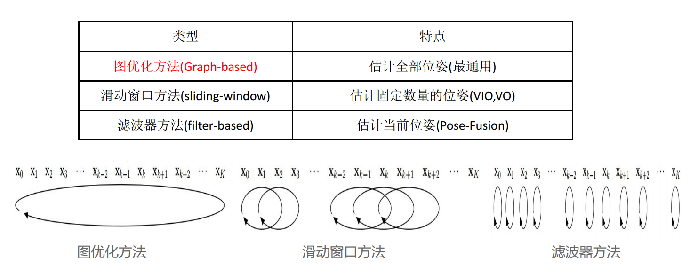

# 3D Lidar Slam Note
## 激光SLAM Overview
### 基于后端的分类
基于后端的分类(是否会去优化之前的激光帧, 会去优化多久之前的激光帧): 图优化的方法, 滑动窗口方法, 滤波器方法.

### Graph-based SLAM框架
①前端匹配 ②回环检测 ③后端优化

### 激光SLAM pipe line
①激光数据处理(激光雷达去畸变、 里程计标定)
②激光帧间匹配(最关键部分, 其他部分都十分类似, 区别不大， 该过程决定了SLAM最终结果的优劣) 
③激光回环检测
④后端优化

### 帧间匹配算法
| 方法  | 特点 |
| --- | --- |
| ICP | |
| CSM(correlation scan match) | 2D 暴力搜索, 能找到最优解 |
| PL-ICP(Point-to-Line Iterative Closet Point) | 2D 点到线的距离, 更符合室内结构化场景, 对初始解依赖度更高 |
| Plane-to-Plane ICP | 3D 面到面的距离 |
| NDT(Normal Distance Transform) | 3D 划分网格，拟合高斯分布，速度快 |
| NICP(Normal Iterative Closest Point) | 3D 引入法向量信息，角度精度更高 |
| LMLS-ICP | 3D 基于曲面拟合的ICP |
| Optimization-Based | 2D 依赖与地图的梯度(与PL-ICP类似, 但没有要求那么多线), 可以轻易引入额外约束 |
| Feature-Based | 3D提取特征点和描述符进行匹配 |

### 回环检测算法
| 方法 | 特点 |
| --- | --- |
| Scan-to-Scan | 计算量最小, 容易产生歧义 |
| Scan-to-Map | 计算量中, 中等歧义 |
| Map-to-Map | 计算量最大, 基本不产生歧义(Best) |

策略: Branch and Bound & Lazy Decision
2D SLAM最常用: CSM + 梯度优化, 比如cartograph(CSM+SBA).

### 激光SLAM的问题和趋势
1. ✔️运动畸变去除
2. 动态物体(一般通过动态物体检测与跟踪来解决)
3. 环境变化(高动态, 低动态)
    识别哪些是真的变化, 如何与原地图准确融合
4. ✔️几何结构相似环境(比如说长走廊)
5. 建图操作复杂(需要一定的背景知识)
5. ✔️全局定位
6. ✔️导致里程计不准的一些外因: 地面材质变化、地面凹凸不平、机器人载重改变

与视觉相融合是趋势, 视觉可以提供: ①高精度的里程信息 ②信息量更加丰富的视觉地图
✔️为可以通过视觉辅助解决