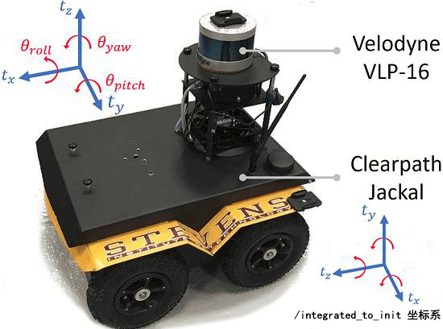

# LeGO-LOAM
[TOC]
## Overview
可分为4个部分:
1. segmentation
2. Lidar Odometry, feature extraction find transformation of relating consecutive scans
4. lidar mapping, register to global point cloud
5. transform integration, fuse the pose estimation result from lidar odo and lidar mappin

## Segmentation
`imageProjection.cpp`, 接收点云数据, 输出分割后的点云, 处理函数`cloudHandler`.
根据激光的特性, 将激光投影成一张深度图. 对于VLP-16激光(16线, 垂直方向: -15°~15°, 步长2°; 水平方向: 步长0.2°), 可以投影成一张1800 * 16 的深度图.
```c++
class ImageProjection {
    void projectPointCloud();
}
```

地面分离, 参考了`Fast Segmentation of 3D Point Clouds for Ground Vehicles`, 对同一水平方向上, 判断与上一根线(角度从小到大排列)之间的angle, 若小于10°, 则认为是地面.
```c++
class ImageProjection {
    void groundRemoval();
}
```

点云聚类, 参考了`Fast Range Image-based Segmentation of Sparse 3D Laser Scans for Online Operation`, 通过相邻两个laser beam之间的$\beta$角阈值来分类.
```c++
class ImageProjection {
    void cloudSegmentation(){}
};
```

最终输出, 点的种类(地面点or分类点, col index, range value):
```c++
for (size_t i = 0; i < N_SCAN; ++i) {
    segMsg.startRingIndex[i] = sizeOfSegCloud-1 + 5;
    // 地面点或非地面点, 以及col index
    for (size_t j = 0; j < Horizon_SCAN; ++j) {
        if (labelMat.at<int>(i,j) > 0 || groundMat.at<int8_t>(i,j) == 1){
            if (labelMat.at<int>(i,j) == 999999){
                if (i > groundScanInd && j % 5 == 0){
                    outlierCloud->push_back(fullCloud->points[j + i*Horizon_SCAN]);
                    continue;
                }else{
                    continue;
                }
            }
            if (groundMat.at<int8_t>(i,j) == 1){ // 滤掉了一部分地面点
                if (j%5!=0 && j>5 && j<Horizon_SCAN-5)
                    continue;
            }
            segMsg.segmentedCloudGroundFlag[sizeOfSegCloud] 
                = (groundMat.at<int8_t>(i,j) == 1);
            segMsg.segmentedCloudColInd[sizeOfSegCloud] = j;
            segMsg.segmentedCloudRange[sizeOfSegCloud]  = rangeMat.at<float>(i,j);
            segmentedCloud->push_back(fullCloud->points[j + i*Horizon_SCAN]);
            ++sizeOfSegCloud;
        }
    }
    segMsg.endRingIndex[i] = sizeOfSegCloud-1 - 5;
}
```

## Feature Association/Lidar Odometry
获取数据:
`FeatureAssociation::laserCloudHandler`, `FeatureAssociation::laserCloudInfoHandler`, `FeatureAssociation::outlierCloudHandler`,
`FeatureAssociation::imuHandler`.
处理函数: `runFeatureAssociation`.

### adjustDistortion
根据IMU的数据对激光点云做了矫正. 对于velodyne激光, 顺时针扫完一圈, 完成一个Sweep数据的采集.
这里假设IMU数据已经转换到LOAM假定的坐标系下, 即IMU数据已经经过了IMU2Lidar的标定处理.

```c++
double imuTime[imuQueLength];
// 根据IMU原始数据推导的姿态 global
float imuRoll[imuQueLength];
float imuPitch[imuQueLength];
float imuYaw[imuQueLength];

// 去除重力加速度后的IMU加速度值 local
float imuAccX[imuQueLength];
float imuAccY[imuQueLength];
float imuAccZ[imuQueLength];

// IMU对应帧时速度的积分值 global
float imuVeloX[imuQueLength];
float imuVeloY[imuQueLength];
float imuVeloZ[imuQueLength];

// IMU对应帧时距离的积分值 global
float imuShiftX[imuQueLength];
float imuShiftY[imuQueLength];
float imuShiftZ[imuQueLength];

// IMU 原始角速度 local
float imuAngularVeloX[imuQueLength];
float imuAngularVeloY[imuQueLength];
float imuAngularVeloZ[imuQueLength];

// IMU对应帧时欧拉角的积分值 global
float imuAngularRotationX[imuQueLength];
float imuAngularRotationY[imuQueLength];
float imuAngularRotationZ[imuQueLength];
```

这里也是用中值积分, 来预测位姿.
```c++
AccumulateIMUShiftAndRotation()
{
    // 先计算旋转
    // 先绕Z轴(原x轴)旋转,下方坐标系示意imuHandler()中加速度的坐标轴交换
    //  z->Y
    //  ^  
    //  |    ^ y->X
    //  |   /
    //  |  /
    //  | /
    //  -----> x->Z
    //
    //     |cosrz  -sinrz  0|
    //  Rz=|sinrz  cosrz   0|
    //     |0       0      1|
    // [x1,y1,z1]^T=Rz*[accX,accY,accZ]
    // 因为在imuHandler中进行过坐标变换，
    // 所以下面的roll其实已经对应于新坐标系中(X-Y-Z)的yaw
    float x1 = cos(roll) * accX - sin(roll) * accY;
    float y1 = sin(roll) * accX + cos(roll) * accY;
    float z1 = accZ;

    // 绕X轴(原y轴)旋转
    // [x2,y2,z2]^T=Rx*[x1,y1,z1]
    //    |1     0        0|
    // Rx=|0   cosrx -sinrx|
    //    |0   sinrx  cosrx|
    float x2 = x1;
    float y2 = cos(pitch) * y1 - sin(pitch) * z1;
    float z2 = sin(pitch) * y1 + cos(pitch) * z1;

    // 最后再绕Y轴(原z轴)旋转
    //    |cosry   0   sinry|
    // Ry=|0       1       0|
    //    |-sinry  0   cosry|
    accX = cos(yaw) * x2 + sin(yaw) * z2;
    accY = y2;
    accZ = -sin(yaw) * x2 + cos(yaw) * z2;

    // 计算位移
    int imuPointerBack = (imuPointerLast + imuQueLength - 1) % imuQueLength;
    double timeDiff = imuTime[imuPointerLast] - imuTime[imuPointerBack];
    if (timeDiff < scanPeriod) {
        imuShiftX[imuPointerLast] = imuShiftX[imuPointerBack] 
            + imuVeloX[imuPointerBack] * timeDiff + accX * timeDiff * timeDiff / 2;
        // ...
    }
}
```

激光数据的插补(运动补偿)
只有激光数据的时间戳小于最新IMU数据的时间戳时, 才进行插补
```c++
// 对激光数据进行插补
for (int i = 0; i < cloudSize; i++) {
    // 计算是否已经过半
    // 由于无法准确控制swap开始和结束时激光的水平角度, 可能会有所偏差
    // 因此对于特别小的角度\alpha和2\pi+alpha, 无法区分
    // 这里通过half_passed来判断
    float ori = -atan2(point.x, point.z);
    if (!halfPassed) {
        if (ori < segInfo.startOrientation - M_PI / 2)
    	// start-ori>M_PI/2，说明ori小于start，不合理，
		// 正常情况在前半圈的话，ori-stat范围[0,M_PI]
        ori += 2 * M_PI;
        else if (ori > segInfo.startOrientation + M_PI * 3 / 2)
            ori -= 2 * M_PI; // ori-start>3/2*M_PI,说明ori太大，不合理
        if (ori - segInfo.startOrientation > M_PI)
            halfPassed = true;
    } else {
        ori += 2 * M_PI;
        if (ori < segInfo.endOrientation - M_PI * 3 / 2)
     	    ori += 2 * M_PI; // end-ori>3/2*PI,ori太小
        else if (ori > segInfo.endOrientation + M_PI / 2)
            ori -= 2 * M_PI; // ori-end>M_PI/2,太大
    }
    if(i == 0) {
        // 只有激光数据的时间戳小于最新IMU数据的时间戳时, 才进行插补
        if (timeScanCur + pointTime > imuTime[imuPointerFront]) {
            // do nothing
        } else {
            // 通过插值计算swap开始时的位姿
        }
    } else {
        // 速度投影到初始i=0时刻
        VeloToStartIMU();
    	// 将点的坐标变换到初始i=0时刻
        TransformToStartIMU(&point);        
    }
}
```

### calculateSmoothness
计算平滑值. 根据激光的特性计算每个点的平滑值, 以区分特征.
$$
c = \frac{1}{|S| \cdot \parallel r_i \parallel } \parallel \sum_{j \in S, j \ne i} (r_j - r_i) \parallel
$$
这里S是点i左右连续的10个点(左右各5各点).

```c++
class FeatureAssociation{
    void calculateSmoothness();
}
```

### markOccludedPoints
滤除被遮挡的点(S中被更近的物体遮挡), 防止特征误判.
```c++
class FeatureAssociation{
    void markOccludedPoints()
    {
        for (int i = 5; i < cloudSize - 6; ++i){
            float depth1 = segInfo.segmentedCloudRange[i];
            float depth2 = segInfo.segmentedCloudRange[i+1];
            int columnDiff = std::abs(int(segInfo.segmentedCloudColInd[i+1] 
                - segInfo.segmentedCloudColInd[i]));

            if (columnDiff < 10){

                // 若左边被遮挡(深度大), 则左边5个点均不用来计算feature
                if (depth1 - depth2 > 0.3){
                    cloudNeighborPicked[i - 5] = 1;
                    cloudNeighborPicked[i - 4] = 1;
                    cloudNeighborPicked[i - 3] = 1;
                    cloudNeighborPicked[i - 2] = 1;
                    cloudNeighborPicked[i - 1] = 1;
                    cloudNeighborPicked[i] = 1;
                }else if (depth2 - depth1 > 0.3){
                    // 若右边被遮挡, 则右边5个点均不用来计算feature
                    cloudNeighborPicked[i + 1] = 1;
                    cloudNeighborPicked[i + 2] = 1;
                    cloudNeighborPicked[i + 3] = 1;
                    cloudNeighborPicked[i + 4] = 1;
                    cloudNeighborPicked[i + 5] = 1;
                    cloudNeighborPicked[i + 6] = 1;
                }
            }
            
            // columnDiff >= 10 时, 单独计算 i
            float diff1 = std::abs(segInfo.segmentedCloudRange[i-1] 
                - segInfo.segmentedCloudRange[i]);
            float diff2 = std::abs(segInfo.segmentedCloudRange[i+1]
                - segInfo.segmentedCloudRange[i]);
            if (diff1 > 0.02 * segInfo.segmentedCloudRange[i] 
                && diff2 > 0.02 * segInfo.segmentedCloudRange[i])
                cloudNeighborPicked[i] = 1;
        }
    }
}
```

### extractFeatures
特征提取. 根据论文给的方法, 提取特征点集合$F_e$不属于地面且最sharp的2个点, $F_p$属于地面且最flat的4个点, $\mathbb{F}_e$不属于地面且最sharp的20个点, $\mathbb{F}_p$ flat的点. edge\_threshold = edgeThreshold = 0.1. 
```c++
for (int i = 0; i < N_SCAN; i++) {
    for (int j = 0; j < 6; j++) { // 分为6个sub image
        std::sort(cloudSmoothness.begin()+sp, cloudSmoothness.begin()+ep, by_value());
        for (int k = ep; k >= sp; k--) {
        int ind = cloudSmoothness[k].ind;
        // 提取edge点
        if (cloudNeighborPicked[ind] == 0 &&
            cloudCurvature[ind] > edgeThreshold &&
            segInfo.segmentedCloudGroundFlag[ind] == false)
            { ... }
        }
        // 提取平面点(平面的点只用属于地面的点)
        for (int k = sp; k <= ep; k++) {
            int ind = cloudSmoothness[k].ind;
            if (cloudNeighborPicked[ind] == 0 &&
                cloudCurvature[ind] < surfThreshold &&
                segInfo.segmentedCloudGroundFlag[ind] == true) {
            }
        }
        // 其他flat的点
        for (int k = sp; k <= ep; k++) {
            if (cloudLabel[k] <= 0) {
                surfPointsLessFlatScan->push_back(segmentedCloud->points[k]);
            }
        }
    }

}
```
这里的输出是: `cornerPointsSharp`, `cornerPointsLessSharp`, `surfPointsFlat`, `surfPointsLessFlat`.

### calculate odo transformation
初始化. 当前帧(cornerPointsLessSharp, surfPointsLessFlat)和上一帧(laserCloudCornerLast, laserCloudSurfLast), 以及kdtree的构建.
```c++
class FeatureAssociation{
    void checkSystemInitialization();
}
```

位姿计算. 这里使用*Two-Step L-M Optimization*: 先根据地面特征计算俯仰、翻滚角和高度值; 再根据edge特征, 计算yaw, 和水平方向上的移动. 在实现中, y轴向上.
```c++
class FeatureAssociation{
    void updateTransformation(){
        for (int iterCount1 = 0; iterCount1 < 25; iterCount1++) {
            findCorrespondingSurfFeatures(iterCount1);
            if (calculateTransformationSurf(iterCount1) == false)
                break;
        }

        for (int iterCount2 = 0; iterCount2 < 25; iterCount2++) {
            findCorrespondingCornerFeatures(iterCount2);
            if (calculateTransformationCorner(iterCount2) == false)
                break;
        }
    }
}
```

findCorrespondingSurfFeatures. 每隔5次迭代执行一次. 当前帧的4个flat点, 在上一帧寻找三个最近的flat点, 另外两个近flat点满足行列的距离要求(intensity), 与最近点的行差不超过2行.
```c++
for (int i = 0; i < surfPointsFlatNum; i++) {
    // 坐标变换到开始时刻，参数0是输入，参数1是输出
    // surfPointsFlat 中插入的是segment points
    // 已经是adjust distorition之后 转换到start imu坐标系下的点了
    // 然后再将其转换到上一个激光帧的坐标系下 by zsw
    TransformToStart(&surfPointsFlat->points[i], &pointSel);
    // 当迭代第5的倍数次时, 才更新feature的对应
    if (iterCount % 5 == 0) {
        // 在上一帧的点云中找到满足intensity条件(why, 防止过分远), 且距离最近的三个点
        kdtreeSurfLast->nearestKSearch(pointSel, 1, pointSearchInd, pointSearchSqDis);
        int closestPointInd = -1, minPointInd2 = -1, minPointInd3 = -1;
        if (pointSearchSqDis[0] < nearestFeatureSearchSqDist) {
            closestPointInd = pointSearchInd[0];
            int closestPointScan = int(laserCloudSurfLast->points[closestPoin.intensity);
            // intensity = (float)rowIdn + (float)columnIdn / 10000.0;
            float pointSqDis, minPointSqDis2 = nearestFeatureSearchSqDist, 
            minPointSq= nearestFeatureSearchSqDist;
            // 往后一行找
            for (int j = closestPointInd + 1; j < surfPointsFlatNum; j++) {
                if (int(laserCloudSurfLast->points[j].intensity)>closestPointScan + 2.5)
                    break;
            }
            // 往前一行找
            for (int j = closestPointInd - 1; j >= 0; j--) {
                if (int(laserCloudSurfLast->points[j].intensity)<closestPointScan - 2.5)
                    break;
                // ...
            }
        }
    }

    // 根据当前点位, 更新weight和残差
｝
```

calculateTransformationSurf, 高度以及俯仰、翻滚角的计算.
在计算能量偏导时, 使用分步积分的方式. 可以根据中间计算的结果, 对能量进行化简:
$$
\begin{aligned}
d_\mathcal{H} &= \frac{
\left|\begin{array}{c}{\left(\tilde{X}_{(k, i)}^{L}-\bar{X}_{(k-1, j)}^{L}\right)} \\ {\left(\left(\bar{X}_{(k-1, j)}^{L}-\bar{X}_{(k-1, l)}^{L}\right) \times\left(\bar{X}_{(k-1, j)}^{L}-\bar{X}_{(k-1, m)}^{L}\right)\right)}\end{array}\right|}{\left|\left(\bar{X}_{(k-1, j)}^{L}-\bar{X}_{(k-1, l)}^{L}\right) \times\left(\bar{X}_{(k-1, j)}^{L}-\bar{X}_{(k-1, m)}^{L}\right)\right|} \\
d_\mathcal{H} &= ((X - X_j) \cdot X_p)^2
\end{aligned}
$$
这里X是当前激光帧上的每个属于地面的平面特征点, $X_p$为在上一帧上找到的对应平面的单位法向(由$X_j, X_l, X_m$计算得到). 从而有:
$$
\frac{\partial d_\mathcal{H}}{\partial T_s} = (\frac{\partial d_\mathcal{H}}{\partial X})^T \cdot (\frac{\partial X}{\partial T_s})^T = c \cdot X_p^T \cdot (\frac{\partial X}{\partial T_s})^T
$$
这里c是$(X-X_j)\cdot X_p$的计算值, 在迭代超过5次之后, 根据点的特性对c做一个调整. 在原Lidar坐标系中$T_s = [\theta_x \theta_y t_z]$, 在IMU坐标系中$T_s = [\theta_z \theta_x t_y]$.  $\frac{\partial d_\mathcal{H}}{\partial X} = s * c * X_p$, 在实现中, 将其拆分为方向和intensity两部分.
```c++
void findCorrespondingSurfFeatures(int iterCount){
    // 计算平面单位法向量 [pa, pb, pc], 并根据点到平面的距离计算一个intensity权重
    if (pointSearchSurfInd2[i] >= 0 && pointSearchSurfInd3[i] >= 0) {
        float pa = (tripod2.y - tripod1.y) * (tripod3.z - tripod1.z) 
                - (tripod3.y - tripod1.y) * (tripod2.z - tripod1.z);
        float pb = (tripod2.z - tripod1.z) * (tripod3.x - tripod1.x) 
                - (tripod3.z - tripod1.z) * (tripod2.x - tripod1.x);
        float pc = (tripod2.x - tripod1.x) * (tripod3.y - tripod1.y) 
                - (tripod3.x - tripod1.x) * (tripod2.y - tripod1.y);
        float pd = -(pa * tripod1.x + pb * tripod1.y + pc * tripod1.z);
        float ps = sqrt(pa * pa + pb * pb + pc * pc);
        pa /= ps;
        pb /= ps;
        pc /= ps;
        pd /= ps;
        // pd2 = _H = ~ - pd, 可正可负
        float pd2 = pa * pointSel.x + pb * pointSel.y + pc * pointSel.z + pd;
        float s = 1; // s是一个scale
        if (iterCount >= 5) {
            s = 1 - 1.8 * fabs(pd2) / sqrt(sqrt(pointSel.x * pointSel.x
                    + pointSel.y * pointSel.y + pointSel.z * pointSel.z));
        }

        if (s > 0.1 && pd2 != 0) { // 点i不在平面上, 需要优化, pd2!=0
            coeff.x = s * pa; // 方向也加上scale
            coeff.y = s * pb;
            coeff.z = s * pc;
            coeff.intensity = s * pd2; // 加上scale的距离
            laserCloudOri->push_back(surfPointsFlat->points[i]);
            coeffSel->push_back(coeff);
        }
    }
}
```

分别计算沿x轴的旋转`arx`, 沿z轴的旋转`arz`和沿着y轴方向的平移`aty`的微分, 并使用高斯牛顿法迭代计算. 这里有一个很坑的地方是， 在LOAM的实现中`transformCur`记录的值都是负的, 而且其转换方式是$R(x-t)$.

$$
\begin{aligned}
J &= \frac{\partial d_\mathcal{H}}{\partial T_s} = c \cdot X_p^T \cdot (\frac{\partial X}{\partial T_s})^T\\
\frac{\partial X}{\partial T_s} &= \frac{\partial{R_{yxz}(x - t)}}{\partial{[ez \quad ex \quad ty]}}\\
R_{yxz} &= R_y(-ey) \cdot R_x(-ex) \cdot R_z(-ez)\\
&= \begin{bmatrix}\cos{\left( \mathit{ey}\right) } \cos{\left( \mathit{ez}\right) }-\sin{\left( \mathit{ex}\right) } \sin{\left( \mathit{ey}\right) } \sin{\left( \mathit{ez}\right) } & \cos{\left( \mathit{ey}\right) } \sin{\left( \mathit{ez}\right) }+\sin{\left( \mathit{ex}\right) } \sin{\left( \mathit{ey}\right) } \cos{\left( \mathit{ez}\right) } & -\cos{\left( \mathit{ex}\right) } \sin{\left( \mathit{ey}\right) }\\
-\cos{\left( \mathit{ex}\right) } \sin{\left( \mathit{ez}\right) } & \cos{\left( \mathit{ex}\right) } \cos{\left( \mathit{ez}\right) } & \sin{\left( \mathit{ex}\right) }\\
\sin{\left( \mathit{ex}\right) } \cos{\left( \mathit{ey}\right) } \sin{\left( \mathit{ez}\right) }+\sin{\left( \mathit{ey}\right) } \cos{\left( \mathit{ez}\right) } & \sin{\left( \mathit{ey}\right) } \sin{\left( \mathit{ez}\right) }-\sin{\left( \mathit{ex}\right) } \cos{\left( \mathit{ey}\right) } \cos{\left( \mathit{ez}\right) } & \cos{\left( \mathit{ex}\right) } \cos{\left( \mathit{ey}\right) }\end{bmatrix}\\
\end{aligned}
$$

在实现中, 先计算了$\frac{\partial{R_{yxz}}}{\partial{ex}}$和$\frac{\partial{R_{yxz}}}{\partial{ez}}$, 分别对应到代码中的a和b.

$$
\begin{aligned}
\frac{\partial{R_{yxz}}}{\partial{ex}} &= \begin{bmatrix}-\cos{\left( \mathit{ex}\right) } \sin{\left( \mathit{ey}\right) } \sin{\left( \mathit{ez}\right) } & \cos{\left( \mathit{ex}\right) } \sin{\left( \mathit{ey}\right) } \cos{\left( \mathit{ez}\right) } & \sin{\left( \mathit{ex}\right) } \sin{\left( \mathit{ey}\right) }\\
\sin{\left( \mathit{ex}\right) } \sin{\left( \mathit{ez}\right) } & -\sin{\left( \mathit{ex}\right) } \cos{\left( \mathit{ez}\right) } & \cos{\left( \mathit{ex}\right) }\\
\cos{\left( \mathit{ex}\right) } \cos{\left( \mathit{ey}\right) } \sin{\left( \mathit{ez}\right) } & -\cos{\left( \mathit{ex}\right) } \cos{\left( \mathit{ey}\right) } \cos{\left( \mathit{ez}\right) } & -\sin{\left( \mathit{ex}\right) } \cos{\left( \mathit{ey}\right) }\end{bmatrix}\\
\frac{\partial{R_{yxz}}}{\partial{ez}} &= \begin{bmatrix}-\cos{\left( \mathit{ey}\right) } \sin{\left( \mathit{ez}\right) }-\sin{\left( \mathit{ex}\right) } \sin{\left( \mathit{ey}\right) } \cos{\left( \mathit{ez}\right) } & \cos{\left( \mathit{ey}\right) } \cos{\left( \mathit{ez}\right) }-\sin{\left( \mathit{ex}\right) } \sin{\left( \mathit{ey}\right) } \sin{\left( \mathit{ez}\right) } & 0\\
-\cos{\left( \mathit{ex}\right) } \cos{\left( \mathit{ez}\right) } & -\cos{\left( \mathit{ex}\right) } \sin{\left( \mathit{ez}\right) } & 0\\
\sin{\left( \mathit{ex}\right) } \cos{\left( \mathit{ey}\right) } \cos{\left( \mathit{ez}\right) }-\sin{\left( \mathit{ey}\right) } \sin{\left( \mathit{ez}\right) } & \sin{\left( \mathit{ex}\right) } \cos{\left( \mathit{ey}\right) } \sin{\left( \mathit{ez}\right) }+\sin{\left( \mathit{ey}\right) } \cos{\left( \mathit{ez}\right) } & 0\end{bmatrix}
\end{aligned}
$$

`calculateTransformationSurf`函数解析:
```c++
for (int i = 0; i < pointSelNum; i++) {
    // ...
    matA.at<float>(i, 0) = arx;
    matA.at<float>(i, 1) = arz;
    matA.at<float>(i, 2) = aty;
    matB.at<float>(i, 0) = -0.05 * d2; // 这里0.05是高斯牛顿的迭代步长
}
if (iterCount == 0) {
    cv::Mat matE(1, 3, CV_32F, cv::Scalar::all(0));
    cv::Mat matV(3, 3, CV_32F, cv::Scalar::all(0));
    cv::Mat matV2(3, 3, CV_32F, cv::Scalar::all(0));
    cv::eigen(matAtA, matE, matV);
    matV.copyTo(matV2);
    isDegenerate = false;
    float eignThre[3] = {10, 10, 10};
    for (int i = 2; i >= 0; i--) {
        // 当特征值过小, 表示在这个方向上移动, loss变化不大, 因此, 不做移动.
        if (matE.at<float>(0, i) < eignThre[i]) {
            for (int j = 0; j < 3; j++) {
                matV2.at<float>(i, j) = 0;
            }
            isDegenerate = true;
        } else {
            break;
        }
    }
    matP = matV.inv() * matV2;
}
if (isDegenerate) {
    cv::Mat matX2(3, 1, CV_32F, cv::Scalar::all(0));
    matX.copyTo(matX2);
    matX = matP * matX2;
}
```

以上计算的是两帧激光之间的transform, 函数`integrateTransformation`将之前累计的transform结合起来, publish transform_to_start.

## Mapping
### Pipe line:
```c++
// 若时间差小于0.005则跳过
if (timeLaserOdometry - timeLastProcessing >= mappingProcessInterval) {
    timeLastProcessing = timeLaserOdometry;
    
    // 通过与上一帧的odo rt对比得到一个相对于上一帧的rt, 再通过上一帧调整过后的rt,
    // 转换到map的坐标系下(Loam noted之中称为世界坐标系与odo的世界坐标系不同, 注意区分)
    transformAssociateToMap();

    // 抽取周围的关键帧
    // 若启用闭环, 则取最近时间的50帧
    // 若不启用闭环, 则搜索距离50m内的激光帧作为新加关键帧
    // 然后与上一次的关键帧两两对比, 去除看不到的关键帧(新关键), 加入新的关键帧.
    // [这个地方全部用新帧替换即可, 为什么要这么麻烦???]
    // 然后点云下采样 corner 0.2m^3, surfel和outlier0.4m^3
    extractSurroundingKeyFrames();

    // 下采样当前帧与keyframe相同的采样参数
    downsampleCurrentScan();
    
    // 当前扫描进行边缘优化，图优化以及进行LM优化的过程
    scan2MapOptimization();

    // 将位姿信和关键帧保存
    saveKeyFramesAndFactor();

    // 根据位姿优化的结果更新关键帧位姿
    correctPoses();

    // 
    publishTF();
    publishKeyPosesAndFrames();
    clearCloud();
}
```

### cornerOptimization
```c++
// 在down sampled keyframe中搜索当前帧corner最近的5个点
kdtreeCornerFromMap->nearestKSearch(pointSel, 5, pointSearchInd, pointSearchSqDis);
// 若到最近的第4个点距离<1才计算loss
if (pointSearchSqDis[4] < 1.0) {
    // 计算这5个点的协方差 \sum (x_i - \bar{x})^T (x_i -\bar{x})
    // 对协方差进行eigen分解
    // 若最大的eigen value > 3*次大的eigen value才认为该corner feature的correspondense是可靠的
    // 计算当前点到之前的单位化垂直向量m, 从而loss = s*(x - x_c)^T m, 这里s是一个scale
    // 源码在求解m时, 写得不是很好
    // 从而可以化简为 loss = s*m^T x + s*x_c^Tm, 对应于intensity中的值
}
```

### surfOptimization
```c++
// 与cornerOptimization类似, 只有当最近的第4个点<1才计算loss
if (pointSearchSqDis[4] < 1.0) {
    // 取5个点, 拟合平面
    // 这里假设平面方程为 Ax + By + Cz + D = 0
    // 即有 (A/D)x + (B/D)y + (C/D)z = -1

    // 求解完成后, 代入这5个点, 若出现误差超过0.2的情况, 则认为是误配
}
```
构造完成后使用LM优化.

### Loop Closure
```c++
// 闭环检测
// 次新关键帧, 与30s之前, 且与当前帧最近的帧的附近帧闭环
detectLoopClosure()
{
    kdtreeHistoryKeyPoses->setInputCloud(cloudKeyPoses3D);
    // 搜索半径5m内的所有位姿节点
    // currentRobotPosPoint：需要查询的点，
    // pointSearchIndLoop：搜索完的邻域点对应的索引
    // pointSearchSqDisLoop：搜索完的每个邻域点与当前点之间的欧式距离
    // 0：返回的邻域个数，为0表示返回全部的邻域点
    kdtreeHistoryKeyPoses->radiusSearch(currentRobotPosPoint, 
        historyKeyframeSearchRadius, pointSearchIndLoop, pointSearchSqDisLoop, 0);
    
    // 选取时长超过30秒的且最近一个节点, 其id记为 closestHistoryFrameID

    // 将最后一帧关键帧记为 latestFrameIDLoopCloure

    // 将latestSurfKeyFrameCloud最远关键帧的所有点

    // 查找最近帧附近前后25帧的点云保存到nearHistorySurfKeyFrameCloud
    for (int j = -historyKeyframeSearchNum; j <= historyKeyframeSearchNum; ++j){
        if (closestHistoryFrameID + j < 0 
            || closestHistoryFrameID + j > latestFrameIDLoopCloure)
        continue;
        // 要求closestHistoryFrameID+j在0到cloudKeyPoses3D->points.size()-1之间,不能超过索引
        *nearHistorySurfKeyFrameCloud 
        += *transformPointCloud(cornerCloudKeyFrames[closestHistoryFrameID+j],
            &cloudKeyPoses6D->points[closestHistoryFrameID+j]);
        *nearHistorySurfKeyFrameCloud 
            += *transformPointCloud(surfCloudKeyFrames[closestHistoryFrameID+j],
                &cloudKeyPoses6D->points[closestHistoryFrameID+j]);
    }
}

// 闭环优化
// latestSurfKeyFrameCloud 到 nearHistorySurfKeyFrameCloudDS的ICP配准
// 若不收敛, 或者分数(sum of squared distances from the source to the target)太高, 则返回
// 使用gtsam优化
)
```

### TransformFusion
将Lidar Odometry和mapping的结果做融合, 说白了就是: 有优化结果了就拿这一时刻的优化结果作为轨迹,没有优化结果只有里程计结果了,就直接拿里程计结果作为这一时刻的轨迹.
```c++
// 接收到/laser_odom_to_init 消息
// 通过laserOdometryHandler, 转换到mapping的坐标系下, 发布tf
void laserOdometryHandler(const nav_msgs::Odometry::ConstPtr& laserOdometry);

// 接受到aft_mapped_to_init 消息
// 通过odomAftMappedHandler, 发布tf
void odomAftMappedHandler(const nav_msgs::Odometry::ConstPtr& odomAftMapped);
```

## Performance


## Reference
[三维SLAM算法LeGO-LOAM源码阅读](https://blog.csdn.net/weixin_42048023/article/details/87866452)
[LeGO-LOAM源码阅读笔记](https://wykxwyc.github.io/2019/01/21/LeGO-LOAM-code-review-mapOptmization/)
[Optimized LeGO-LOAM](https://github.com/facontidavide/LeGO-LOAM-BOR)
[LeGo-LOAM NOTED](https://github.com/wykxwyc/LeGO-LOAM_NOTED)
[LOAM细节分析](https://zhuanlan.zhihu.com/p/57351961)
[velodyne_loam官方doc](https://loam-velodyne.readthedocs.io/en/latest/LaserMapping/lasermapping.html)