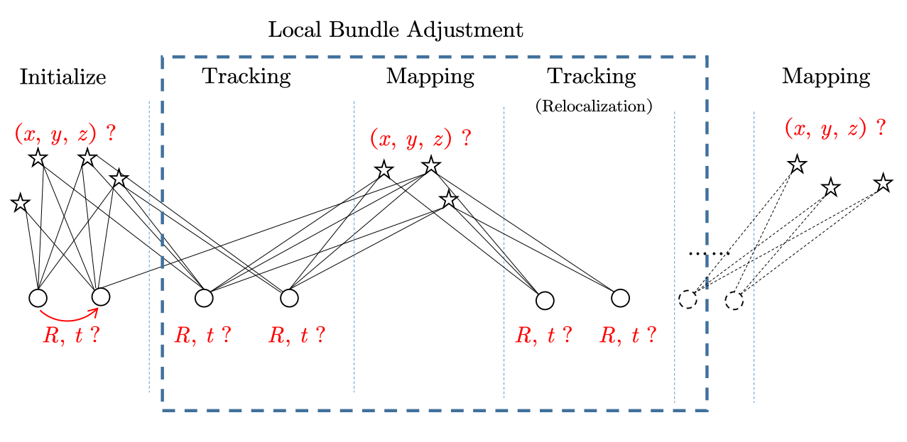

# ORB-SLAM代码架构分析
## 代码概要
主要进程:


* Tracking
* Local Mapping
* Loop Detection, Loop Correction

主要逻辑文件:

System.cc ORB-SLAM封装, 供外部调用
Initializer.cc 初始化(主要是单目初始化)
Tracking.cc ORB-SLAM视觉里程计, 帧间位姿跟踪计算
LocalMapping.cc 局部地图构建维护
LoopClosing.cc 闭环检测

其他主要类(数据结构和算法):

```c++
class Frame
class KeyFrame
class KeyFrameDatabase
class Map
class Optimizer
```

简单VO流程:


## QA
1. Initialization 代码阅读
2. Tracking流程是否是简单的pnp
    * 根据恒速模型预测下一帧位姿, 然后优化位姿 (TrackWithMotionModel)
    * 以最近关键帧作为当前位姿, 然后优化位姿 (TrackWithKeyFrame)
    * 若VO正常, 跟踪局部地图, 得到更精准的位姿 (TrackLocalMap) TODO
    * 重定位, pnp + 优化 (Relocalization)
3. Tracking中的参数值的理解

4. 关于亚像素匹配

3. 局部地图维护实现代码
    * Frame、KeyFrame的关系

    * 主要的数据结构及其作用

    * 局部地图关键帧的增删

4. 闭环检测和闭环优化

5. 重定位和闭环的区别