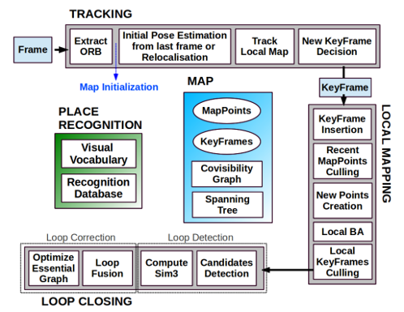
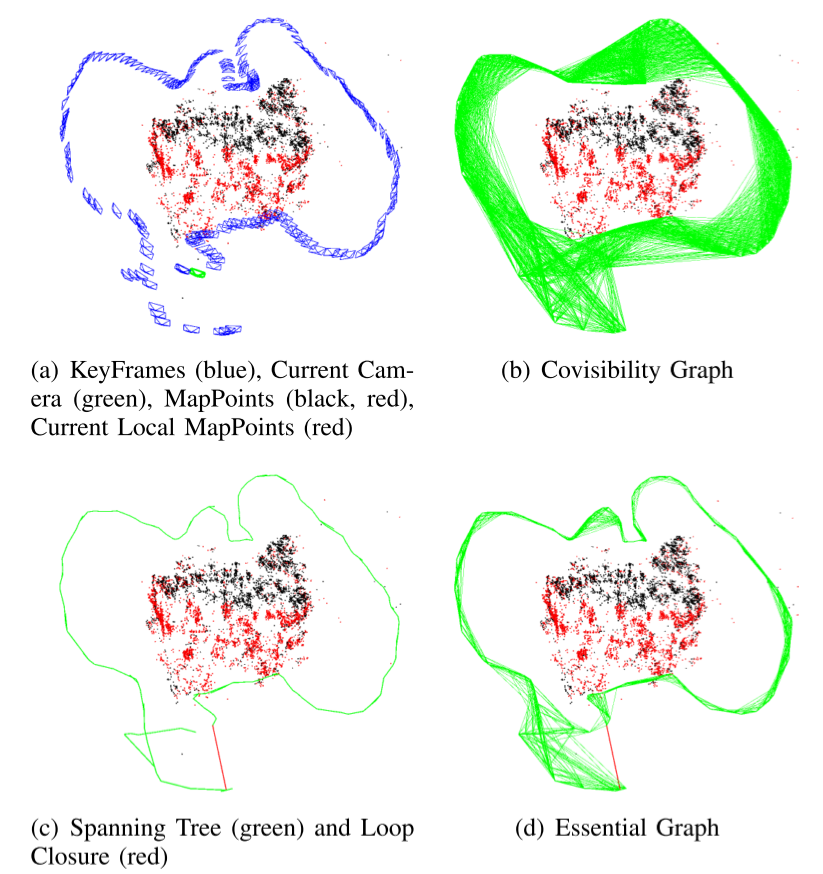

# ORB-SLAM模块分析
概要: 提出了一个实时、准确、可靠的视觉里程计系统
需要解决的问题是: 实时、准确(精度)、可靠(光照变化, 稳定, 不容易挂, 且能恢复)
论文分为以下几个部分:
* Section I
    总地介绍了ORB-SLAM 系统，以及主要的贡献(实时、稳定, survial of the fittest 关键帧选取策略等)
* Section III
    System OVerview, 提出了算法的三个线程. 并介绍了Covisibility Graph, Essential Graph. 以及Bags of Words Place Recognition.
* Section IV
    初始化的介绍
* Section V, VI, VII
    分别是Tracking, Local Mapping, Loop Closing的介绍

算法分以下几个部分进行阅读:
1. Tracking
    特征提取、初始化+全局重定、局部地图跟踪、关键帧选择
2. Local Mapping
    局部地图的维护, 包括关键帧的插入, 滤波, BA等
3. Loop Closing
    包括Loop Detection和Loop Correction



关键词/概念介绍
* Covisibility Graph
    由关键帧组成的带有权重的无向图. 关键帧之间若有边的权重表示着两个关键帧匹配的点的数量, 若匹配点少于15个, 则没有边.
    >  Each node is a keyframe and an edge between two keyframes exists if they share observations of the same map points (at least 15), being the weight θ of the edge the number of common map points
    
* Essential Graph
    为了减少边的规模, 通过最小生成树, 在保证连通性的前提下, 移除一些权重小的边.



## Tracking
### 特征点提取
为了确保特征的均匀分布. 
1. 使用图像金子塔, 每一层的与上一层的候选特征数量比例与图像的放缩比例一致.
2. 先使用大的阈值来求特征, 若特征数量为0, 则使用小的阈值来求特征.
3. 求出特征后, 给每个栅格提供相同的候选数量, 若有的栅格提供不出足够多的候选特征, 再将多余的候选特征按照相同的规则均匀分配给有多余特征的栅格. 特征点提取完毕之后, 计算`Orientation`和特征描述算子`OrbDescriptor`.

### 初始化
目的: ???
要求: 自动不对环境有要求.
方法: 同时计算Fundamental Matrix和Homography Matrix, 并自动选择.
Pipeline:
1. 特征匹配, 直到有足够多的匹配则进入下一步
2. 同时计算 $H_{cr}$和$F_{cr}$

$$
\mathrm{x}_c = H_{cr} \mathrm{x}_r \quad \quad \mathrm{x}_c^T F_{cr} \mathrm{x}_r = 0
$$

3. 选择合适的模型
$$
R_H = \frac{S_H}{S_H + S_F}
$$
当$R_H>0.45$时, 认为是平面的场景, 选取Homography Matrix; 否则选取Fundamental Matrix.

4. 计算相机的位姿.

####
在计算$H_{cr}$时, 虽然有$\mathrm{x}_c = H_{cr} \mathrm{x}_r$, 但这里用的是齐次坐标, 因此, 事实上这两个向量并不相等(有一个未知的scale), 约束可以定义为$\mathrm{x}_c \times H_{cr} \mathrm{x}_r = 0$. 设$\mathrm{x}_c = (x, y, w)$, 则有:
$$
    \begin{bmatrix}
        0^T & -w \mathrm{x}_r^T & y \mathrm{x}_r^T\\
        w \mathrm{x}_r^T & 0^T & -x \mathrm{x}_r^T\\
        -y \mathrm{x}_r^T & x \mathrm{x}^T & 0^T
    \end{bmatrix} \begin{bmatrix}
        \mathrm{h}^1 \\
        \mathrm{h}^2 \\
        \mathrm{h}^3
    \end{bmatrix} = 0
$$
这里其中两个是线性无关的, 第三项可由前两项线性相加得到. 从而有约束:
$$
    \begin{bmatrix}
        0^T & -w \mathrm{x}_r^T & y \mathrm{x}_r^T\\
        w \mathrm{x}_r^T & 0^T & -x \mathrm{x}_r^T
    \end{bmatrix} \begin{bmatrix}
        \mathrm{h}^1 \\
        \mathrm{h}^2 \\
        \mathrm{h}^3
    \end{bmatrix} = 0
$$
由此可知, 最少由4组点即可求出$H$.


### 全局重定位
利用ORB特征, 构建字典, 通过字典进行全局重定位.

### 局部地图跟踪
将局部地图上的点投影到相机上, 寻找更多的correspondences.

### 关键帧的选择
关键帧需要满足的条件

## Local Mapping
局部地图的维护(points culling in key frames, creation, key frame culling)和优化(BA)

## Loop Closing
通过字典检测相邻的key frame的相似度. 为了保证正确性, 必须找到超过3个闭环, 才算是闭环.

## Code Analysis
### Monocular
PipeLine:
```c++
// in file mono_tmu.cc
// argv[1] - vocabulary; argv[2] - camera_setting
ORB_SLAM2::System SLAM(argv[1],argv[2],ORB_SLAM2::System::MONOCULAR,true)
{
    // init(construct) tracking, with vocabulary and camera setting
    mpTracker = new Tracking(this, mpVocabulary, mpFrameDrawer, mpMapDrawer,
                             mpMap, mpKeyFrameDatabase, strSettingsFile, mSensor);
}

// in file mono_tmu.cc
// trac the img by slam system
SLAM.TrackMonocular(im,tframe)
{
    cv::Mat Tcw = mpTracker->GrabImageMonocular(im,timestamp)
    {
        if(mState==NOT_INITIALIZED || mState==NO_IMAGES_YET)
            mCurrentFrame = Frame(mImGray,timestamp,mpIniORBextractor,mpORBVocabulary,
                mK,mDistCoef,mbf,mThDepth);
        else
            mCurrentFrame = Frame(mImGray,timestamp,mpORBextractorLeft,
                mpORBVocabulary,mK,mDistCoef,mbf,mThDepth);
        Track()
        {
            // initialization
            // lost manage
            // ...
        }
    }
}
```

ORBExtractor:
```c++
ComputeKeyPointsOctTree()
{
    computeOrientation();
}

computeOrbDescriptor()
```

Initialization:
```c++
// in file Tracking.cc
void Tracking::MonocularInitialization()
{
    // Find correspondences
    ORBmatcher matcher(0.9,true);

    // 在去畸变后的图片窗口中寻找匹配
    // 最佳匹配比次佳匹配明显要好，那么最佳匹配才真正靠谱
    // 根据方向剔除误匹配的点
    int nmatches = matcher.SearchForInitialization(mInitialFrame,mCurrentFrame,
        mvbPrevMatched,mvIniMatches, 100);

    // 根据匹配, 计算F或H, 做初始化
    if(mpInitializer->Initialize(mCurrentFrame, mvIniMatches, Rcw, tcw, mvIniP3D, vbTriangulated))
    {
        // 使用RANSAC, 随机选取8个点, 计算结果, 判断inlier和outlier. 计算F和H
        
    }
}
```


## 拓展
### 评价
优势:
1. 在静态环境下定位准确, 稳定
    1.1 回环检测
    1.2 特征点的提取优化    
2. 单双目均可达到实时
3. 代码可读性强, 易扩展

劣势:
1. 建的地图点云稀疏
2. 运行速度上特征点的提取成为瓶颈
3. 动态物体敏感