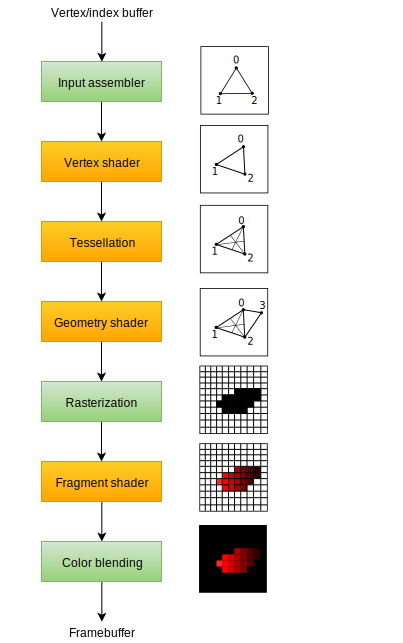
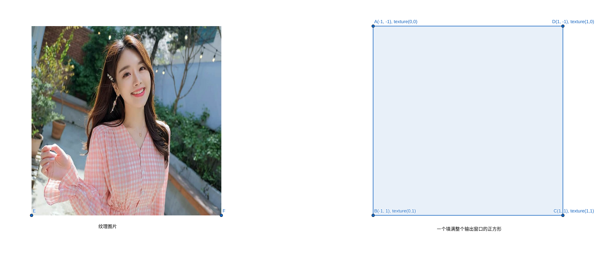
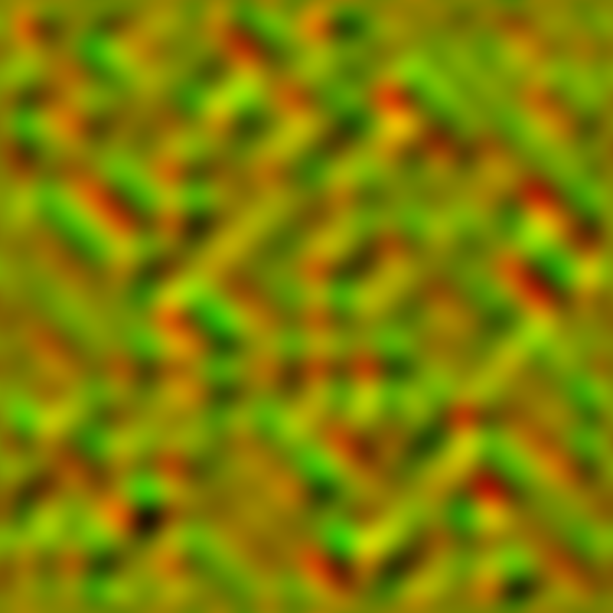
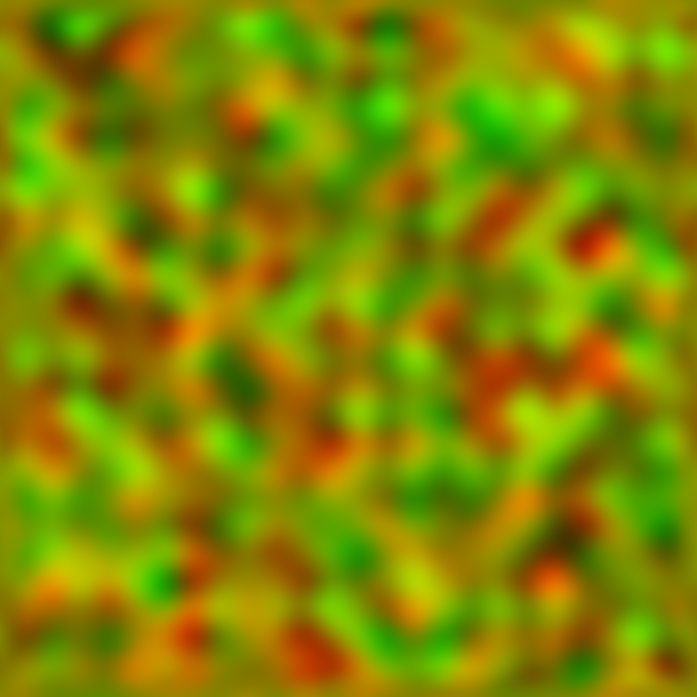
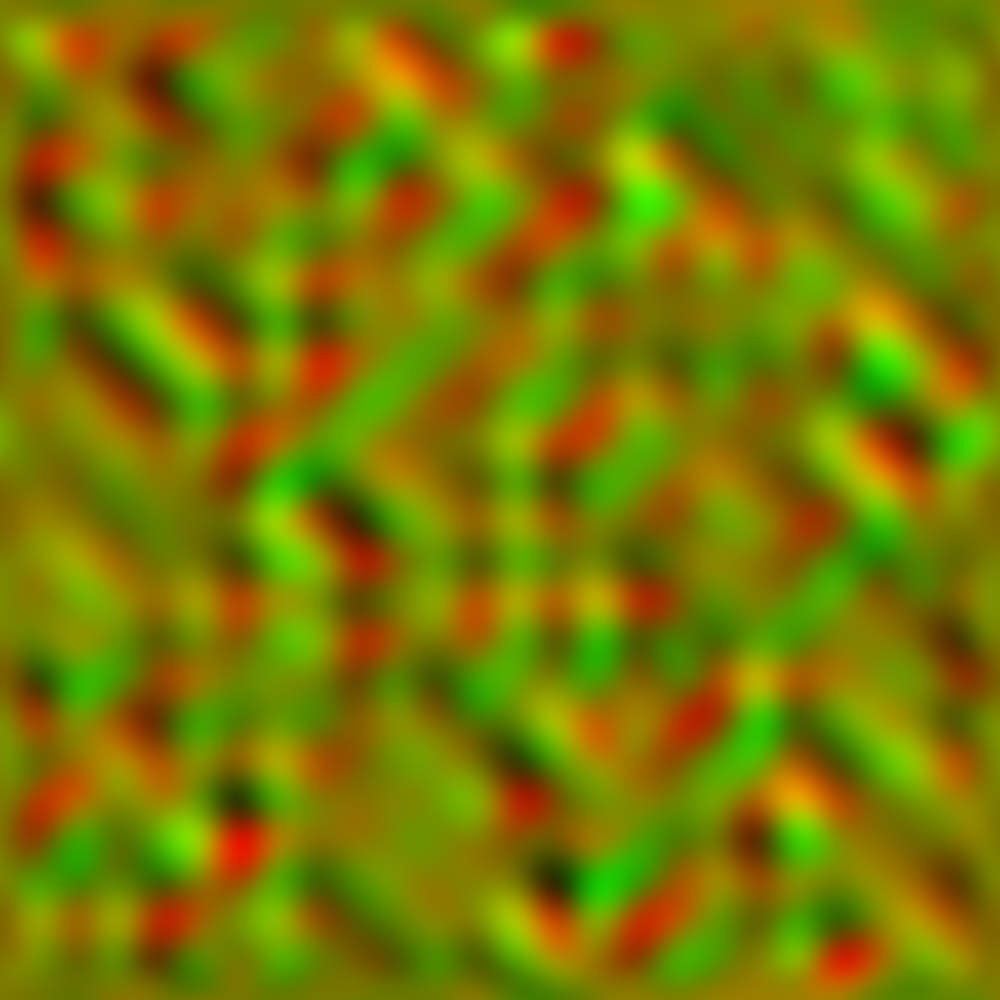

# 一些简单特效原理

## 一些简单特效原理

滤镜(曝光), 湍流置换.


Rendering Pipeline:



在我们的应用场景中, 操作最多的是`Fragment Shader`, 这里用到的也是Fragment Shader.

输入一张图片, 贴到全屏幕上, 然后对其颜色进行重新计算并显示.



## Exposure ——调整曝光的滤镜

滤镜本质上是颜色的一个函数:
$$
\mathrm{res}_{rgba} = f(\mathrm{params},\mathrm{input}_{rgba})
$$
这里, $\mathrm{params}$是exposure, offset, gamma这些参数.  通过一系列的努力, 我们得到了这个函数, 然后将其写成代码:
$$
\begin{aligned}
\mathrm{res}_r &= (off(r, \mathrm{offset}_r)*\exp(\mathrm{exposure}_r))^{1.0/\mathrm{gamma}}\\
\mathrm{off}(r, \mathrm{offset}_r) &= \quad ... 
\end{aligned}
$$
这里rgb三通道所对应的函数是相同的.

```c++
float apply_offset(float x, float y)
{
    if(y<0.0)
    {
        float bp = 0.464718181687013 + 0.148897630028037*log(0.0761973876132542 - 3.69128928500786*y) - 0.374675386588236*y;
        if(x < bp) return 0.0;
        return x+0.248967608657087*y + 0.943808986094993*y/(0.0675642563543009 + x + 1.82290859887865*y + 0.943808986094993*x*y + 4.19494506868985*x*x*x - 0.943808986094993*y*y);
    }
    float bp = 2.10766178205468 + 3.01597653520333/(y - 2.71173462618154);
    if(x > bp) return 1.0;
    return x+0.248967608657087*y + 0.943808986094993*y/(0.0675642563543009 + x + 1.82290859887865*y +0.943808986094993*x*y + 4.19494506868985*x*x*x - 0.943808986094993*y*y);
}

void main() {
    vec2 uv = (gl_FragCoord.xy / iResolution.xy);
    vec4 color = texture(iChannel0, uv);
    
    // offset
    color.x = apply_offset(color.x, offset);
    color.y = apply_offset(color.y, offset);
    color.z = apply_offset(color.z, offset);

    // exposure
    color.xyz = color.xyz*exp(0.289275662274758*exposure);

    // gamma
    color.x = pow(color.x, 1.0/gamma);
    color.y = pow(color.y, 1.0/gamma);
    color.z = pow(color.z, 1.0/gamma);
    
    gl_FragColor = color;
}
```

## Turbulence displacement ——湍流置换

其本质是一个计算像素位置偏移的函数:
$$
\begin{aligned}
(u',v') &= f(\mathrm{param}, u, v)\\
color(u, v) &= \mathrm{image}(u', v')
\end{aligned}
$$
我们通过噪声来对像素位置做一个扰动(不同类型的湍流置换, 对应不同类型的噪声).



 





```c++
vec2 calc_normalized_coord(vec2 frag_coord, vec2 off, float am)
{
    vec2 disp_index = fract(ori_size/u_dis_size*frag_coord + 0.5 + off);
#ifdef SHADER_TOY
    vec2 disp = texture2D(iChannel1, disp_index).xy;
#else
    #if defined(ETGL_TEXEL2_BGRX)
        vec2 disp = texture2D(uBitmap2, disp_index).bg;
    #elif defined(ETGL_TEXEL2_BGRA)
        vec2 disp = texture2D(uBitmap2, disp_index).bg;
    #elif defined(ETGL_TEXEL2_RGBX)
        vec2 disp = texture2D(uBitmap2, disp_index).rg;
    #endif
#endif
    // restore to 0~65535, x-->green, y-->red
    float restore_x = /*disp[0] * 255.0 +*/ disp[1] * 65280.0;
    float restore_y = /*disp[2] * 255.0 +*/ disp[0] * 65280.0;
    // 0~65535 map to [-offset, ori_len - offset]
    int dis_type = int(u_dis_type+0.5);
    float dis_x = (dis_type == 10) ? 0.0 : restore_x * ori_len[dis_type] * 1.525902189669642e-5 - offset[dis_type];
    float dis_y = (dis_type == 9) ? 0.0 : restore_y * ori_len[dis_type] * 1.525902189669642e-5 - offset[dis_type];

    float s = u_dis_size/ori_size;
    float ss = s - 9.19798746971319e-5 *s*s*s*s*s;
    return ss * am/ori_amount * vec2(dis_x, dis_y);
}
```

