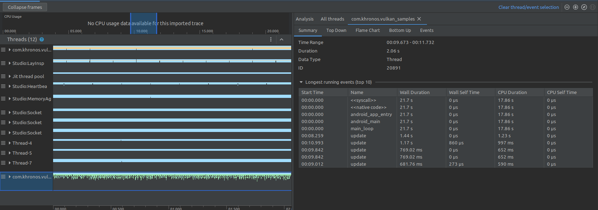
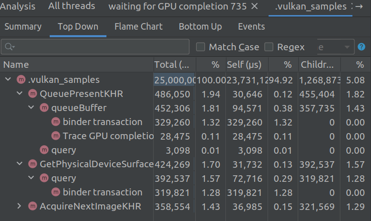
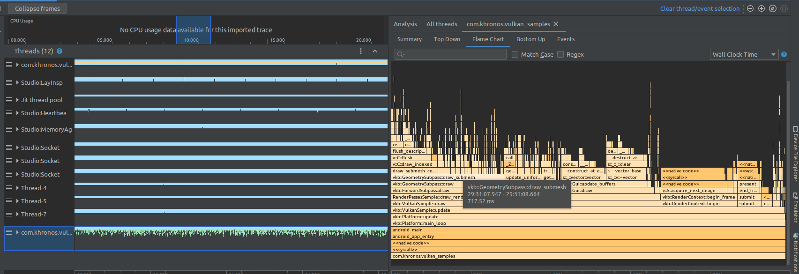
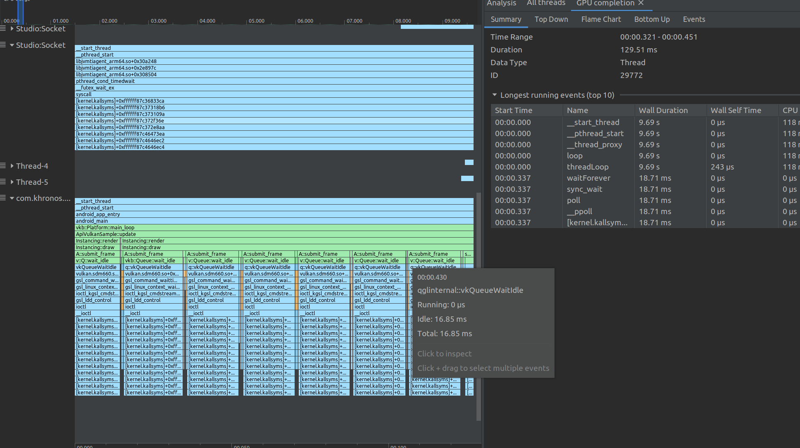
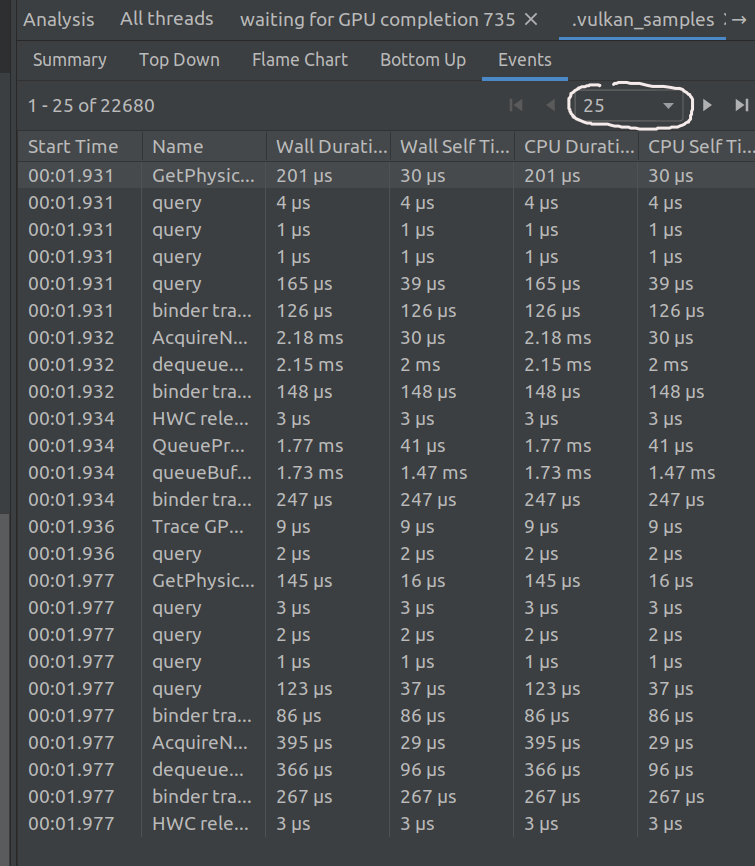
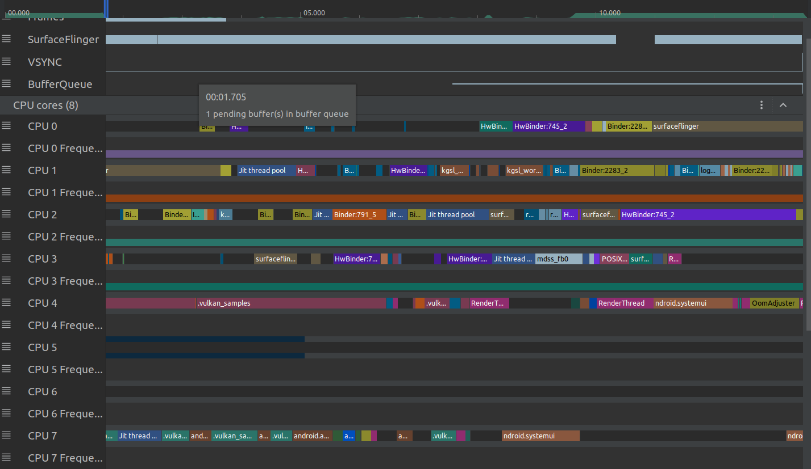
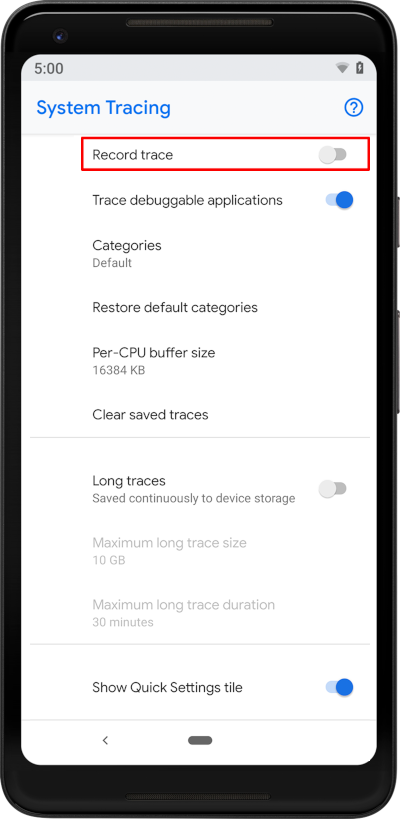
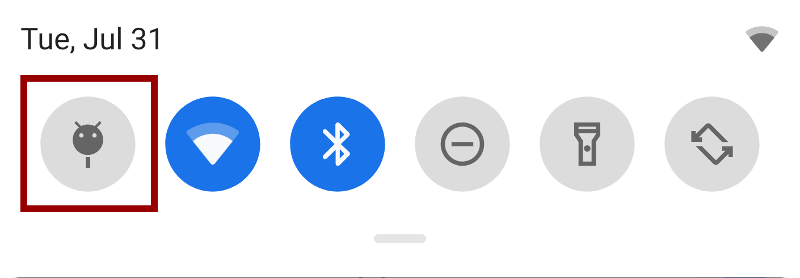

# Android CPU Profile

先参考[Android笔记-build.gradle文件详解](android.md), App编译为`RelWithDebInfo`. 然后进行profile record.

在record之后, 可以通过点击线程的名字, 来选择展示特定线程/或多个线程(shift选取)的Summary, Top Down, Flame Char, Bottom Up 和 Events. 
 
在CPU Usage中可以选取时间段(对Events无效).



## Summary
显示汇总信息, 时间跨度, 时间间隔, 以及运行时间最长的10个event(见上图).

## Top Down & Bottom Up
线程耗时堆栈.


## Flame Chat
火焰图提供一个倒置的图表, 来汇总展示线程的调用堆栈和时间消耗. 
火焰图中, 会将具有相同调用堆栈的函数汇总起来, 因此 __横坐标不代表时间轴, 而是执行每个函数的相对时间__.
火焰图中, 不同的属性的函数以不同的颜色表示: __橙色表示系统库函数, 绿色表示APP的函数, 蓝色表示第三方库函数__.


火焰图:


点开线程, 看到线程中的函数随着时间的调用情况:


## Event
按照时间顺序, 分页显示了各个函数的调用情况:


## System Trace
System Trace 可以用来分析App运行时CPU的使用情况. 相比于Profile, 粒度大很多, 无法看到底下的函数调用. 可以用来预判多线程计算的潜在性能提升.



在Android API 29以上, 可以通过系统自带的System Trace抓取性能信息.
在开发者选项中将启用, 并添加到下拉列表: `Developer Options` -> `System Tracing`-> enable `Show Quick Settings tile`



设置完成后, 就可以在下拉列表中进行录制:


通过adb获取录制的结果:

```bash
adb pull /data/local/traces/ .

# 删除原有的trace结果
adb shell
rm -rf /data/local/traces/*
```

## Reference
[Android CPU Studio Profile Activity](https://developer.android.com/studio/profile/inspect-traces?hl=en)
[Android CPU Capture a system trace on a device](https://developer.android.com/topic/performance/tracing/on-device?hl=en)
[Android CPU system trace report](https://developer.android.com/topic/performance/tracing/navigate-report?hl=en#analysis)