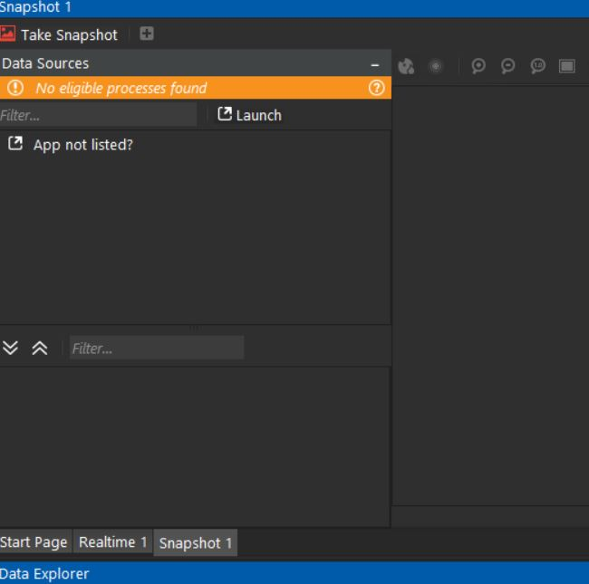
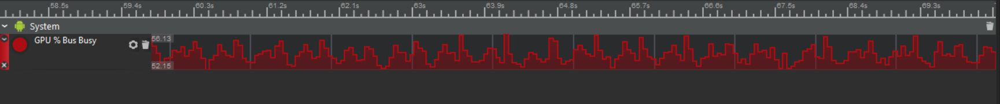

# Android GPU Profile

两种方案:
* [Android GPU Inspector](https://developer.android.com/agi/start#system-profile)
    当前支持的设备较少, 作为分析工具而言是比较棒的.
    

* 使用类似`snapdragon`的工具.
    该工具也不怎么好用, 能够拿到一些信息. [度量参数参考](https://blog.csdn.net/wangqing008/article/details/106481938)
    
    通过实时trace, 可以看到在direction blur这个特效中, texture miss很大, 时间几乎花在texture fetch上:
    

    vulkan无法抓单帧:
    

    GPU的图并没有像AGI那么方便去分析什么时候GPU是空闲的, 以便消除GPU气泡.
    

* 现代图形API自带的query API进行统计分析.

* 使用Arm提供的[HWCPipe](https://github.com/ARM-software/HWCPipe/tree/5a0c3d0b527bea96154998f29177f3b449cebd3a)
    提供了一些基本的参数信息, 对大自了解性能有帮助. 但无法细致分析性能瓶颈.

## Reference
[Android GPU Inspector](https://developer.android.com/agi/start#system-profile)