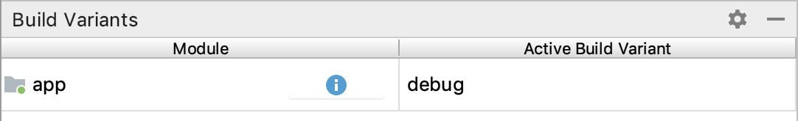

# Android Develop
## Android构建工具
* gradle
    一个高级的构建工具, 使用DSL语言来组织构建配置.
    >An advanced build toolkit, to automate and manage the build process, while allowing you to define flexible custom build configurations, using DSL language.
* android plugin for gradle
    一个android专用的插件, 与gradle一起用来构建和测试android应用.
    >Works with the build toolkit to provide processes and configurable settings that are specific to building and testing Android applications.


文件目录
```
MyApp/
├── build.gradle #项目的全局配置
├── settings.gradle #用于指定项目中所有需要引入的模块(需要加入编译的模块)
├── gradle.properties #全局的属性配置, 比如Gradle daemon's maximum heap size.
├── local.properties #用于指定本地的编译环境, 如android sdk的路径
└── app
    ├── build.gradle # defines build configurations of module
    └── ...(source code)
```

### build.gradle文件详解

settings.gradle
```json
rootProject.name = "android_opengles" # 这里必须和很目录名称一致
```

[@Configure your build](https://developer.android.com/studio/build#module-level)
项目的build.gradle文件:
```json
// 本文件一般自动生成
// Top-level build file where you can add configuration options common to all sub-projects/modules.
buildscript {
    /**
     * repositories指定用来搜索和下载依赖的仓库.
     * 常用的包括: JCenter, Maven Central, and Ivy.
     */
    repositories {
       google()
       jcenter()
    }

    /**
     * 依赖的gradle版本
     * version 4.1.0 as a classpath dependency.
     */
    dependencies {
        classpath 'com.android.tools.build:gradle:4.0.0'
    }
}

/**
 * allprojects是应用到所有模块的配置
 */
allprojects {
    repositories {
        google()
        jcenter()
    }
}
```

APP的gradle文件:
```json
apply plugin: 'com.android.application'

android {
    compileSdkVersion 29
    ndkVersion '21.2.6472646'
    
    defaultConfig {
        /**
         * applicationId用于指定唯一的用来发布时的id.
         * However, your source code should still reference the package name
         * defined by the package attribute in the main/AndroidManifest.xml file.
         */
        applicationId 'com.android.gl2jni'
        minSdkVersion 14
        targetSdkVersion 28
        externalNativeBuild {
            cmake {
                // Available arguments are inside ${SDK}/cmake/.../android.toolchain.cmake file
                arguments '-DANDROID_STL=c++_static'
            }
        }
        versionName '1.0.0'
        versionCode 1
    }

    /**
     * 不同编译版本的设置
     */
    buildTypes {
        // 启用调试, cmake 生成RelWithDebInfo
        debug {
            debuggable true
            jniDebuggable true
        }
        release {
            minifyEnabled = false
            proguardFiles getDefaultProguardFile('proguard-android.txt'),
                          'proguard-rules.pro'
        }

        debug {
            minifyEnabled = false
            proguardFiles getDefaultProguardFile('proguard-android.txt'),
        }                    'proguard-rules.pro'

    }
    externalNativeBuild {
        cmake {
            version '3.10.2'
            path 'src/main/cpp/CMakeLists.txt'
        }
    }
}
```

### AndroidManifest.xml详解
启动时候的状态配置, 以及依赖的opengles配置. [@Android构建清单](https://developer.android.com/guide/topics/manifest/manifest-intro?hl=zh-cn)

```xml
<?xml version="1.0" encoding="utf-8"?>
<manifest xmlns:android="http://schemas.android.com/apk/res/android"
          package="com.android.gl2jni">
  <uses-feature android:glEsVersion="0x00020000"/>
  <application
      android:allowBackup="false"
      android:fullBackupContent="false"
      android:icon="@mipmap/ic_launcher"
      android:label="@string/gl2jni_activity">
    <activity android:name="GL2JNIActivity"
              android:theme="@android:style/Theme.NoTitleBar.Fullscreen"
              android:launchMode="singleTask"
              android:configChanges="orientation|keyboardHidden">
      <intent-filter>
        <action android:name="android.intent.action.MAIN" />
        <category android:name="android.intent.category.LAUNCHER" />
      </intent-filter>
    </activity>
  </application>
</manifest>
```


### 调试或运行版本
[@调试运行配置](https://developer.android.com/studio/run)
默认情况下, 在您点击 Run 后, Android Studio 会构建应用的调试版本, 不过这仅供在开发期间使用. 

如要更改 Android Studio 使用的构建变体, 请在菜单栏中依次选择 Build > Select Build Variant. 

对于不含原生/C++ 代码的项目, Build Variants 面板有两列：Module 和 Active Build Variant. 模块的 Active Build Variant 值决定了 IDE 部署到连接的设备并显示在编辑器中的构建变体.



## NDK和SDK
* android sdk (Android Software Development Kit, 即android软件开发工具包
    可以说只要你使用java去开发Android这个东西就必须用到. 他包含了SDK Manager 和 AVD Manage, 对于android系统的一些开发版本的管理以及模拟器管理. 它只能运行纯java程序, 有了它模拟器才可以使用. 
    [SDK 平台版本说明](https://developer.android.com/studio/releases/platforms?hl=zh-cn)
* ndk (Native Development Kit)跟sdk差不多的是它也是一个开发工具包. 
    用它开发c/c++是很方便的. 他有一个强大的编译集合. Java调C、C++(jni接口), 是一些java如何调C的代码. 它会把C代码编译成一个.SO的动态库, 通过jni接口用java代码去调用它, 有了它我们可以直接在android代码中去添加C代码.

    __Android NDK从r13起, 默认使用Clang进行编译.__ [@Android NDK Clang迁移](https://zhuanlan.zhihu.com/p/27470060)
    但是暂时也没有把GCC删掉,Google会一直等到libc++(Clang的c++标准库实现, gcc使用libstdc++)足够稳定后删掉GCC.


## ADB
在默认android-studio的android-sdk/platform-tools下会有一个adb. 另外在linux下, 也可以通过apt来安装.

常用命令:
```bash
# 下载文件
adb pull [file/dir on device] [local file/dir]

# ssh链接
adb shell
```

## Java和C++
JNI运行时加载C++动态库, 调用其中的函数.
```java
public class RendererJNI implements GLSurfaceView.Renderer {
    // Used to load the 'native-lib' library on application startup.
    static {
        System.loadLibrary("native-lib");
    }
```

## Android opengles 应用
这里以helo-gl2为例[@Android demo项目(包括opengl es)](https://github.com/android/ndk-samples.git)

只绘制一次的问题:

```java
mGLSurfaceView.setRenderMode(RENDERMODE_CONTINUOUSLY);
```


### OpenGL ES动态加载
参考[ndk_sample/gles3jni](https://github.com/android/ndk-samples/tree/main/gles3jni)
* OpenGL ES 2.0 - 此 API 规范受 Android 2.2（API 级别 8）及更高版本的支持.
* OpenGL ES 3.0 - 此 API 规范受 Android 4.3（API 级别 18）及更高版本的支持.
* OpenGL ES 3.1 - 此 API 规范受 Android 5.0（API 级别 21）及更高版本的支持.
* OpenGL ES 3.2 - API 24

可以根据 \_\_ANDROID_API\_\_ 来选择不同的头文件:
```c++
#if __ANDROID__
// OpenGL ES 2.0 api >= 8
// OpenGL ES 3.0 api >= 18
// OpenGL ES 3.1 api >= 21
// OpenGL ES 3.2 api >= 24
#if __ANDROID_API__ < 18
#include <kiwi/backend/opengl/gles31_stub.h>
#else
inline int gles31Init() { return 0; }
#if __ANDROID_API__ >= 24
#include <GLES3/gl32.h>
#elif __ANDROID_API__ >= 21
#include <GLES3/gl31.h>
#else
#include <GLES3/gl3.h>
#endif //__ANDROID_API__ >= 21
#endif // __ANDROID_API__ < 18
```

## Android opencv
参考项目:[android-opencv](https://cloud.tencent.com/developer/article/1723892)
这里构建ktolinproject
[lib_opencv import失败处理](https://stackoverflow.com/questions/68649524/opencv-android-studio-module-importing-issue):
1. copy sdk folder in your project directory
2. Add below line in settings.gradle
3. include ':sdk'
4. click sync now

文件结构:
```
android-opencv
├── app
    ├── src
    ├── ...
    ├── build.gradle # 添加了ktolin-android, ktolin-android-extension plugin
├── ...
├── sdk # opencv sdk
├── build.gradle # 不修改
├── ...
└── settings.gradle # 这里添加include ':sdk'
```

使用时, 在cmake中加入:
```cmake
add_library(libopencv SHARED IMPORTED)

#lib
set_target_properties(libopencv PROPERTIES IMPORTED_LOCATION
        ${CMAKE_SOURCE_DIR}/../../../../sdk/native/libs/${ANDROID_ABI}/libopencv_java4.so)

#include dir
include_directories(${CMAKE_SOURCE_DIR}/../../../../sdk/native/jni/include)
```

在`MainActivity.kt`中加载opencv库:

```ktolin
// 必须先加载这个库
System.loadLibrary("opencv_java4") // so的名字, 去除lib和.so
```

在代码中读取文件
app->src->AndroidManifest.xml添加读取文件的权限
```xml
<manifest xmlns:android="http://schemas.android.com/apk/res/android"
    xmlns:tools="http://schemas.android.com/tools"
    package="com.zsw.android_opencv">

    <uses-permission android:name="android.permission.READ_EXTERNAL_STORAGE" />
    ...
```

在MainActivity.kt onCreate函数中创建App目录, 并拼凑出path, 即可根据path读取文件.
```ktolin
var dir = this.getExternalFilesDir("TEMP")?.absolutePath
File(dir).mkdirs()
var path = dir + "0.avi" //得到path
```

```java
String dir = this.getExternalFilesDir("TEMP").getAbsolutePath();
```

将0.avi存放到`Android/data/com.*****`目录下, 这里avi需要以mjpeg编码才能被video capture读取. [用ffmpeg进行转换](https://answers.opencv.org/question/126732/loading-video-files-using-videocapture-in-android/):
```bash
ffmpeg -i 0.avi -vcodec mjpeg 0.mjpeg
ffmpeg -i 0.mjpeg -vocdec mjpeg 00.avi
```

release版本需要sign, 参考: https://stackoverflow.com/questions/66579530/error-the-apk-for-your-currently-selected-variant-unknown-output-is-not-signe

>File menu > Project Structure->Modules -> Default Config -> Signing Config -> $signingConfigs.debug


## Reference
[Configure your build](https://developer.android.com/studio/build#module-level)
[调试运行配置](https://developer.android.com/studio/run)
[Android构建清单](https://developer.android.com/guide/topics/manifest/manifest-intro?hl=zh-cn)
[Android NDK Clang迁移](https://zhuanlan.zhihu.com/p/27470060)
[Android demo项目(包括opengl es)](https://github.com/android/ndk-samples.git)