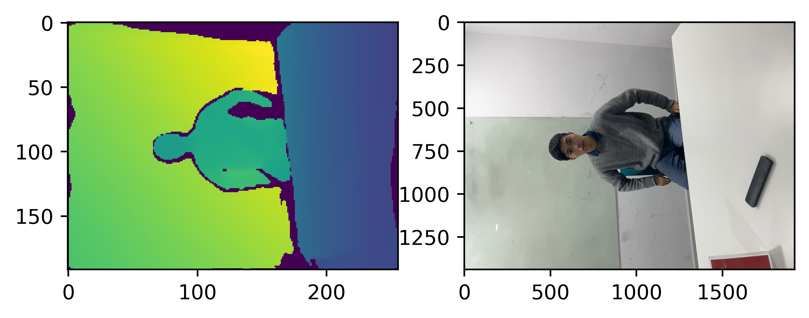
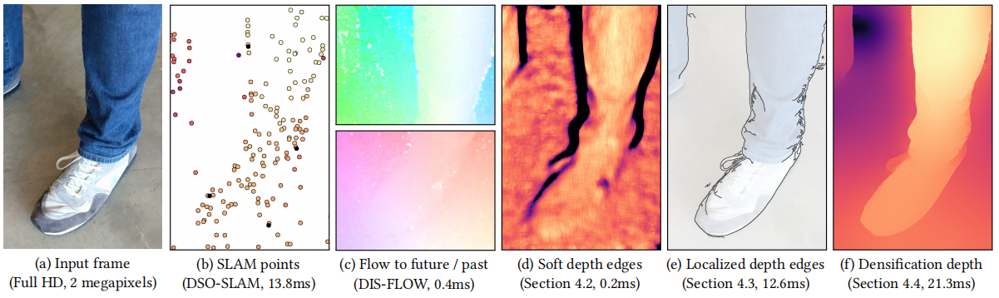

## 深度图优化目标
### 闪烁处理
<figure class="image">
  
  <em>
深度图闪烁
</em>
</figure>

对于相对静态的场景, 相邻帧confidence为high的深度像素任然会出现抖动(差异很大)的情况(如下图所示). 存在以下矛盾:
①若相信当前帧的深度, 则会出现比较大的抖动, 但对于动态物体的实时性会很好.
②若选择将当前帧与前几帧做加简单的权平均, 需要较多帧才能稳定, 且实时性变差, 会出现运动模糊.

一个好的方案是: 对图像帧做光流, 对对应上的像素点做加权平均. 但此方案计算量会加大.

<figure class="image">
  
  
  <em>
相邻帧高置信度的像素任可能会出现抖动
</em>
</figure>

### 抗锯齿
由于Lidar分辨率低, 直接使用在边界会存在很大的锯齿.

## 输入数据
* depth image
* confidence map [low medium high]
* camera pose of each frame (可以用来做重投影, 但若是固定相机, 动态的物体也没用)

## 相关参考文献
Face book: Fast Depth Densification for Occlusion-aware Augmented Reality

该方法使用相机直接做稀疏的三维重建, 使用光流, 检测物体的边界(视角变化, 或者物体移动时, 前景和背景的像素移动不一样).

该方法需要满足: 相机要有足够大的移动量(或相机中的物体有足够大的移动量).

Google Depth api: 对深度图做抗锯齿, 简单快速, 但无法解决抖动的问题.
<figure class="image">

<em>depth-guided FXAA抗锯齿</em>

</figure>

## 方案&结果
### 抗锯齿
对深度图做抗锯齿(FXAA).
<figure class="image">

<em>FXAA深度图抗锯齿效果</em>

</figure>

1. 由于深度图本身的问题, 可以看到显示器边界线并不直. 
2. 闪烁的问题任然存在.
metal
使用内置的抗锯齿方法参考MetalBasic3D

### Depth Densification
参考: https://github.com/facebookresearch/AR-Depth/blob/master/AR-Depth.ipynb
计算深度图的边界: soft_edge
<figure class="image">

<em>
与彩色图片做边界对齐结果
</em>
</figure>

计算图像的边界: hard_edge
以depth作为初始值, 构建最小二乘问题:
* 当前帧depth的约束
* 前几帧depth的约束(最好是重投影)
* smooth约束

结果:
<figure class="image">

<em>
参考相机图片做深度图细化的结果
</em>
</figure>

#### 性能优化
1. 将solver的方式转化为filter的方式, 在GPU上实现.
  使用filter的方式需要较大的滤波半径, 且效果与solver相比差很多.
  <figure class="image">
  
  <em>
solver(左)和filter(右)结果对比
</em>
  </figure>

2. 减少待优化量
  事实上我们仅需要对深度图的edge区域进行深度优化(抗锯齿)
  <figure class="image">
  
  
  <em>
深度图边界(上). solver完整结果(左下)和只优化深度图边界(右下)的对比
</em>
  </figure>

#### 移植
使用[MPSImageSobel](https://developer.apple.com/documentation/metalperformanceshaders/mpsimagesobel)来做图像梯度计算.
使用[MPSImageCanny](https://developer.apple.com/documentation/metalperformanceshaders/mpsimagecanny)来做边缘检测, 测试所需时间. 参考ARkit Depth fog的代码.

### 效果调优
1. 当图像边界不明显, 且周围有干扰时, 可能会将原来很强的depth边界给剔除掉.
    

2. 抖动优化.
  [图像缩放抗锯齿](https://blog.csdn.net/u013289254/article/details/102943161)

### Bialterial Solver & Filtering
以彩色图片做为参考, 对深度图做时域和空域的滤波.
参考: https://github.com/poolio/bilateral_solver/blob/master/notebooks/bilateral_solver.ipynb
https://github.com/kuan-wang/The_Bilateral_Solver

## 一些其他产品样例
1. [unity ios arkit 遮挡样例](https://blogs.unity3d.com/2020/06/24/ar-foundation-support-for-arkit-4-depth/)
    unity对于depth应该也有处理, 其api中开放了一个参数[EnvironmentDepthMode](https://docs.unity3d.com/Packages/com.unity.xr.arsubsystems@4.1/api/UnityEngine.XR.ARSubsystems.EnvironmentDepthMode.html)分为三个等级: `Fastest`, `Medium`, `Best`.

2. [FXAA 解析](http://blog.simonrodriguez.fr/articles/30-07-2016_implementing_fxaa.html#fn2)
   [FXAA 对应源码](https://github.com/kosua20/Rendu/blob/master/resources/common/shaders/screens/fxaa.frag)
   [FXAA 加速版本](https://github.com/mattdesl/glsl-fxaa)

3. [Metal 中的各种抗锯齿方案](https://www.programmersought.com/article/17475448461/)