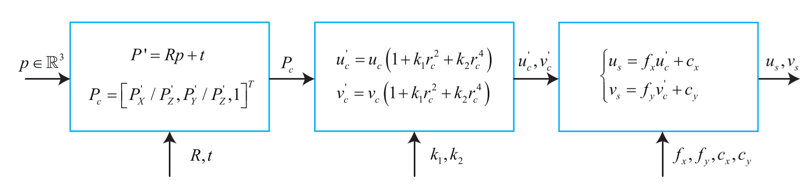

# VSLAM Back End
后端接受不同时刻视觉里程计测量的相机位姿, 以及回环检测的信息, 对他们进行优化, 得到全局一致的轨迹和地图. 主要是做非线性优化. 假设马尔可夫性的情况下用EKF, 而当前主流的是非线性优化的方法——BA.

## Full BA
	
<b>Input: ①每个相机的i位姿; ②路标j在相机i上的投影坐标.</b>

<b>Todo: 优化重投影误差.</b>

### 相机投影过程
这里只考虑径向畸变.

### 能量的定义
相机位姿$x$对应的李代数$\xi$, 路标$y$对应的三维点$p$, 则观测误差定义为:

$$
e = z - h(\xi, p) 
$$

把所有观测信息都考虑进来, 设$z_{ij}$为在位姿$\xi_i$处观察路标$x_j$产生的测量数据. 则有整体代价函数:

$$
\frac{1}{2}\sum_{i=1}^m \sum_{j=1}^n \parallel e_{ij} \parallel^2 = \frac{1}{2} \sum_{i=1}^m \sum_{j=1}^n \parallel z_{ij} - h(\xi_i, p_j) \parallel^2
$$

### 能量优化
将所有相机的位姿和观测点作为优化的变量:

$$
x = [\xi_1, ..., \xi_m, p_1, ... , p_n]^T
$$

假设增量为$\Delta x$, 则目标函数变为:

$$
\begin{aligned}
\parallel f(x + \Delta x) \parallel^2 &\approx  \sum_{i=1}^m \sum_{j=1}^n \parallel e_{ij} + F_{ij} \Delta \xi_i + E_{ij} \Delta p_j \parallel^2 \\
&= \parallel e + F \Delta x_c + E \Delta x_p \parallel^2
\end{aligned}
$$

根据定义, 我们知道$e_{ij}$对$x$的Jacobian $J_{ij}$是如下形式:

这里可以利用目标函数的Jacobian的特点, 来简化、加速整个求解的过程.
### Implementation

## Pose Graph BA
