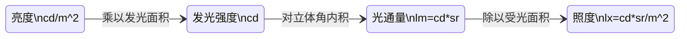

---
tags:
  - cg/shading
---
## 数学符号定义
* $\mathbf{n}$ surface normal
* $\mathbf{v}$ view direction
* $\mathbf{h}$ half vector
* $\mathbf{l}$ incident light direction
* $\mathbf{\omega_o}$ direction of out going light
* $\alpha$ roughness
* $\rho$ diffuse reflectance
* $\chi^{+}(a)$ Heaviside function: 1 if a > 0 and 0 if a <= 0
* $\langle\omega_1, \omega_2\rangle$ clamped dot product: 0 if $\omega_1 \cdot \omega_2 < 0$
* F0 normal incidence $\theta = 0$
* F90 normal incidence $\theta = 90$ 

## 经典光照模型
color = diffuse + ambient + specular

$$
    diffuse = \mathbf{l} \cdot \mathbf{n} \cdot albedo
$$

* Phone
    $$
        spec = (\mathbf{v} \cdot \mathbf{\omega_o})^{shiness}
    $$

* Blin-Phone
    $$
        spec = (\mathbf{n} \cdot \mathbf{h})^{shiness}
    $$
### BRDF
* energy conservation
* fresnel
* micro surface

general rendering equation:

$$
    {\cal L}_{o}(p,\omega_{o})={\cal L}_{e}(p,\omega_{o})+\int_{\Omega^{+}}{\cal L}_{i}(p,\omega_{i})f_{r}(p,\omega_{i},\omega_{o})(n\cdot\omega_{i})\,\mathrm{d}\omega_{i}    
$$

对于每一束光打在一个微表面区域上:

$$
    f_{d/r}(\mathbf{v})={\frac{1}{|\mathbf{n}\cdot\mathbf{v}||\mathbf{n}\cdot\mathbf{l}|}}\int_{\Omega}f_{m}(\mathbf{v},\mathbf{l},\mathbf{m})\;G(\mathbf{v},\mathbf{l},\mathbf{m})\;D(\mathbf{v},\mathbf{m})\,\langle\mathbf{v}\cdot\mathbf{m}\rangle\langle\mathbf{l}\cdot\mathbf{m}\rangle\,\mathrm{d}\mathbf{m}
$$

cook-Torrance equation:

$$
\int_{\Omega^+}{\cal L}_{i}(p,\omega_{i})(k_d f_d+k_s f_r )(n\cdot\omega_{i})d\omega_i
$$

对于镜面发射$f_m$ 是Fresnel, 积分后为:

$$
    f_{r}(\mathbf{v})=\frac{F(\mathbf{v},\mathbf{h},f_{0},f_{90})\;G(\mathbf{v},\mathbf{l},\mathbf{\alpha})\;L\!\!\!\!D(\mathbf{h},\alpha)}{4\langle\mathbf{n}\cdot\mathbf{v}\rangle\langle\mathbf{n}\cdot\mathbf{l}\rangle}
$$

因为

$$
V(\bf v, \bf l,\alpha) = \frac{G(\bf v, \bf l, \alpha)}{4\langle\mathbf{n}\cdot\mathbf{v}\rangle\langle\mathbf{n}\cdot\mathbf{l}\rangle}
$$

因此, 又可表示为:

$$
f_r(v)=F(\mathbf{v},\mathbf{h},f_{0},f_{90})\;V(\mathbf{v},\mathbf{l},\mathbf{\alpha})\;L\!\!\!\!D(\mathbf{h},\alpha)
$$

Normal Distrbution Function, 描述能够将来自$\mathbf{l}$的光反射到$\mathbf{v}$的面积密度——所有法线为$\mathbf{h}$的微平面的面积。

将$D(m)$的投影到宏观表面上，会得到宏观表面的面积，其被约定等于1.

$$
\int_\mathbf{H} D(m) (n \cdot m)dm = 1
$$

更一般的, 微表面(Micro Surface)和宏观表面(Macro Surface)在垂直于任何观察方向的平面上的投影是相等的.

$$
\int_\mathbf{H} D(m) (v \cdot m)dm = n \cdot v
$$

![[rc/NDF_attribute.webp]]

NDF选择"long-tailed" GGX:

$$
\large
D_{GGX} =
\chi^+ (\vec n \cdot \vec h)
\frac
{ \alpha^2 }
{ \pi \left((\vec n \cdot \vec h)^2 *(\alpha^2 - 1) + 1\right)^2}
$$

NDF的形状不变性: 改变粗糙度$\alpha$, 等价于拉伸微表面, 并不改变微表面形状.
具有形状不变性的NDF, 可以用于推导该函数的归一化的各向异性版本, 并且可以很方便地推导出对应的遮蔽阴影项G.

Geometry Function, Smith visibility function能够精确地表示. 采用height-corrleated Smith function近似表示会更好:

$$
\begin{aligned}
G(\mathbf{l}, \mathbf{v}, \mathbf{h}, \alpha) &=\frac{\chi^{+}({\bf v}.{\bf h})\chi^{+}({\bf l.\bf h})}{1+\Lambda({\bf v})+\Lambda({\bf l})}\ \quad \mathrm{with}\ \Lambda({\bf m})=\frac{-1+\sqrt{1+\alpha^2\tan^2(\theta_m)}}{2}\\
\Rightarrow V(\bf{v}, \bf{l}, \bf{h}, \alpha) &= \frac{0.5}{V_1 ( \mathbf{l}, \alpha) + V_1 (\bf v,\alpha)} \quad \mathrm{with} V_1(\bf l, \alpha) = (n.v) \sqrt{\alpha^2 + (1 - \alpha^2) (n.l)^2 }
\end{aligned}
$$

Fresnel using Schlick's approximation:

$$
	F = F_0 + (F_{90} - F_0)*(1 - (\vec n \cdot \vec v))^5
$$
由于$f_r$中Fresnel项代表了反射比例, 已经隐含了$k_s$, 因此可以去除$ks$.

对于漫反射, 使用Lambertian模型, $f_m$是一个常量:

$$
f_{d}({\bf v})=\frac{\rho}{\pi}\frac{1}{|{\bf n}\cdot{\bf v}||{\bf n}\cdot{\bf l}|}\int_{\Omega}G({\bf v},{\bf l},{\bf m})~D({\bf m},\alpha)~\langle{\bf v}\cdot{\bf m}\rangle\langle{\bf l}\cdot{\bf m}\rangle\ \mathrm{d}{\bf m}
$$

这里$\rho$是漫反射的颜色, 上述积分没有解析解, 只能进行近似. 也可以采用简单的经验模型进行替代:

$$
f_{d}=\frac{\rho}{\pi}(1+F_{D90}(1-\langle{\bf n\cdot1}\rangle)^{5})(1+F_{D90}(1-\langle{\bf n\cdot v}\rangle)^{5})\mathrm{~where~}{F}_{D90}=0.5+\cos(\theta_{d})^{2}\alpha
$$

另外, $k_d = 1 - F$.

在大部分引擎中又近似为: $f_d = \frac{\rho}{\pi}$

### BRDF实现

为了保证能量守恒, Frostbite对diffuse进行修正, 而[filament中则是对reflection进行修正](https://google.github.io/filament/Filament.md.html#materialsystem/improvingthebrdfs/energylossinspecularreflectance).

$$
    \int_\Omega (f_r(\mathbf{v}, \mathbf{l}) + f_d(\mathbf{v}, \mathbf{l})) \langle{} \mathbf{n} \cdot \mathbf{l} \rangle d\mathbf{l} \le 1
$$

新的diffuse计算:  

$$
    {F}_{D90}=0.5\alpha+\cos(\theta_{d})^{2}\alpha
$$

代码(Moving Frostbite to Physically Based Rendering 3.0):

```hlsl
float Fr_DisneyDiffuse(float NdotV, float NdotL, float LdotH, float linearRoughness)
{
    float energyBias = lerp(0, 0.5, linearRoughness);
    float energyFactor = lerp(1.0, 1.0 / 1.51, linearRoughness);
    float fd90 = energyBias + 2.0 * LdotH*LdotH * linearRoughness;
    float3 f0 = float3 (1.0f, 1.0f, 1.0f);
    float lightScatter = F_Schlick(f0, fd90, NdotL).r;
    float viewScatter = F_Schlick(f0, fd90, NdotV).r;
    return lightScatter * viewScatter * energyFactor;
}

float3 F_Schlick (in float3 f0 , in float f90 , in float u)
{
    return f0 + (f90 - f0) * pow (1. f - u, 5.f);
}

float V_SmithGGXCorrelated ( float NdotL , float NdotV , float alphaG )
{
    // Original formulation of G_SmithGGX Correlated
    // lambda_v = (-1 + sqrt ( alphaG2 * (1 - NdotL2 ) / NdotL2 + 1)) * 0.5 f;
    // lambda_l = (-1 + sqrt ( alphaG2 * (1 - NdotV2 ) / NdotV2 + 1)) * 0.5 f;
    // G_SmithGGXCorrelated = 1 / (1 + lambda_v + lambda_l );
    // V_SmithGGXCorrelated = G_SmithGGXCorrelated / (4.0 f * NdotL * NdotV );

    // This is the optimize version
    float alphaG2 = alphaG * alphaG ;
    // Caution : the " NdotL *" and " NdotV *" are explicitely inversed , this is not a mistake .
    float Lambda_GGXV = NdotL * sqrt ((- NdotV * alphaG2 + NdotV ) * NdotV + alphaG2 );
    float Lambda_GGXL = NdotV * sqrt ((- NdotL * alphaG2 + NdotL ) * NdotL + alphaG2 );

    return 0.5 f / ( Lambda_GGXV + Lambda_GGXL );
}

float D_GGX ( float NdotH , float m)
{
    // Divide by PI is apply later
    float m2 = m * m;
    float f = ( NdotH * m2 - NdotH ) * NdotH + 1;
    return m2 / (f * f);
}

// This code is an example of call of previous functions
float NdotV = abs( dot (N, V)) + 1e -5f; // avoid artifact
float3 H = normalize (V + L);
float LdotH = saturate ( dot (L, H));
float NdotH = saturate ( dot (N, H));
float NdotL = saturate ( dot (N, L));

// Specular BRDF
float3 F = F_Schlick (f0 , f90 , LdotH );
float Vis = V_SmithGGXCorrelated (NdotV , NdotL , roughness );
float D = D_GGX (NdotH , roughness );
float Fr = D * F * Vis;

// Diffuse BRDF
float Fd = Fr_DisneyDiffuse (NdotV , NdotL , LdotH , linearRoughness ) / PI;

// apply diffuse light, 这里1.0 - F是反射部分的光
xx_light(i, N) * (diffuse_color * (vec3(1.0) - F) * Fd + Fr)
```
## Basic Material System
### SG(Specular Glossiness)
* Diffuse 漫反射光 RGB
* Specular 用来描述菲涅尔项 RGB, 当表达黄金这样的金属, 对于不同的色彩效果不一样
* Glossiness 光滑程度

缺点: Specular项不是很好设置, 设置不好会导致结果非常假. 代码参考上面shader code.

### Metallic Roughness
使用金属度 (metalic) 来关联diffuse和菲尼尔部分, 这样就避免了两个参数冲突问题. 本质上MR材质还是使用SG材质.
* base_color
* roughness
* metallic
* specular/reflectance 一般非金属都是0.5, 反射4%的光.
metalic的意义: 如果一个物体的金属度非常低，则代表为非金属, 那么此时的base_color __无法用在diffuse和specular中进行计算__. 而如果金属度十分高, 则代表这个物体是金属, 那么你的base_color会被大量抽走并用在diffuse和specular的计算中.

```c++
vec3 diffuseColor = (1.0 - metallic) * baseColor.rgb;
vec3 f0 = 0.16 * reflectance * reflectance * (1.0 - metallic) + baseColor * metallic;
```
### standard imp
在现在的引擎中, 基本上都用到以下标准材质(filament/UE):

|Parameter|Definition| Type and range|
|---|---|---|
|**BaseColor**|Diffuse albedo for non-metallic surfaces, and specular color for metallic surfaces| Linear RGB [0..1] | 
|**Metallic**|Whether a surface appears to be dielectric (0.0) or conductor (1.0). Often used as a binary value (0 or 1)| Scalar [0..1] | 
|**Roughness**|Perceived smoothness (0.0) or roughness (1.0) of a surface. Smooth surfaces exhibit sharp reflections| Scalar [0..1] |
|**Reflectance**|Fresnel reflectance at normal incidence for dielectric surfaces. This replaces an explicit index of refraction| Scalar [0..1] |
|**Emissive**|Additional diffuse albedo to simulate emissive surfaces (such as neons, etc.) This parameter is mostly useful in an HDR pipeline with a bloom pass| Linear RGB [0..1] + exposure compensation |
|**Ambient occlusion**|Defines how much of the ambient light is accessible to a surface point. It is a per-pixel shadowing factor between 0.0 and 1.0. This parameter will be discussed in more details in the [lighting](https://google.github.io/filament/Filament.md.html#lighting) section| Scalar [0..1] |

## Light 
在不同的工具/系统之间保持灯光度量的一致性, 从而数据可以兼容互通.

Question: 在代码中如何体现?

色温, 单位 Kelvin.
![[light_tempture.png]]

### 度量
* 辐射度量(Radiometry), 关注物理的电磁辐射量. 包含了非可见光(某些材质在紫外光下可能呈现出不同的颜色或外观).

| Name              | Symbol | Units       | Description                                                                                   |
| ----------------- | ------ | ----------- | --------------------------------------------------------------------------------------------- |
| radiant flux      | $\Phi$ | watt(W)     | 辐射通量是随时间流动的辐射能量，也就是功率，以瓦特（W）为单位测量.                                                            |
| irradiance        | E      | $W/m^2$     | 辐射通量相对与面积的密度(单位面积上的辐射通量)                                                                      |
| radiant intensity | I      | $W/sr$      | flux density with respect to direction—more precisely, solid angle $(d\Phi/d\omega)$.         |
| radiance          | L      | $W/(m^2sr)$ | a measure of electromagnetic radiation in a single ray, 在某一方向上, 单位面积上的辐射通量. 这也是眼睛/相机能够感受到的度量. |

* 光度量(Photometry), 将测量结果根据人眼的敏感度(CIE photometric curve)进行加权.

| Radiometric Quantity: Units | Photometric Quantity: Units |
| --- | --- |
| radient flux: watt (W) | luminous flux: lumen(lm) |
| irradiance: $\mathrm{W/m^2}$ | illuminance: lux(lx)|
| radiant intensity: $\mathrm{W/sr}$ | luminance intensity: candela (cd) |
| radiance: $\mathrm{W/(m^2 sr)}$ | luminance: $cd/m^2$ = nit $\to$ 感知的亮度 |

在UE中使用lux来度量方向光, 用cd来度量point、spot、area light(随着面积扩大强度减弱).



### Punctual lights
点光源或几乎是点光源的光源, 光源从一个非常小的局部区域发出光，类似于空间中的一个点.
在给定距离上接收到的 radiance的计算(与距离的平方成反比):

* point light

$$
L_{\text {out }}=f(\mathbf{v}, \mathbf{l}) E=f(\mathbf{v}, \mathbf{l}) L_{\text {in }}\langle\mathbf{n} \cdot \mathbf{l}\rangle=f(\mathbf{v}, \mathbf{l}) \frac{I}{\text { distance }^2}\langle\mathbf{n} \cdot \mathbf{l}\rangle=f(\mathbf{v}, \mathbf{l}) \frac{\phi}{4 \pi \text { distance }^2}\langle\mathbf{n} \cdot \mathbf{l}\rangle
$$

* spot light

$$
L_{\text {out }}=f(\mathbf{v}, \mathbf{l}) \frac{I}{\text { distance }^2}\langle\mathbf{n} \cdot \mathbf{l}\rangle=f(\mathbf{v}, \mathbf{l}) \frac{\phi}{\pi \text { distance }^2}\langle\mathbf{n} \cdot \mathbf{l}\rangle \; \mathrm{getAngleAttenuation}()
$$

## 参考
* [PBR公式推导以及理论梳理](https://zhuanlan.zhihu.com/p/606407173)
* [由浅入深学习PBR的原理和实现-0向往0](https://www.cnblogs.com/timlly/p/10631718.html)
* Moving Frostbite to Physically Based Rendering 3.0
* [Games-104 Game Engine 05:渲染光和材质的数学魔法](https://zhuanlan.zhihu.com/p/512998645)
* [【基于物理的渲染（PBR）白皮书】（五）几何函数相关总结](https://zhuanlan.zhihu.com/p/81708753)
* [Unreal Physically Based Materials](https://docs.unrealengine.com/5.3/en-US/physically-based-materials-in-unreal-engine/) 最基本的BRDF
* [mastering materials in unreal engine](https://awesometuts.com/blog/materials-unreal-engine/)
* [filament pbr](https://google.github.io/filament/Filament.md.html)
* [CIE 1931 XYZ详解](https://zhuanlan.zhihu.com/p/137639368)