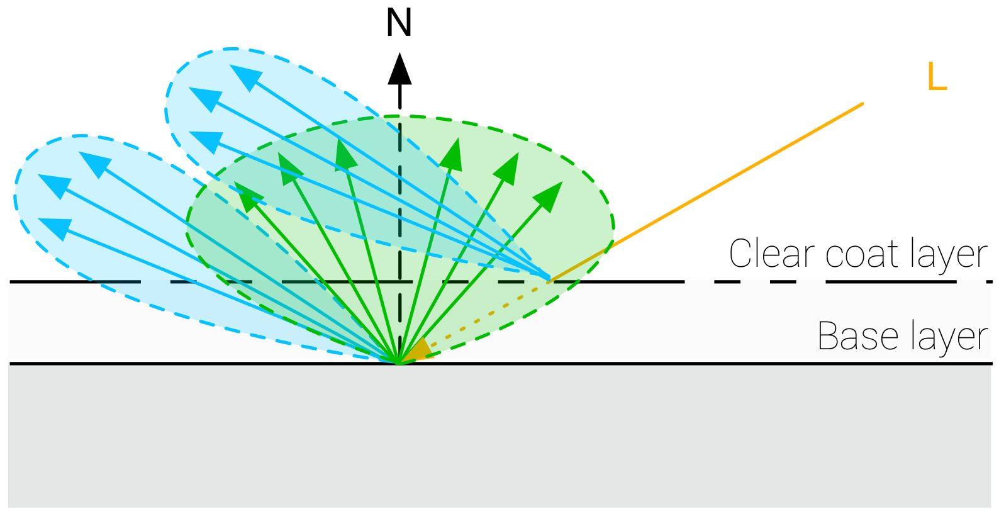

## Multi-layer materials
多层的材质在现实中非常常见, 尤其是在标准的层上覆盖一层薄薄的半透明层.

### Clear Coat
有clear coat和无clear coat的对比:

在filament中: 仍旧使用BRDF模拟clear coat层, 只是改用Kelemen visibility function(一般clear coat比较光滑, 该近似具有更高性能).

$$
V(l, h) = \frac{1}{4(l \cdot h)^2}
$$

并使用固定的F0=0.04, 即IOR=1.5.

加入了Clear Coat层后:

$$
f(v, l) = (f_d(v, l) + f_r(v, l)) * (1 - F_c) + f_c(v, l)
$$

| 参数 | 定义 |
| --- | --- |
| clear_coat_weight | [0..1], clear coat层的权重(在F_c的基础上乘以这个权重) |
| clear_coat_roughness | [0..1], clear coat的粗糙度 |

此外, 加入clear coat层后, 我们需要重新计算base layer的Fresnel项.

## Sheen

## Camera

| 参数 | 定义 |
| --- | --- |
| focal length | 焦距, 毫米为单位 |
| Aperture | 用f-stops F(焦比)表示, $\frac{f}{d}$ , $f$是焦距, $d$光圈直径, 描述了光圈的打开/闭合程度. 全级级数光圈有: f/1、f/1.4、f/2、f/2.8、f/4、f/5.6、f/8、f/11、f/16、f/22. 这些光圈值是公比为 $\frac{1}{\sqrt{2}}$ |
| Shutter speed |  |
| Sensitivity | |

焦距越大, 景深越小. 光圈越大, 景深越小.
手机摄像头一般是定焦组合: 例如, 一个28mm焦距的主摄，一个14mm的广角，一个50mm的长焦，有的还有100mm以上的长焦.

https://www.pooher.com/xinwen/1020.html
https://zhidao.baidu.com/question/55907940