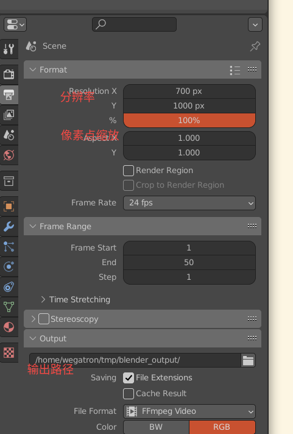

## 视角切换

通过左侧栏, 设置cursor location, `view` -> `align view` -> `center view to cursor` 设置视角中心.

通过小键盘进行控制: 46, 82. 上下左右, ctrl按住为平移, + 缩放视角.


## 快捷键
* `HOME` 将视角移动到场景中心
* `CTRL` + `H` hook
* `CRTL` + `G` group
* `F3` search command


## Camera

refer to: https://docs.blender.org/manual/en/latest/render/cameras.html

默认近平面宽度: 18mm.
可以通过Focal Length/Field of View来调整相机透视投影.

## render output

blender 渲染相关设置
![[rc/blender_render_config.png|500]]

渲染输出的设置:



## Blender python
### python console
![[blender_python_console.png]]

根据id选择顶点:
```python
import bpy
import bmesh
import numpy as np

index = 0 # here the index you want select please change 

obj = bpy.context.object
me = obj.data
bm = bmesh.from_edit_mesh(me)

lm_bfm = np.loadtxt('/home/wegatron/win-data/workspace/MeInGame/data/mesh/mine/lm.txt', dtype=np.int)[:,0]

for v in bm.verts:
    v.select = False
    
for ind in lm_bfm:
    bm.verts[ind].select = True

# update highlight the selected vertex
bmesh.update_edit_mesh(me)    
```

打印所有选中的顶点信息:
```python
import bpy
import bmesh
import numpy as np

ids = []
obj=bpy.context.object
if obj.mode == 'EDIT':
    bm=bmesh.from_edit_mesh(obj.data)
    for v in bm.verts:
        if v.select:
            ids.append(v.index)
    ids_n = np.array(ids, dtype=int)
    np.save('right_eye_mask_ids.npy', ids_n)
else:
    print("Object is not in edit mode.")
```
### python editor
相同的地方, 选择`Text Editor`, 可以进行python脚本编辑.

## Blender显示选中index
先开启`develop extras`: _Edit_ > Preferences > Interface > Display > Develop Extras
![[blender_show_index.png]]

## Blender install plugin
`Edit` -> `Preference` -> `Add ons`

