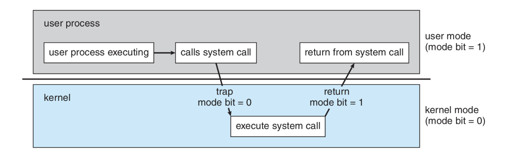
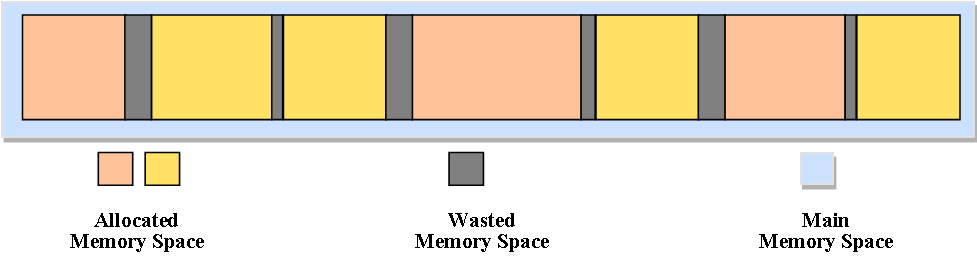
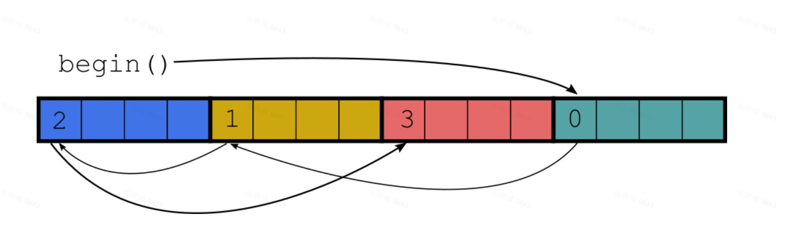

## Advance Memory Management
### 关于内存的知识
![[main_memory.png|500]]
内存分布, stack memory相对于Dynamic Memory是非常快的, 但是内存大小是被限制的. 如windows 1MB, linux 8MB.

访问速度:
```
// 来自 https://stackoverflow.com/questions/7638932/what-is-locality-of-reference
+----------+
| CPU      |  <<-- Our beloved CPU, superfast and always hungry for more data.
+----------+
|L1 - Cache|  <<-- works at 100% of CPU speed (fast)
+----------+
|L2 - Cache|  <<-- works at 25% of CPU speed (medium)
+----+-----+
      |
      |        <<-- This thin wire is the memory bus, it has limited bandwidth.
+----+-----+  <<-- works at 10% of CPU speed.
| main-mem |  <<-- The main memory is big but slow (because we are cheap-skates)
+----------+
      |
      |        <<-- Even slower wire to the harddisk
+----+-----+
| harddisk | <<-- Works at 0,001% of CPU speed
+----------+ 
```

### 内存问题

1. 默认的内存分配、回收慢.
    * 通用 == 复杂
    需要处理任意时间、任意位置申请任意大小内存的请求，它在设计上就无法兼顾一些特殊场景的优化，在管理上也会带来一定开销
    * 系统调用带来的开销
    申请内存会从用户模式切换到内核模式，当前线程会block住，上下文切换将会消耗一定时间
      
    * 动态内存的申请通常需要调用锁
      很影响并行的效率. 就算是单线程的程序,在堆上申请内存也比在栈上申请更慢(系统需要寻找一个合适大小的memory block)

2. 分配位置无法控制. 比如连续多次分配时, 内存的定域性/局部性(locality)无法保证.
    * 内存碎片
      
    * 内存扩散(memory diffusion), 以std::list为例: 刚开始的时候在连续的内存上顺序插入节点, 遍历非常快. 随后不断的增删改, 数据被打散, 遍历变得很慢.
      
3. 内存对齐
    * SIMD更高效(当前也支持不对齐的SIMD, 对齐后会有一定提升)
      
    * 对cache有好处, 跨越cache line可能会多一次操作.


### 处理策略
![[rc/memory_stragety.jpg]]
								根据范围和使用场景, 划分为4类

好处, 针对1~3内存问题的性能提升, 外加:

4. 内存高水位线的监测
5. 更方便的发现、定位内存泄漏问题

根据不同需求, 选取不同的分配策略, 主要考虑以下几个方面:
使用场景可以总结为以下四个方面:
* Density 申请释放的频度, 指令数量占比
* Varation 申请内存大小的变化
* Locality 局部性
* UTILIZATION 利用率
* CONTENTION 申请内存时是否会有竞争(多线程)

### 使用案例

#### Filament

* Memory Arena(Pool) - 预先分配一大块内存, 然后在这块内存上, 继续sub-allocate小一点的内存, 构造我们需要的对象.
  ![[rc/memory_arena.jpg]]
  
* Allocator - 负责内存的分配
    * Heap Allocator, 默认的分配释放
    * Linear Allocator, 只吃不拉的貔貅. 连续分配, 对于没有额外资源的类可以省略析构函数.
    * Pool Allocator, 先分配一块大的内存, 对于需要不断创建删除的对象, 建立一个独立的内存池, 由于大小固定, 管理策略十分简单.

```c++
/// 使用
class FRenderer : public Renderer {
...
private:
    // per-frame arena for this Renderer
    LinearAllocatorArena& mPerRenderPassArena;
};

void FRenderer::renderJob(ArenaScope& arena, FView& view) {
{
    ...
    // 适用于单帧内申请, 到帧结束才会被释放的资源在mPerRenderPassArena上申请
    GrowingSlice<Command> commands(
            arena.allocate<Command>(commandsCount, CACHELINE_SIZE), commandsCount);
    ...
}

// 任务系统(父子任务关系图结构)
class JobSystem
{
    ...
private:
    // 使用无锁内存池 TODO 如何实现无锁!!!!!
    utils::Arena<utils::ThreadSafeObjectPoolAllocator<Job>, LockingPolicy::NoLock> mJobPool;
}
```

#### 利用c++17 pmr

在c++中allocator是类型的一部分, 使用起来很不方便:

```c++
std::vector<int, Allocator1> A;
std::vector<int, Allocator2> B;
```

C++17引入了多态的内存管理方式pmr(polymorphic memory resources). 利用多态Allocator实现相同类型, 不同Allocator.

```c++
namespace std::pmr{

    // 管理内存资源
    class memory_resource {
    public:
        virtual ~memory_resource();
    
        // 本身不是虚函数 , 调用虚函数实现
        void * allocate(size_t bytes, size_t alignment);
        void deallocate(void *p, size_t bytes, size_t alignment);

        // 用来判断从一个memory_resource申请的内存是否可以还回到另一个对象
        // 基本上是两个memory_resource是同一对象才返回true, 也有例外:
        // 使用的是全局默认, 或者是同一个资源的不同wrapper
        bool is_equal(const memory_resource& other) const noexecpt;

    private:
        virtual void* do_allocate( std::size_t bytes, std::size_t alignment ) = 0

        virtual void do_deallocate( void* p, std::size_t bytes, std::size_t alignment ) = 0;

        virtual bool do_is_equal( const std::pmr::memory_resource& other ) const noexcept = 0;   
    };


    // 为对象分配内存资源, 通过设置不同的memory_source实现不同的内存管理方式
    template<class Tp>
    class polymorphic_allocator
    {
    public:
        // 使用默认的内存资源 new delete
        polymorphic_allocator() noexcept;

        // 使用指定内存资源
        polymorphic_allocator(memory_resource * r) noexcept;
        memory_resource * resource() const;

        // 为对象分配内存资源
        Tp * allocate(size_t n);

        // 内存资源回收
        void deallocate(Tp * p, size_t n);
        ...
    };
}
```

提供了一些常用的memory resource类:

* `new_delete_resource`: 默认的分配器

* `null_memory_resource`: 不进行分配的分配器, 用于失败分配.

* `synchronized_pool_resource`: Thread-safe pools of similarsized memory blocks.

* `unsynchronized_pool_resource`: Non-thread-safe pools of similar-sized memory blocks.

* `monotonic_buffer_resource`: Super-fast, non-thread-safe allocation into a buffer with do-nothing deallocation.
    向前分配, 2的指数递增.

* std::pmr::vector, std::pmr::string, ...

#### 性能对比测试
```c++
#include <vector>
#include <list>
#include <memory_resource>
#include <benchmark/benchmark.h>

int insertElemetns = 100;

static void pmrVector(benchmark::State& state) {
  for (auto _ : state) {
    std::byte stackStorage[2048];
    std::pmr::monotonic_buffer_resource memoryResource {stackStorage, sizeof(stackStorage)};

    std::pmr::vector<int> vector1{{1,2,3,4}, &memoryResource};
    std::pmr::vector<double> vector2{{5,6,7,8}, &memoryResource};

    for (int i = 0; i < insertElemetns; ++i)
      vector1.emplace_back(i);
    for (int i = 0; i < insertElemetns; ++i)
      vector2.emplace_back(i);
  }
}
BENCHMARK(pmrVector);

static void stdVector(benchmark::State& state) {
  for (auto _ : state) {    
    std::vector<int> vector1{{1,2,3,4}};
    std::vector<double> vector2{{5,6,7,8}};

    for (int i = 0; i < insertElemetns; ++i)
      vector1.emplace_back(i);
    for (int i = 0; i < insertElemetns; ++i)
      vector2.emplace_back(i);
  }
}
BENCHMARK(stdVector);

static void pmrList(benchmark::State& state) {
  for (auto _ : state) {
    std::byte stackStorage[2048];
    std::pmr::monotonic_buffer_resource memoryResource {stackStorage, sizeof(stackStorage)};

    std::pmr::list<int> list1{{1,2,3,4}, &memoryResource};
    std::pmr::list<double> list2{{5,6,7,8}, &memoryResource};

    for (int i = 0; i < insertElemetns; ++i)
      list1.emplace_back(i);
    for (int i = 0; i < insertElemetns; ++i)
      list2.emplace_back(i);
  }
}
BENCHMARK(pmrList);

static void stdList(benchmark::State& state) {
  for (auto _ : state) {    
    std::list<int> list1{{1,2,3,4}};
    std::list<double> list2{{5,6,7,8}};

    for (int i = 0; i < insertElemetns; ++i)
      list1.emplace_back(i);
    for (int i = 0; i < insertElemetns; ++i)
      list2.emplace_back(i);
  }
}
BENCHMARK(stdList);

BENCHMARK_MAIN();
```

```
Running E:\workspace\zsw_test\build\bin\Release\zsw_test.exe
Run on (12 X 2208 MHz CPU s)
CPU Caches:
  L1 Data 32 KiB (x6)
  L1 Instruction 32 KiB (x6)
  L2 Unified 256 KiB (x6)
  L3 Unified 9216 KiB (x1)
-----------------------------------------------------
Benchmark           Time             CPU   Iterations
-----------------------------------------------------
pmrVector         859 ns          820 ns       896000
stdVector        1649 ns         1507 ns       497778
pmrList          1353 ns         1287 ns       497778
stdList         26981 ns        24414 ns        32000
```

### 支持pmr进行内存管理
```c++
struct X {
    using allocator_type = polymorphic_allocator<byte>;

    //构造函数传入allocator
    X(const X&, allocator_type = {});
    // Allocator at start of arg list    
    template <class... Args> X(Args&&...);
    template <class... Args> X(allocator_arg_t, allocator_type,
    Args&&...);

    // 移动构造函数, 若是allocator不一样则需要拷贝
    X(X&& other) //stores other.get_allocator()
    X(X&& other, allocator_type a) //stores a.
};
```

## Reference
[游戏引擎开发新感觉！(6) c++17内存管理](https://zhuanlan.zhihu.com/p/96089089)
[C++17 的 多态内存分配器](https://zhuanlan.zhihu.com/p/359409607)
[quick c++ benchmark](https://quick-bench.com/)
[C++17 Polymorphic Memory Resources](https://marknefedov.dev/2020/06/13/c17-polymorphic-memory-resources/)
[CppCon2017Code](https://github.com/phalpern/CppCon2017Code)

