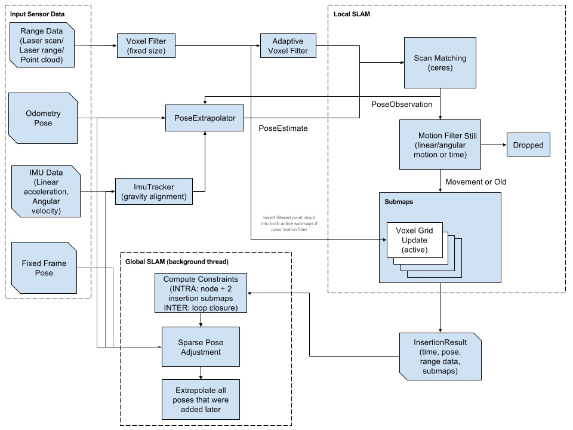
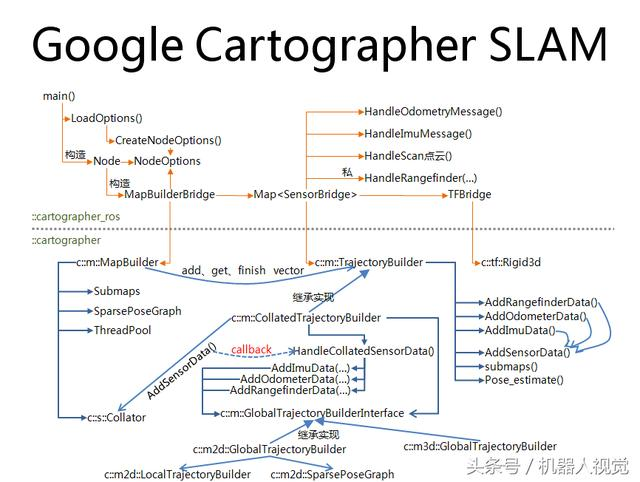

# cartographer解析
## overview


基本思想流程:


代码文件结构
```
.
├── cartographer 负责处理来自雷达、IMU和里程计的数据并基于这些数据进行地图的构建, 是cartographer理论的底层实现
|    ├── common　定义了基本数据结构以及一些工具的使用接口
|    ├── sensor 定义了雷达数据及点云等相关的数据结构
|    ├── transform 定义了位姿的数据结构及其相关的转换
|    ├── kalman_filter 主要通过kalman滤波器完成对IMU、里程计及基于雷达数据的估计位姿的融合, 进而估计新进的laser scan的位姿
|    ├── io
|    ├── metric
|    ├── cloud
|    ├── ground_truth
|    └── mapping 定义了上层应用的调用接口以及局部submap构建和基于闭环检测的位姿优化等的接口
|        ├── 2d mapping接口的2d实现
|        └── 3d mapping接口的3d实现
└── cartographer_ros cartographer的ros warpper.
```

代码调用



算法的核心可以分为如下三个部分(论文)
* 前端scan to submap (Real-Time Correlative Scan Matching (BBS))
* 位姿调整优化 (Efficient Sparse Pose Adjustment for 2D Mapping (SPA))
* 实时闭环和优化(Real-Time Loop Closure in 2D LIDAR SLAM , ICRA 2016)

## 分析
* 算法适用的场景 and why.

## reference
[cartograph 安装测试](https://www.cnblogs.com/lvchaoshun/p/9824528.html)
[cartograph 前端优化](https://blog.csdn.net/u012209790/article/details/82735923)
[cartograph 论文阅读](http://ttshun.com/2018/09/12/Cartographer%E5%AD%A6%E4%B9%A0%E4%B8%80%E8%AE%BA%E6%96%87%E9%98%85%E8%AF%BB/)
[cartograph 源码阅读](https://zhuanlan.zhihu.com/p/48010119)
[cartograph 占据概率推导](https://zhuanlan.zhihu.com/p/49030629)
[cartographer理论及实现浅析](https://blog.csdn.net/zouyu1746430162/article/details/73289745?utm_source=blogxgwz1)
[cartograph 前后端总结](http://www.ishenping.com/ArtInfo/1917276.html)
[cartograph-ros doc](https://google-cartographer-ros.readthedocs.io/en/latest)
[cartograph-dataset](https://google-cartographer-ros.readthedocs.io/en/latest/data.html)