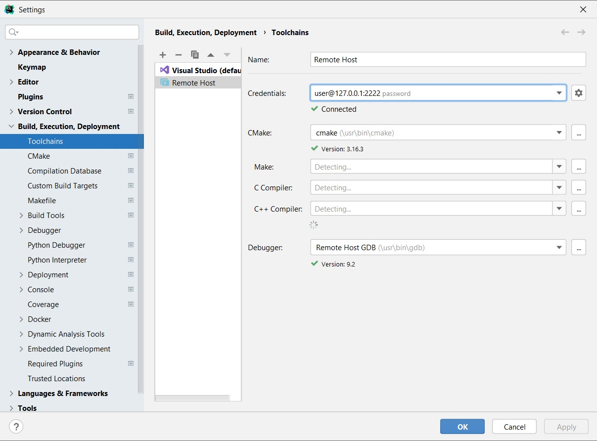
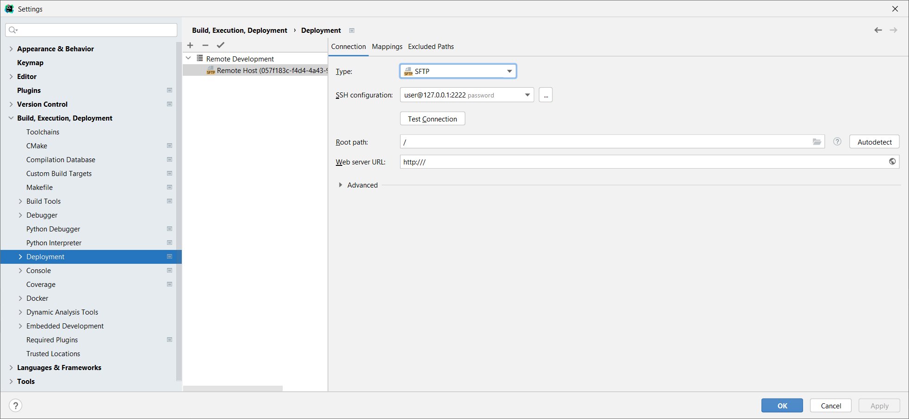
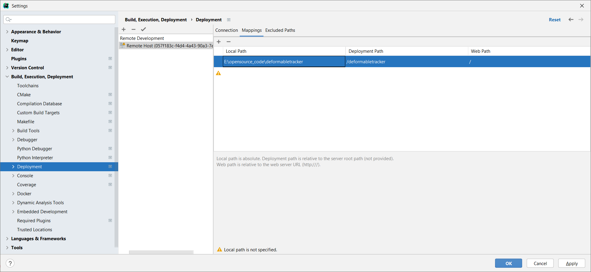

## 使用CLion调试Docker中的程序
### Docker file配置
```Dockerfile
# CLion remote docker environment (How to build docker container, run and stop it)
#
# Build and run:
#   docker build -t clion/remote-cpp-env:0.5 -f Dockerfile.remote-cpp-env .
#   docker run -d --cap-add sys_ptrace -p127.0.0.1:2222:22 --name clion_remote_env clion/remote-cpp-env:0.5
#   ssh-keygen -f "$HOME/.ssh/known_hosts" -R "[localhost]:2222"
#
# stop:
#   docker stop clion_remote_env
# 
# ssh credentials (test user):
#   user@password 

FROM ubuntu:latest

ENV DEBIAN_FRONTEND=noninteractive

RUN apt-get update \
  && apt-get install -y tzdata \
  ssh \
  build-essential \
  gcc \
  g++ \
  gdb \
  clang \
  cmake \
  rsync \
  tar \
  python \
  libboost-all-dev \
  libopenblas-dev \
  liblapack-dev \
  libarpack2-dev \
  libsuperlu-dev \
  libeigen3-dev \
  libopencv-dev \
  libcgal-dev \
  && apt-get clean

RUN ( \
    echo 'LogLevel DEBUG2'; \
    echo 'PermitRootLogin yes'; \
    echo 'PasswordAuthentication yes'; \
    echo 'Subsystem sftp /usr/lib/openssh/sftp-server'; \
  ) > /etc/ssh/sshd_config_test_clion \
  && mkdir /run/sshd

RUN useradd -m user \
  && yes password | passwd user

RUN usermod -s /bin/bash user

CMD ["/usr/sbin/sshd", "-D", "-e", "-f", "/etc/ssh/sshd_config_test_clion"]
```

这里默认用户名密码是: `user:password`

构建Image
```bash
docker build -t clion_debug -f Dockerfile_clion .
```

### 运行容器
```bash
docker run --rm -e DISPLAY="host.docker.internal:0.0" -v e:/:/disk_e -d --cap-add sys_ptrace -p127.0.0.1:2222:22 --name archlinux_cpp wegatron/archlinux_cpp
```

这里`-v`挂载文件, `-d`表示在后台运行, `--cap-add sys_ptrace`启用linux的ptrace能力, `-p`则是将image的22端口映射到本地2222端口.

### CLion 创建Remote Host toolchain
在CLion的 file$\to$ settings $\to$ build,Execution,Deployment.


### 代码文件的同步
默认情况下, CLion的代码会被同步到容器中, 同步维护两份. 另外一种方式是将文件挂载到容器中, 本地和容器使用同一套代码.


并将文件mapping设置好.



### 将Image推送到DockerHub
首先, 在DockerHub上创建Repository, 在本地利用Dockerfile构建Image
```bash
docker build -t wegatron/ubuntu_cpp -f Dockerfile_cpp . 
```

将Image推动到DockerHub
```bash
docker push wegatron/ubuntu_cpp
```

### 内容修改后提交Image
```bash
docker commit --author "wegatron" --message "install armadillo" ubuntu_cpp wegatron/ubuntu_cpp
```

### 系统内部安装的库头文件无法访问
Click on Tools -> Resync with Remote Hosts Or Set the clion.remote.resync.system.cache key in the Registry (go to Help | Find Action or press ⇧⌘A, type Registry, and search for the key by name). 

## Reference
[Toolchains in Docker](https://www.jetbrains.com/help/clion/clion-toolchains-in-docker.html#sample-dockerfile)