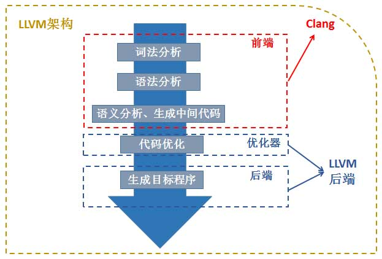

## Clang
编译器粗略分为
前端: 词法分析、语法分析、类型检查、中间代码生成. 
后端: 代码优化、目标代码生成、目标代码优化. 
<figure class="image">

<em>Clang-llvm编译器</em>

</figure>

编译程序工程过程一般划分为如下阶段: 词法分析 语法分析 语义分析 中间代码产生 中间代码优化 目标代码生成.

* 第一阶段, 词法分析: 对构成源程序的字符串每一个字符逐个进行分析, 识别出一个个单词, 如关键字(if for while break. . . . ), 标识符, 常数等. 
    在词法分析阶段的工作中所依循的是语言的词法规则. 描述词法规则或者解析词法规则的有效工具是正则式和有限自动机. 

* 第二阶段, 语法分析: 词法分析是针对于每个字符串的分析, 而语法分析则是针对于该句的分析, 并不涉及上下文. 通过语法分析, 确定整个输入串是否构成正确的语法
    词法分析的目的：第一确定该表达式是正确的, 第二确定该表达式是一个算术表达式以及是一个赋值语句. 

* 第三阶段, 语义分析与中间代码产生.
    该阶段主要有两个工作. 其一对每种语法范畴进行静态语义检查, 例如比变量是否定义, 类型是否正确等. 其二翻译语句生成中间代码, 这一阶段所依据是语言的语义规则. 

* 第四阶段, 中间代码优化. 优化的任务是对中间代码进行加工变换, 以保证在最后阶段能够产出更为高效的目标代码. 优化的主要方面有：公共子表达式的提取、循环优化、删除无用代码等等. 

* 第五阶段, 目标代码生成. 

## Reference
[clang历史 refere to article GCC_LLVM_Clang](https://www.cnblogs.com/qoakzmxncb/archive/2013/04/18/3029105.html)
[clang](https://clang.llvm.org/docs/CommandGuide/clang.html)
[编译原理-第一章-引论](https://zhuanlan.zhihu.com/p/104655477)
[详解三大编译器：gcc、llvm 和 clang Dr. Wang](https://zhuanlan.zhihu.com/p/357803433)