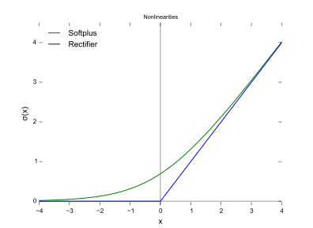

---
tag:summary/basic_theory
---
## 卷积神经网络层次结构
* Conv Layer(Convolutional Layer, 卷积层)
Compute the output of neurons that are connected to local regions in the input, each computing a dot product between their weights and a small region they are connected to in the input volume. 
* RELU Layer
Apply an elementwise activation function, such as the $max(0,x)$ thresholding at zero.
* Pooling Layer
Perform a downsampling operation along the spatial dimensions (width, height).
* FC(Fully-Connected Layer, 全连接层)
Compute the class scores. As with ordinary Neural Networks and as the name implies, each neuron in this layer will be connected to all the numbers in the previous volume.

Note: 这里Conv Layer和FC Layer的参数是训练得到, 而RELU和Pooling Layer是固定的函数(没有参数).

## 卷积层
卷积层可以看做是学习得到的滤波器(卷积核)对输入数据抽取特征.
> Intuitively, the network will learn filters that activate when they see some type of visual feature such as an edge ...

只取局部区域做连接的原因: ①特征具有局部性; ②基于脑科学的研究; ③做全连接参数太多(会引入过多无效参数), 不现实.
> The spatial extent of this connectivity is a hyperparameter called the __receptive field__ of the neuron (equivalently this is the filter size).

exp.1: Suppose that the input volume has size [32x32x3], If the receptive field (or the filter size) is 5x5, then Conv Layer will have weights to a [5x5x3] + 1(1 bias parameter).

三个超级参数:
1. __depth__
depth即Conv Layer输出的depth维度, 即filter的数量(exp.1中depth=1, 输出是一个2D的activation map).
2. __stride__
filter在数据上滑动的间隔.
3. __zero-padding__
数据的边缘填0扩充的数量.

Conv Layer输出大小的计算公式
$$
K \times [(W - F + 2P)/S + 1]
$$

这里, $W$ - input volume size , $F$ - Conv Layer neurons , $S$ - stride, $P$ - zero padding, K - depth. 
注意: 这里$(W - F + 2P)/S + 1$必须得是整数, 否则认为是无效的.
我们认为filter(卷积核)是通用的, 在每一层上使用相同的参数, 从而参数规模为:
$$
K \times (F \times F \times D_{input} + 1)
$$

## ReLu
非线性激励函数引入原因:
如果不用激励函数, 每一层输出都是上层输入的线性函数, 很容易验证, 无论你神经网络有多少层, 输出都是输入的线性组合, 与没有隐藏层效果相当. 引入非线性函数作为激励函数, 这样深层神经网络就有意义了(不再是输入的线性组合, 可以逼近任意函数).

Relu函数
$$
f(x) = max(0, x)
$$

非线性激活函数有: sigmoid, tanh, Relu等, Why ReLu?
1. 计算量小
2. 对于深层网络, sigmoid函数反向传播时, 很容易就会出现梯度消失的情况(在sigmoid接近饱和区时, 变换太缓慢, 导数趋于0, 这种情况会造成信息丢失.
3. Relu会使一部分神经元的输出为0, 这样就造成了网络的稀疏性, 并且减少了参数的相互依存关系, 缓解了过拟合问题的发生.

## Pooling Layer
Pooling Layer的作用是降维, 从而减少计算量以及避免overfitting. Pooling Layer单独对每一个depth slice进行操作, 使用pooling函数进行降维. 比如使用大小为$2 \times 2$, stride=2的滤波器可以减少75%的数据量.
pooling 函数: MAX, Average(效果好, 最常用), L2-norm.

## Transposed Convolution(反卷积)
矩阵上的理解, 一个zero padding, unit strides正向卷积:

input $4 \times 4$:
$$
X=\left[\begin{array}{llll}{x_{1}} & {x_{2}} & {x_{3}} & {x_{4}} \\ {x_{5}} & {x_{6}} & {x_{7}} & {x_{8}} \\ {x_{9}} & {x_{10}} & {x_{11}} & {x_{12}} \\ {x_{13}} & {x_{14}} & {x_{15}} & {x_{16}}\end{array}\right]
$$

kernel $3 \times 3$:
$$
C = \begin{bmatrix} w_{00} & w_{01} & w_{02} \\
w_{10} & w_{11} & w_{12} \\
w_{20} & w_{21} & w_{22}
\end{bmatrix}
$$

stride=1, padding=0, output $2 \times 2$:
$$
Y = \begin{bmatrix} y_{00} & y_{01} \\ y_{10} & y_{11} \end{bmatrix}
$$

将输入和输出展开成一维的向量, 则有:
$$
\begin{aligned}
X' &= [x_1 \; x_2 \; x_3 \; x_4 \; x_5 \; x_6 \; x_7 \; x_8 \; x_9 \; x_{10} \; x_
{11} \; x_{12} \; x_{13} \; x_{14} \; x_{15} \; x_{16}]^T \\
Y' &= [y_{00} \; y_{01} \; y_{10} \; y_{11}]^T\\
C' &= \\
Y' &= C'X'
\end{aligned}
$$

## Reference
[CS231-convolution-networks](http://cs231n.github.io/convolutional-networks/)
[知乎-Relu的作用](https://www.zhihu.com/question/29021768)
[知乎-怎样通俗易懂地解释反卷积](https://www.zhihu.com/question/48279880)
[Convolution arithmetic tutorial](http://deeplearning.net/software/theano_versions/dev/tutorial/conv_arithmetic.html#transposed-convolution-arithmetic)
[convolution示意图](https://github.com/vdumoulin/conv_arithmetic)
