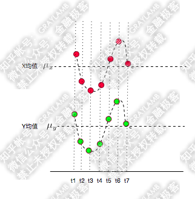

---
tag:math
---
# 协方差矩阵和多维正态分布
## 协方差矩阵
### 协方差的理解
协方差可以通俗的理解为两个变量之间相关性的描述(正相关、负相关, 相关性有多大). 公式如下:
$$
Cov(X, Y) = E[(X - \mu_x)(Y - \mu_y)]
$$
例如下面的例子, 每一时刻$X-\mu_x$与$Y-\mu_y$的正负号相同, 协方差为正.

而下面的例子, 则相反.

### 相关系数
为了定量的描述两个变量之间相关性的程度, 引入相关系数. 相关系数消除了两个变量变化幅度的影响, 而只是单纯反应两个变量每单位变化时的相似程度.
$$
\rho = \frac{Cov(X, Y)}{\sigma_x \sigma_y}
$$

### 协方差矩阵的引入
对于多维变量, 每个变量两两之间均有协方差来描述它们之间的相关性. 引入协方差矩阵, 更好地表示这些信息.
$$
\Sigma = E[(X - \mu)(X - \mu)^T] = \begin{bmatrix} \Sigma_{x_0 x_0} & \Sigma_{x_0 x_1} & ... & \Sigma_{x_0 x_n} \\
\Sigma_{x_1 x_0} & \Sigma_{x_1 x_1} & ... & \Sigma_{x_1 x_n}\\
... & ... & ... & ... \\
\Sigma_{x_n x_0} & \Sigma_{x_n x_1} & ... & \Sigma_{x_n x_n}\\
\end{bmatrix}
$$
由协方差的意义可知, 协方差矩阵是一个对称矩阵.

## 多维正态分布的推导
对于多维正态分布, $x = [x_1, x_2, ... , x_d]^T$, 平均值和方差分别为: $\mu_1, \mu_2, ... , \mu_d$, $\sigma_1, \sigma_2, ... , \sigma_d$, 若其各个维度之间相互独立, 则其密度函数就是各个维度密度函数的积:
$$
f(x) = \frac{1}{\sqrt{2\pi}^d \sigma_1 \sigma_2 ... \sigma_d} e^{-0.5[(\frac{x_1-\mu_1}{\sigma_1} )^2 (\frac{x_2-\mu_2}{\sigma_2} )^2 ... (\frac{x_d-\mu_d}{\sigma_d} )^2]} \\
= \frac{1}{(\sqrt{2\pi})^d |\Sigma|^{\frac{1}{2}}} e^{-0.5(x-u)^T\Sigma^{-1}(x-u)}
$$
这里$
\Sigma = \begin{bmatrix}
\sigma_1^2 & 0 & ... & 0\\
0 & \sigma_2^2 & ... & 0\\
0 & 0 & ... & 0\\
0 & 0 & ... & \sigma_d^2\\
\end{bmatrix}$
>好, 那么回到问题的重点, 在维度之间互相关的多元高斯分布中, 如何计算相对距离呢? 让我来举个吴恩达老师课上的例子, 这是一个二维正态分布, memory use和CPU load之间存在明显的正相关关系, 如果按照之前维度不相关的计算方法, 图中的绿色异常点就会被视作是正常的(真实分布是倾斜的椭圆).

利用化归的思想(主成分分析PCA), 找到倾斜的椭圆分布的长轴方向u1和短轴方向u2, 计算数据点在这两个轴上的坐标(变换到这两个方向之后，新的维度之间显然是不相关的).

对其协方差矩阵做SVD分解, 可得$\Sigma = U \Lambda U^T$, 这里$U = [u_1 \, u_2]$, $u_1$和$u_2$分别为u1和u2方向上的单位向量. 对于$Y=(X-\mu_{_X})U$, 则我们有$Y$的概率密度为:
$$
f(Y) = \frac{1}{\sqrt{2\pi}^{d} |\Lambda|^{\frac{1}{2}}}e^{-Y^T\Lambda^{-1}Y}
$$
易知$X$与$Y$一一对应, 因此$X$的概率密度, 与X对应的$Y$的概率密度相等. 因此, $X$的概率密度函数为:
$$
f(X) = \frac{1}{\sqrt{2\pi}^{d} |\Sigma_X|^{\frac{1}{2}}}e^{-(X-\mu_{_X})^T\Sigma_X^{-1}(X-\mu_{_X})}
$$

## Reference
协方差矩阵的理解: https://www.zhihu.com/question/20852004/answer/134902061
多维高斯分布是如何由一维发展而来的: https://www.zhihu.com/question/36339816/answer/67043318