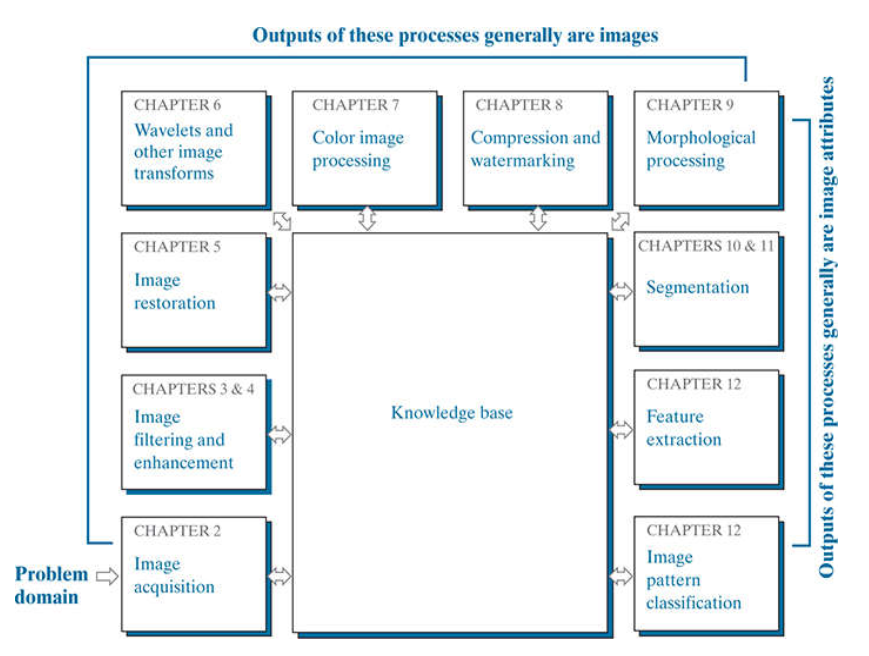
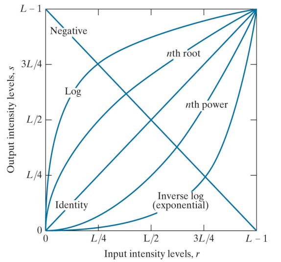

# Digitical Image Processing
## Book Overview(鸟瞰)
1. 图像处理的介绍: 图像处理的概念, 应用, 基本步骤, 以及一个图像处理系统的组成
2. 图像处理的基本知识: 视觉感知, 光学, 图像的获取、采样, 和一些数学工具
3. 💡 强度度变换和空域滤波
4. 💎 频域滤波
5. 🚩　应用: 图像的恢复和重建
6. 💡 霍夫变换和其他图像变换
7. 💡 图像颜色处理: 颜色空间模型, 颜色空间转换, 一些应用(压缩, 分割)
8. 应用: 图像压缩和水印
9. 应用: 形态图像处理: 膨胀腐蚀, 开闭
10. 🚩 应用: 图像分割1
11. 🚩 应用: 图像分割2
12. 🚩 应用: 图像pattern classification

💎: 非常重要
💡: 重要
🚩: 需要看的应用

## 图像处理的介绍
ch1既是介绍也包含的一个overview.
图像的来源并不单单是相机, 可以是garamma ray, xray, mri, lidar或者超声的信号的成像.

## Digital Image Fundamentals
basics of image sampling and quantization
spatial and intensity resolution and their effects on image appearance
basic geometric relationships between image pixels
principal mathematical tools used in digital image processing
a variety of introductory digital image processing techniques

## Intensity Transformations

Log Transformation, 将暗的像素值进行扩展, 将亮的像素值进行压缩.
$$
s = c\log(1+r)
$$

Power-Law (Gamma) transformation, $\gamma<1$展暗压亮, 而$\gamma>1$展亮压暗. 在打印机和显示器等设备上常用做颜色的调整.
$$
s = cr^\gamma \quad \mathrm{or} \quad s = c(r+\epsilon)^\gamma
$$

这里除了使用连续的函数, 也可以使用分段函数.

Histogram Processing, 基础且重要的工具之一. 
Histogram Equalization, 令$p_r$和$p_s$分别表示原始图片和目标图片像素值的PDF(probability density function), 则有:
$$
P_{s}(s)=p_{r}(r)\left|\frac{d r}{d s}\right|
$$

变换公式为(一个像素点的归一化像素值即为小于该亮度的概率):
$$
s=T(r)=(L-1) \int_{0}^{r} p_{r}(w) d w
$$

Histogram Matching(Specification), 两张图片分别做equalization, 并记录映射表, 即可相互转换.

Local Histogram Processing, 采用局部区域, 滑动窗口.

Local enhancement using histogram statistics
首先计算全局亮度均值$m_G$和全局亮度方差$\delta_G$, 以及局部均值$m_{xy}$和局部方差$\delta_{xy}$. 局部区域通过与全局进行对比, 来判断是否需要增强(这里我们对于暗区域直接乘以一个常数):
$$
g(x, y)=\left\{\begin{array}{ll}{C f(x, y)} & {\text { if } k_{0} m_{G} \leq m_{S_{x y}} \leq k_{1} m_{G} \; \mathrm{AND} \; k_{2} \sigma_{G} \leq \sigma_{S_{x y}} \leq k_{3} \sigma_{G}} \\ {f(x, y)} & {\text { otherwise }}\end{array}\right.
$$

这里$k_0 = 0, \; k_1=0.25, \; k_2=0, k_3=0.1$.

Spatial Correlation and Convolution
Correlation
$$
(w \circ f)(x, y) = \sum_{s=-a}^{a} \sum_{t=-b}^{b} w(s, t) f(x+s, y+t)
$$

Convolution
$$
(w \bullet f)(x, y) = \sum_{s=-a}^{a} \sum_{t=-b}^{b} w(s, t) f(x-s, y-t)
$$

Median filter

first and second derivative

laplacian

## Experiment
- [ ] median filtering
- [ ] laplacian

## 附加资料
http://www.imageprocessingplace.com/DIP-4E/dip4e_main_page.htm