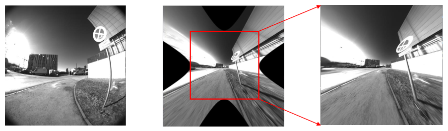

# DSO
## 裁切缩缩放, 新内参矩阵K
对于畸变较大的相机, 去畸变后会留下一部分空白区域. 因此, DSO对去畸变后的图片进行裁切, 然后缩放到目标大小, 然后计算新的相机内参矩阵K.

对应代码函数:`void makeOptimalK_crop()`

为了兼容所有的相机畸变模型, 在计算新的相机内参矩阵K时, 使用了采样的方法: 将归一化平面上的点加畸变投影到目标图像上, 来判断(去畸变后)该点是否有值, 来选取归一化平面上x, y的范围, 然后计算新的fx, fy, cx, cy.

不考虑scale(有缩放的话都乘以一个因子就好), 只考虑crop. 计算出的图像边界, 相机归一化坐标下$x_{min}, x_{max}$, 像素坐标系下$xp_{min}, xp_{max}$, 
按照我们的想法, 按照原相机投影

$$
\begin{aligned}
xp_{min} &= f_x x_{min} + c_x\\
xp_{max} &= fx x_{max} +c_x
\end{aligned}
$$
只有crop时, $f_x' = f_x$, 像素坐标需要加一个offset, $c_x' = c_x + xp_{min}$.

再考虑论文中的做法:

$$
\begin{aligned}
f_x' & = \frac{w}{x_{max} - x_{min}} = \frac{xp_{max} - xp_{min}}{x_{max} - x_{min}}\\
c_x' &= - f_x' * x_{min}
\end{aligned}
$$

显然这两个是等价的. 加入缩放因子, 也是一样.

## 光度误差建模
为了增加系统的可靠性, DSO将相机成像过程中的曝光时间、渐晕、Gamma校正加入进来, 一起建模. 其中, gamma校正和渐晕需要预先标定, 对于曝光时间则可给可不给.

相机光度模型:

$$
I(x) = G(tV(x)B(x))
$$

$I(x)$是从相机中得到的原始数据. 这里G是相机的响应函数(非线性), V是渐晕(衰减因子), B是辐照度(irradiance). 校正后: $I'(x) = tB(x) = \frac{G^{-1}(I(x))}{V(x)}$

接下来, 使用$I(x)$来定义校正后的图像. 光度误差定义为:

$$
r = I_j[p_j] - b_j - \frac{t_j e^{a_j}}{t_i e^{a_i}}(I_i[p_i] - b_i)
$$

为了兼容曝光时间已知和未知的情况, 使用$\frac{e^{a_i}(I_i - b_i)}{t_i}$来建模去除曝光时间后的光度, 加入一个额外的能量$\lambda_a a_i^2 + \lambda_b b_i^2$. 当曝光时间已知, 则通过令$\lambda_a, \lambda_b$为一个很大的值, 来使得$a_i=0, b_i=0$. 当曝光时间未知时, 则令$\lambda_a = \lambda_b = 0, t_i=1$, 从而利用$e^{a_i}(I_i - b_i)$来近似真实的$\frac{e^{a_i}}{t_i}$.

## 像素选择
目标: ①分布均匀, ②并包含在梯度较小区域的那些梯度虽然不那么高的点.
>We found that it is often beneficial to also include some points with weaker gradient from regions where no high-gradient points are present.

第0层和其余层的选点方式稍有区别.

## 初始化

## Reference
[DSO源码解读](https://zhuanlan.zhihu.com/p/85359304)
[DSO详解-高翔](https://zhuanlan.zhihu.com/p/29177540)
[dso注释版](https://github.com/alalagong/DSO)
[TUM数据集](https://vision.in.tum.de/data/datasets/mono-dataset?redirect=1)