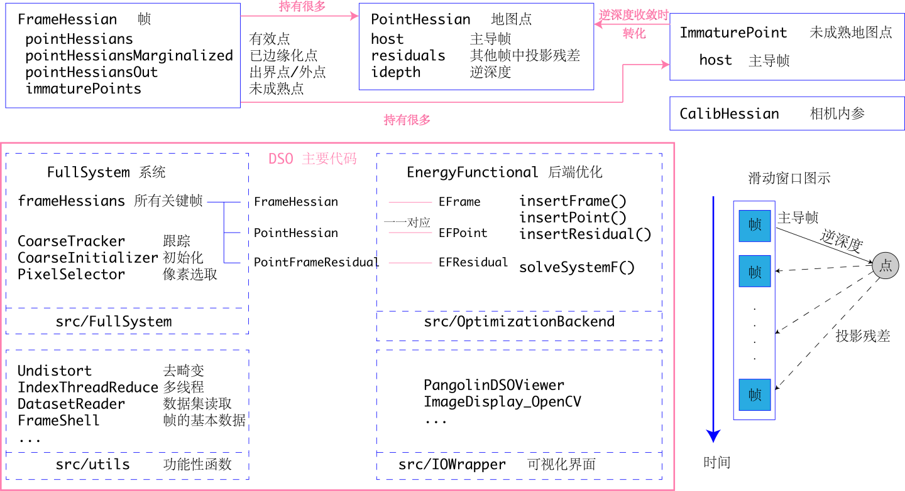
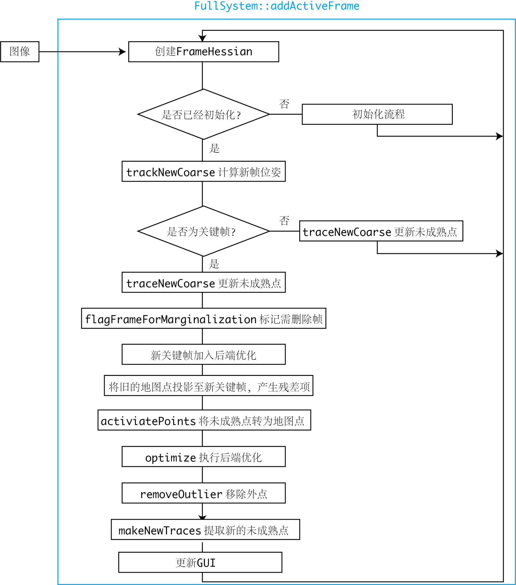

## DSO Implementation
### DSO代码框架

DSO整体代码由四个部分组成:
* 系统算法集成于 src/FullSystem
* 后端优化 src/OptimizationBackend
* src/utils, src/IOWrapper 为去畸变、数据集读写和可视化UI代码

滑动窗口的所有信息, 可以由若干个FrameHessian, 加上每个帧带有的PointHessian来描述. 所有的PointHessian又可以在除主导帧外的任意一帧中进行投影, 形成一个残差项, 记录于PointHessian::residuals中.

后端优化部分单独具有独立的Frame, Point, Residual结构. 由于DSO的优化目标是最小化能量, 所以以EF(energy function)开头, 且与FullSystem中存储的实例一一对应，互相持有对方的指针, 由EnergyFunctional类统一管理.

### 主流程:

