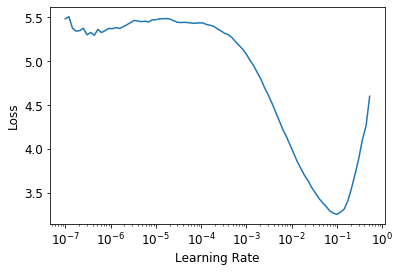

## ML Basic Concept
* `train`, `valid`, `test` data set & split stragety

    train-训练集

    valid-验证集, 用来验证数据是否过拟合

    test-测试集, 用来测试模型最终的正确率

* loss function
    * softmax/sigmoid
        
        $(-\infty,\infty) \to (0, 1)$, 可微. 用来做是否的判断.
        $$
        \mathrm{sigmoid}(x) = \frac{1}{1+e^{-x}}
        $$
        
    * 多label判断
        
        1. 输入 $x_i \in (-\infty, \infty)$,
        
        2. softmax 转换到 (0,1)
           $$
           softmax(x_i) = \frac{\exp(x_i)}{\sum_j \exp(x_j)}
           $$
        
        3. -ln (x[targ])得到 none negative loss - nn_loss (-1, 0)
        4. 将所有训练的数据残差相加
        
        $$
        \mathrm{CrossEntropyLoss} = \sum -\ln(\mathrm{softmax}(x[trag]))
        $$
    
* error metric
    * accuracy
    * recall
    
* learning rate

    小的learning rate会使得收敛特别慢(浪费时间), 且会由于过多的训练次数导致过拟合(每一次的训练, 都给模型记忆的机会).

    learning rate finder:

    1. 设置小的learning rate, 在小的数据batch上测试

    2. 慢慢将learning rate增大(double), loss 应该先下降后上升.

       ​	

       3. 选取拐点向前一点的learning rate

       4. 在transform learning中, 新加的那层由于使用了随机值(初始化). 

          可以先冻结住前面的层, 对输出层做学习. 然后再对全部层做学习. 也可以使用不同的learning rate.

* transform learning-迁移学习

    使用预先训练好的其他用途的模型，将最后的输出layer丢弃, 添加自己的layer.

* basic data process
    
    数据增强, 以提高数据量. 对图片进行缩放旋转, 仿射变换, 裁剪等.

* normalization

## Coding Basic

* fastbook init
    ```python
    !pip install -Uqq fastbook
    import fastbook
    fastbook.setup_book()
    
    from fastbook import *
    from fastai.vision.all import *
    ```

* Jupyter 帮助
    
    ```python
    ??function_name # 查看函数帮助
    %debug # debug查看变量
    ```
    
* DataBlock, 定义了数据获取接口, 包括数据的类型以及获取方法.
    
    ```python
    bears = DataBlock(
        blocks=(ImageBlock, CategoryBlock), 
        get_items=get_image_files, 
        splitter=RandomSplitter(valid_pct=0.2, seed=42),
        get_y=parent_label,
        item_tfms=Resize(128))
    ```
    
* DataLoader, 根据DataBlock加载数据, 是一个数据加载器.
    
    需要指定几个函数: get_items, splitter, get_x, get_y
    
    ```python
    dls = dblock.dataloaders(path)
    dls.show_batch(max_n=9, figsize=(8,6))
    
    # view tensor shape
    xb, yb=dls.one_batch()
    xb.shape, yb.shape
    ```
    
    DataLoader中包: train, valid, test?
    
* DataSet, 包含了整个数据集合.
    
    ```python
    df = pd.read_csv(path/'train.csv')
    dblock = DataBlock(get_x = lambda r: r['fname'], get_y = lambda r: r['labels'])
    dsets = dblock.datasets(df) # 
    dsets.train[0]
    ```
            
* DataAugmentation, 数据增强， 创建原始数据的多种变体. 

    ```python
    bears = DataBlock(
        blocks=(ImageBlock, CategoryBlock), 
        get_items=get_image_files, 
        splitter=RandomSplitter(valid_pct=0.2, seed=42),
        get_y=parent_label,
        item_tfms=RandomResizedCrop(224, min_scale=0.5), # 先缩放后裁剪, min_scale=0.5缩放不小于原图的1/2
        batch_tfms=aug_transforms(mult=2))
    # aug_transform 包括: flip, rotate, zoom, affine, lighting, wrap等
    ```

* Learner

  包含四个重要部件的类对象: Model, Data Loader, Optimizer(SGD), Loss Function.

   fastai会根据DataBlock 中带有 Loss Function.

  ```python
  learn = cnn_learner(dls, resnet34, metrics=error_rate)
  learn = vision_learner(dls, resnet18)
  
  dls.loss_func
  ```

* Learning Rate

  ```python
  learn = vision_learner(dls, resnet34, metrics=error_rate)
  lr_min,lr_steep = learn.lr_find(suggest_funcs=(minimum, steep))# 可以得到上面learning rate的图
  
  learn.fine_tune?? # 包含了learning rate find的过程
  # 专门用来做transform learning
  
  learn.learn_model
  ```

## Reference
[](https://github.com/muellerzr/Practical-Deep-Learning-for-Coders-2.0/tree/master/Computer%20Vision)