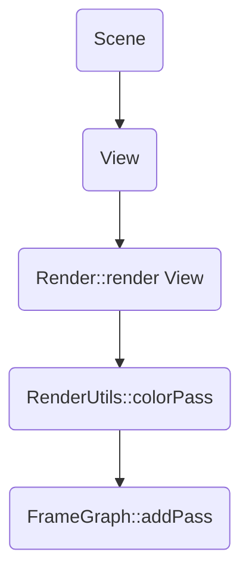

# filament
## 编译
* Android
    ```bash
    cmake ../../ -DCMAKE_TOOLCHAIN_FILE=/home/wegatron/opt/android_sdk/ndk/21.4.7075529/build/cmake/android.toolchain.cmake -DANDROID_PLATFORM=android-30 -DANDROID_NDK=/home/wegatron/opt/android_sdk/ndk/21.4.7075529 -DCMAKE_BUILD_TYPE=Release -DANDROID_ABI="arm64-v8a" -DCMAKE_INSTALL_PREFIX="/home/wegatron/win-data/usr/android"
    ```

    修改`filament/backend/CMakeLists.txt`

    ```cmake
    if (EGL OR ANDROID)
        list(APPEND SRCS src/opengl/platforms/PlatformEGL.cpp)
    endif()
    ```

* Linux
    编译前需要安装 libc++, libc++abi
    ```bash
    cmake -S . -B build_linux -DCMAKE_C_COMPILER=clang-12 -DCMAKE_CXX_COMPILER=clang-12
    ```
    修改CMakeLists.txt, 添加:
    ```cmake
    add_link_options(-stdlib=libc++)
    add_link_options(-lm)
    add_compile_options(-stdlib=libc++)
    ```

* Windows

## 整体架构
filament整体架构:
![[rc/filament_structure.svg]]

第一层 [工具、example、App]
* Tools主要是材质或模型的处理优化工具. 比如: 材质编译工具`matc`, 材质编辑器`tungsten`(未有成熟的Release).

第二层 [用户接口]
* Engine, 虚拟渲染资源创建销毁管理, 并利用JobSystem, 发送命令到下一层.
* Virtual Rendering Resource, 虚拟渲染资源.
* 场景级别的抽象, 包括View(后处理如抗锯齿、雾等, Viewport, Camera等), Scene(场景中的物体), Entity(被绘制的物体+light等).

第三层 [支撑组件]
* Backend/RHI
    * Platform 系统和窗口的抽象
    * Rendering Resource/Setting抽象, 例如: Texture, Buffer, SwapChain, RenderTarget
    * Driver 创建销毁渲染资源
    * Context 跟踪管理渲染资源以及渲染状态设置. Vulkan/Metal(数据Device, CommandQueue...), OpenGl(OpenGL状态控制).
* Frame Graph 渲染帧图, 一帧渲染的整个pipline.
* Material 材质的定义和解析
* JobSystem 任务系统
## ECS系统
参考: [Filament解析4·ECS](https://zhuanlan.zhihu.com/p/144543664)

#### ECS entity的创建
```c++
// 由EntityManager负责Entity的创建和销毁
// Entity只是一个全局唯一的id
class EntityManager
{
public:
	void create(size_t n, Entity* entities);
	void destroy(size_t n, Entity* entities);
};

// 在filament中有四种entity, 对应于engine中的四个Manager
class FEngine : public Engine
{
public:
	...
private:
    FRenderableManager mRenderableManager;
    FTransformManager mTransformManager;
    FLightManager mLightManager;
    FCameraManager mCameraManager;
};

// 以FRenderableManager为例
class FRenderableManager
{
public:
	// free-up all resources
	void terminate() noexcept;

	// 由engine调用, 垃圾回收
	// 删除死亡的entity, 所拥有的component
	void gc(utils::EntityManager& em) noexcept;

	// 删除entity拥有的component
	void destroy(utils::Entity e) noexcept;

	void create(const RenderableManager::Builder& builder, 
				utils::Entity entity);
	
	bool hasComponent(utils::Entity e) const noexcept {
		return mManager.hasComponent(e);
	}

	// 在manager的map中查询是否存在该entity, 若存在, 返回index
	// 不存在返回0
	Instance getInstance(utils::Entity e) const noexcept {
		return mManager.getInstance(e);
	}
};
```

FRenderableManager创建entity, 并添加components

```c++
void FRenderableManager::create(
    const RenderableManager::Builder& UTILS_RESTRICT builder,
    Entity entity) {
    ...
	// 添加一个新的entity
    Instance ci = manager.addComponent(entity);

    // 添加components
    setPrimitives(ci, { rp, size_type(entryCount) });
    ...
}
```
在FRenderableManager中, Sim类定义了该类entity所能够拥有的component类型:
```c++
using Base = utils::SingleInstanceComponentManager<
    Box,                             // AABB
    uint8_t,                         // LAYERS
    MorphWeights,                    // MORPH_WEIGHTS
    uint8_t,                         // CHANNELS
    uint16_t,                        // INSTANCE_COUNT
    Visibility,                      // VISIBILITY
    utils::Slice<FRenderPrimitive>,  // PRIMITIVES
    Bones,                           // BONES
    utils::Slice<MorphTargets>       // MORPH_TARGETS
>;

struct Sim : public Base {
    using Base::gc;
    using Base::swap;
    ...
};
```

#### ECS 系统的更新
将entity加入到场景中
```c++
void FScene::addEntity(Entity entity) {
    mEntities.insert(entity);
}
```

当renderJob运行时会进入到FScene::prepare. 
遍历场景中所有alive的entity, 并将数据更新到mRenderableData(SOA数据结构)中.
```c++
void FScene::prepare(const mat4& worldOriginTransform, bool shadowReceiversAreCasters) noexcept {
// TODO: can we skip this in most cases? Since we rely on indices staying the same,
// we could only skip, if nothing changed in the RCM.
FEngine& engine = mEngine;
EntityManager& em = engine.getEntityManager();
FRenderableManager& rcm = engine.getRenderableManager();
FTransformManager& tcm = engine.getTransformManager();
FLightManager& lcm = engine.getLightManager();
// go through the list of entities, and gather the data of those that are renderables
auto& sceneData = mRenderableData;
auto& lightData = mLightData;
auto const& entities = mEntities;

...

for (Entity e : entities) {
    if (!em.isAlive(e)) {
        continue;
    }
    // we know there is enough space in the array
    sceneData.push_back_unsafe(
        ri,                             // RENDERABLE_INSTANCE
        worldTransform,                 // WORLD_TRANSFORM
        visibility,                     // VISIBILITY_STATE
        rcm.getSkinningBufferInfo(ri),  // SKINNING_BUFFER
        rcm.getMorphingBufferInfo(ri),  // MORPHING_BUFFER
        worldAABB.center,               // WORLD_AABB_CENTER
        0,                              // VISIBLE_MASK
        rcm.getChannels(ri),            // CHANNELS
        rcm.getInstanceCount(ri),       // INSTANCE_COUNT
        rcm.getLayerMask(ri),           // LAYERS
        worldAABB.halfExtent,           // WORLD_AABB_EXTENT
        {},                             // PRIMITIVES
        0,                              // SUMMED_PRIMITIVE_COUNT
        {},                             // UBO
        scale                           // USER_DATA
    );        
}    
}
```

这里sceneData是一个SOA数据结构
```c++
using RenderableSoa = utils::StructureOfArrays<
  utils::EntityInstance<RenderableManager>,   // RENDERABLE_INSTANCE
  math::mat4f,                                // WORLD_TRANSFORM
  FRenderableManager::Visibility,             // VISIBILITY_STATE
  FRenderableManager::SkinningBindingInfo,    // SKINNING_BUFFER
  FRenderableManager::MorphingBindingInfo,    // MORPHING_BUFFER
  math::float3,                               // WORLD_AABB_CENTER
  VisibleMaskType,                            // VISIBLE_MASK
  uint8_t,                                    // CHANNELS
  uint16_t,                                   // INSTANCE_COUNT
  uint8_t,                                    // LAYERS
  math::float3,                               // WORLD_AABB_EXTENT
  utils::Slice<FRenderPrimitive>,             // PRIMITIVES
  uint32_t,                                   // SUMMED_PRIMITIVE_COUNT
  PerRenderableData,                          // UBO
  // FIXME: We need a better way to handle this
  float                                       // USER_DATA
  >;
```

[filament SOA的数据结构](https://blog.csdn.net/qq_16555407/article/details/123619365)(代码较为复杂, 简单的可以是一个struct有数量相同的各种类型的array). 为了支持多种类型的数据渲染, 可以包含不同类型的RenderableSoa.

## 任务系统/线程模型

### Driver线程
在引擎构建时, 创建一个driver线程, 在该线程内相关图形API命令(execute函数).

```c++
FEngine* FEngine::create(Backend backend, Platform* platform, void* sharedGLContext) {
    ...
    // start the driver thread
    instance->mDriverThread = std::thread(&FEngine::loop, instance);

    // wait for the driver to be ready
    instance->mDriverBarrier.await();
    ...
}

int FEngine::loop() {
    ...
    while (true) {
        // looks like thread affinity needs to be reset regularly (on Android)
        JobSystem::setThreadAffinityById(id);
        if (!execute()) {
            break;
        }
    }
    ...    
}

bool FEngine::execute() {
    // wait until we get command buffers to be executed (or thread exit requested)
    auto buffers = mCommandBufferQueue.waitForCommands();
    if (UTILS_UNLIKELY(buffers.empty())) {
        return false;
    }
    // execute all command buffers
    for (auto& item : buffers) {
        if (UTILS_LIKELY(item.begin)) {
            mCommandStream.execute(item.begin);
            mCommandBufferQueue.releaseBuffer(item);
        }
    }
    return true;    
}
```

### 渲染过程



### Command
CommandStream
CommandBase
CircularBuffer

## RHI
### 初始化

在filament中, `opengl context`, `vulkan/metal device`是怎么创建的?

在platform中封装了各个平台+窗口系统下, 各个图形API Driver的创建和销毁. 其中, Opengl由于其设计思想比较古老, 还添加了swapchain以及makecurrent等函数.

![[rc/filament_platform.svg]]

几个重要的platform:
* PlatformWGL中, platform在创建的时候直接创建窗口, 并得到窗口的opengl context.

* PlatformEGLAndroid

* PlatformVkWindows, 

* PlatformVkAndroid

* platformMetal, 直接创建Device.

在创建了platform之后, 再使用*DriverFactory根据platform和context, 创建Driver. Driver图形API的真正抽象.

![[rc/filament_rendering_resources_class.svg]]

#### 资源创建

在filament中, 大部分操作都需要用到`Engine`, 调用其相关函数, 但仔细看代码可以发现, `Engine`类其实只是构建了虚拟的资源, 并不真正干活.

![[rc/filament_rendering_resource.svg]]

```c++
template <typename T>
inline T* FEngine::create(ResourceList<T>& list, typename T::Builder const& builder) noexcept {
    T* p = mHeapAllocator.make<T>(*this, builder);
    list.insert(p);
    return p;
}
```

🍉 这个地方咋一看, 申请虚拟资源就完了, 看CommandQueue, 也找不到其怎么将command存入的地方.
这里, 创建了一个资源的包装VertexBufferHandle, 并将创建命令加入到`CircularBuffer`中(通过allocateCommand), 当执行`CommandQueue::flush`时, 将buffer中的命令才被加入任务队列, 由driver thread去执行任务队列中的任务.

```c++
// 在虚拟的图形资源中会往buffer中添加相关命令
FVertexBuffer::FVertexBuffer(FEngine& engine, const VertexBuffer::Builder& builder)
{
    ...
    FEngine::DriverApi& driver = engine.getDriverApi(); // 这里driver是CommandStream
    mHandle = driver.createVertexBuffer(
            mBufferCount, attributeCount, mVertexCount, attributeArray, backend::BufferUsage::STATIC);    
    ...
}

// 真实的createVertexBuffer函数展开后如下.
// 每一层的抽象图形API都有自己的一套实现方式, 直到真正的XXXDriver.cpp
VertexBufferHandle Driver::createVertexBuffer(uint8_t bufferCount, uint8_t attributeCount, uint32_t vertexCount,
                                      AttributeArray attributes, BufferUsage usage)
{
    mDriver->debugCommand("createVertexBuffer");
    VertexBufferHandle result = mDriver->createVertexBufferS();
    using Cmd = CommandType<decltype(&Driver::createVertexBufferR)>::Command<&Driver::createVertexBufferR>;

    // 在创建命令时已经把命令放入command buffer
    void* const p = allocateCommand(CommandBase::align(sizeof(Cmd)));
    new(p) Cmd(mDispatcher->createVertexBuffer_, // 函数指针
                VertexBufferHandle(result), std::move(bufferCount), std::move(attributeCount), std::move(vertexCount),
                std::move(attributes), std::move(usage));
    return result;
}

// CommandStream以CircleBuffer的数据来源
void FEngine::init() {
    ...
    mCommandStream = CommandStream(*mDriver, mCommandBufferQueue.getCircularBuffer());
    ...
}

// 将buffer中的命令放入queue
void CommandBufferQueue::flush() noexcept {
    SYSTRACE_CALL();

    CircularBuffer& circularBuffer = mCircularBuffer;
    
    // end of this slice
    void* const head = circularBuffer.getHead();

    // beginning of this slice
    void* const tail = circularBuffer.getTail();

    std::unique_lock<utils::Mutex> lock(mLock);
    mCommandBuffersToExecute.push_back({ tail, head });
    ...
}
```

## 内存管理

## 其他
## 参考
* [filament SOA的数据结构](https://blog.csdn.net/qq_16555407/article/details/123619365)
* [游戏引擎开发新感觉！(6) c++17内存管理](https://zhuanlan.zhihu.com/p/96089089)
* [《STL源码剖析》提炼总结：空间配置器(allocator)](https://zhuanlan.zhihu.com/p/34725232)