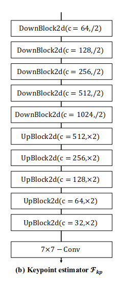
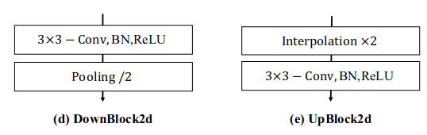
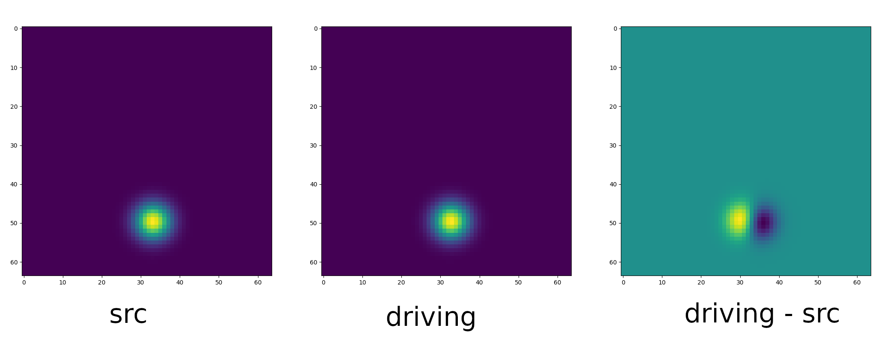
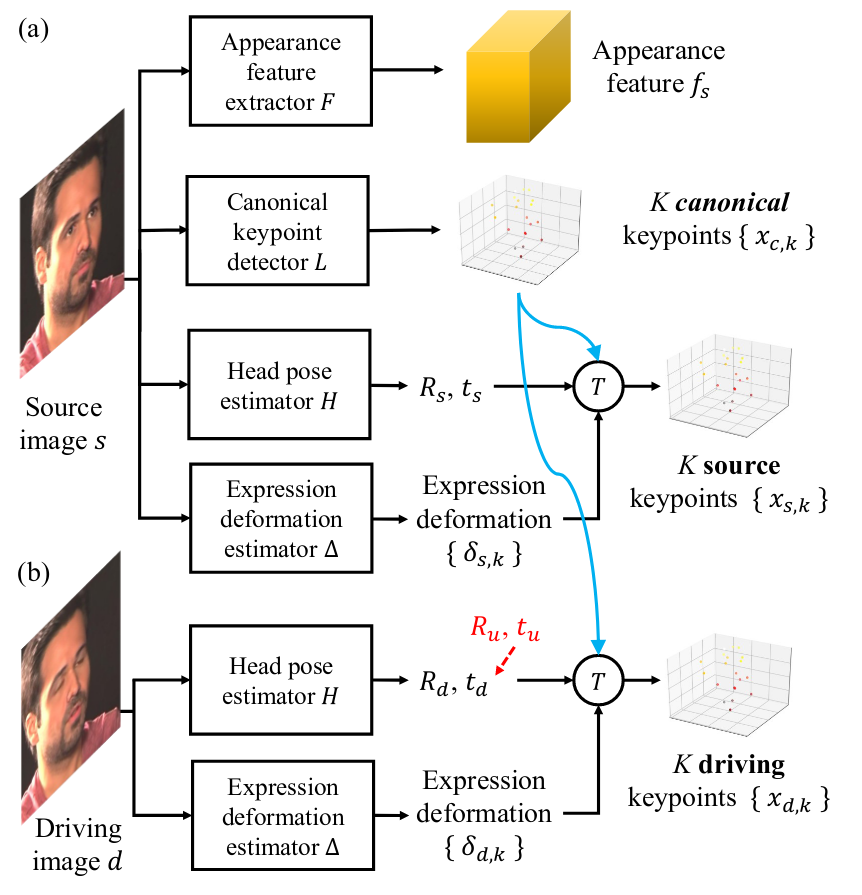
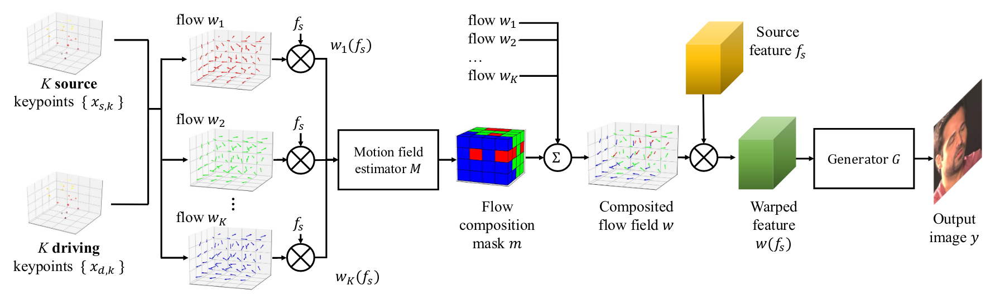
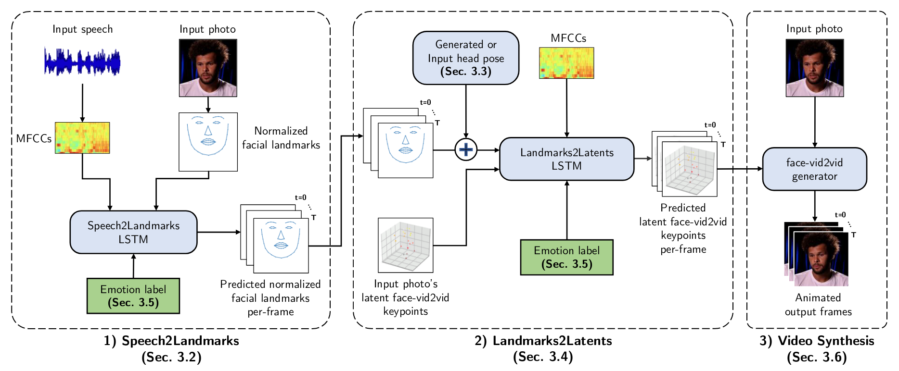
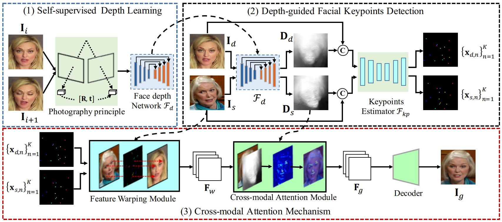
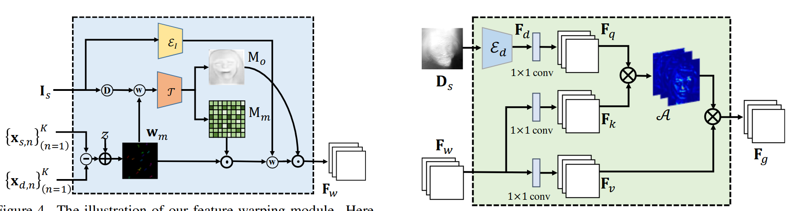

# FOMM

## keypoint detector network:
通过U-Net得到feature map




* 输入为1x3x64x64的图像, 每经过一个DownBlock wh/2, channelx2.
* 接着是一系列UpBlock, UpBlock先通过插值将whx2, 再通过conv将channel/4, 再concate上原对应层数据, 这样输出whx2, channel/2. 最终输出1x35x64x64的feature map.
* 最后通过一个7x7的conv, 输出depth=num_kpt的heat_map(热力图). 再通过softmax函数将热力图转化为该像素点是keypoint的概率值.
* 然后通过加权得到特征点的位置. (grid是一个wxhx2的array, 每个的值代表其2D坐标, 用它与概率值相乘再求和) arg-softmax, 可微分.

最终输出为: N=10 个 2x1 keypoint + 2x2 jacobian

## Dense Motion Network

通过`OcclusionAwareGenerator::forward(self, source_image, kp_driving, kp_source)`计算motion.


* 通过关键点检测, 得到driving frame上的相对运动, normalize计算相对运动, 最终计算得到source frame上关键点的目标位置.

    ```python
    kp_norm = normalize_kp(
        kp_source=kp_source, kp_driving=kp_driving,
        kp_driving_initial=kp_driving_initial, use_relative_movement=relative,
        use_relative_jacobian=relative, adapt_movement_scale=adapt_movement_scale)
    ```

* sparse motion: 基于这N=10个特征点的一阶段Taylor展开, 以及gaussian函数加权平均, 得到各个像素的driving_to_source(归一化到-1，1), 最后添加一层额外的identity_grid. `create_sparse_motions(self, source_image, kp_driving, kp_source)`.

* 根据sparse motion得到deform后的image. `create_deformed_source_image(self, source_image, sparse_motions)`.

* 计算每keypoint导致的运动的发生程度高斯热力图heatmap(有正负), 距离driving越近正值越大, 距离src越近负值越大, driving - source:

    $$
    \mathrm{H}_k = \exp(\frac{(\tau_{D \leftarrow R}(p_k) - z)^2}{\sigma}) - \exp(\frac{(\tau_{S \leftarrow R}(p_k) - z)^2}{\sigma})
    $$

    

    备注: $\tau_{D \leftarrow R}(p_k)$ 是keypoint在Driving frame中的位置. $z$是S/D frame中每个像素点的位置.

* 设计了另一个hourglass network, 以sparse deform之后的结果与heatmap进行级联作为输入, 输出prediction. 基于prediction, 分别经过7x7 conv可以得到mask(每个sparse motion权重, 加权得到最终的dense motion)和occlusion(遮挡).

最后的输出为: sparse_deformed(deform之后的图片) 1x11x3x64x64, mask(权重) 1x11x64x64, deformation 1x64x64x2, occlusion_map 1x1x64x64

### Generation
通过SameBlock + 2xDownBlock2d, 将1x3x256x256的原图转变为1x256x64x64的feature map. 利用上一步的结果对feature map进行deform, 再乘以occlusion_map, 将被遮挡的feature除去. 在通过bottleneck + up_blockx6 + 7x7 conv 3 /3 得到最终输出.


### Training

* reconstruction loss
    输出结果构建图像金字塔, 在多个分辨率下, 利用vgg-19提取feature, 计算driving frame $D$ 与 reconstructed frame $\hat{D}$之间的loss:

    $$
    L_{rec}(\hat{D}, D) = \sum_{i=1}^I |N_i(\hat{D}) - N_i(D)|
    $$

    ```python
    for scale in self.scales:
        x_vgg = self.vgg(pyramide_generated['prediction_' + str(scale)])
        y_vgg = self.vgg(pyramide_real['prediction_' + str(scale)])

        for i, weight in enumerate(self.loss_weights['perceptual']):
            value = torch.abs(x_vgg[i] - y_vgg[i].detach()).mean()
            value_total += self.loss_weights['perceptual'][i] * value
        loss_values['perceptual'] = value_total
    ```

* GAN loss
    这里GAN与普通的loss好像有点不一样, 对输出结果的图像金字塔进行判别, loss:

    $$
        L = (1-D(x))^2
    $$

    ```python
    for scale in self.disc_scales:
        key = 'prediction_map_%s' % scale
        # discriminator_maps_generated 判别器对结果的判别
        value = ((1 - discriminator_maps_generated[key]) ** 2).mean()
        value_total += self.loss_weights['generator_gan'] * value
    ```

* keypoint equivariance loss
    图片旋转或形变后, 检测到的key point位置不变.

# face-vid2vid

## 特征提取和特征点驱动
针对人头进行了适配, 将人头信息进行了拆分: 
1. apparance feature volumn
    特征tensor

2. geometry feature
    K=20个3D特征点进行表示, 3D特征点与人头姿态和表情无关(标准姿态下的人脸特征点). 

3. head pose + expression
    人头的RT, 以及(第k个)特征点自然姿态下的deformation $\delta_{s,k}$. $s$表示source.

从而有:

$$
x_{s,k} = T(x_{c,k}, R_s, t_s, \delta_{s,k}) \equiv R_s x_{c,k} + t_s + \delta_{s,k}
$$

这里, $x_{c,k}$ canonical keypoints是检测得到的姿态、表情无关的特征点位置. $x_{s,k}$是加入姿态表情之后的特征点位置.


对于原图提取所有信息, 而对于驱动视频, 只提取Head pose和Expression deformation. 应用到原图的$x_{c,k}$上, 得到目标特征点位置.




## Motion Field生成和结果生成
感觉与FOMM基本差别不大. 利用每个特征点的一阶Taylor展开, 生成多个flow, 对feature进行wrap, 再将wrap的结果送入一个网络得到权重.




## Training

# SpaceX
在face-vid2vid的基础上, 加了两个前端(从后往前).
1. Landmarks2Latents
    根据标准化的3DDFA和MTCNN特征点, 计算对应的face-vid2vid的特征点. 从而可以显示地控制人脸的emotion, 眨眼等.

2. Speech2Landmarks
    通过语音驱动标准化的3DDFA和MTCNN特征点.



# DaGAN
通过深度图, 对FOMM的结果进行了优化.

1. 通过估计得到的人脸深度图, 来辅助特征点检测(得到更好的特征点).
2. 对wrap得到的$F_w$, 利用深度图进行进一步加工得到$F_g$.



生成部分, 第一个生成网络与原始FOMM基本没有区别. 一个初始的dense motion field $\mathbf{w}_m$, 再对feature进行wrap, 然后利用wrap的feature生成权重$\mathbf{M}_m$和occlustion map $\mathbf{M}_o$, 然后得到最终的$\mathbf{F}_w$.




# 一些问题
FOMM 分辨率如何提高, face-vid2vid 512x512, 其他大部分256 x 256. 分辨率与数据集合相关?