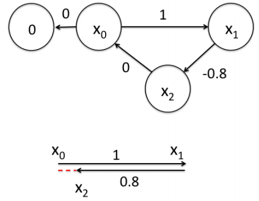
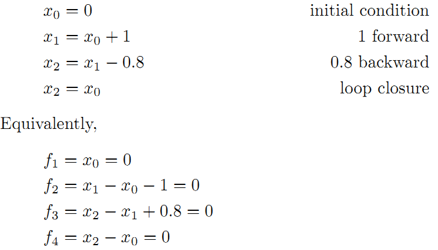
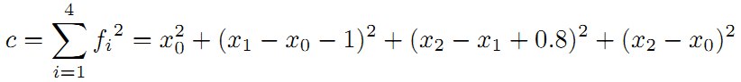
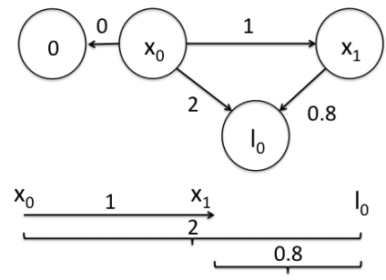
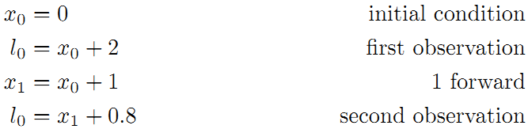
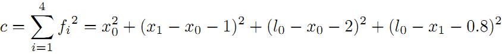

# 图优化和g2o的简单介绍
## 图优化的直观理解的例子
图优化的直观例子理解参考: https://blog.csdn.net/heyijia0327/article/details/47686523
### 1.闭环检测优化
>下图所示，假设一个机器人初始起点在0处，然后机器人向前移动，通过编码器测得它向前移动了1m，到达第二个地点。接着，又向后返回，编码器测得它向后移动了0.8米。但是，通过闭环检测，发现它回到了原始起点。可以看出，编码器误差导致计算的位姿和观测到有差异，那机器人这几个状态中的位姿到底是怎么样的才最好的满足这些条件呢？
>
>首先构建位姿之间的关系，即图的边:
>
>求解最小化残差平方和:
>

### 2.Landmark优化
>除了用闭环检测, 也可以用Landmark来构建边. 假设一个机器人初始起点在0处, 并观测到其正前方2m处有一个路标. 然后机器人向前移动, 通过编码器测得它向前移动了1m, 这时观测到路标在其前方0.8m. 求机器人位姿的最优状态.
>
>我们把路标也当作了一个顶点, 构建边的关系如下:
>
>求解最小化残差平方和:
>

### 3.增加权重
>我们知道传感器的精度是有差别的，也就是说我们对传感器的相信程度应该不同。比如假设这里编码器信息很精确，测得的路标距离不准，我们应该赋予编码器信息更高的权重.

## g2o
### g2o整体结构
我以为g2o中有几个重要的部分, 分别为: 由vertex、edge构成的graph以及solver. g2o全称`A General Framework for Graph Optimization`, 之所以general, 是因为只要用vertex, edge定义好graph, 然后指定solver, 即可求解. 其结构如下图:

### g2o在slam中的使用
对于初学者而言, 可以循序渐进:
1. 学会使用已经定义好了的vertex, edge构造优化问题求解.
2. 学着自定义vertex, edge.
3. 去了解图优化问题的数学定义公式和求解原理. 

这里只到第一步. 在slam问题中, 顶点可以是由传感器计算得到的机器人的位姿势$SE(3)$, 或者是landmark的位置$xyz$, 而边则可以是机器人位姿之间的变换推导, 或者是特定位姿下对landmark的测量值.

## reference
图优化的直观例子理解: https://blog.csdn.net/heyijia0327/article/details/47686523
半闲居士深入理解g2o: https://www.cnblogs.com/gaoxiang12/p/5304272.html
半闲居士g2o在SLAM中的使用: https://www.cnblogs.com/gaoxiang12/p/3776107.html
g2o学习笔记: https://www.jianshu.com/p/e16ffb5b265d
github官方文档: https://github.com/RainerKuemmerle/g2o/blob/master/doc/g2o.pdf