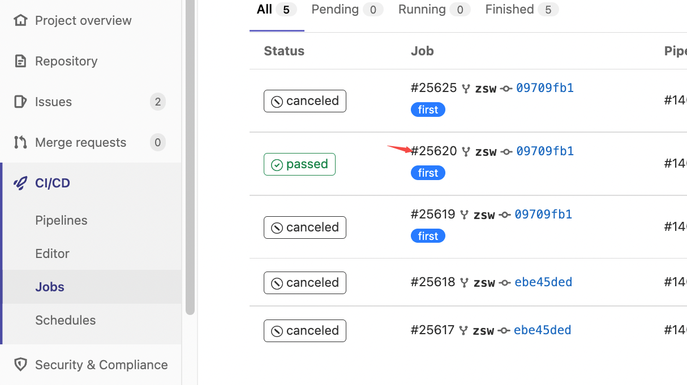
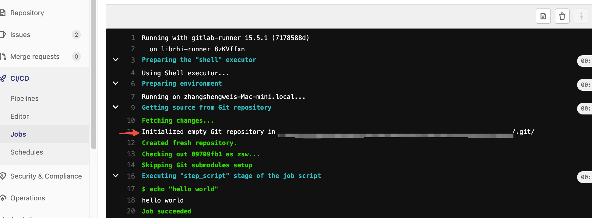

## 安装&注册 gitlab runner
参考: https://docs.gitlab.com/runner/install/osx.html

```bash
# 下载
sudo curl --output /usr/local/bin/gitlab-runner \
"https://gitlab-runner-downloads.s3.amazonaws.com/latest/binaries/\
gitlab-runner-darwin-amd64"

# 执行权限
sudo chmod +x /usr/local/bin/gitlab-runner
```

```bash
# 安装gitlab service, gitlab runner 会在系统启动时自动启动
gitlab-runner install

# 启动服务
gitlab-runner start

# 注册
gitlab-runner register
# 注册完成后会将信息保存到config.toml
# Configuration (with the authentication token) was saved in
# "***/.gitlab-runner/config.toml"
```

```bash
# 真正启动
gitlab-runner run
```

## gitlab ci/cd配置

```yaml
build_job:
  stage: build
  script:
    - echo "hello world"
  tags:
    - first # 这里是runner的tag
```

查看log:


gitlab runner 会自动将代码下载到目录下:
