# Global Relocalization
## Relate Work
全局配准方法可以分为两类:①点云全局配准算法; ②基于特征匹配的算法. `4PCS`和`GO-ICP`是全局点云配准算法中最具代表性(主流)的算法. 而当前新提出的基于特征匹配的3d激光全局定位算法有:`Scan Context`, `LocNet`以及`SegMap`.
### 4PCS & Super4PCS
优势: 能很好地应对噪声(outlier)和只有部分重叠的情况.
* Pipeline & Basic Concept
对于需要配准的两片点云P, Q. 参考RANSAC的思想, 在P中随机选取4个共面点B, 基于共面点之间的仿射不变性, 在Q中寻找最佳的匹配U, 计算B$\to$U的最佳Transfrom T, 然后用点云P,Q对T进行验证, 计算outlier, 判断配准是否正确. 重复多次上述过程, 获得outlier最少(最佳)的Transform.
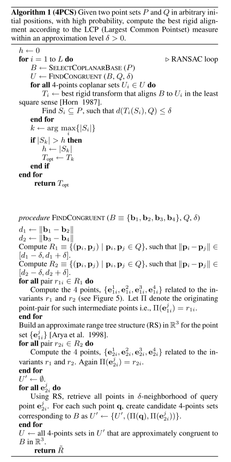

①核心加速策略: 在寻找correspondence时, 对于刚性变换, 先可以根据长度选取点对. 然后根据仿射不变性, 求出每对点上可能的交点(每对点两个). 构建交点的ANN树, 从而可以高效搜索correspondense.
②验证加速: 在验证所求得的Transform T时, 先随机的选取一部分点, 若满足条件再验证其余的点.

* Complexity
时间复杂度$O(n^2)$, 空间复杂度$O(n)$, n是点的数量.
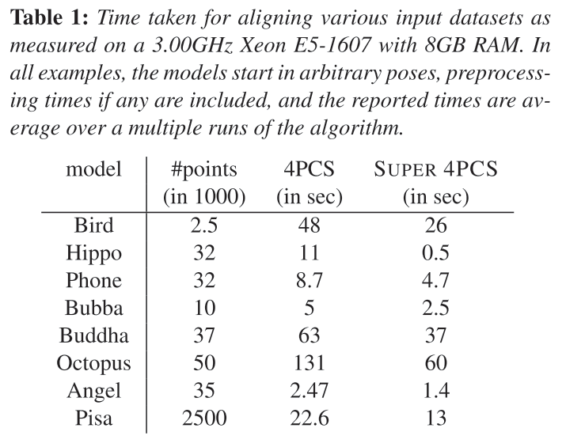

* Partial Overlap
在选取B时需要考虑, 选取的点必须在overlap区域内.

* 算法衍生
Super4PCS将时间复杂度提升到$O(n)$. 利用栅格化索引, 将特定距离点对的提取由$O(n^2)$下降到$O(n)$, 并且在寻找共面点时将两个线段之间的夹角也考虑进去(法向可表示为一个单位球体上的坐标, 从而可以通过栅格化这个球, 快速查找到角度差异在一定范围内的点对). 2PNS, MSSF-4PCS添加了更多的优化策略, 提高了精度和效率.
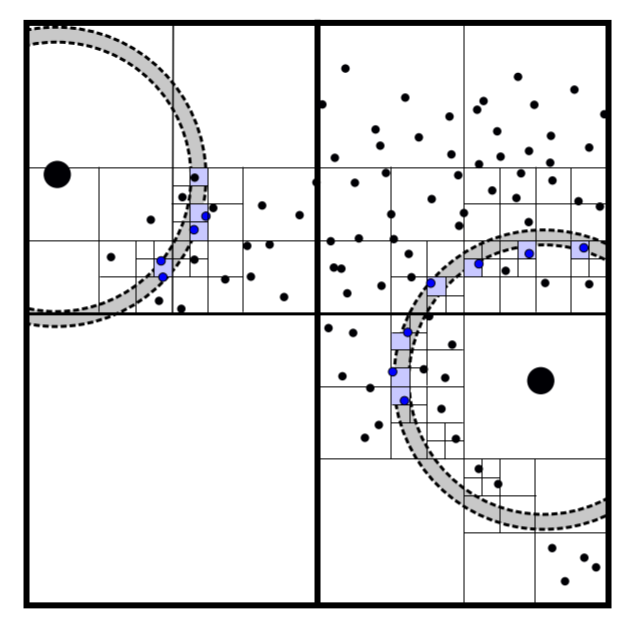

## GO-ICP
基于BnB(Branch-and-Bound)思想的全局优化算法. 该算法的本质是, 在解空间中利用类似二分查找的思想, 进行搜索, 通过估计求解空间的下界迅速剔除无效的搜索空间, 并优先搜多下界较小的解空间.

* Basic Concept
将求解空间参数化为
`Rotation domain`: 3D vector $\mathbf{r}$, with axis $\mathbf{r}/\parallel \mathbf{r} \parallel$ and angle $\parallel \mathbf{r} \parallel$, 为了方便计算, 看做是一个$[-\pi, \pi]$的立方体空间.
`Translation domain`: 看做是$[-\xi, \xi ]^3$立方体空间.
对于任意的一个以$(\mathbf{r_0, r_1})$为中心的求解空间$C_r \times C_t$, 我们可以求取残差的上下界:
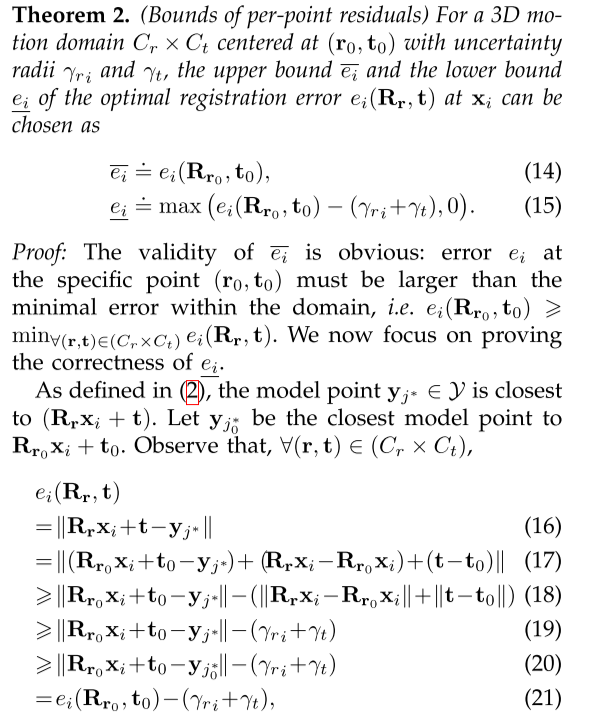

* Pipeline
通过搜索逐渐减小$E^*$, 中间通过ICP对结果进行refine, 当$E^*$和最小的下界差异很小时结束搜索.
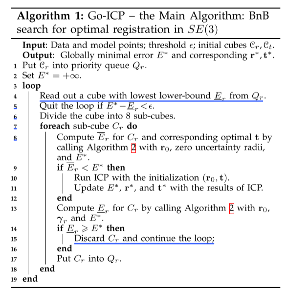
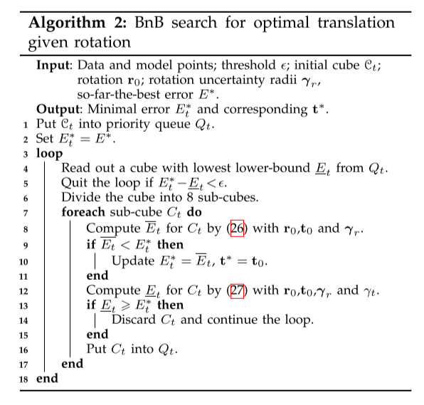

* Performance
时间消耗非常大, 2000个点的配准可能要80s. 当然, 若能够在初始的情况下缩小搜索空间, 则可以考虑使用.

## Scan Context
定义了3D激光的特征, 并在特征空间中寻找相似的方法.

* Basic Concept
对激光数据进行两个维度上的划分: 根据离中心点的距离划分为环, 并根据水平方向的角度划分扇区, 最后得到一块块的bin, 取每个bin的高度最大值(很少的计算量, 但很有效)作为这个bin的代表, 从而得到一个matrix or image以此作为激光的特征, 以两个矩阵之间的差异的反来表示两帧的激光的相似度(暴力旋转匹配).
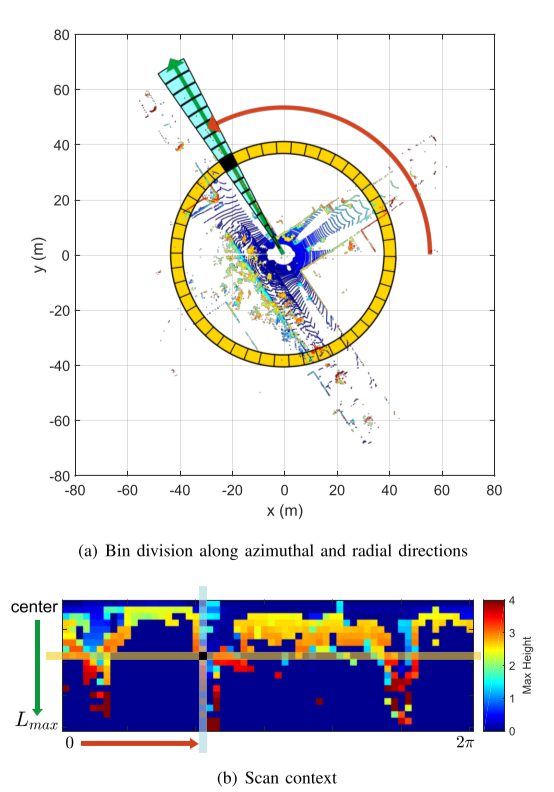

为了加速搜索相似的激光帧, 使用两步搜索策略, 计算每帧激光每一环的占空比, 构建一个一维向量(旋转不变).
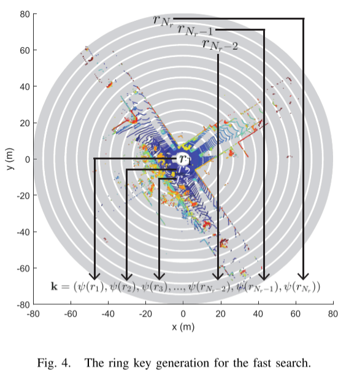
* Pipeline
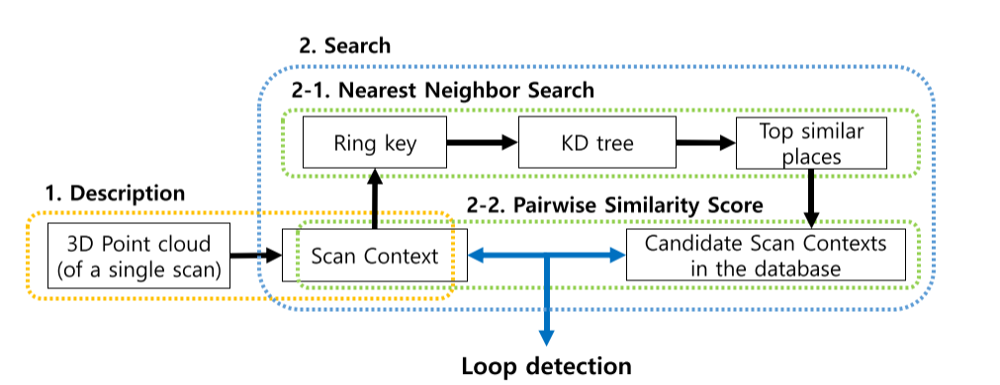
设环数为$N_r$, 扇区数为$N_s$.
初始化:
①为每一帧抽取特征矩阵$\mathbf{I}_{rs}$
②计算旋转不变特征向量`ring key`: $\mathbf{k} = (\psi(r_1), ... \psi(r_{N_r}))$, 这里$\psi(r_i)$是 占空比(occupancy ratio).
③根据$\mathbf{k}$构建kdtree.
搜索:
①通过`ring key`, 选取最相似的m帧激光帧
②通过$\mathbf{I}$做更细的筛选和判断
③从而可以给出ICP的初始translate和rotation

* Performance
速度很快, I7-6700CPU,16G内存, 在KITTI00上搜索时间少于1s, 不包括ICP时间.
效果具体待验证

## LocNet
对于多线旋转的3d激光数据帧P, 每一线都可以得到一环的数据. 对每一环的数据$S_N^i$, 计算相邻点之间的2D距离$d(p_k, p_{k-1}) = \sqrt{(x_k - x_{k-1})^2 + (y_k - y_{k-1})^2}$, 并计算得这个距离的统计直方图, 构成向量$H_b^i$. 从而对于一帧的激光可以得到一个2D的矩阵$R = (H_b^0, ..., H_b^{N-1})^T$. 以此作为特征搭建卷积神经网络, 将$R$转化为一个d维向量$G_W(R)=\{g_1, ... g_d\}$, 从而通过计算两帧$G_W(R)$的距离, 计算两帧的相似性. 以地图上相似的激光帧作为参照, 最终通过粒子滤波来得到机器人的位置.

* Performance
速度也很快, 作者在i5-5200U且没用GPU的情况下, 定位时间不到1s.

## M2DP
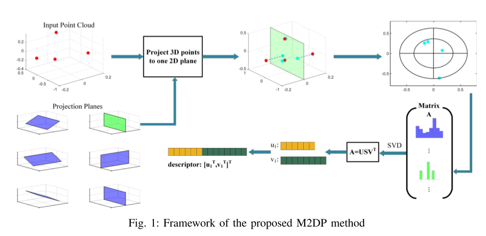
在激光帧点云的局部坐标系内, 可以通过定义方向角(azimuth angle)$\theta$和倾斜角(elevation angle)$\phi$, 来定义一个中心在原点的平面. 平均分成$p$个不同的$\theta$, 和$q$个不同的$\phi$, 共$pq$个平面.

将x轴投影到该平面上, 成为该平面的x轴. 将点云投影到该平面上, 根据不同距离区间$[r, 2^2 r, 3^2 r, ..., l^2 r]$, 和与x轴的夹角(平均分t份), 可以得到 $r \times l$个扇区. 统计每个扇区的点云数量得到一个$lt \times 1$的特征向量.
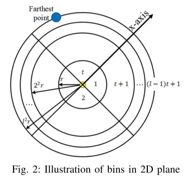
从而, 得到一个$pq \times lt$的矩阵$\mathbf{A}$. 对$A$做SVD分解

$$
A = \mathbf{U} \Sigma \mathbf{V}^T = \sigma_{1} u_{1} v_{1}^{\mathrm{T}}+\sigma_{2} u_{2} v_{2}^{\mathrm{T}}+\ldots+\sigma_{r} u_{r} v_{r}^{\mathrm{T}}
$$

取奇异值最大的$u$和$v$, 连接起来作为该激光帧的特征向量, 以特征向量之间的距离来表示激光帧的相似性. 

## Reference
* GO-ICP
* GoTS
* Super 4PCS
    http://geometry.cs.ucl.ac.uk/projects/2014/super4PCS/
* Scan Context
    https://github.com/irapkaist/scancontext
* LocNet
* Keypoint Voting
* Segmatch: Segment based loop-closure for 3d point clouds
* ESF: Ensemble of shape functions for 3d object classification
    PCL
* SegMap: 3D Segment Mapping using Data-Driven Descriptors
