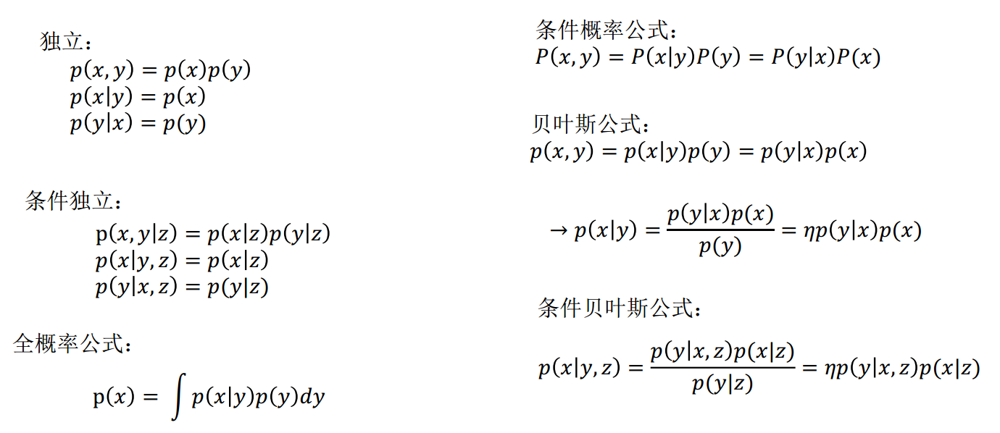
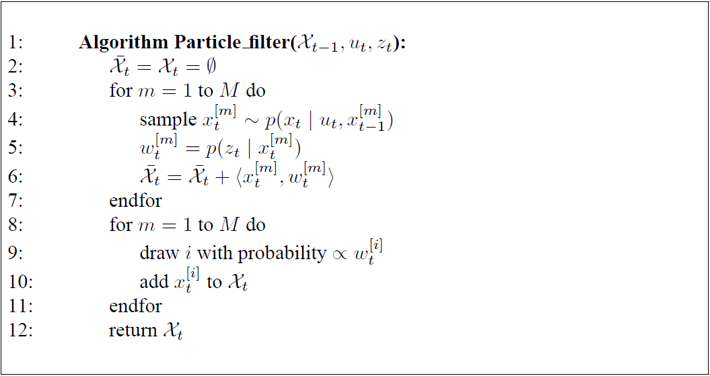
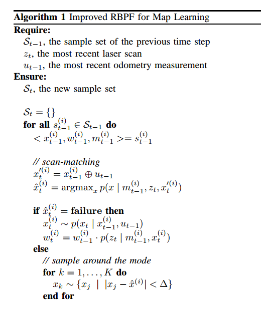
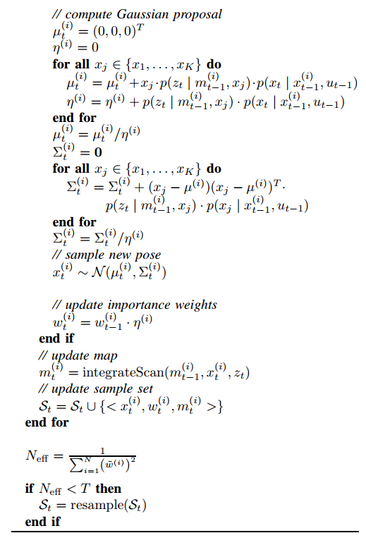

## Gmapping
### 算法原理
RBPF概述: 一种SLAM方法, 将定位和建图分离, 通过带有权重、轨迹、地图的散布的粒子来表示地图和定位的后验概率分布. (*类似采样枚举法, 只采样枚举可能性高的点*)
Gmapping概述: 基于RBPF, 通过加入观测优化了提议分布, 通过选择性重采样, 降低了采样频率.

关键词: 目标分布、提议分布、选择性重采样、粒子退化.

#### 详解
##### 贝叶斯滤波
基本贝叶斯估计知识:


贝叶斯滤波: 已知状态量$t-1$时刻的概率分布, 在给定𝑡时刻的观测数据$z_t, u_t$的情况下, 估计出状态量在$t$时刻的概率分布.

$$
bel(x_t) = p(x_t|z_{1:t}, u_{1:t}) = \eta p ( z _ { t } | x _ { t } ) \overline { b e l } ( x _ { t } ) = \eta p ( z _ { t } | x _ { t } ) \int p ( x _ { t } | x _ { t - 1 } , u _ { t } ) p ( x _ { t - 1 } | z _ { 1 : t - 1 } , u _ { 1 : t - 1 } ) d x _ { t - 1 }
$$

##### Rao-Blackwellized Particle Filters
定位和建图分离:

$$
p(x_{1:t}, m | z_{1:t}, u_{1:t-1}) = p(m|x_{1:t}, z_{1:t}) \cdot p(x_{1:t}|z_{1:t}, u_{1:t-1})
$$

在粒子滤波器中, 后验概率分布的样本称为粒子particles

$$
\mathcal{X}_t := x_t^{[1]}, x_t^{[2]}, \cdots, x_t^{[M]}
$$

其中$\mathcal{X}_t$为粒子集合, 每一个粒子$x_t^{[m]}, 1 ≤ m ≤ M$, 都是状态在t时刻的一个具体实例, 也就是在t时刻真实世界可能状态的一个假设.

粒子滤波器背后的思想是用集合$\mathcal{X}_t$来近似置信度$bel(x_t)$, 理想情况下粒子集合$\mathcal{X}_t$中含有状态假设$x_t$的似然概率应当与贝叶斯滤波器的后验概率$bel(x_t)$成正比关系:

$$
x_t^{[m]} \sim p(x_t | z_{1:t}, u_{1:t})
$$


算法伪代码:


RBPF存在两大问题: 粒子数多(造成计算量和内存消耗变大)、频繁重采样(加剧了粒子退化).
粒子退化: 主要指正确的粒子被丢弃和粒子多样性减小, 而频繁重采样则加剧了正确的粒子被丢弃的可能性和粒子多样性减小速率.
粒子权重的计算:

$$
\begin{aligned}
w _ { t } ^ { ( i ) } &= \frac { p ( x _ { 1 : t } ^ { ( i ) } | z _ { 1 : t } , u _ { 1 : t - 1 } ) } { \pi ( x _ { 1 : t } ^ { ( i ) } | z _ { 1 : t } , u _ { 1 : t - 1 } ) } \\
 &= \frac { \eta p ( z _ { t } | x _ { 1 : t } ^ { ( i ) } , z _ { 1 : t - 1 } ) p ( x _ { t } ^ { ( i ) } | x _ { t - 1 } ^ { ( i ) } , u _ { t - 1 } ) } { \pi ( x _ { t } ^ { ( i ) } | x _ { 1 : t - 1 } ^ { ( i ) } , z _ { 1 : t } , u _ { 1 : t - 1 } ) } \cdot \underbrace { \frac { p ( x _ { 1 : t - 1 } ^ { ( i ) } | z _ { 1 : t - 1 } , u _ { 1 : t - 2 } ) } { \pi ( x _ { 1 : t - 1 } ^ { ( i ) } | z _ { 1 : t - 1 } , u _ { 1 : t - 2 } ) } }_{ w _ { t - 1 } ^ { ( i ) } }\\
 &\propto \frac { p ( z _ { t } | m _ { t - 1 } ^ { ( i ) } , x _ { t } ^ { ( i ) } ) p ( x _ { t } ^ { ( i ) } | x _ { t - 1 } ^ { ( i ) } , u _ { t - 1 } ) } { \pi ( x _ { t } | x _ { 1 : t - 1 } ^ { ( i ) } , z _ { 1 : t } , u _ { 1 : t - 1 } ) } \cdot w _ { t - 1 } ^ { ( i ) }
\end{aligned}
$$

$\eta = 1/p(z_t | z_{1:t-1}, u_{1:t-1})$ 是一个归一化参数, 每个粒子都一样.
$p$是目标分布: 根据机器人携带的所有传感器的数据能确定机器人状态置信度的最大极限.
$\pi$是提议分布: 由于无法直接对目标分布建模进行采样, 比如对于激光传感器, 无法进行高斯建模. 但问题是我们希望从一个分布中进行采样来获取对下一时刻机器人位姿的估计, 而在计算机中能模拟出的分布也就是高斯分布、三角分布等有限的分布, 因此提议分布被提出来代替目标分布来提取下一时刻机器人位姿信息. 而提议分布毕竟不是目标分布因此使用粒子权重来表征提议分布和目标分布的不一致性. [refer to GMapping原理分析]


##### Gmapping
Fast Slam以motion model作为提议分布:
$$
\begin{aligned}
 w _ { t } ^ { ( i ) } &= w _ { t - 1 } ^ { ( i ) } \frac { \eta p ( z _ { t } | m _ { t - 1 } ^ { ( i ) } , x _ { t } ^ { ( i ) } ) p ( x _ { t } ^ { ( i ) } | x _ { t - 1 } ^ { ( i ) } , u _ { t - 1 } ) } { p ( x _ { t } ^ { ( i ) } | x _ { t - 1 } ^ { ( i ) } , u _ { t - 1 } ) }\\
&\propto w _ { t - 1 } ^ { ( i ) } \cdot p ( z _ { t } | m _ { t - 1 } ^ { ( i ) } , x _ { t } ^ { ( i ) } )
\end{aligned}
$$

改进, 以激光scanmatch作为提议分布:

$$
p ( x _ { t } | m _ { t - 1 } ^ { ( i ) } , x _ { t - 1 } ^ { ( i ) } , z _ { t } , u _ { t - 1 } ) =  \frac { p ( z _ { t } | m _ { t - 1 } ^ { ( i ) } , x _ { t } ) p ( x _ { t } | x _ { t - 1 } ^ { ( i ) } , u _ { t - 1 } ) } { p ( z _ { t } | m _ { t - 1 } ^ { ( i ) } , x _ { t - 1 } ^ { ( i ) } , u _ { t - 1 } ) }
$$

*注: 为什么要除这一项? 我们要的是$x_t$的分布, 而分子上是$z_t x_t$的分布.*
从而有:

$$
\begin{aligned}
w_t^{(i)} &= w _ { t - 1 } ^ { ( i ) } \frac { \eta p ( z _ { t } | m _ { t - 1 } ^ { ( i ) } , x _ { t } ^ { ( i ) } ) p ( x _ { t } ^ { ( i ) } | x _ { t - 1 } ^ { ( i ) } , u _ { t - 1 } ) } { p ( x _ { t } | m _ { t - 1 } ^ { ( i ) } , x _ { t - 1 } ^ { ( i ) } , z _ { t } , u _ { t - 1 } ) }\\
&\propto \quad w _ { t - 1 } ^ { ( i ) } \frac { p ( z _ { t } | m _ { t - 1 } ^ { ( i ) } , x _ { t } ^ { ( i ) } ) p ( x _ { t } ^ { ( i ) } | x _ { t - 1 } ^ { ( i ) } , u _ { t - 1 } ) } { \frac { p ( z _ { t } | m _ { t - 1 } ^ { ( i ) } , x _ { t } ) p ( x _ { t } | x _ { t - 1 } ^ { ( i ) } , u _ { t - 1 } ) } { p ( z _ { t } | m _ { t - 1 } ^ { ( i ) } , x _ { t - 1 } ^ { ( i ) } , u _ { t - 1 } ) } }\\
&= w _ { t - 1 } ^ { ( i ) } \cdot p ( z _ { t } | m _ { t - 1 } ^ { ( i ) } , x _ { t - 1 } ^ { ( i ) } , u _ { t - 1 } )\\
&= w _ { t - 1 } ^ { ( i ) } \cdot \int p ( z _ { t } | x ^ { \prime } ) p ( x ^ { \prime } | x _ { t - 1 } ^ { ( i ) } , u _ { t - 1 } ) d x ^ { \prime }\\
&\simeq w _ { t - 1 } ^ { ( i ) } \cdot \sum _ { j = 1 } ^ { K } p ( z _ { t } | m _ { t - 1 } ^ { ( i ) } , x _ { j } ) \cdot p ( x _ { j } | x _ { t - 1 } ^ { ( i ) } , u _ { t - 1 } )
\end{aligned}
$$

在scanmatch的有效区域采样K个点, 计算$\mu$和$\Sigma$, 得到提议高斯分布:

$$
\begin{aligned}
\mu_t^{(i)} = \frac { 1 } { \eta ^ { ( i ) } } \cdot \sum _ { j = 1 } ^ { K } x_{ j } \cdot p ( z _ { t } | m _ { t - 1 } ^ { ( i ) } , x _ { j } ) \cdot p ( x _ { j } | x _ { t - 1 } ^ { ( i ) } , u _ { t - 1 } )\\
\Sigma_t^{(i)} = \frac { 1 } { \eta ^ { ( i ) } } \cdot \sum _ { j = 1 } ^ { K } p ( z _ { t } | m _ { t - 1 } ^ { ( i ) } , x _ { j } ) \cdot p ( x _ { j } | x _ { t - 1 } ^ { ( i ) } , u _ { t - 1 } ) ( x _ { j } - \mu _ { t } ^ { ( i ) } ) ( x _ { j } - \mu _ { t } ^ { ( i ) } ) ^ { T }
\end{aligned}
$$

若后一刻的观测和前一刻的结论一致性很好, 则粒子权重变化很小, 但若后一刻的观测和前一刻的结论出现较大偏差(比如闭环时候), 粒子的权重会发生剧变. 体现在(或许scanmatch配上情况比例发生变化).

算法伪代码:



##### 关键代码
关键代码位于`openslam_gmapping/gridfastslam/gridslamprocessor.cpp`之中:
```c++
bool GridSlamProcessor::processScan(const RangeReading &reading, int adaptParticles) {
        //write the state of the reading and update all the particles using the motion model
        for (ParticleVector::iterator it = m_particles.begin(); it != m_particles.end(); it++) {
            OrientedPoint &pose(it->pose);
            pose = m_motionModel.drawFromMotion(it->pose, relPose, m_odoPose);
        }

        /*
         * 为每个粒子进行scanMatch，计算出来每个粒子的最优位姿，同时计算改最优位姿的得分和似然
         * 对应于gmapping论文中的用最近的一次测量计算proposal的算法
         * 这里面除了进行scanMatch之外，还对粒子进行了权重的计算，
         * 并计算了粒子的有效区域 但不进行内存分配 内存分配在resample()函数中
         * 这个函数在gridslamprocessor.hxx里面
         */
        scanMatch(plainReading);

        // 由于scanMatch中对粒子的权重进行了更新，那么这个时候各个粒子的轨迹上的累计权重都需要重新计算
        // 这个函数即更新各个粒子的轨迹上的累计权重是更新
        updateTreeWeights(false);

        // 粒子重采样  根据neff的大小来进行重采样  不但进行了重采样，也对地图进行更新
        // GridSlamProcessor::resample 函数在gridslamprocessor.hxx里面实现
        resample(plainReading, adaptParticles, reading_copy);
}
```

### 测试&分析
#### 安装
ROS中的slam_gmapping包也是调用了openslam_gmapping开源算法, 因此需要下载编译两个代码.

```bash
mkdir gmapping_ws
cd gmapping_ws
mkdir src
cd src
git clone https://github.com/ros-perception/slam_gmapping
git clone https://github.com/ros-perception/openslam_gmapping
cd ..
catkin_make
```

订阅消息:
```
scan : 2d激光数据, 注意正反角度顺序
tf : 里程数据
```

### Reference
[数据集运行Gmapping](https://www.jianshu.com/p/74fea75554ba)
[SLAM构建地图——gmapping功能包](http://xxty.fun/2019/08/19/ROS%E5%B0%8F%E8%BD%A6%EF%BC%9ASLAM%20%E6%9E%84%E5%BB%BA%E5%9C%B0%E5%9B%BE%20--%20gmapping%E5%8A%9F%E8%83%BD%E5%8C%85/)
[GMapping原理分析](https://blog.csdn.net/liuyanpeng12333/article/details/81946841)
[粒子滤波原理分析](https://gaoyichao.com/Xiaotu/?book=probabilistic_robotics&title=pr_chapter4)
[gmapping源码阅读](https://www.cnblogs.com/yhlx125/p/5634128.html)