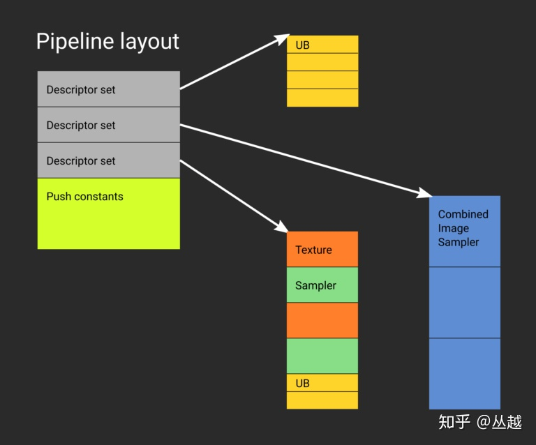
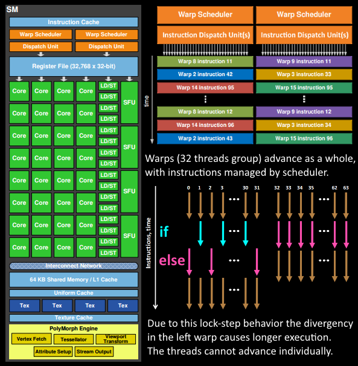
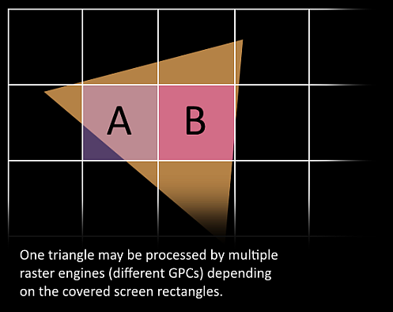
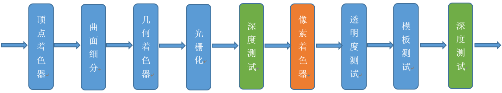
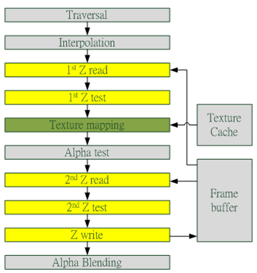

# Deep Into Modern Graphics API

## 现代图形API VS 传统图形API

传统图形API: Direct3D\OpenGL(ES)

* 管线状态是隐式的、全局的

  管线的当前状态隐藏在 API(Runtime\Driver)内部, 应用程序**无法精准的控制管线当前状态**

* 频繁的 API 调用

  由于整个图形 API 渲染管线是基于状态的, 所以应用程序必须**频繁的调用 API 来设置管线状态和恢复状态**, 这就使得 API 调用导致的 CPU 开销也成为了渲染瓶颈.

* 状态切换开销

  传统 API 会对每个**渲染状态**的设置进行**校验和二次处理**, 比如**合并状态统一提交**, 这样就造成了状态的切换也有一定的开销. 开发者们各显神通减少状态的切换(例如, 状态编码进行排序, 构建状态树形结构等). 本质上都是在 CPU 端做额外的预处理工作来换取 GPU 的时间.

  现代 GPU 硬件上, 分散的状态设置成为了性能提升的障碍. 例如, 新型 GPU 会将这些固定管线状态合并成单一硬件状态. 但由于 API 允许单独设置这些管道状态, 因此 Driver 很可能在运行时为不同的状态组合创建、查找缓存内部的管线状态集合, 这很可能会导致管线卡顿, 同时额外增大了开销.

  

* 复杂的驱动层逻辑

  在 Driver **内部维护跟踪状态**, **自动管理资源及调度**, 以及进行运行时的校验, 以保证渲染正确. 同时为了便于调试, 图形 API 的获取错误接口(glGetError) 也需要正确的返回错误, 但也增加了 CPU 开销. 另外, Driver 还要负责 CPU 与 GPU 的同步.

  

  典型的例子: 动态更新 GPU Buffer 数据, 如果此时 GPU 正在使用这个 Buffer, 则 Map\Lock 之后 API 返回的是 Runtime\Driver 内部动态创建的新内存地址, 以更新新数据, 当 GPU 使用完旧内存后, 再使用新数据. 另外, API 的提示标记并不能保证 Driver 一定按照预想的方式执行, Driver 会根据自身当前的状态来决定, 比如上述情况, 即使在 Map 时指定了 Discard, 也不能完全保证运行时 CPU 和 GPU 是完全异步的. 

  另一种“隐式”的体现是 GPU 资源的状态跟踪与同步, 比如当前渲染阶段的 Render Target , 也许会成为下一个渲染阶段所使用的 Shader 可访问的纹理资源(典型的如后处理中的 Scene Texture), 为了维护资源状态的正确, 就需要使用 GPU 内部的同步机制如 Resource Barrier 来保证渲染次序. 但这样的"隐式"行为导致应用程序无法深入到内部以最优化的方式减少同步, 也无法进一步提升同步性能. 

* Shader 的编译

* 隐式的渲染工作提交

  传统 API 渲染工作的提交一般情况下是 Runtime\Driver 内部执行的, 比如当内部的 Render Command Buffer 已满或者 CPU 端通过 Map 访问或者写入资源数据时, Runtime\Driver 会自动提交当前的渲染工作, 并等待 GPU 完成. 由于这种隐式的机制, 导致应用程序很难做到最优化的 CPU、GPU 同步.

现代图形API: Direct3D12\Vulkan\Metal

* 低消耗的状态切换

  使用 PipelineState 将管道状态提前创建并绑定, 在渲染时, 通过设置不同的 PipelineState, Driver 只需要少量的切换开销即可将预先创建的状态绑定到 GPU 中, 而无需像传统 API 那样校验每种状态有效性以及动态合并状态, 从而降低了绘制调用开销, 并且可以大幅增加每帧的绘制调用次数.

  

* 预置的 Shader 资源布局和绑定

  通过 RootSingature(D3D12)或者 PipelineLayout(Vulkan)通过 Descriptor 预先设置好 Shader 所需要使用的资源布局信息, 包括：Constant、Texture(SRV)、Buffer(UAV)、Sampler 等, 在渲染时 Shader 通过 DescriptorTable 或者 DescriptorSet 用间接寻址方式获取资源, 无需渲染时绑定, 大大降低了资源绑定和校验开销, 从而提高了渲染性能. 

  Metal 虽然也有 PipelineState, 但并没有提供指定 Shader Resource Layout 的机制, 绑定 Shader 资源时和传统 API 类似, 使用 setFragmentTexture\setVertexTexture 之类的函数设置.

  

* 显式的资源状态管理

  现代 API 通过使用资源屏障(Resource Barrier)来要求应用层明确控制资源的状态迁移,  Runtime\Driver 不再通过提示、假设或猜想进行自动的状态跟踪和维护, 而是完全由开发者来管理资源状态.

* 更加显式的渲染工作提交和 CPU/GPU 同步控制

  现代 API 则提供了显式的控制渲染提交和同步控制接口. 应用程序通过使用 Command List(D3D12)或 Command Buffer(Vulkan/Metal)录制渲染命令, 再通过 Command Queue 提交到 GPU 中执行.

  

  CPU 和 GPU 的同步是通过 Fence 对象和 WaitFence 函数完成, 整个过程完全由应用程序来控制, 这样应用程序可以根据需要, 更加精准的控制同步时机, 从而实现 CPU/GPU 最大化并行性能.

* 提供显式的 CPU/GPU 堆内存管理

  传统的 API 的内存管理是隐式的, 当创建资源时 Runtime\Driver 内部也同时创建用于这个资源的内存, 这个过程对开发者是透明的, 尽管接口简单, 但带来的问题是很难优化内存分配, 并且容易造成 GPU 内存碎片. 

   现代API 都提供了 CPU/GPU 堆内存管理接口, 可以通过创建堆, 在堆上分配空间的方式来创建资源, 应用程序可以精准的控制资源堆内存的分配. 比如可以通过资源别名(在同一堆空间中创建不同的资源), 在不同的时段可重复利用同一的设备内存来完成渲染逻辑, 从而更有效的使用有限的 GPU 内存资源. 

  

* 并行提交渲染工作

  现代 API 都增加了 Command List 或 Command Buffer 记录渲染指令, 再通过 Queue 提交到 GPU 中, 而每个 Command List\Buffer 都可以在不同的线程中单独填充, 这意味着可以并行录制渲染指令, 充分发挥了现代 CPU 多核的并行能力. 甚至还可以创建多个异步计算或者上传数据的 Command Queue, 利用 GPU 的并行机制实现渲染和计算、上传数据的并行. 

* Shader 预编译机制

* 实时 GI

  RayTracying

* 机器学习

  同实时 GI 一样, 新一代 API 也都有各自的 ML 方案.

  - D3D12：DirectML
  - Vulkan：Vulkan ML
  - Metal：基于 Performance Shader 的 ML

* 显式的多 GPU 支持


## 基于现代图形 API 开发的挑战

要在现代 API 基础上实现更好的性能, 需要更多更复杂的图形管线管理开发工作. 由于是显式的, 更接近图形硬件的设计, 现代 API 的驱动不再负责传统 API Driver 复杂的内部逻辑, 但这些工作并不是自动消失, 而是转移到应用层, 由开发者负责. 传统 API 上和现代 API 上图形管线管理开发工作量的比较:


这些工作量包括:

* 重新设计图形 API 抽象接口.

  通过PipelineState对象来维护渲染管线状态, Command List录制图形指令, 实现并行渲染. 资源屏障等, 来进行同步.

* 堆内存管理.

  包括 GPU 和 CPU 内存, 精细控制内存预算和跟踪内存分配和使用, 甚至还要根据不同使用场景来定制内存管理策略. 比如根据 GPU 是否只读、CPU 是否只读、CPU\GPU 的写入频率等, 不同的情况需要对应不同的内存管理策略, 充分利用 GPU 的 Copy\Upload\Transfer 硬件引擎完成数据传输, 才能实现最佳的性能.

* 描述符(Descriptor)管理

  在传统 API 上绑定 Shader 资源只需要简单调用形如 SetTexture\SetConstant\SetSampler 之类的接口即可, 而在现代 API 中, 通过 Shader 所需要使用的资源布局信息是预置的(前文所述), 渲染时需要通过 Descriptor 来间接寻址资源, 由于 Descriptor 也是一种 API(GPU 硬件) 资源, **一般来说 GPU 可见的 Descriptor 是有限的(硬件相关限制)**, 渲染时需要对有限的 GPU Descriptor 使用有效的管理方式加以重用, 才能完成复杂的渲染逻辑. 另外由于并行渲染的存在, Descriptor 的分配和释放还要考虑到线程同步, 如何在并行中减少线程同步所带来的开销也是需要仔细考虑的问题, 这进一步增加了管理复杂度.

* 渲染帧管理

  为了最大化并行 CPU/GPU, Swapchain 通常需要**创建多个back Buffer**, 这样 GPU 绘制当前帧(或者上一帧), CPU 可以并行填充绘制下一帧的命令, 在开始录制每个 Frame 的渲染指令时, 可以通过这一帧上一次绘制的 GPU Fence 查询 GPU 是否完成上一次渲染, 如果完成则开始录制逻辑, 否则等待. 要达到这样的结果, 每个 Frame 需要有自己的 CommandList 和相关的 GPU 资源, 这就需要实现渲染帧逻辑, 还需要在提交到 GPU 渲染时对 Frame 进行调度管理.

  

* API 对象的生命周期控制

  要保证 API 渲染、计算管线中在使用对象的过程中不能释放对象. 比如上层逻辑在 Frame2 中释放某个对象, 但这个对象还在 Frame1 中被使用, 则此时不能执行真正的释放, 需要通过 GPU Fence 事件通知或者轮询方式等到 Frame1 执行完成才能释放.

* 并行提交绘制指令

  现代 API 的 Command List 都是 Thread Free 的, 所以可以实现多个线程并行填充绘制、计算指令, 以达到并行提交渲染工作的的目的. 可利用Task/Job System来实现.

## 基于现代图形 API 的渲染管线设计


## 深入GPU硬件运行机制

备注: CPU的SIMD(Single Instruction Multiple Data), 如SSE, VAX指令). GPU的SIMT(Single Instruction Multiple Threads).

### GPU中的几个基本概念:

Nvidia Turing 2018
Turing 架构配备了名为 RT Core 的专用光线追踪处理器, 能够以高达每秒 10 Giga Rays 的速度对光线和声音在 3D 环境中的传播进行加速计算


* Giga Thread Engine
* GPC(Graphics Processor Cluster)
  * Raster Engine
  * TPC(Texture/Processor Cluster)
    * SM(Stream Multiprocessor)、SMX、SMM
      多个sp加上其他的一些资源组成一个SM, 其他资源也就是存储资源, 共享内存, 寄储器等. 可见, 一个SM中的所有SP是先分成warp的, 是共享同一个memory和instruction unit(指令单元). 从硬件角度讲, 一个GPU由多个SM组成(当然还有其他部分), 一个SM包含有多个SP(以及还有寄存器资源, shared memory资源, L1cache, scheduler, SPU, LD/ST单元等等).

      Each SP is then grouped as a *streaming* *[multiprocessor](https://www.sciencedirect.com/topics/computer-science/multiprocessors)* (SM). The SM provides thousands of registers, a [thread scheduler](https://www.sciencedirect.com/topics/computer-science/thread-scheduler), and shared memory for the group of SPs. Equipped with those components in its silicon backyard and a number of SPs, an SM manages thread scheduling, context switching, and data fetching and caching for the blocks of threads assigned to it.
      * Register File
      * Warp(Warp Scheduler+Dispatch)
        warp是SM调度和执行的基础概念, 通常一个SM中的SP(thread)会分成几个warp(也就是SP在SM中是进行分组的, 物理上进行的分组), 一般每一个WARP中有32个thread.这个WARP中的32个thread(sp)是一起工作的, 执行相同的指令, 如果没有这么多thread需要工作, 那么这个WARP中的一些thread(sp)是不工作的. 一个warp中的所有线程以一个相同的速度执行, 只有全部线程都执行完毕, 才会进行下一个wap.
      * SP(Stream Processor)/Core/Thread
        最基本的处理单元, GPU进行并行计算, 也就是很多个sp同时做处理. 现在SP的术语已经有点弱化了, 而是直接使用thread来代替, 一个SP对应一个thread.
        
        A fundamental unit of GPU is a *streaming processor* (SP). This provides the capability to fetch a single instruction from memory and carry it out on different data sets in parallel. Each GPU contains tens to hundreds of SPs in a single piece of hardware.
        * ALU (整型计算)
        * FPU (浮点计算)
        * Tensor Core
      * SFU (特殊数学函数)
        这里指GPU提供的一些特殊的计算函数, 如`__sin`, `__cos`与普通的`cos`, `sin`实现不一样
      * L1 Cache/Shared Memory
      * Texture Cache
      * LD/ST
      * RT CORE
    * PolyMorph Engine
      多边形引擎负责属性装配(attribute Setup)、顶点拉取(VertexFetch)、曲面细分、栅格化(这个模块可以理解专门处理顶点相关的东西)
* Grid 编程中的一个概念. 指在GPU上由多个Thread block(SM)执行的一套代码.

内存上可以分为四级:
| More descriptive name | Closest old term outside of GPUs | Official Nvidia GPU term | description |
| -------------------- | -------------------------- | --------------------- | -------------- |
| GPU Memory | Main Memory | Global Memory | DRAM memory accessible by all multithreaded SIMD Processors in a GPU.|
| Private Memory | Stack or Thread Local Storage (OS) | Local Memory | Portion of DRAM memory private to each SIMD Lane. |
| Local Memory | Local Memory | Shared Memory | ast local SRAM for one multithreaded SIMD Processor, unavailable to other SIMD Processors |
| SIMD Lane Registers | Vector Lane Registers | Thread Processor Registers | Registers in a single SIMD Lane allocated across a full thread block (body of vectorized loop). |

| 存储类型 | 寄存器	| 共享内存 | L1缓存 |	L2缓存 | 纹理、常量缓存 |	全局内存 |
| ---- | ---- | ---- | ---- | ---- | ---- | ---- |
| 访问周期 |	1 | 1~32 |	1~32	| 32~64	| 400~600	| 400~600 |

### GPU渲染总览
现代GPU有着相似的结构, 有很多相同的部件, 在运行机制上, 也有很多共同点. 这里以Nvidia-Fermi架构为例:


从Fermi开始NVIDIA使用类似的原理架构, 使用一个Giga Thread Engine来管理所有正在进行的工作, GPU被划分成多个GPCs(Graphics Processing Cluster), 每个GPC拥有多个SM(SMX、SMM)和一个光栅化引擎(Raster Engine), 它们其中有很多的连接, 最显著的是Crossbar, 它可以连接GPCs和其它功能性模块(例如ROP或其他子系统). 

程序员编写的shader是在SM上完成的. 每个SM包含许多为线程执行数学运算的Core(核心). 例如, 一个线程可以是顶点或像素着色器调用. 这些Core和其它单元由Warp Scheduler驱动, Warp Scheduler管理一组32个线程作为Warp(线程束)并将要执行的指令移交给Dispatch Units. 

GPU中实际有多少这些单元(每个GPC有多少个SM, 多少个GPC ......)取决于芯片配置本身. 例如, GM204有4个GPC, 每个GPC有4个SM, 但Tegra X1有1个GPC和2个SM, 它们均采用Maxwell设计. SM设计本身(内核数量, 指令单位, 调度程序......)也随着时间的推移而发生变化, 并帮助使芯片变得如此高效, 可以从高端台式机扩展到笔记本电脑移动. 

### GPU 逻辑管线
1. 图形API调用Drawcall, 推送到驱动程序, 驱动会检查指令的合法性, 然后会把指令放到GPU可以读取的Pushbuffer中.
2. 过一段时间或者显式调用flush指令后, 驱动程序把Pushbuffer的内容发送给GPU, GPU通过主机接口(Host Interface)接受这些命令, 并通过前端(Front End)处理这些命令.
3. 在图元分配器(Primitive Distributor)中开始工作分配, 处理indexbuffer中的顶点产生三角形分成批次(batches), 然后发送给多个PGCs. 这一步的理解就是提交上来n个三角形, 分配给这几个PGC同时处理.

4. 在GPC中, 每个SM中的Poly Morph Engine负责通过三角形索引(triangle indices)取出三角形的数据(vertex data), 即图中的Vertex Fetch模块.

5. 在获取数据之后, 在SM中以32个线程为一组的线程束(Warp)来调度, 来开始处理顶点数据. Warp是典型的单指令多线程(SIMT, SIMD单指令多数据的升级)的实现, 也就是32个线程同时执行的指令是一模一样的, 只是线程数据不一样, 这样的好处就是一个warp只需要一个套逻辑对指令进行解码和执行就可以了, 芯片可以做的更小更快, 之所以可以这么做是由于GPU需要处理的任务是天然并行的. 
6. SM的warp调度器会按照顺序分发指令给整个warp, 单个warp中的线程会锁步(lock-step)执行各自的指令, 如果线程碰到不激活执行的情况也会被遮掩(be masked out). 被遮掩的原因有很多, 例如当前的指令是if(true)的分支, 但是当前线程的数据的条件是false, 或者循环的次数不一样(比如for循环次数n不是常量, 或被break提前终止了但是别的还在走), 因此在shader中的分支会显著增加时间消耗, 在一个warp中的分支除非32个线程都走到if或者else里面, 否则相当于所有的分支都走了一遍, 线程不能独立执行指令而是以warp为单位, 而这些warp之间才是独立的. 
7. warp中的指令可以被一次完成, 也可能经过多次调度, 例如通常SM中的LD/ST(加载存取)单元数量明显少于基础数学操作单元. 
8. 由于某些指令比其他指令需要更长的时间才能完成, 特别是内存加载, warp调度器可能会简单地切换到另一个没有内存等待的warp, 这是GPU如何克服内存读取延迟的关键, 只是简单地切换活动线程组. 为了使这种切换非常快, 调度器管理的所有warp在寄存器文件中都有自己的寄存器. 这里就会有个矛盾产生, shader需要越多的寄存器, 就会给warp留下越少的空间, 就会产生越少的warp, 这时候在碰到内存延迟的时候就会只是等待, 而没有可以运行的warp可以切换. 

9. 一旦warp完成了vertex-shader的所有指令, 运算结果会被Viewport Transform模块处理, 三角形会被裁剪然后准备栅格化, GPU会使用L1和L2缓存来进行vertex-shader和pixel-shader的数据通信. 

10. 接下来这些三角形将被分割, 再分配给多个GPC, 三角形的范围决定着它将被分配到哪个光栅引擎(raster engines), 每个raster engines覆盖了多个屏幕上的tile, 这等于把三角形的渲染分配到多个tile上面. 也就是像素阶段就把按三角形划分变成了按显示的像素划分了. 


11. SM上的Attribute Setup保证了从vertex-shader来的数据经过插值后是pixel-shade是可读的. 

12. GPC上的光栅引擎(raster engines)在它接收到的三角形上工作, 来负责这些这些三角形的像素信息的生成(同时会处理裁剪Clipping、背面剔除和Early-Z剔除). 

13. 32个像素线程将被分成一组, 或者说8个2x2的像素块, 这是在像素着色器上面的最小工作单元, 在这个像素线程内, 如果没有被三角形覆盖就会被遮掩, SM中的warp调度器会管理像素着色器的任务. 

14. 接下来的阶段就和vertex-shader中的逻辑步骤完全一样, 但是变成了在像素着色器线程中执行.  由于不耗费任何性能可以获取一个像素内的值, 导致锁步执行非常便利, 所有的线程可以保证所有的指令可以在同一点. 

15. 最后一步, 现在像素着色器已经完成了颜色的计算还有深度值的计算, 在这个点上, 我们必须考虑三角形的原始api顺序, 然后才将数据移交给ROP(render output unit, 渲染输入单元), 一个ROP内部有很多ROP单元, 在ROP单元中处理深度测试, 和framebuffer的混合, 深度和颜色的设置必须是原子操作, 否则两个不同的三角形在同一个像素点就会有冲突和错误. 
  

### GPU技术要点

#### SIMD和SIMT
SIMD(Single Instruction Multiple Data)是单指令多数据, 在GPU的ALU单元内, 一条指令可以处理多维向量(一般是4D)的数据. 比如, 有以下shader指令：
```c++
float4 c = a + b; // a, b都是float4类型
// 对于没有SIMD的处理单元, 需要4条指令将4个float数值相加, 汇编伪代码如下：
ADD c.x, a.x, b.x
ADD c.y, a.y, b.y
ADD c.z, a.z, b.z
ADD c.w, a.w, b.w
// 但有了SIMD技术, 只需一条指令即可处理完：
SIMD_ADD c, a, b
```


SIMT（Single Instruction Multiple Threads，单指令多线程）是SIMD的升级版，可对GPU中单个SM中的多个Core同时处理同一指令，并且每个Core存取的数据可以是不同的。
```
SIMT_ADD c, a, b
```
上述指令会被同时送入在单个SM中被编组的所有Core中，同时执行运算，但a、b 、c的值可以不一样：


#### co-issue
co-issue是为了解决SIMD运算单元无法充分利用的问题。例如下图，由于float数量的不同，ALU利用率从100%依次下降为75%、50%、25%。


为了解决着色器在低维向量的利用率低的问题，可以通过合并1D与3D或2D与2D的指令。例如下图，DP3指令用了3D数据，ADD指令只有1D数据，co-issue会自动将它们合并，在同一个ALU只需一个指令周期即可执行完。


但是，对于向量运算单元（Vector ALU），如果其中一个变量既是操作数又是存储数的情况，无法启用co-issue技术：


于是标量指令着色器（Scalar Instruction Shader）应运而生，它可以有效地组合任何向量，开启co-issue技术，充分发挥SIMD的优势。

#### Early-Z
早期GPU的渲染管线的深度测试是在像素着色器之后才执行（下图），这样会造成很多本不可见的像素执行了耗性能的像素着色器计算。


后来，为了减少像素着色器的额外消耗，将深度测试提至像素着色器之前（下图），这就是Early-Z技术的由来。


Early-Z技术可以将很多无效的像素提前剔除，避免它们进入耗时严重的像素着色器。Early-Z剔除的最小单位不是1像素，而是像素块（pixel quad，2x2个像素).

但是，以下情况会导致Early-Z失效：
* 开启Alpha Test：由于Alpha Test需要在像素着色器后面的Alpha Test阶段比较，所以无法在像素着色器之前就决定该像素是否被剔除。

* 开启Alpha Blend：启用了Alpha混合的像素很多需要与frame buffer做混合，无法执行深度测试，也就无法利用Early-Z技术。

* 开启Tex Kill：即在shader代码中有像素摒弃指令（DX的discard，OpenGL的clip）。
关闭深度测试。Early-Z是建立在深度测试看开启的条件下，如果关闭了深度测试，也就无法启用Early-Z技术。

* 开启Multi-Sampling：多采样会影响周边像素，而Early-Z阶段无法得知周边像素是否被裁剪，故无法提前剔除。
以及其它任何导致需要混合后面颜色的操作

此外，Early-Z技术会导致一个问题：深度数据冲突（depth data hazard）


避免深度数据冲突的方法之一是在写入深度值之前，再次与frame buffer的值进行对比：


#### 统一着色器架构（Unified shader Architecture）
在早期的GPU，顶点着色器和像素着色器的硬件结构是独立的，它们各有各的寄存器、运算单元等部件。这样很多时候，会造成顶点着色器与像素着色器之间任务的不平衡。对于顶点数量多的任务，像素着色器空闲状态多；对于像素多的任务，顶点着色器的空闲状态多（下图）。


于是，为了解决VS和PS之间的不平衡，引入了统一着色器架构（Unified shader Architecture）。用了此架构的GPU，VS和PS用的都是相同的Core。也就是，同一个Core既可以是VS又可以是PS。


这样就解决了不同类型着色器之间的不平衡问题，还可以减少GPU的硬件单元，压缩物理尺寸和耗电量。此外，VS、PS可还可以和其它着色器（几何、曲面、计算）统一为一体。


#### 像素块（Pixel Quad）
32个像素线程将被分成一组(warp)，或者说8个2x2的像素块，这是在像素着色器上面的最小工作单元，在这个像素线程内，如果没有被三角形覆盖就会被遮掩，SM中的warp调度器会管理像素着色器的任务。
也就是说，在像素着色器中，会将相邻的四个像素作为不可分隔的一组，送入同一个SM内4个不同的Core。


## 总结
### CPU VS GPU
| | CPU	| GPU |
| --- | --- | --- |
| 延迟容忍度 |	低 | 高 |
| 并行目标 | 任务（Task） | 数据（Data）|
|核心架构 | 多线程核心 | SIMT核心 |
|线程数量级别 | 10 | 10000 |
|吞吐量 | 低 | 高|
|缓存需求量 | 高 | 低|
|线程独立性	| 低 | 高 |

它们之间的差异（缓存、核心数量、内存、线程数等）可用下图展示出来：


### 渲染优化建议
* 减少CPU & GPU数据交换:
  * 合批（Batch）
  * 减少顶点数、三角形数
  * 视锥裁剪
    * BVH
    * Portal
    * BSP
    * OSP
  * 避免每帧提交Buffer数据
    * CPU版的粒子、动画会每帧修改、提交数据，可移至GPU端
  * 减少渲染状态设置和查询
    * 例如：glGetUniformLocation会从GPU内存查询状态，耗费很多时间周期。
    * 避免每帧设置、查询渲染状态，可在初始化时缓存状态
  * 启用GPU Instance
  * 开启LOD
  * 避免从显存读数据

* 减少过绘制
  * 避免Tex Kill操作
  * 避免Alpha Test
  * 避免Alpha Blend
  * 开启深度测试
    * Early-Z
    * 层次Z缓冲（Hierarchical Z-Buffering，HZB）
  * 开启裁剪：
    * 背面裁剪
    * 遮挡裁剪
    * 视口裁剪
    * 剪切矩形（scissor rectangle）
  * 控制物体数量
  * 粒子数量多且面积小，由于像素块机制，会加剧过绘制情况
  * 植物、沙石、毛发等也如此

* Shader优化:
  * 避免if、switch分支语句
  * 避免for循环语句，特别是循环次数可变的
  * 减少纹理采样次数
  * 禁用clip或discard操作
  * 减少复杂数学函数调用


## 现代图形API核心类的比较


### 设备

物理设备:

| API    | Structure                |
| ------ | ------------------------ |
| Vulkan | `vk::PhysicalDevice`     |
| Metal  | `MTLDevice`              |
| OpenGL | `glGetString(GL_VENDOR)` |

逻辑设备

| API    | Structure    |
| ------ | ------------ |
| Vulkan | `vk::Device` |
| Metal  | `MTLDevice`  |
| OpenGL | `N/A`        |


## 基于现代图形 API 的渲染管线设计


## Reference

[现代图形API的比较](https://blog.51cto.com/u_15273495/2917764)

[游戏引擎随笔 0x04：并行计算架构](https://zhuanlan.zhihu.com/p/71688066)

[游戏引擎随笔 0x05：现代图形 API 讲义](https://zhuanlan.zhihu.com/p/73016473)

[深入GPU硬件架构及运行机制](https://www.cnblogs.com/timlly/p/11471507.html)

[GPU中的几个概念](https://zhuanlan.zhihu.com/p/53763285)