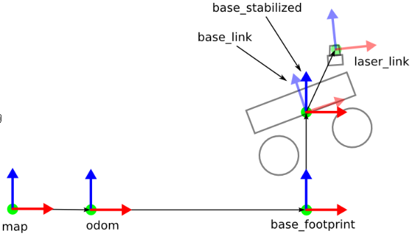

## Hector SLAM
### 算法原理
使用occupancy grid maps, 实时构建跟新地图. 每个激光点落在栅格地图上都会得到一个打分, 使用高斯牛顿法最大化分值.
关键公式:

得分双线性插值:

$$
\begin{aligned}
M ( P _ { m } ) \approx \frac { y - y _ { 0 } } { y _ { 1 } - y _ { 0 } } ( \frac { x - x _ { 0 } } { x _ { 1 } - x _ { 0 } } M ( P _ { 11 } ) + \frac { x _ { 1 } - x } { x _ { 1 } - x _ { 0 } } M ( P _ { 01 } ) ) \\ + \frac { y _ { 1 } - y } { y _ { 1 } - y _ { 0 } } ( \frac { x - x _ { 0 } } { x _ { 1 } - x _ { 0 } } M ( P _ { 10 } ) + \frac { x _ { 1 } - x } { x _ { 1 } - x _ { 0 } } M ( P _ { 00 } ) )
\end{aligned}
$$

梯度双线性插值:

$$
\begin{aligned}
\frac { \partial M } { \partial x } ( P _ { m } ) \approx \frac { y - y _ { 0 } } { y _ { 1 } - y _ { 0 } } ( M ( P _ { 11 } ) - M ( P _ { 01 } ) ) \\ + \frac { y _ { 1 } - y } { y _ { 1 } - y _ { 0 } } ( M ( P _ { 10 } ) - M ( P _ { 00 } ) ) \\ \frac { \partial M } { \partial y } ( P _ { m } ) \approx \frac { x - x _ { 0 } } { x _ { 1 } - x _ { 0 } } ( M ( P _ { 11 } ) - M ( P _ { 10 } ) ) \\ + \frac { x _ { 1 } - x } { x _ { 1 } - x _ { 0 } } ( M ( P _ { 01 } ) - M ( P _ { 00 } ) )
\end{aligned}
$$

目标函数:

$$
\sum _ { i = 1 } ^ { n } [ 1 - M ( S _ { i } ( \xi ) ) - \nabla M ( S _ { i } ( \xi ) ) \frac { \partial S _ { i } ( \xi ) } { \partial \xi } \Delta \xi ) ) ] ^ { 2 } \rightarrow 0
$$

得到2D的位姿$(x, y, \phi)$, 再通过 __EKF__, 与里程计IMU推导的位姿做融合.

### 测试&分析
论文中使用的测试配置: Intel Atom Z530 CPU

* 编译安装
[下载代码](https://github.com/tu-darmstadt-ros-pkg/hector_slam)放入ros工作空间, `catkin_make`即可, 为了在qt5上编译, 对CMake文件需要做一定的修改, 并将include头文件由`QtGui/QApplication`改为`QtWidgets/QApplication`.

* 测试运行
修改`hector_slam/hector_slam_launch/launch/tutorial.launch`, 添加rosbag播放node:
    ```xml
    <?xml version="1.0"?>

    <launch>

    <arg name="geotiff_map_file_path" default="$(find hector_geotiff)/maps"/>

    <param name="/use_sim_time" value="true"/>

    <node pkg="rviz" type="rviz" name="rviz"
        args="-d $(find hector_slam_launch)/rviz_cfg/mapping_demo.rviz"/>

    <include file="$(find hector_mapping)/launch/mapping_default.launch"/>

    <include file="$(find hector_geotiff)/launch/geotiff_mapper.launch">
        <arg name="trajectory_source_frame_name" value="scanmatcher_frame"/>
        <arg name="map_file_path" value="$(arg geotiff_map_file_path)"/>
    </include>

    <!-- add ros bag play node -->
    <node name="playbag" pkg="rosbag" type="play" 
        args="--clock Team_Hector_MappingBox_Dagstuhl_Neubau.bag"/>
    </launch>
    ```

    ros input message的配置
    
    gmapping数据集的运行, 对`hector_slam/hector_mapping/launch/mapping_default.launch`文件做如下修改:
    ```xml
    <arg name="base_frame" default="base_footprint"/>
    <arg name="odom_frame" default="odom"/>
    <arg name="pub_map_odom_transform" default="true"/>
    <arg name="scan_subscriber_queue_size" default="5"/>
    <arg name="scan_topic" default="base_scan"/>
    ```

### Reference
[如何使用hector slam算法包](https://www.jianshu.com/p/8a21b688c30c)
[hector slam ros package](https://code.google.com/archive/p/tu-darmstadt-ros-pkg/downloads)