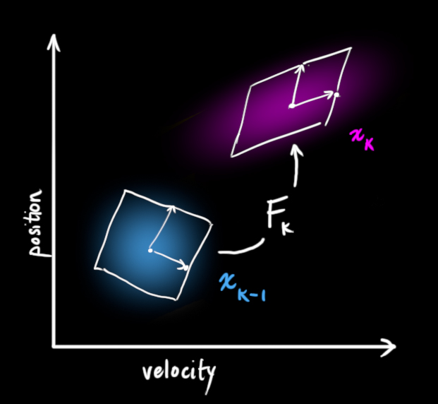
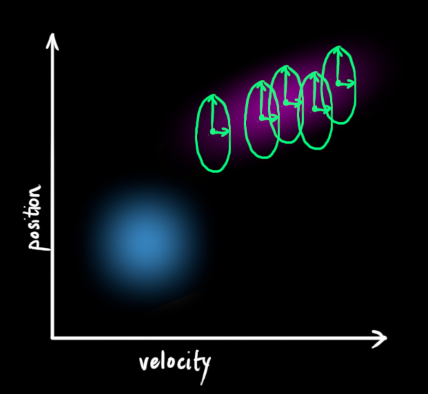
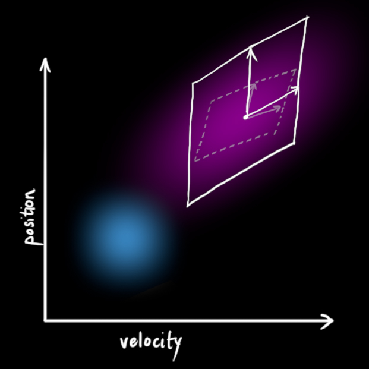
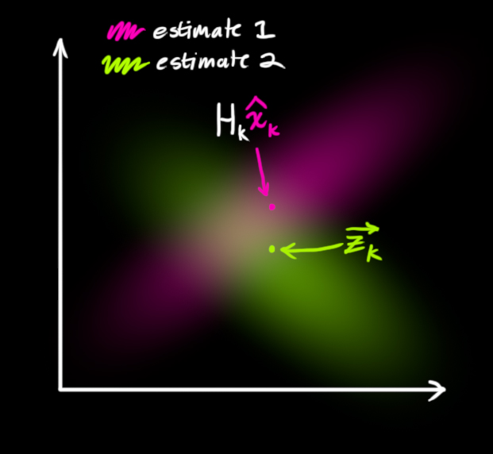
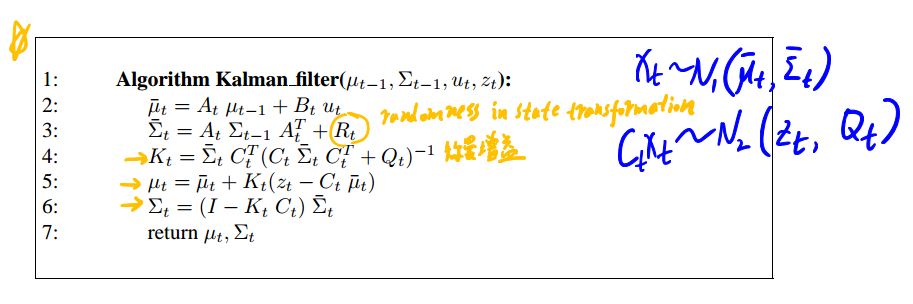
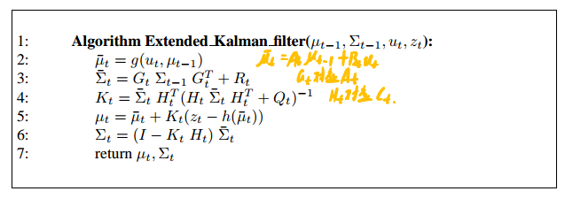
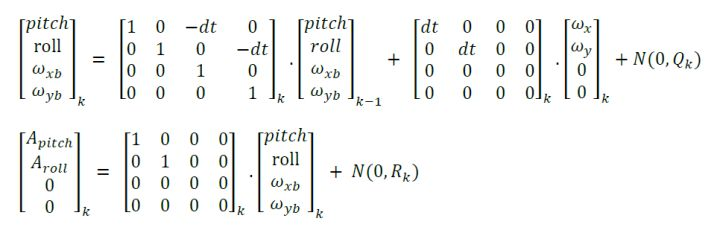

[TOC]
## Kalman 滤波用来解决什么样的问题
解决多传感器融合问题的最优解. 使用kalman滤波来融合多种机器人位置的预测(多传感器数据), 以期更加精准(鲁棒)地估计机器人的位置.

## Kalman 滤波的基本原理
假设每种预测(一般由不同的传感器数据计算得到)满足高斯分布(包括机器人的初始位置). 则在机器人运动的过程中, 可以将各个高斯分布的预测进行融合, 得到一个当前位置的最佳预测(也是高斯分布), 然后不断迭代.

### 理想的状态估计
从一个简单的状态(只有位置和速度)开始考虑 $\hat{x} = [p, v]$, 小车的加速度为$a$, 则有:
$$
\hat{x}_k = \left[\begin{array}{cc}
1 & \Delta t\\
0 & 1
\end{array}\right]  \left[\begin{array}{c}
p_{k-1}\\
v_{k-1}
\end{array}
\right] + \left[\begin{array}{c}
\frac{1}{2} \Delta t^2\\
\Delta t
\end{array}
\right] a
$$
也可以写成
$$
\hat{x}_k = \mathbf{F_k} \hat{x}_{k-1} + \mathbf{B}_k \vec{u}_k
$$
>$\mathbf{B}$ is called the control matrix and $\vec{u}_k$ the control vector.

但是上式仅描述了理想状况下机器人状态变换, 在真实情况下, 往往还有很多不确定因素比如轮子的磨损打滑导致的误差, 机器人受到风的作用力, 传感器的测量误差等.

### 升级状态描述
我们假设不确定性满足高斯分布. 我们通过加入协方差矩阵，强化状态的描述, 从而一个状态表示的是机器人当前位置和速度的概率分布.
>We’re modeling our knowledge about the state as a Gaussian blob, so we need two pieces of information at time k: We’ll call our best estimate $\hat{x}$(the mean, elsewhere named $\mu$), and its covariance matrix $P_k$.

$$
\begin{array}{c}
\hat{x}_k = \left[\begin{array}{c}
p_{k}\\
v_{k}
\end{array}
\right] \\
P_k = \left[\begin{array}{cc}
\Sigma_{pp} & \Sigma_{pv}\\
\Sigma_{vp} & \Sigma_{vv}\\
\end{array}
\right]
\end{array}
$$

协方差矩阵的更新
$$
\begin{array}{c}
Cov(x) = \Sigma \\
Cov(Ax) = A \Sigma A^T\\
\end{array}
$$
从而有$P_k = F_k P_k F_k^T$



### 加入外部不确定性
然而在状态变化过程中总会受到一些不确定的外因影响, 在每次状态变化时, 考虑每次变化过程中新加入的外在不确定因素, 我们加入协方差矩阵$Q_k$来表示这个不确定性因素.
>Everything is fine if the state evolves based on its own properties. Everything is still fine if the state evolves based on external forces, so long as we know what those external forces are.
Every state in our original estimate could have moved to a range of states. Because we like Gaussian blobs so much, we’ll say that each point $x_{k-1}$ in is moved to somewhere inside a Gaussian blob with covariance $Q_k$. Another way to say this is that we are treating the untracked influences as noise with covariance $Q_k$.

从而状态的变化可以描述为:
$$
\begin{array}{c}
\hat{x}_k = \mathbf{F_k}  \hat{x}_{k-1} + \mathbf{B}_k \vec{u}_k\\
P_k = F_k P_{k-1} F_k^T + Q_k
\end{array}
$$

 

### 通过测量优化估计

<div style="text-align:center">

</div>

在上述预测的基础上, 我们还可以获得一些传感器的数据(满足高斯分布), 利用这些数据来优化我们的估计. 
>We can figure out the distribution of sensor readings we’d expect to see in the usual way:
$$
\begin{aligned}
\vec{\mu}_{expected} = H_k\hat{x}_k\\
\Sigma_{expected} = H_k P_k H_k^T
\end{aligned}
$$

高斯估计之间的融合:

$$
\begin{aligned}
K = \Sigma_0(\Sigma_0+\Sigma_1)^{-1}\\
\vec{\mu}' = \vec{\mu_0} + K(\vec{\mu_1} - \vec{\mu_0})\\
\Sigma' = \Sigma_0 - K \Sigma_0
\end{aligned}
$$


>We have two distributions: The predicted measurement with $(\mu_0, \Sigma_0)=(\hat{H}_k\hat{x}_k, H_kP_kH_k^T)$, and the observed measurment with$(\mu_1, \Sigma_1)=(\overrightarrow{z_k}, R_k)$.

## Kalman滤波算法总结
### 线性Kalman滤波
在t时刻, 状态可以由均值$\mu_t$和方差$\Sigma_t$来表示, 对于下一时刻状态的概率$p(x_t | u_t, x_{t-1})$, 有状态转移方程:
$$
\begin{aligned}
x_t &= A_t x_{t-1} + B_t u_t + \varepsilon_t\\
x_t &\sim \mathcal{N}(A_t \mu_{t-1} + B_t u_t, \; \; \Sigma_{t-1}+R_t)
\end{aligned}
$$

这里$\varepsilon_t$是状态转移噪声, $R_t$是噪声的协方差. 对于测量概率$p(z_t|x_t)$, 同样有:
$$
\begin{aligned}
z_t &= C_t x_t + \delta_t\\
z_t &\sim \mathcal{N}(C_t x_t,\; \; Q)
\end{aligned}
$$

这里$\delta_t$是测量噪声. 根据贝叶斯理论进行概率融合有:
$$
\begin{aligned}
&p(x_t|u_t, z_t, x_{t-1}) \propto p(z_t|x_t) p(x_t|u_t, x_{t-1})\\
\Rightarrow &bel(x_t) = \eta p(z_t|x_t) p(x_t|u_t, x_{t-1}) = \eta \exp(-J_t)
\end{aligned}
$$

这里$J_t = \frac{1}{2}(z_t - C_t x_t)^T Q_t^{-1} (z_t - C_t x_t) + \frac{1}{2}(x_t - \bar{\mu}_t)^T\bar{\Sigma}_t^{-1}(x_t - \bar{\mu}_t)$.
$bel(x_t)$也服从高斯分布, 其均值和协方差可以通过其导数求得:
$$
\begin{aligned}
\frac{\partial J_t}{\partial x_t} &= -C_t^T Q_t^{-1}(z_t - C_tx_t) + \bar{\Sigma}_t^{-1}(x_t - \bar{\mu}_t)\\
\frac{\partial^2 J}{\partial x^2} &= C_t^T Q_t^{-1} C_t + \bar{\Sigma}_t^{-1}
\end{aligned}
$$

最小化$J_t$, 令一阶导等于0, 可得均值, 二阶导的逆即协方差:
$$
\begin{aligned}
\Sigma_t &= (C_t^T Q_t^{-1} C_t + \bar{\Sigma}_t^{-1})^{-1}\\
\mu_t &= \Sigma_t C_t^T Q_t^{-1}(z_t - C_t \bar{\mu}_t) + \bar{\mu}_t
\end{aligned}
$$

定义卡尔曼增益为: $K_t = \Sigma_t C_t^T Q_t^{-1}$, 则有:
$$
\mu_t = K_t(z_t - C_t \bar{\mu}_t) + \bar{\mu}_t
$$

计算时先计算卡尔曼增益, 通过他来计算协方差:
$$
\begin{aligned}
K_t &= \bar{\Sigma}_t C_t^T(C_t \bar{\Sigma}_tC_t^T + Q_t)^{-1}\\
\Sigma_t &= (I-K_tC_t)\bar{\Sigma}_t
\end{aligned}
$$

伪代码：
<div style="text-align:center">

</div>

### EKF
对于非线性的状态转移函数或测量函数, 可以对其进行一阶泰勒展开, 再使用Kalman滤波:
$$
\begin{aligned}
x_t &= g(u_t, x_{t-1}) + \varepsilon_t\\
z_t &= h(x_t) + \delta_t
\end{aligned}
$$

$$
\begin{aligned}
g(u_t, x_{t-1}) &\approx g(u_t, \mu_{t-1}) + G_t(x_{t-1} - \mu_{t-1})\\
h(x_t) &\approx h(\bar{\mu}_t) + H_t(x_t - \bar{\mu}_t)
\end{aligned}
$$

伪代码:
<div style="text-align:center">

</div>

## Example 根据重力加速度计算Pitch, Roll
3个欧拉角的不同排序, 可以得到不同的旋转矩阵, 这里我们使用的排序为'x-y-z'. 更多排列组合见[Tilt Sensing Using Linear Accelerometers](https://cache.freescale.com/files/sensors/doc/app_note/AN3461.pdf)
$$
\begin{aligned}
&R_{xyz} \begin{bmatrix} 0 \\ 0 \\ 1 \end{bmatrix} = R_x(\phi) R_y(\theta) R_z(\psi) \begin{bmatrix} 0 \\ 0 \\ 1 \end{bmatrix} \\
&= \begin{bmatrix}
\cos\theta \cos\psi & \cos\theta \cos\psi & -\sin \theta\\
\cos \psi \sin \theta \sin \phi - \cos \phi \sin \psi & \cos \phi \cos \psi + \sin \theta \sin \phi \sin \psi & \cos \theta \sin \phi\\
\cos \phi \cos \psi \sin \theta + \sin \phi \sin \psi & \cos \phi \sin \theta \sin \psi - \cos \psi \sin \phi & \cos \theta \cos \phi
\end{bmatrix} \begin{bmatrix} 0 \\ 0 \\ 1 \end{bmatrix}\\
&=\begin{bmatrix}
-\sin \theta \\
\cos \theta \sin \phi \\
\cos \theta \cos \phi
\end{bmatrix}
\end{aligned}
$$
在这里假设pitch和roll的改变导致了IMU重力加速度读数的变化. 使用如下模型来进行Kalman滤波:


单轴(pitch/roll) Kalman滤波
```c++
/* Copyright (C) 2012 Kristian Lauszus, TKJ Electronics. All rights reserved.
 This software may be distributed and modified under the terms of the GNU
 General Public License version 2 (GPL2) as published by the Free Software
 Foundation and appearing in the file GPL2.TXT included in the packaging of
 this file. Please note that GPL2 Section 2[b] requires that all works based
 on this software must also be made publicly available under the terms of
 the GPL2 ("Copyleft").
 Contact information
 -------------------
 Kristian Lauszus, TKJ Electronics
 Web      :  http://www.tkjelectronics.com
 e-mail   :  kristianl@tkjelectronics.com
 */

#include "Kalman.h"

Kalman::Kalman() {
    /* We will set the variables like so, these can also be tuned by the user */
    Q_angle = 0.001f;
    Q_bias = 0.003f;
    R_measure = 0.03f;

    angle = 0.0f; // Reset the angle
    bias = 0.0f; // Reset bias

    P[0][0] = 0.0f; // Since we assume that the bias is 0 and we know the starting angle (use setAngle), the error covariance matrix is set like so - see: http://en.wikipedia.org/wiki/Kalman_filter#Example_application.2C_technical
    P[0][1] = 0.0f;
    P[1][0] = 0.0f;
    P[1][1] = 0.0f;
};

// The angle should be in degrees and the rate should be in degrees per second and the delta time in seconds
float Kalman::getAngle(float newAngle, float newRate, float dt) {
    // KasBot V2  -  Kalman filter module - http://www.x-firm.com/?page_id=145
    // Modified by Kristian Lauszus
    // See my blog post for more information: http://blog.tkjelectronics.dk/2012/09/a-practical-approach-to-kalman-filter-and-how-to-implement-it

    // Discrete Kalman filter time update equations - Time Update ("Predict")
    // Update xhat - Project the state ahead
    /* Step 1 */
    rate = newRate - bias;
    angle += dt * rate;

    // Update estimation error covariance - Project the error covariance ahead
    /* Step 2 */
    P[0][0] += dt * (dt*P[1][1] - P[0][1] - P[1][0] + Q_angle);
    P[0][1] -= dt * P[1][1];
    P[1][0] -= dt * P[1][1];
    P[1][1] += Q_bias * dt;

    // Discrete Kalman filter measurement update equations - Measurement Update ("Correct")
    // Calculate Kalman gain - Compute the Kalman gain
    /* Step 4 */
    float S = P[0][0] + R_measure; // Estimate error
    /* Step 5 */
    float K[2]; // Kalman gain - This is a 2x1 vector
    K[0] = P[0][0] / S;
    K[1] = P[1][0] / S;

    // Calculate angle and bias - Update estimate with measurement zk (newAngle)
    /* Step 3 */
    float y = newAngle - angle; // Angle difference
    /* Step 6 */
    angle += K[0] * y;
    bias += K[1] * y;

    // Calculate estimation error covariance - Update the error covariance
    /* Step 7 */
    float P00_temp = P[0][0];
    float P01_temp = P[0][1];

    P[0][0] -= K[0] * P00_temp;
    P[0][1] -= K[0] * P01_temp;
    P[1][0] -= K[1] * P00_temp;
    P[1][1] -= K[1] * P01_temp;

    return angle;
};
```

# Reference
>How a Kalman filter works, in pictures: https://www.bzarg.com/p/how-a-kalman-filter-works-in-pictures/

>卡尔曼滤波器是如何运用于多传感器融合的？
: https://www.zhihu.com/question/46869663/answer/103311127

>A practical approach to Kalman filter and how to implement it: http://blog.tkjelectronics.dk/2012/09/a-practical-approach-to-kalman-filter-and-how-to-implement-it/

> 卡尔曼滤波C代码分析: https://blog.csdn.net/cztqwan/article/details/50084967

> Tilt Sensing Using Linear Accelerometers: https://cache.freescale.com/files/sensors/doc/app_note/AN3461.pdf

> Thrun S. Probabilistic robotics[M]. MIT Press, 2006.