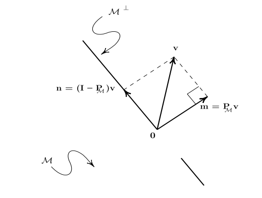
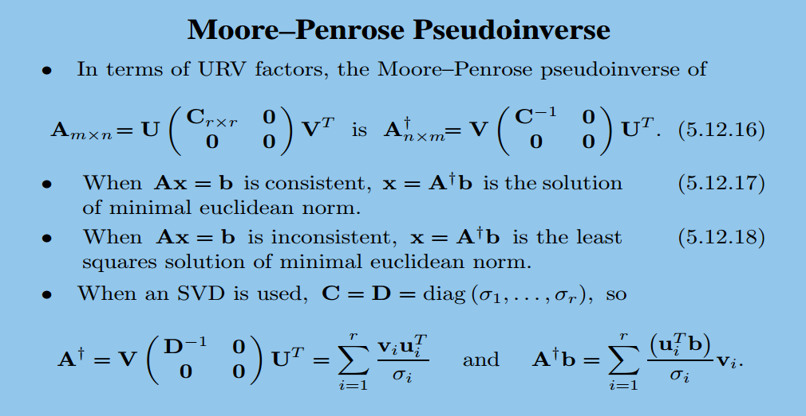

## 一些数学定义
共轭: 实数部分相等, 复数部分相反.
厄米特矩阵(Hermitian Matrix): 矩阵中每一个第i行第j列的元素都与第j行第i列的元素的共轭相等.

## 行列式
关于行列式, 我知道三种等价定义：一是用排列和逆序数定义（国内大多数教材上都用这种定义）；二是用归一化（单位矩阵行列式为1）、多线性（当矩阵的某一列所有元素都扩大c倍时, 相应行列式也扩大c倍。多的意思是对所有n个列都呈现线性性质）、反对称（交换两列行列式反号）来定义；三是利用代数余子式和按第一行展开进行归纳定义；

## Ax=b的求解方法
对于多元一次线性方程组$Ax=b$, 有两种策略, 一种是对曾广矩阵进行高斯消元, 若A为n阶方阵则计算复杂度$O(n^3)$. 用这种方法, 若b改变, 则需要重新计算.另一种策略是使用不同种方式对$A$进行分解, 然后对A求逆, 好处是: 计算完成后不依赖与b, 不需要重新计算. 这里对分解做一个总结, 合并回答1,2两个小题.

### SVD分解

### LU分解
先通过高斯消元, 将矩阵A变为上三角矩阵和下三角矩阵乘积LU, 从而$Ax = LUx = b$ --> $Ux = L^{-1}b$, 然后求解. 若在高斯消元过程中必须进行行交换, 则可以先将A乘上一个置换矩阵P, 即PA = LU, 又有A = PLU.
[reference](https://www.cnblogs.com/bigmonkey/p/9555710.html)

### QR分解
任意实数方阵$A$, 都能被分解为$A=QR$. 这里的Q为正交单位阵, 即$Q^TQ=I$. $R$是一个上三角矩阵. 这种分解被称为QR分解. QR分解也有若干种算法, 常见的包括Gram–Schmidt、Householder和Givens算法.

#### 原理
我们定义投影符号如下:

$$
\mathrm{proj}_{\mathbf{e}}\mathbf{a}
= \frac{\left\langle\mathbf{e},\mathbf{a}\right\rangle}{\left\langle\mathbf{e},\mathbf{e}\right\rangle}\mathbf{e}
$$

令$A=[\mathbf{a}_1, \cdots, \mathbf{a}_n]$, 其中$a_i$为列向量. 则有Gram–Schmidt正交化:

$$
\begin{aligned}
 \mathbf{u}_1 &= \mathbf{a}_1,
  & \mathbf{e}_1 &= {\mathbf{u}_1 \over \|\mathbf{u}_1\|} \\
 \mathbf{u}_2 &= \mathbf{a}_2-\mathrm{proj}_{\mathbf{u}_1}\,\mathbf{a}_2,
  & \mathbf{e}_2 &= {\mathbf{u}_2 \over \|\mathbf{u}_2\|} \\
 \mathbf{u}_3 &= \mathbf{a}_3-\mathrm{proj}_{\mathbf{u}_1}\,\mathbf{a}_3-\mathrm{proj}_{\mathbf{u}_2}\,\mathbf{a}_3,
  & \mathbf{e}_3 &= {\mathbf{u}_3 \over \|\mathbf{u}_3\|} \\
 & \vdots &&\vdots \\
 \mathbf{u}_k &= \mathbf{a}_k-\sum_{j=1}^{k-1}\mathrm{proj}_{\mathbf{u}_j}\,\mathbf{a}_k,
  &\mathbf{e}_k &= {\mathbf{u}_k\over\|\mathbf{u}_k\|}
\end{aligned}
$$

即:

$$
\begin{aligned}
 \mathbf{a}_1 &= \langle\mathbf{e}_1,\mathbf{a}_1 \rangle \mathbf{e}_1  \\
 \mathbf{a}_2 &= \langle\mathbf{e}_1,\mathbf{a}_2 \rangle \mathbf{e}_1 + \langle\mathbf{e}_2,\mathbf{a}_2 \rangle \mathbf{e}_2 \\
 \mathbf{a}_3 &= \langle\mathbf{e}_1,\mathbf{a}_3 \rangle \mathbf{e}_1 + \langle\mathbf{e}_2,\mathbf{a}_3 \rangle \mathbf{e}_2 + \langle\mathbf{e}_3,\mathbf{a}_3 \rangle \mathbf{e}_3 \\
 &\vdots \\
 \mathbf{a}_k &= \sum_{j=1}^{k} \langle \mathbf{e}_j, \mathbf{a}_k \rangle \mathbf{e}_j
\end{aligned}
$$

因此,

$$
Q = \left[ \mathbf{e}_1, \cdots, \mathbf{e}_n\right] \qquad \text{and} \qquad R = \begin{bmatrix}
\langle\mathbf{e}_1,\mathbf{a}_1\rangle & \langle\mathbf{e}_1,\mathbf{a}_2\rangle &  \langle\mathbf{e}_1,\mathbf{a}_3\rangle  & \ldots \\
0 & \langle\mathbf{e}_2,\mathbf{a}_2\rangle &  \langle\mathbf{e}_2,\mathbf{a}_3\rangle  & \ldots \\
0 & 0 & \langle\mathbf{e}_3,\mathbf{a}_3\rangle & \ldots \\
\vdots & \vdots & \vdots & \ddots \end{bmatrix}
$$

#### Householder实现
[householder](https://rpubs.com/aaronsc32/qr-decomposition-householder)
[householder](https://blog.csdn.net/hzh_0000/article/details/78655725)

#### Gram-Schmidt实现
参考原理. 复杂度$n^3$
优点:
1. 适合小矩阵计算；
2. 每次迭代都生成一个正交基，可以随时停止计算（相比之下，Householder/Givens方法只能在迭代结束之后才可以计算全部正交基，中间产生了大量的半成品。）
缺点:
1. 不适合稀疏矩阵；
2. 在有限精度的病态矩阵中会导致大量误差；
3. 循环过程中必须保存整个矩阵，导致内存开销大；

#### Givens实现

### LLT(Cholesky)分解
设A是一个n阶厄米特正定矩阵(Hermitian positive-definite matrix).
Cholesky分解的目标是把A变成: $A = LL^T$, L是下三角矩阵.
__推导过程__
因为A是对称的矩阵, 所以设A为:

$$
A =  \left[ \begin{matrix} a_{11}&A_{21}^{T}\\ A_{21}&A_{22}\\ \end{matrix} \right]
$$

设L:
$$
L =  \left[ \begin{matrix} l_{11}&0\\ L_{21}&L_{22}\\ \end{matrix} \right]
$$

则有:

$$
L^{T} =  \left[ \begin{matrix} l_{11}&L_{21}^{T}\\ 0&L_{22}^{T}\\ \end{matrix} \right]
$$

设$A = LL^T$, 得到:

$$
\begin{aligned}
\left[ \begin{matrix} a_{11}&A_{21}^{T}\\ A_{21}&A_{22}\\ \end{matrix} \right] &=  \left[ \begin{matrix} l_{11}&0\\ L_{21}&L_{22}\\ \end{matrix} \right] \left[ \begin{matrix} l_{11}&L_{21}^{T}\\ 0&L_{22}^{T}\\ \end{matrix} \right] \\
 &=  \left[ \begin{matrix} l_{11}^{2}&l_{11}L_{21}^{T}\\ l_{11}L_{21}&L_{21}L_{21}^{T}+L_{22}L_{22}^{T}\\ \end{matrix} \right]
\end{aligned}
$$

其中, $l_{11},L_{21},L_{22}$是未知量, 求解公式为:

$$
\begin{aligned}
l_{11} &= \sqrt {a_{11}}\\
L_{21} &= \frac {1}{l_{11}}A_{21}\\
L_{22}L_{22}^{T} &=  A_{22} - L_{21}L_{21}^{T}
\end{aligned}
$$

设$A_{22}' = A_{22} - L_{21}L_{21}^{T}$, 则使用递归的方式进一步求解.

优点: 速度快
缺点: 由于进行了开平方, 精度低.

refere to: [线性代数之线性代数之Cholesky分解](https://www.qiujiawei.com/linear-algebra-11/)

### LDLT分解
LDLT分解法实际上是Cholesky分解法的改进，因为Cholesky分解法虽然不需要选主元，但其运算过程中涉及到开方问题，而LDLT分解法则避免了这一问题，可用于求解线性方程组。 也需要分解对象为方阵，分解结果为$A=LDL^T$。其中L为一下三角形单位矩阵(即主对角线元素皆为1)，D为一对角矩阵(只在主对角线上有元素，其余皆为零)，$L^T$为L的转置矩阵。

//TODO Eigen中LDLT分解, 并不需要对称????

### Jacobian分解
TODO 

### 正交投影
"Matrix Analysis and Applied Linear Algebra" p 433

给定$\mathfrak{R}^n$上的一组互补的子空间$\mathcal{M, N}$, 往$\mathcal{M}$上的投影矩阵$\mathbf{P}$定义为:
$$
\mathbf{P = ( M | N ) \left( \begin{array} { l l } { \mathbf{I} } & { 0 } \\ { 0 } & { 0 } \end{array} \right) ( M | N ) ^ { - 1 } = ( M | 0 ) ( M | N ) ^ { - 1 }}
$$

由
$$
\mathbf{
\left( \frac { ( M ^ { T } M ) ^ { - 1 } M ^ { T } } { N ^ { T } } \right) ( M | N ) = \left( \begin{array} { l l } { \mathbf{I} } & { 0 } \\ { 0 } & { \mathbf{I} } \end{array} \right) \Rightarrow ( M | N ) ^ { - 1 } = ( \frac { ( M ^ { T } M ) ^ { - 1 } M ^ { T } } { N ^ { T } } )}
$$

可以化简得到:
$$
\mathbf{P _ { \mathcal{M} } = ( M | 0 ) ( \frac { ( M ^ { T } M ) ^ { - 1 } M ^ { T } } { N ^ { T } } ) = M ( M ^ { T } M ) ^ { - 1 } M ^ { T }}
$$

这里, $\mathbf{( M ^ { T } M ) ^ { - 1 } M ^ { T }}$是$\mathbf{M}$的伪逆. 特别的, 当$\mathbf{M}$是一组正交基的时有$\mathbf{M^TM=I} \Rightarrow \mathbf{P}_\mathcal{M} = \mathbf{MM^T}$.

### 矩阵伪逆
"Matrix Analysis and Applied Linear Algebra" p 423

## Reference
[线性代数几何理解](https://www.bilibili.com/video/av6731067/?p=2)
[线性代数几何理解的笔记总结](https://charlesliuyx.github.io/2017/10/06/【直观详解】线性代数的本质/)
[知乎-线性代数精讲](https://www.zhihu.com/lives/840892402460954624)
[线性代数MIT公开课](http://open.163.com/special/opencourse/daishu.html)
[LU分解](https://www.cnblogs.com/bigmonkey/p/9555710.html)
[不同种QR分解的优劣](https://www.zhihu.com/question/23905796)
[Eigen中矩阵分解对比](http://zhaoxuhui.top/blog/2019/08/22/eigen-note-2.html)