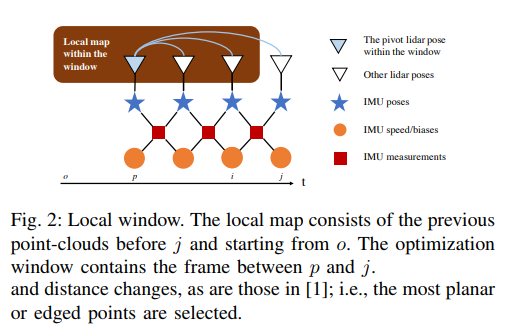

# LIO
[TOC]
## Overview
概要: 提出了一种紧耦合的Lidar IMU融合方法, 以及一种基于旋转约束的位姿优化算法.
解决的问题: 在具有挑战性的场景中(甚至在激光数据退化的情况下), 也能够保证较小的漂移.
论文的结构:
* Section I
提出存在的问题: Lidar分辨率低, 一帧数据的特征有限, 且在有些场景下, 激光数据会退化(空旷、长直道等). 且激光数据处理起来, 帧率较低, 无法做到实时.
介绍了解决这个问题的思路: 将激光和IMU紧耦合, 融合在一起. 使用预计分来填补中间机器人位姿的空档.

* Section III
定义了本文一些量的数学表示符号. 并介绍了IMU的预计分.

* ⭐Section IV
详细介绍了Lidar和IMU紧耦合的残差表达式, 以及算法的Pipe line.

* ⭐Section V
详细介绍了基于旋转约束的优化

* Section VI
实现上的一些细节

* Section VII
测试结果和分析

关键词/概念介绍
de-skewing 矫正单帧的Lidar数据(运动畸变)
pivot lidar sweep 在联合优化时此帧之前的激光帧位姿固定, 局部地图以此帧的坐标系为局部坐标系.
marginalization 残差优化时, 需要边缘化

可按照其提出的两个方法, 进行阅读.

## 基本原理

[IMU预积分](imu_pre_integration.md)

## Lidar IMU紧耦合
Pipeline:
①. 不断更新IMU数据.
②. 使用IMU数据做预积分, 来确定机器人的位姿.
③. 当激光数据到达时, 激光数据去运动畸变.
④. 激光帧特征提取.
⑤. 将上一帧的激光数据合并到局部地图中.
⑥. ⭐计算激光帧的相对位姿.
⑦. ⭐IMU和激光帧联合优化. 

### 激光帧相对位姿的计算
局部地图由不同时间点的激光帧组成$\{o, \cdots , p, \cdots, i\}$, $o$为滑动窗口的第一帧, $p$为pivot帧, $i$滑动窗口的最后一帧. 局部地图$M_{L_{o,i}}^{L_p}$以pivot帧的坐标系为准, 上一次激光和IMU联合优化的结果. 而此次通过特征我们估计的是pivot帧之后(pivot帧之前的位姿固定), $\{p+1, \cdots, j\}$激光在局部地图上的位姿.

TODO 相对位姿的求解细节

### IMU和激光帧联合优化
在得到$\{pivot+1, \cdots, j\}$相对于局部地图即pivot的相对位姿之后, 构造激光特征配准残差和IMU预计分残差, 联合优化, 求解.

TODO 残差表示以及具体的优化细节

## 基于旋转约束的位姿Refinement
任务: 将局部地图的数据Align到全局地图上.
问题: 旋转累计误差, 会导致合并之后的全局地图失去在重力方向上的精准配准(align with gravity accurately), 使得后续数据产生巨大偏差.
因此, 在合并时对旋转加了约束.

# LIO Implementation

## Reference
[Lio 论文解析](https://zhuanlan.zhihu.com/p/24709748)
