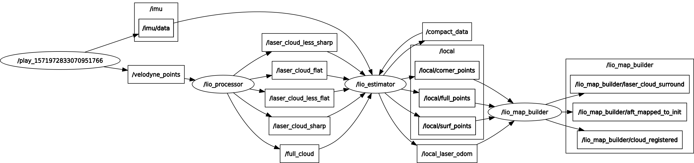

# LIO 源码分析
## Overview
ros 节点和Topic图


| 节点名称 | 功能 | source code |
| --- | --- | ---- |
| lio_processor | 接收激光原始点云数据, 抽取输出特征. 这里输出点云的intensity为ring+rel_time. | point_processor/processor_node<br> point_processor/PointProcessor |
| lio_estimator | 1.PointOdometry: 接收分类的点云, 执行激光里程计, 并根据里程计结果对激光数据做运动补偿<br> 2. Estimator: 在父类MeasurementManager实现中, 接收IMU和lio_processor的结果compactdata, 存放到buffer. 再通过ProcessEstimation, 与VINS相似, 执行processIMU和ProcessCompactData | point_processor/PointOdometry <br> point_processor/PointMapping <br> imu_processor/Estimator |
| lio_map_builder | |

node pipeline
```c++
//// processor node
// get raw lidar point cloud
// remove invalid point
// calculate corner and surf

//// estimator node
thread odom(&PointOdometry::Spin, &odometry); // in estimator node
thread measurement_manager(&Estimator::ProcessEstimation, &estimator); // in estimator node
PointOdometry::Spin()
{
    while(status)
    {
        Process()
        {
            // check if no new data return
            // if imu haven't inited, perform point odometry
            // publish compacted odometry and point cloud
        }
    }
}
Estimator::ProcessEstimation()
{
    // get measurement
    // 打包好的激光雷达和IMU数据, 与VINS一样, 要求包含一帧激光雷达开始前和结束后的IMU数据
    // 使用IMU数据对位姿进行积分, 相当于VINS中的processIMU

    // 处理激光雷达数据, 与VINS中的processCamera相当
    ProcessCompactData()
    {
        // 数据解包, 并将是否收到数据的标志值设置为true
        PointMapping::CompactDataHandler(compact_data);
        // 若已经初始化, 则先将数据转换到局部地图坐标系下, pivot帧的坐标系
        if (stage_flag_ == INITED) {
            // ...
        }
        
        // 若未初始化, 或者不使用IMU, 则使用LOAM的scan to local mapping
        if (stage_flag_ != INITED || !estimator_config_.imu_factor) {
            PointMapping::Process();
        }

        ProcessLaserOdom()
        {
            // 若IMU未初始化, 则返回
            // 执行IMU和激光数据的联合优化
            PublishResults(); // 发布结果
        }
    }
}
```

## 代码详解
### PointProcessor
接收原始激光数据, 去除无效点, 分类corner和surf.

### PointOdometry
在未初始化成功时, 执行激光里程计, 并根据激光里程计对点云做运动补偿, 然后发布里程信息以及transform之后的激光点云.
| 消息名称 | 描述 | in/out |
| --- | --- | --- |
| /laser_cloud_sharp <br> /laser_cloud_less_sharp </br> /laser_cloud_flat <br> /laser_cloud_less_flat <br> /full_cloud | feature点云数据 | in |
| /compact_data | 打包的数据, 按顺序存放了odometry信息, 以及根据odometry transform之后的corner点云信息, surf点云信息, full点云信息 | out |

code:
```c++
ros::Rate r(100);
while (ros::ok()) {
    odometry.Process()
    {
        if (!HasNewData()) return;
        if (enable_odom_) {
            // transform_es_为上一帧到上上帧的transform
            // 执行指定次数的迭代
            for (size_t iter_count = 0; iter_count < num_max_iterations_; ++iter_count){
                // 构建corner点的loss
                for (int i = 0; i < num_curr_corner_points_sharp; ++i) {
                    // deskew, 这里没用到IMU, 而是直接用lidar odo
                    TransformToStart(corner_points_sharp_->points[i], point_sel);
                    // ...
                }

                // 构建flat点的loss
                for (int i = 0; i < num_curr_surf_points_flat; ++i) {
                    TransformToStart(surf_points_flat_->points[i], point_sel);
                    // ...
                }
                // gaussian optimize
            }
        }
    }
    ros::spinOnce();
    r.sleep();
}
```

### PointMapping
在IMU初始化之前, LOAM激光里程计scan to local map optimization. 根据地图中附近区域的点云, 对激光帧的位姿进行优化, 并合并到地图中.
| 消息名称 | 描述 | in/out |
| --- | --- | --- |
|  | | |

### Estimator
Estimator继承了PointMapping和MeasurementManager. 调用MeasurementManager获取数据, 执行激光和IMU滑窗tightly optimization, 以及IMU的初始化工作. 同时, 在未初始化之前, 由其来调用PointOdometry和PointMapping来执行纯激光的里程计和scan to local map优化.

| 消息名称 | 描述 | in/out |
| --- | --- | --- |
| /imu/data | imu数据 | in |
| /compact_data | 打包的里程计位姿(在IMU初始化之前会更新)和corner、surf点云数据. <br> 由其父类MeasurementManager接收 | in |

关键代码:
```c++
Estimator estimator(estimator_config);
    estimator.SetupRos(*nh_ptr) {
        // 在父类中接收数据, 保存到buffer
        MeasurementManager::SetupRos(nh);
        // 这里不接收数据, handler在Estimator中被显示调用
        PointMapping::SetupRos(nh, false);
    }

  PointOdometry odometry(0.1, odom_io);
  odometry.SetupRos(*nh_ptr);
  odometry.Reset();  
  thread odom(&PointOdometry::Spin, &odometry);
  // 显示调用
  thread measurement_manager(&Estimator::ProcessEstimation, &estimator);
}

Estimator::ProcessEstimation()
{
    // 获取一打数据
    // processIMU
    // processCompactData
    ProcessCompactData(compact_data_msg, compact_data_msg->header)
    {
        if (stage_flag_ != INITED || !estimator_config_.imu_factor) {
            /// 2. process decoded data
            PointMapping::Process();
        }
        Transform transform_to_init_ = transform_aft_mapped_;
        ProcessLaserOdom(transform_to_init_, header)
        {
            if (estimator_config_.run_optimization) {
                switch (stage_flag_) {
                    case NOT_INITED: {
                    }
                    case INITED: {
                    }
                }
            }
        }
    }
}
```

关键函数:
```c++
Estimator::RunInitialization(); // 执行IMU初始化
Estimator::SolveOptimization(); // 执行联合优化
```