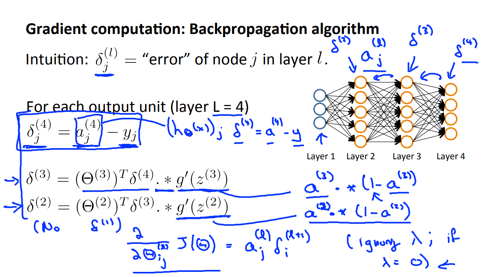
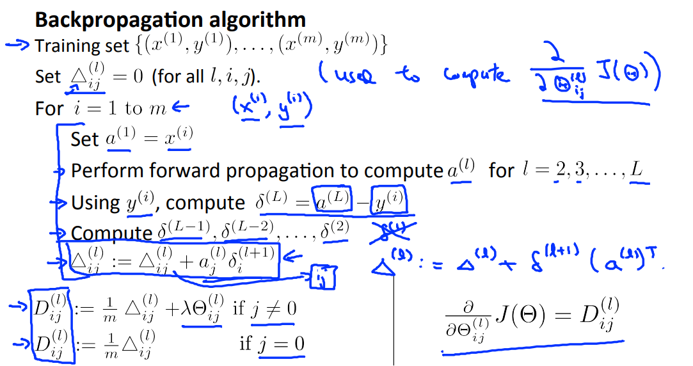
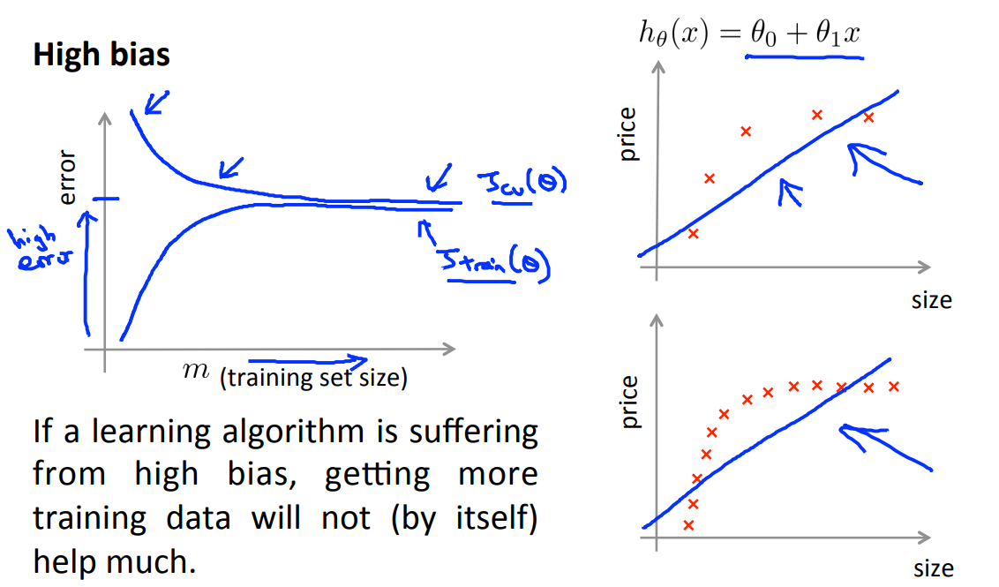

# Machine Learning Course Note
## Linear Regression
Cost function
$$
J(\theta) = \frac{1}{2m} \sum_{i=1}^m (h_\theta(x^{(i)}) - y^{(i)})^2 + \frac{\lambda}{2m} \sum_{j=1}^n \theta_j^2
$$
这里$h_\theta(x) = \theta^T x$.

Gradient
$$
\begin{aligned}
\frac{\partial J(\theta)}{\partial \theta_0} &= \frac{1}{m}\sum_{i=1}^m (h_\theta(x^{(i)}) - y^{(i)}) x_j^{(i)} \quad \mathrm{for} \; j = 0\\
\frac{\partial J(\theta)}{\partial \theta_j} &= \frac{1}{m}\sum_{i=1}^m (h_\theta(x^{(i)}) - y^{(i)}) x_j^{(i)} + \frac{\lambda}{m} \theta_j \quad \mathrm{for} \; j \ge 1
\end{aligned}
$$

Feature Normalization, 减去均值,除以方差, 归一化特征.
```matlab
X_norm = X;
mu = mean(X);
sigma = std(X);
X_norm = (X - mu) ./ sigma;
```

## Logistic Regression
### sigmoid function
$$
\begin{aligned}
\log \frac{p(y=1 | x)}{p(y=0 | x)} =  \log\frac{y}{1-y} = \theta^Tx \\
\Rightarrow y = g(\theta^T x) = \frac{1}{1+e^{-\theta^T x}} 
\end{aligned}
$$


sigmoid函数有一个很好地特性: $g'(z) = g(z)(1-g(z))$

### Cost Function
maximum likelihood method:
$$
\begin{aligned}
&\prod_{i=1}^{m} p(y_i | x^{(i)}; \theta) \Rightarrow J(\theta) = \sum_{i=1}^{m} \log p(y_i | x^{(i)}; \theta) \\
&J(\theta)=-\frac{1}{m} \sum_{i=1}^{m}\left[y^{(i)} \log \left(h_{\theta}\left(x^{(i)}\right)\right)+\left(1-y^{(i)}\right) \log \left(1-h_{\theta}\left(x^{(i)}\right)\right)\right]+\frac{\lambda}{2 m} \sum_{j=1}^{n} \theta_{j}^{2}
\end{aligned}
$$

这里$h_{\theta}\left(x^{(i)}\right)=g\left(\theta^{T} x^{(i)}\right)$

```matlab
% calculate hypothesis
h = sigmoid(X*theta);
% regularize theta by removing first value
theta_reg = [0;theta(2:end, :);];
J = (1/m)*(-y'* log(h) - (1 - y)'*log(1-h))+(lambda/(2*m))*theta_reg'*theta_reg;
```

### Gradient
$$
\begin{aligned}{\frac{\partial J(\theta)}{\partial \theta_{0}}} & {=\frac{1}{m} \sum_{i=1}^{m}\left(h_{\theta}\left(x^{(i)}\right)-y^{(i)}\right) x_{j}^{(i)}} & {\text { for } j=0} \\
{\frac{\partial J(\theta)}{\partial \theta_{j}}} & {=\left(\frac{1}{m} \sum_{i=1}^{m}\left(h_{\theta}\left(x^{(i)}\right)-y^{(i)}\right) x_{j}^{(i)}\right)+\frac{\lambda}{m} \theta_{j}} & {\text { for } j \geq 1}
\end{aligned}
$$

```matlab
grad = 1/m * (X'*(h - y)+lambda*theta_reg);
```

### Traning
```matlab
function [all_theta] = oneVsAll(X, y, num_labels, lambda)
m = size(X, 1);
n = size(X, 2);
all_theta = zeros(num_labels, n + 1);
X = [ones(m, 1) X];
for c = 1:num_labels
  initial_theta = zeros(n + 1, 1);
  options = optimset('GradObj', 'on', 'MaxIter', 50);
  [theta] = ...
    fmincg (@(t)(lrCostFunction(t, X, (y == c), lambda)), ...
  initial_theta, options);
  all_theta(c, :) = theta;
end
end
```

##  Neural Networks
### Cost Function
Let's first define a few variables that we will need to use:
* L = total number of layers in the network
* $s_l$ = number of units (not counting bias unit) in layer l
* K = number of output units/classes

Denote $h_{\theta}(x)_k$ as being a hypothesis that results in the $k^{th}$ output. The  cost function is:
$$
J(\Theta)=-\frac{1}{m} \sum_{i=1}^{m} \sum_{k=1}^{K}\left[y_{k}^{(i)} \log \left(\left(h_{\Theta}\left(x^{(i)}\right)\right)_{k}\right)+\left(1-y_{k}^{(i)}\right) \log \left(1-\left(h_{\Theta}\left(x^{(i)}\right)\right)_{k}\right)\right]+\frac{\lambda}{2 m} \sum_{l=1}^{L-1} \sum_{i=1}^{s_{l}} \sum_{j=1}^{s_{l+1}}\left(\Theta_{j, i}^{(l)}\right)^{2}
$$

### Foward Propagation

这里a代表sigmoid函数的输出值(activation), z是前一层输出的权重加和(输入值).

### BackPropagation
BP基本思想: 结果误差, 根据权重反向传播(分配)到隐藏层, 从而得到每个隐藏层的误差. 权重越大, 被分配的误差也越大.


$\delta_j^{(l)}$ = "error" of cost for $a_j^{(l)}$ （unit j in layer l). 正式的定义为:

$$
\delta_j^{(l)} = \frac{\partial}{\partial_{z_j}^{(l)}} \mathrm{cost}(i) \quad \mathrm{for} \quad j > 0
$$

这里, $\mathrm{cost}(i) = y^{(i)} \log h_{\Theta}(x^{(i)}) + (1-y^{(i)})\log h_\Theta(x^{(i)})$
Note: 之前logistic regression是求对$\theta$的偏导, 这里求得是对$z = \theta^T x$的偏导.

BP算法流程图


BP算法流程伪代码


```matlab
z2 = [ones(m,1) X] * Theta1'; % m x (l1+1) * (l1+1) x l2
a2 = sigmoid(z2);
z3 = [ones(m, 1) a2] * Theta2'; % m x l3 
h = sigmoid(z3);

y2 = zeros(m, num_labels);
y2(sub2ind(size(y2), 1:length(y), y')) = 1; % m \times 10
tmp = -y2 .* log(h) - (1-y2) .* log(1-h);
reg_theta1 = Theta1(:, 2:end);
reg_theta2 = Theta2(:, 2:end);
reg_theta = [reg_theta1(:); reg_theta2(:)];
J = 1/m * (sum(tmp(:)) + 0.5*lambda *(reg_theta' * reg_theta));

delta3 = h - y2; % m x l3 = 10
gz2 = sigmoidGradient(z2); % m x l2
delta2 = delta3 * Theta2(:, 2:end) .* gz2; % m x l2

grad_theta2 = delta3' * [ones(m,1) a2]; % l3 x m * m x l2
grad_theta1 = delta2' * [ones(m,1) X]; % l1 x m * m x l1

grad_lambda_theta1 = lambda * Theta1; grad_lambda_theta1(:, 1) = 0;
grad_lambda_theta2 = lambda * Theta2; grad_lambda_theta2(:, 1) = 0;
grad = 1/m * ([grad_theta1(:); grad_theta2(:)]
  + [grad_lambda_theta1(:); grad_lambda_theta2(:)]);
```

## Learning Curves
### 数据集的拆分
一般将数据集分为三部分, 来评估学习结果:
1. 60% 的数据作为训练集
2. 20% 的数据作为交叉验证集(cross validation set)
3. 20% 的数据作为测试集(test set)

由于我们会根据cross validation的结果来调整机器学习的一些参数(如feature的数量, $\lambda$的大小等), 因此, cross validation set上的结果会优与真实的情况, 无法用其来评估模型.

### 模型的调试
影响学习结果的几个因素:
* 模型本身的表达能力(如神经网络的设计: feature数量, 网络层数等).
* 训练样本的数量
* 正则化项$\lambda$的大小

调试方法:


模型复杂度的影响


$\lambda$的影响


训练样本数的影响
* 模型表达能力不够(high bias), 更多的训练数据无助于更好的结果.


* 模型的复杂度过高(high variance), 需要更多数据才能泛化.


### Machine Learning System Build Pipeline
1. 快速构建简单的学习模型.
2. 画出learning curve从而决定下一步该做什么.
3. 在corss validation数据集上验证效果, 并通过分析错误数据, 提出优化思路.

### Skewed Data
例如预测是否患有癌症, 假设真实患有癌症的概率为0.05%, 则全部预测为不患有癌症, 可以达到99.5%的正确率. 此时正确率无法用来评估模型.
```matlab
function y = predictCancer(x)
  y = 0; % ignore x!
end
```

Precision and Recall
| actual/predict  | 1  |  0 |
|---|---|---|
|  1 |  True positive |  False positive |
| 0  |  False negative | True negative  |

Prescision表示有多少检测为True的是真的, Recall表示有多少为True的被检测出来了.
$$
\begin{aligned}
Precision = \frac{TP}{TP + FP}\\
Recall = \frac{TP}{TP + NP}
\end{aligned}
$$

F1 Score
$$
F1 = 2 * \frac{Precision * Recall}{Precision + Recall}
$$

在大数据下, 很多模型能够得到相似的结果. 在大数据复杂模型, 能够得到低bias和variance的结果.

## SVM
### Compare With Logistic Regression
与logistic regression相似, 用$cost_0$和$cost_1$来替换原cost function.


Cost Function:
$$
\min C \sum_{i=1}^m [y^{(i)} cost_1 (\theta^T x^{(i)})+(1-y^{(i)})cost_0(\theta^T x^{(i)})] + \frac{1}{2} \sum_{i=1}^n \theta_j^2
$$

与Logistic Regression不同, 我们期望(在最终判断时任以0为分界)：
$$
\begin{aligned}
\mathrm{if} \quad y&=1, \; \mathrm{we \; want} \; \theta^T x \ge 1(\mathrm{not \; just \ge0}) \\
\mathrm{if} \quad y&=0, \; \mathrm{we \; want} \; \theta^T x \le -1(\mathrm{not \; just \le0})
\end{aligned}
$$

### Cost Function intuition
'

通过调整$\theta$的方向, 从而使得$\parallel \theta \parallel$可以更小, 而$p^{(i)} \cdot \parallel \theta \parallel$更大.


### Kernel
Kernel is a similarity function, to transform the future, exp gaussian kernel:
$$
f_i = \mathrm{simarity}(x, l^{(i)}) = \exp(-\frac{\parallel x - l^{(i)} \parallel^2}{2\sigma^2})
$$

Why Kernel: 使用Kernel, 可以适应更加复杂的情况, 而其他方法（Logistic Regression)不使用kernel是因为①优化慢(SVM有适应的算法可以优化); ②泛化差.

Kernel 的种类, 注意事项: Kernel有多种类型, 但需要满足"Mercer's Theorem", 在对feature进行transform之前需要对feature做normalization.

什么时候需要用kernel:
1. 当feature的数量原大于数据集的数量时(10倍), No kernel. 足够的feature可以训练得很好.
2. 当数据集的数量特别大时, No kernel. 计算量很大.
3. 当数据集合的数量不大, 且feature数量与训练集合数量相当时, guassian kernel.

## Unsupervised Learning
### K-means
算法pipeline:


优化的目标:


初始化： 在样本中随机地选取K个不同的点, 作为聚类中心. 为了避免不好的初始化使得算法陷于很差的局部最优, 可以以不同的初始化, 多次聚类, 选取最优(当聚类数量少于10时很有效, 当聚类数量超过10时, 重复聚类效果不明显).

聚类数量的选择, elbow method:


### PCA
$$
\begin{aligned}
&Sigma = \frac{1}{m} \sum_{i=1}^{m} (x^{(i)})(x^{(i)})^T \\
&[\mathrm{U, S, V}] = \mathrm{svd}(Sigma);\\
&\mathrm{Ureduce} = \mathrm{U}(:, 1:k);\\
&z = \mathrm{Ureduce}' * x;
\end{aligned}
$$

通过评估`variance retained`, 来选择k:
$$
\frac{\frac{1}{m}\sum_{i=1}^m \parallel x^{(i)} - x^{(i)}_{approx} \parallel^2}{\frac{1}{m}\sum_{i=1}^m \parallel x^{(i)} \parallel^2} \le 1-retained
$$

或者:
$$
\frac{\sum_{i=1}^k S_{ii}}{\sum_{i=1}^m S_{ii}} \ge retained
$$

什么时候该用PCA(PCA该用来做什么):
1. 压缩数据以减少内存或磁盘的占用
2. 加速学习的速度
3. 可视化

一些错误的用法：
1. 使用PCA来防止overfitting. (PCA在降维时没有考虑到y的信息, 并不合适)
2. 一开始就使用PCA. (尽可能使用原始数据, 除非发现不work, 或者内存或者训练速度达不到).

## Anomaly Detection System
### Density estimation
Traing set: ${x^{(1)}, ..., x^{(m)}}$
Each example is $x \in \mathbb{R}^n$
Target:
$$
\begin{aligned}
p(x) &= p(x_1, \mu_1, \sigma_1^2) p(x_2, \mu_2, \sigma_2^2)p(x_3, \mu_3, \sigma_3^2) ... p(x_m, \mu_m, \sigma_1^2)\\
p(x) &< \varepsilon \quad \mathrm{Anomaly} \; y=1
\end{aligned}
$$

这里, $x_i \sim \mathbf{N}(\mu_i, \sigma_i^2)$. $\mu$和$\sigma$可根据样本计算得到.

当数据集有标记时, 也只用来做corss validation和test:
> 10000 good(normal)engins (y=0)
20 flawed engines(anomalous) (y=1)
Training set: 6000 good engines
CV: 2000 good engines, 10 anomalous
Test: 2000 good engines, 10 anomalous

由于数据有大程度的skew, 使用Precision/Recall, $F_1$ score来评价结果.

### Anomaly detectin vs supervised learning


特征的选择
1. 可以先将某个维度的数据直方图画出来, 若数据不符合高斯分布, 可以对数据做一些处理(如log, ^?等).
2. 通过分析误判的数据, 添加一些新的feature(如$\frac{cpu\_load}{network\_trafic}$).
3. 使用Mul-variate(Gaussian((Normal) distribution
$$
p(x; \mu, \Sigma) = \frac{1}{\sqrt{(2\pi)^{n} |\Sigma|}} \exp(-\frac{1}{2}(x-\mu)^T \Sigma^{-1}(x-\mu))
$$
对于训练集$\{x^{(1)}, x^{(2)}, ..., x^{(m)}\}$, $\Sigma = \frac{1}{m}\sum_{i=1}^m (x^{(i)} - \mu) (x^{(i)} - \mu)^T$.

### Recommender Systems


Collaborative filtering
1. 迭代优化
Given $x^{(1)}, ..., x^{(n_m)}$ (and movie ratings), estimate $\theta^{(1)}, ..., \theta^{(n_u)}$
Given $\theta^{(1)}, ..., \theta^{(n_u)}$ (and movie ratings), estimate $x^{(1)}, ..., x^{(n_m)}$
$\theta \to x \to \theta \to x ...$

2. 联合优化
Minimizing $x^{(1)}, ..., x^{(n_m)}$ and $\theta^{(1)}, ..., \theta^{(n_u)}$ simultaneously:
$$
J(x^{(1)}, ..., x^{(n_m)},\theta^{(1)}, ..., \theta^{(n_u)})=\frac{1}{2} \sum_{(i,j):r(i,j)=1} ((\theta^{(j)})^T)x^{(i)} - y^{(i,j)})^2+\frac{\lambda}{2}\sum_{i=1}^{n_m} \sum_{k=1}^{n}(x_k^{(i)})^2 +\frac{\lambda}{2} \sum_{i=1}^{n_u} \sum_{k=1}^{n} (\theta_k^{(j)})^2
$$

向量化表示 Low rank matrix factorization:

$$ Y = 
\begin{bmatrix}
(\theta^{(1)})^T(x^{(1)}) & (\theta^{(2)})^T(x^{(1)}) & ... & (\theta^{(n_u)})^T(x^{(1)})\\
(\theta^{(1)})^T(x^{(2)}) & (\theta^{(2)})^T(x^{(2)}) & ... & (\theta^{(n_u)})^T(x^{(2)})\\
\vdots & \vdots & ... & \vdots\\
(\theta^{(1)})^T(x^{(n_m)}) & (\theta^{(2)})^T(x^{(n_m)}) & ... & (\theta^{(n_u)})^T(x^{(n_m)})
\end{bmatrix}
$$

令:
$$
 X = \begin{bmatrix}
(x^{(1)})^T\\
(x^{(2)})^T\\
\vdots\\
(x^{(n_m)})^T\\
\end{bmatrix}, \quad
\Theta = \begin{bmatrix}
(\theta^{(1)})^T\\
(\theta^{(2)})^T\\
\vdots\\
(\theta^{(n_u)})^T\\
\end{bmatrix}
$$

则 $Y = X \Theta^T$.
相似的电影: 若$\| x^{(i)} - x^{(j)} \|$很小, 则电影相似.

Mean normalization
对于没有对任何电影做过评分的人系统无法预测他们对电影的打分, 无法进行推荐. 因此引入mean normalization.


## Large Scale Machine Learning
1. 对于大的数据集, 可以先取一小部分数据进行训练, 慢慢增加数据量, 画出$\mathrm{Err}_{training}\; \mathrm{vs} \; \mathrm{Err}_{validation}$, 通过图判断bias和variance的情况, 然后做下一步打算(比如high bias, 则需要添加future).

2. Stochastic gradient decent
将数据乱序打乱, 然后每计算一个样本的gradient, 即进行一次优化迭代.

3. Batch gradient decent.
将数据乱序打乱, 然后每计算m(1~10)样本的gradient, 即进行一次优化迭代. 这样做的好处是可以充分利用计算机的多核资源.

4. Checking for convergence.
乱序后, 假设数据有300,000,000, 每隔1000次更新, 输出最后1000个样本的error, 判断有没有在收敛, 以采取下一步行动.


5. Online learning.
若是有源源不断的数据过来, 则可以使用上述两个策略, 然后训练完后直接将数据丢弃.

6. Map-reduced and data parallelism.
将数据拆分, 进行利用集群进计算梯度, 最后融合到一起. 也可以进行线程并行.

## OCR Problem(System)
### OCR System Pipeline


1. Text detection
使用滑动窗口(可以使用不同大小的patch)+Supervised learning判断窗口中是否有想要的内容(text).


在判断完成之后, 在全图上将带有text的且很接近的区域连起来, 并去除一些明显误判点.


2. Character segmentation
然后, 仍然用sliding window和learning的方法, 最text做segmentation.


3. Character classification
使用superviced learning做classification. 这里, 可以通过改变字符的背景, 或者网络下载各种font, 或对字母做warping, 加入人为噪声, 增加训练样本.

### Etimating the error due to each component(celling analysis)
可以通过, 人为矫正每一步的结果(使得其100%正确)来判断其是否是整个system的bottleneck.　从而在这一个方向上下功夫做优化.


每个模块都有自身的准确率, 这个准确率是独立的, 与其他模块无关. 在每个模块都单独训练完成后, 通过人工方法替换自动的方法从而让上一步准确率=100%, 得到的整个系统的准确率的提升即上一个模块优化所带来的收益.