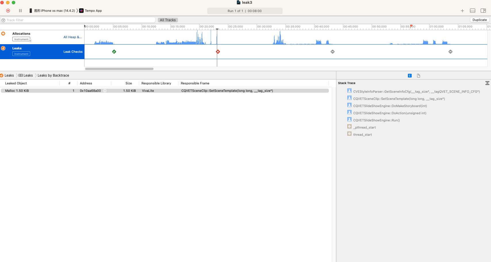

## 内存检测工具使用
### XCode Instrument
#### 内存泄漏检测
检测那些申请且已经失去引用, 但没有释放的内存.
启动内存泄漏检测: `Product` $\to$ `Profile` $\to$ `leaks`.


点击左上角按钮🔘运行程序后, 可以看到 ✅ 表示没有内存泄漏, ❌ 表示有新的内存泄漏, 点击它, 可以看到具体的泄漏代码位置. 



#### 检测不断申请且持有的内存.
除了不同的内存泄漏, 我们在写代码的时候仍然有可能有不断申请内存且持有引用, 导致内存不断上涨的情况. __此时, 我们可以关注当程序运行起来之后, 我们认为内存应该稳定的一段时间区域内, 不正常的内存的申请和持有情况.__

`Product` $\to$ `Profile` $\to$ `Allocations`.


同样将程序运行起来, 然后我们可以在区域1中选择一段时间区域. 为了方便查找内存申请的位置, 建议在3中选择`calltree`, 在区域2中选择`created&persistent`(创建且持有), `invert call tree`更方便查找内存申请的源头.


从上图区域4我们可以看到, 在这段时间区域内所申请且持有的内存.

### Visual studio
Viausl studio的`Performance Profile`也是一个特别强大的工具, 检查内存问题的一大利器.


这里只简单介绍`Memory Usage`功能, 其他强大功能可以自行探索.


测试代码:

```c++
#include <iostream>
#include <vector>
#include <thread>

struct Data
{
	int data[1000];
};

int main(int argc, char* argv[])
{
	std::vector<std::shared_ptr<Data>> datas(1000);
	for(int i=0; i<10000; ++i)
	{
		datas.emplace_back(new Data);
		std::this_thread::sleep_for(std::chrono::milliseconds(1000));
	}
	return 0;
}
```

运行之后, 在你想要做内存检查的地方`Take snapshot`.


在`Stop Collection`之后, 即可查看每个快照相对于之前快照内存的申请情况.


点开对应快照, 即可发现内存申请的位置(main函数, Data数据):
