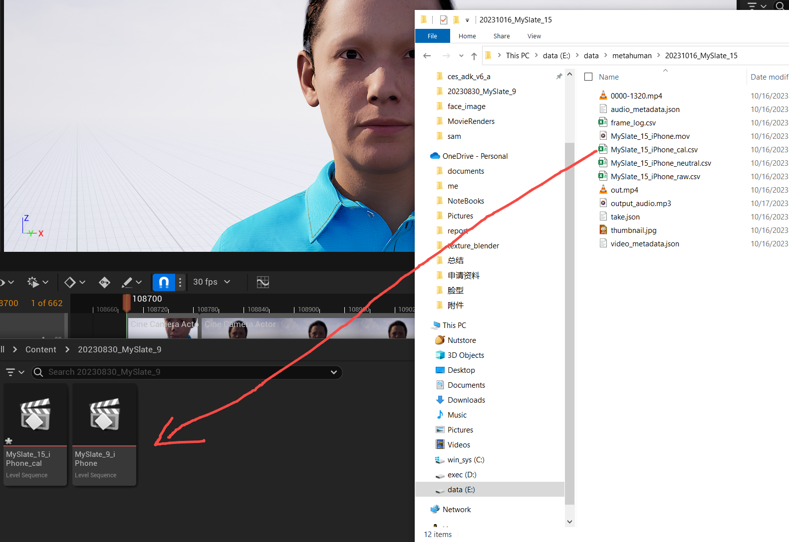
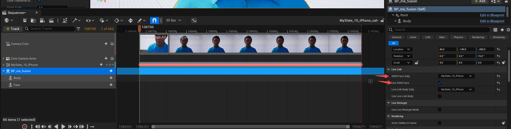
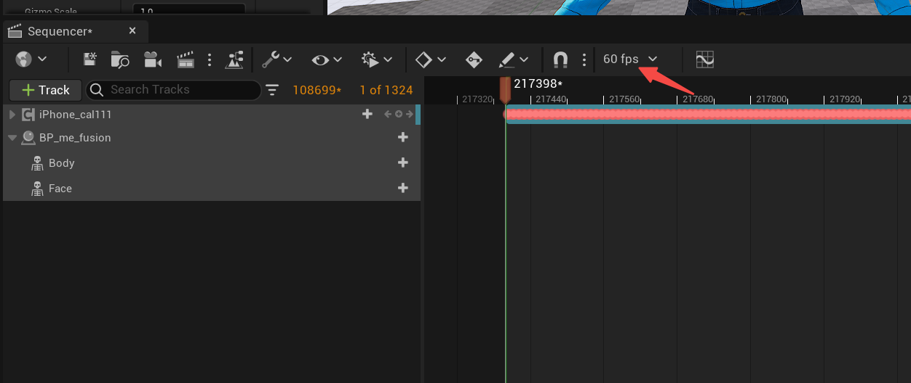

---
tags:
- cg/tools
- digital_human
---
## Pipeline
1. 开启plugin
	

2. 导入arkit录制的csv
	

3. 打开sequence, 删除原control_rig控制, 改用live link控制
	

4. arkit 默认帧率60fps
	
## Reference
[livelink importer](https://dev.to/alexdjulin/live-link-face-to-unreal-metahuman-retarget-5f9b)