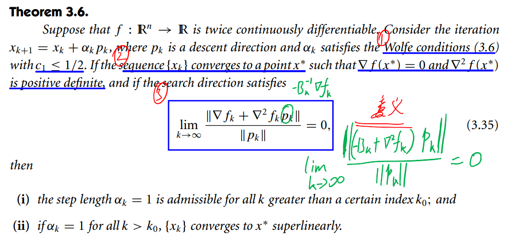

# Numerical Optimization
## 线搜索方法基本概念
线搜索方法通过迭代来进行能量优化:
$$
 x_{k+1} = x_k + \alpha_k p_k
$$
这里, $\alpha_k$是`Step Length`, $p_k$是`Direction`. 大多数情况下$p_k$可以写成如下形式:
$$
p_k = - B_k^{-1} \nabla f_k
$$
这里, $B_k$是一个对称非奇异矩阵, 在不同方法中, 以不同的方式计算. 在这里, 线搜索方法对这两个部分分别进行讨论. **这里根据$B_k$的不同分为三种方法: steepest descent method($B_k = I$), Newton's method($B_k = \mathrm{Hessian}$), quasi-Newton method(每次迭代都通过低阶公式计算一个Hessian近似值).**

### Step Length
`Step Length`的选择可分为两个步骤: ①计算目标长度所在的区间; ②在目标区间中进行折半搜索或插值确定`Step Length`的值. 为了达到好的收敛效果, 在选取`Step Length`时一般要求其满足下面条件的其中之一: `Wolfe Consitions`, `Goldstein Condition`, `Armijo Backtracking Condition`.

#### Wolfe Conditions
⭐**该条件保证了迭代具有足够大的下降(a), 并且保证(makes reasonable progress)梯度本身也有较大的变缓(b).**

$$
\left\{
\begin{aligned}
f(x_k + \alpha_k p_k) \le f(x_k) + c_1 \alpha_k \nabla f_k^T p_k \quad (a)\\
|\nabla f(x_k + \alpha_k p_k)^T p_k| \le c_2 | \nabla f_k^T p_k| \quad \quad \quad \quad \quad(b)
\end{aligned}
\right.
$$

这里$0 < c_1 < c_2 < 1$, 在实际应用中, $c_1$一般取一个很小的值, 比如$10^{-4}$.

**大部分线搜索方法均可用Wolfe Condition**.

### Goldstein conditions
**⭐Goldstein conditions保证迭代具有足够大的下降, 且$\alpha$不至于太小(makes reasonable progress)**:
$$
f(x_k)+(1-c)\alpha_k \nabla f_k^T p_k \le f(x_k + \alpha_k p_k) \le f(x_k) + c \alpha_k \nabla f_k^T p_k
$$

这里$0 < c < 1/2$(c的值越接近与0.5, 夹角越小, 条件越苛刻), 第二个不等式与Wolfe Condition相同, 保证有足够大的下降. 第一个不等式保证`Step Length`不至于太小.

>**Goldstein conditions are often used in Newton-type methods but are not well suited for quasi-Newton methods that maintain a positive definite Hessian approximation.**

### Armijo Backtracking Method
我们知道Wolfe Condition中的(a)条件是不够充分的, 除了上诉两种方法来保证makes reasonable progress之外, 也可以通过迭代的方式, 从大到小尝试, 找一个较大的`Step Length`:

**该方法适用于牛顿法, 但不适用于`quasi-Newton`和`conjugate gradient`方法**.

## 收敛性基本原理
### Convergence Theorem
**⭐只要我们提供的搜索方向不要太靠近$\nabla f$的垂直方向, 在wolfe条件下搜索就能保证$\parallel \nabla f \parallel \to 0$.**

定义$\theta_k$为搜索方向$p_k$和梯度方向$-\nabla f_k$之间的角度, 即:
$$
\cos \theta_k = \frac{- \nabla f_k^T p_k}{\parallel \nabla f_k\parallel \parallel p_k \parallel}
$$

全局收敛定理:

通过该定理的结论(Zoutendijk condition), 我们可以推断出:

$$
\cos^2 \theta \parallel \nabla f_k \parallel^2 \rightarrow 0
$$

由此, 如果在我们的方法中, 能保证the angle $\theta_k$ is bounded away from 90°, there is a positive constant $\delta$, such that

$$
\cos \theta_k \ge \delta \ge 0, \quad \mathrm{for \ all \ k}
$$

则有:

$$
\lim_{k \to \infty} \parallel \nabla f_k \parallel = 0
$$

然而, 这个条件还无法保证得到的就是一个极小值(还得排除驻点stationary points). 通过对Hessian $\nabla^2 f(x_k)$来分析**曲率**的情况, 加入附加条件, 从而使结果收敛到局部最小值. 在Newton-like方法中, 就有假设$B_k$正定, 且`condition number`有一个统一的bound:

$$
\begin{aligned}
&\parallel B_k \parallel \parallel B_k^{-1} \parallel \le M, \quad \mathrm{for \; all \; k}. \\
&\Rightarrow \cos \theta_k \ge 1/M
\end{aligned}
$$

这里, $\parallel B_k \parallel$并不是行列式(见 https://en.wikipedia.org/wiki/Condition_number). 有:
$$
\cos \theta_k = \frac{\nabla f_k^T B_k^{-1}\nabla f_k}{\parallel \nabla f_k \parallel \parallel B_k^{-1} \nabla f_k \parallel}
$$

### Convergence Rate
最速下降法和牛顿法各有优略. 最速下降能够保证全局收敛, 但在实际应用中速度太慢. 对于牛顿法, 若是初始值离求解目标很近, 则收敛速度非常快, 但当里求解目标较远时, 连搜索方向能够使得能量下降都无法保证.

对一个理想的二阶函数$f(x) = \frac{1}{2}x^T Q x - b x$做收敛分析(这里$Q$对称正定). 
#### 最速下降法


扩展到任意函数:


#### 牛顿法
由于Hessian $\nabla^2 f$不总是正定的, 牛顿迭代$p_k = -\nabla^2 f^{-1} \nabla f$, 可能不是一个下降的方向, 需要对Hessian做一定修改. 这里分析在解附近牛顿法的收敛情况.


### Quasi-Newton法
两个结论:
① 若是quasi-Newton法的搜索方向能够很好的近似牛顿法的方向, 那么$\alpha = 1$可以满足wolfe condition并最终收敛到目标解.
② 搜索方向若能够满足下面的条件, 便能够达到超线性收敛.

若$c_1 > 1/2$, 则线搜索方法会将二次函数的最小值排除在外, 且单位步长可能不被允许.

根据quasi-Newton法$p_k = -B_k^{-1} \nabla f_k$, 则:

$$
\begin{aligned}
&\lim_{k \to \infin} \frac{\parallel \nabla f_k - \nabla^2 f_k p_k \parallel}{\parallel p_k \parallel} = 0\\
\Leftrightarrow &\lim_{k \to \infin} \frac{\parallel B_k(-B_k^{-1} \nabla f_k) - \nabla^2 f(x^*)p_k \parallel}{\parallel p_k \parallel} = 0 \\
\Leftrightarrow &\lim_{k \to \infin} \frac{\parallel (B_k - \nabla^2 f(x^*))p_k \parallel}{\parallel p_k \parallel} = 0
\end{aligned}
$$

要达到收敛, 不需要$B_k \to \nabla^2 f(x^*)$, 只需要$(B_k - \nabla^2 f(x^*))p_k \to 0$.

## Least Square Problem
最小二乘问题的目标函数定义如下:

$$
f(x) = \frac{1}{2} \sum_{j=1}^m r_j^2(x)
$$

这里$r_j$是一个$\mathbb{R}^n \to \mathbb{R}$光滑的函数, 残差函数$\mathbf{r}$也可定义为一个$\mathbb{R}^n \to \mathbb{R}^m$的函数:

$$
\begin{aligned}
\mathbf{r} (x) &= [ r_1(x), r_2(x), ..., r_m(x) ]^T \\
f(x) &= \frac{1}{2}\mathbf{r}^T \mathbf{r}
\end{aligned}
$$

残差函数$\mathbb{r}(x)$的Jacobian:

$$
J(x) = \begin{bmatrix}
\nabla r_1^T \\
\nabla r_2^T \\
... \\
\nabla r_m^T \\
\end{bmatrix}
$$

目标函数的Jacobian和Hessian:

$$
\begin{aligned}
\nabla f(x) &= \mathbf{r}(x)^T J(x) \\
\nabla^2 f(x) &= J^T J + \sum_{j=1}^m r_j \nabla^2 r_j
\end{aligned}
$$


### Gauss-Newton Method
#### 根据线搜索方法+牛顿法来解释
使用近似的Hessian: $\nabla^2 f_k \approx J_k^T J_k$, 则有:

$$
J_k^T J_k p_k^{GN} = -J_k^T r_k
$$

高斯牛顿法的4个特点:
1. 节省了计算$\nabla^2 \mathbf{r}$的麻烦
2. 在很多时候$J^T J$会主导$\nabla^2 f$, 且在主导情况下($J^T J \to \nabla^2 f$), 收敛率和牛顿法一样好.
    主导的意思: $|r_j(x) | \parallel \nabla^2 r_j(x) \parallel$ 远远小于$J^TJ$的特征值.
    当$r_j$很小, 或者近似很好的时候.
3. $p^{GN}$一直是一个下降的方向: $p_k^{GN} \nabla f_k \le 0$.
4. 实际上高斯牛顿法优化的残差是该残差的局部线性化近似.

#### 另一种解释
高斯牛顿法在牛顿法的基础之上修改得到,避免了Hessian的计算, 仅适用于最小二乘问题. 在高斯牛顿法中, 将$r_j(x)$进行一阶展开:

$$
r_j(x+\Delta x) \approx r_j(x) + J(x) \Delta x
$$

从而问题变为: 寻找下降矢量$\Delta x$, 使得$\frac{1}{2} \sum_{j=1}^m r_j^2(x+\Delta x)$达到最小:

$$
\Delta x^* = \argmin_{\Delta x} \frac{1}{2} \sum_{j=1}^m r_j^2(x+\Delta x)
$$

将$\frac{1}{2}r_j^2(x+\Delta x)$对$x$求导, 并另其导数等于0, 可得:

$$
J^T(x) J(x) \Delta x = -J(x)^T r_j(x)
$$

从而构建出:

$$
H \Delta x = g
$$

这里$H = \sum_j J_j^TJ_j$, 而$g = \sum_j -J_j r_j$

#### Gauss-Newton法的收敛率


### Levenberg-Marquadt Method


#### Question
* $p_k^N = -\nabla^2 f_k^{-1} \nabla f_k$是怎么来的(N表示Newton).
对于纯的牛顿迭代: $x_{k+1} = x_k + p_k^N$, 则$\nabla f(x_{k+1}) = \nabla f(x_k - \nabla^2 f_k^{-1} \nabla f_k) \approx \nabla f_k - \nabla^2 f(\nabla^2 f_k^{-1} \nabla f_k) = 0$
* Hessian非正定意味着什么
    https://www.zhihu.com/question/265784697
* Why Newton's Method? And Why Quasi-Newton Method? + 梯度下降三者之间的比较.
    https://www.zhihu.com/question/19723347

#### Direction $p_k$ Calculation
* basic newton's method
* quasi-newton's method
* hessian modification

## TODO
Cholesky factorization, QR, cholmod, ipopt

## Optimization Source Code Analysis
### Eigen::LevenbergMarquardt
```c++
LevenbergMarquardt<FunctorType,Scalar>::minimizeOneStep(FVectorType  &x)
{
    
}
```

## Others
### Hubber Norm
对residual加Huber Norm:
$$
\rho_H(e) = \left\{
    \begin{aligned}
    &\frac{1}{2} e^2 &\quad \mathrm{for} \; |e| \le k\\
    &k|e| - \frac{1}{2}k^2 &\quad \mathrm{for} \; |e| \gt k
    \end{aligned}
    \right.
$$

使用权重的方式:
$$
w_H(e) = \left\{
    \begin{aligned}
    &1 &\quad \mathrm{for} \; |e| \le k\\
    &k/|e| &\quad \mathrm{for} \; |e| \gt k
    \end{aligned}
    \right.
$$

两种方式等价:
$$
w_H(e) \times (2 - w_H(e)) \times e^2 = 2 \times \rho_H(e) = \left\{
    \begin{aligned}
    &e^2 \quad &\mathrm{for} \; |e| \le k\\
    &2k|e| - k^2 \quad &\mathrm{for} \; |e| > k 
    \end{aligned}
    \right.
$$

又有$\min 2k|e| - k^2 \Leftrightarrow \min 2k|e|$, 因此$J' = \sqrt{w_H(e)} J$.