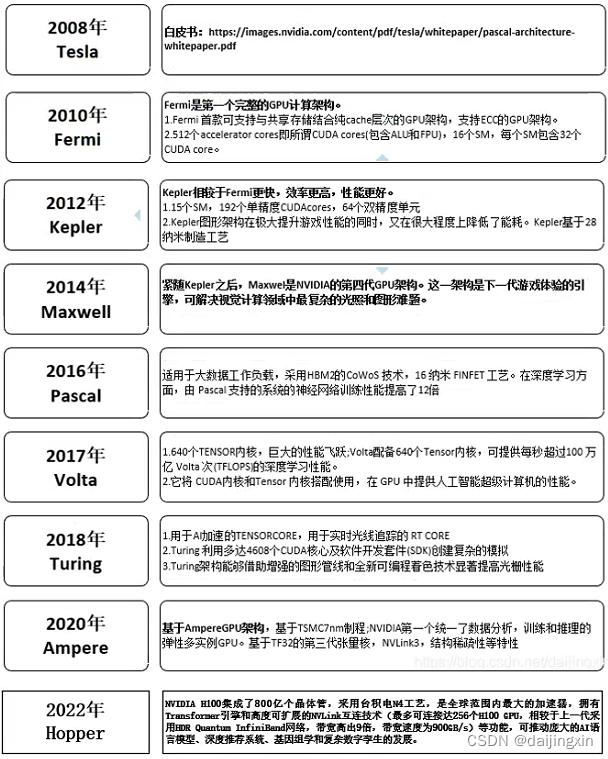

## Nvidia GPU Architecture



Pascal: GTX 10x0系列
Turing: GTX 16x0系列, GTX 20x0系列, T4(colab)
Ampere: GTX 30x0系列
Ada Lovelace: GTX40x0系列


## CUDA/cudnn/CUDA Toolkit/NVCC区别简介

* CUDA是显卡厂商NVIDIA推出的运算平台。CUDA™是一种由NVIDIA推出的通用并行计算架构，是一种并行计算平台和编程模型，该架构使GPU能够解决复杂的计算问题。CUDA英文全称是Compute Unified Device Architecture.

* CUDA Toolkit 主要包含了CUDA-C和CUDA-C++编译器(NVCC)、一些科学库和实用程序库、CUDA和library API的代码示例、和一些CUDA开发工具. 
	在linux上通过 `apt install nvidia-cuda-toolkit` 进行安装.
	根据官方文档, cuda与需要与显卡驱动相兼容(cuda用到了显卡驱动中的动态库, __若不兼容, 可能会更新驱动, 同时若更新驱动, 可能会卸载安装的cuda__). 
	从官网直接下载安装:
	```bash
	# https://developer.nvidia.com/cuda-11-5-0-download-archive?target_os=Linux&target_arch=x86_64&Distribution=Ubuntu&target_version=20.04&target_type=deb_local
	wget https://developer.download.nvidia.com/compute/cuda/repos/ubuntu2004/x86_64/cuda-ubuntu2004.pin
	sudo mv cuda-ubuntu2004.pin /etc/apt/preferences.d/cuda-repository-pin-600
	wget https://developer.download.nvidia.com/compute/cuda/11.5.0/local_installers/cuda-repo-ubuntu2004-11-5-local_11.5.0-495.29.05-1_amd64.deb
	sudo dpkg -i cuda-repo-ubuntu2004-11-5-local_11.5.0-495.29.05-1_amd64.deb
	sudo apt-key add /var/cuda-repo-ubuntu2004-11-5-local/7fa2af80.pub
	sudo apt-get update
	sudo apt-get -y install cuda
	```
* cuDNN 全称为NVIDIA CUDA® Deep Neural Network library，是NVIDIA专门针对深度神经网络中的基础操作而设计基于GPU的加速库.

*  CUDA Toolkit (Pytorch)： CUDA不完整的工具安装包，其主要包含在使用 CUDA 相关的功能时所依赖的动态链接库。不会安装驱动程序。（NVCC 是CUDA的编译器，只是 CUDA Toolkit 中的一部分）。 可通过Anaconda安装.
	在conda环境中可以独立安装 支持cuda的pytorch并不需要`nvidia-cuda-toolkit`, 其可以附带安装依赖的cuda库`envs/meingame/lib/python3.9/site-packages/nvidia/cuda_runtime/lib`中.
		```bash
		pip install torch==1.4.0+cu100 torchvision==0.5.0+cu100
		# 或者conda的方式
		conda install pytorch==1.4.0 torchvision==0.5.0 \
		cudatoolkit=10.1 -c pytorch
		```

## Reference
* [一文讲清楚CUDA、CUDA toolkit、CUDNN、NVCC关系](https://blog.csdn.net/qq_41094058/article/details/116207333)

* [NVIDA GPU架构演进(2022年更新)](https://blog.csdn.net/daijingxin/article/details/115042353)

* [一文讲清楚CUDA、CUDA toolkit、CUDNN、NVCC关系](https://blog.csdn.net/qq_41094058/article/details/116207333)

* CUDA Compatibility: 
	[官方英文版](https://docs.nvidia.com/deploy/cuda-compatibility/index.html)
	[知乎中文版](https://zhuanlan.zhihu.com/p/459431437)