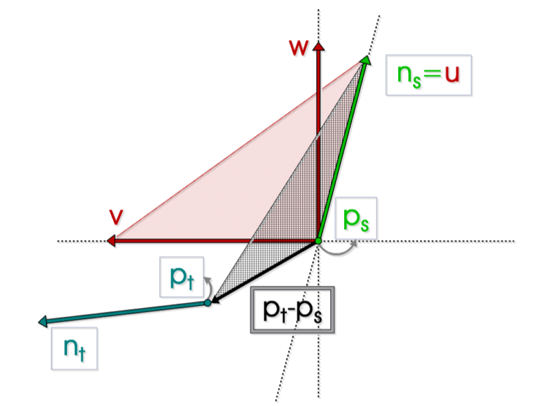
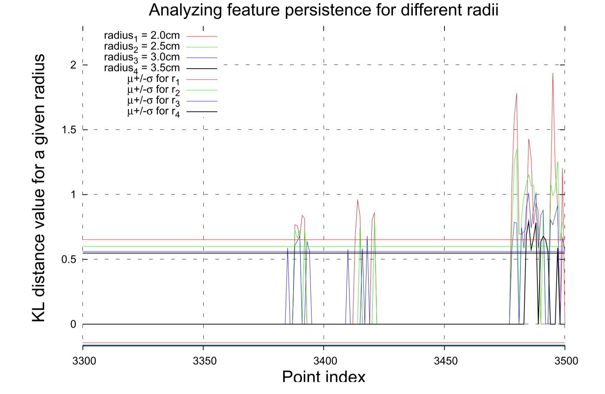
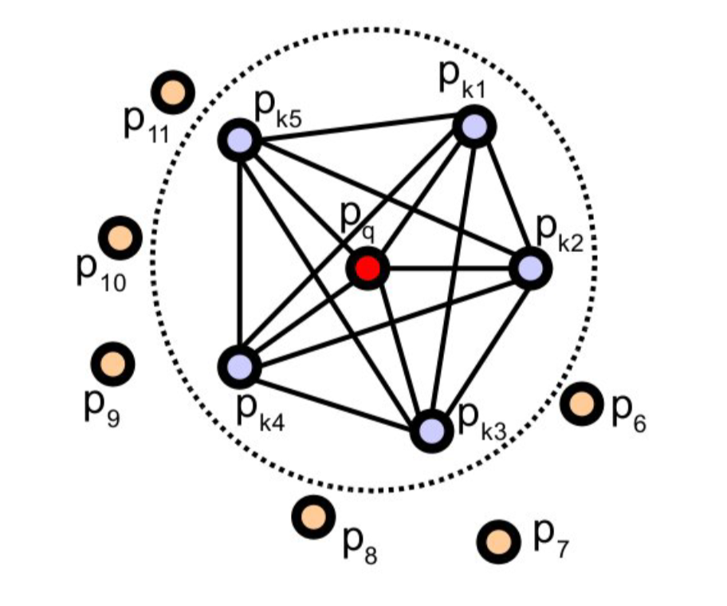
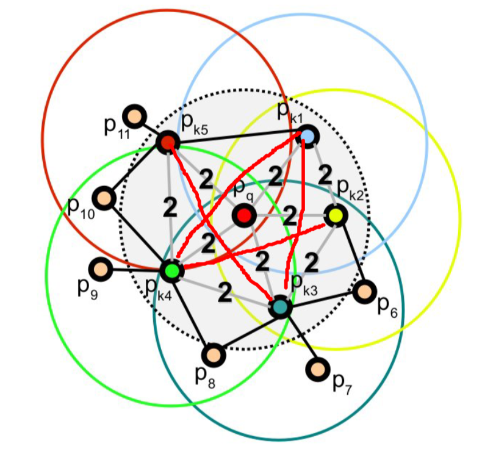
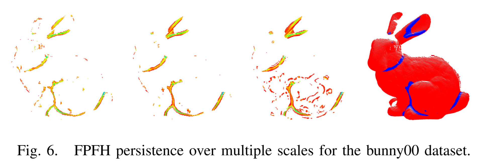
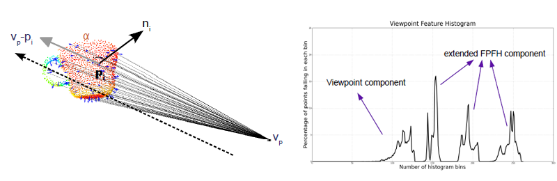
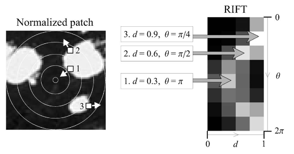
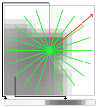
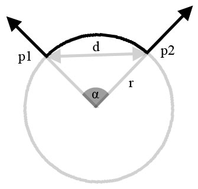
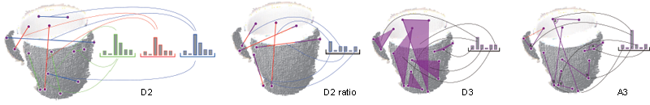

# Overview and Comparison of Features

## Introduction

This article gives an overview over all feature point algorithms implemented in PCL. The following criteria are important when describing an algorithm:

* Category: Local, regional, global
* Does it extend other known methods (e.g. _Name_ is based on Spin Images)
* Does it require a specific input format?
* High level overview so that a beginner / technical interested person understands the purpose and methodology of the algorithm(s).
* Process chain in 3 to 5 points
* Use cases

## How Features Work

See [Feature overview](http://docs.pointclouds.org/trunk/group__features.html)

## Overview Matrix

Feature Name  |  Supports Texture / Color |  Local / Global / Regional | Best Use Case
:------------:|:-------------------------:|:--------------------------:|:-------------:
PFH           | No                        |  L                         |              
FPFH          | No                        |  L                         | 2.5D Scans (Pseudo single position range images)
VFH           | No                        |  G                         | Object detection with basic pose estimation
CVFH          | No                        |  R                         | Object detection with basic pose estimation, detection of partial objects
RIFT          | Yes                       |  L                         | Real world 3D-Scans with no mirror effects. RIFT is vulnerable against flipping.
RSD           | No                        |  L                         |
NARF          | No                        |  L                         | 2.5D (Range Images) 
ESF           | No                        |  G                         |  

## PFH (Point Feature Histogram)

### 特性
* 局部特征
* 复杂度 $O(n \cdot k^2)$

### Basic Concept
根据一定半径r(大于求法向的半径)范围内的点, 计算几个局部的几何特征(描述了点云局部 __区域__ 的曲率信息). 对于点云中的任意点$p$, 对其半径r范围内的任意一组(所有)点对$p_{i}$, $p_{j}$, 计算这两个点的三个几何特征, 生成统计直方图, 选取显著特征.
1.  确定局部标架
    if $\langle n_i, p_j-p_i \rangle \le \langle n_j, p_i - p_j \rangle$
    then $p_s = p_i, p_t = p_j$
    else $p_s = p_j, p_t = p_i$

    $u = n_s, v = (p_t - p_s) \times u, w = u \times v$
    

2. 计算几何特征
$$
\begin{array}{cc}
f_1 =& \langle v, n_t \rangle \\
f_2 =& \langle u, p_t - p_s \rangle / \| p_t - p_s \| \\
f_3 =& atan(\langle w, n_t \rangle , \langle u, n_t \rangle )
\end{array}
$$

3. 生成统计直方图
有了这三个几何特征之后, 直方图可以划分为$div^3$个bins. $div$是每个特征的划分数量($s_i$是划分的range):
$$
idx = \sum_{i=1}^{i\le 3} step(s_i, f_i) \cdot div^{i-1}
$$

4. 显著特征的选取和distance metric
当我们以点云的几何特征作为整个点云的特征时, 需要抽取特征与众不同的点. 每个点的histogram与整片点云的平均histogram做比较, 选取距离超过$\mu\pm\alpha\cdot \delta$的点作为特征点. $\alpha$一般设置为1左右.
使用KL divergence作为distance metric(计算差异时给的结果较好).
$$
KL divergence = \sum_{i=1}^{div^3}(p_i^f - \mu_i) \cdot ln \frac{p_i^f}{\mu_i}
$$
为了保证鲁棒性, 根据点云的大小和密度, 在一定的区间内选取多个半径计算特征, 只有在相邻大小的两个半径上, 都突出的特征才算是显著的特征.
$$
P_f = \bigcup_{i=1}^{n-1} [P_{f_i} \cap P_{f_{i+1}}]
$$

## FPFH (Fast Point Feature Histogram)

### 特性
* 局部算子
* 算法复杂度 $O(n \cdot k)$

### Basic Concept
FPFH是PFH的提速、近似版. 为了计算某个点的PFH特征, 我们需要对其半径r范围内的点两两组合, 计算特征.

FPFH算法中, 不再计算这些两两组合的特征. 而是计算每个点和其neighbor之间的特征, 然后通过这些特征的组合来近似PFH.

$$
FPFH(p) = SPF(p) + \frac{1}{k}\sum_{i=1}^k \frac{1}{\omega_k} \cdot SPF(p_k)
$$

这里$SPF(p)$即PFH中的几何特征${f_1, f_2, f_3}$. 对比FPFH和PFH可以发现: 对于同一点$p_q$, FPFH少了一些点对组合(红线相连的点对), 并且引入了距离r之外的点对. 因此FPFH相对于PFH效果要差些.

## VFH (Viewpoint Feature Histogram)

### Category:
* Global

### Extends:
The VFH extends the Fast Point Feature Histogram (FPFH).

### Input Format
* A point cloud consisting of a set of oriented points _P_. Oriented means that all points have a normal _n_. 
* **This feature does not make use of color information.**

### How it works:
* Calculate the centroid _pc_ of the point cloud and its normal _nc_. Calculate the vector between the viewpoint and the centroid _vc_ and normalize it.
* The VFH consists of two components: A viewpoint component and an extended FPFH component.
* To map the viewpoint component iterate over all points in _P_ and calculate the angle between their normal and _vc_. Increment the corresponding histogram bin.
* For the extended FPFH component simply calculate the FPFH at the centroid _pc_ setting the entire surrounding point cloud _P_ as neighbours.
* Add the two histograms together.
* For further details on the feature calculation see the original paper: http://www.willowgarage.com/sites/default/files/Rusu10IROS.pdf

### Short Overview
1. Estimate the centroid and its normal in the point cloud. Calculate the normalized vector _vc_ between the viewpoint and the viewpoint.
2. For all points calculate the angle between their normal and _vc_.
3. Estimate the FPFH signature for the centroid with all remaining points set as neighbours.

## CVFH (Clustered Viewpoint Feature Histogram)

### Category:
* Regional

### Extends:
The CVFH extends the Viewpoint Point Feature Histogram (VFH).

### Input Format
* A point cloud consisting of a set of oriented points _P_. Oriented means that all points have a normal _n_. 
* **This feature does not make use of color information.**

### How it works:
* The result of computing the point and normal centroid for the entire cloud can be entirely different once points are missing due to occlusion and sensor limitations. That's why VFH descriptors turn out entirely different once essential points are missing from a cloud.
* CVFH creates stable regions (clusters). From the point cloud _P_ a new cluster _Ci_ is started from a random point _Pr_ that hasn't been assigned to any cluster yet. Every point _Pi_ in _P_ is assigned to that cluster if there exists a point _Pj_ in _Ci_ so that their normals are similiar and they are in a direct neighbourhood (compare angle and distance thresholds). Clusters with too few points are rejected.
* Compute the VFH on each cluster.
* Add a shape distribution quotient to each histogram that expresses how the points are distributed around the centroid.
* For further details on the feature calculation see the original paper: http://ieeexplore.ieee.org/xpl/articleDetails.jsp?arnumber=6130296

### Short Overview
1. Subdivide the point cloud into clusters (stable regions) of neighbouring points with similiar normals.
2. Calculate the VFH for each cluster.
3. Add the shape distribution component (SDC) to each histogram.

## RIFT (Rotation-Invariant Feature Transform)

### Category:
* Local

### Extends:
The RIFT feature extends SIFT (Lowe). 
* Object recognition from local scale-invariant features (http://ieeexplore.ieee.org/xpls/abs_all.jsp?arnumber=790410&tag=1)

### Input Format
* A point cloud consisting of a set of textured points _P_. Without textures this feature will not produce any usable results.
* Intensity Gradients: http://docs.pointclouds.org/trunk/classpcl_1_1_intensity_gradient_estimation.html

### How it works:
* Iterate over points in the point cloud _P_. 
* For every point _Pi_ (_i_ is the iteration index) in the input cloud all neighbouring points within a sphere around _Pi_ with the radius _r_ are collected. This set is called _Pik_ (_k_ for _k_ neighbours)
* An imaginary circle with _n_ segments (the projection of the sphere perpendicular to the normal of _Pi_) is fitted to the surface. Here _n_ corresponds to the number of distance bins in the implementation.
* All neighbours of _Pi_ are assigned to a histogram bin according to their distance _d_ < _n_ and gradient angle position _theta_ < _g_ (g denotes the number of gradient bins in the implementation). Theta is the angle between the gradient direction and the vector pointing outwards the circle from the center. 
* For further details on the feature calculation see the original paper: http://hal.inria.fr/docs/00/54/85/30/PDF/lana_pami_final.pdf

### Short Overview
1. For each point _Pi_ in _P_ sample all k neighbours around _Pi_.
2. Assign all neighbours to a histogram according to their distance d and their gradient angle theta. 
3. The resulting set of histograms can be compared to those of other point clouds in order to find correspondences.

## NARF (Normal Aligned Radial Feature)

### Category:
* Local

### Extends:
The NARF feature extends a few concepts of SIFT (Lowe). 
* Object recognition from local scale-invariant features (http://ieeexplore.ieee.org/xpls/abs_all.jsp?arnumber=790410&tag=1)

### Input Format
* A range image _RI_ of a scene.
* NARF is not only a descriptor but also a detector. You might want to run the interest point detector over the data set first: http://docs.pointclouds.org/trunk/classpcl_1_1_narf_keypoint.html

### How it works:
* Iterate over all interest points in the range image _RI_.
* For each point _Pi_ create a small image patch by looking at it along its normal. The normal is the Z-axis of the image patch's local coordinate system where _Pi_ is at (0,0). The Y-axis is the world coordinate system Y-Axis. The X-axis aligns accordingly. All neighbours within the radius _r_ around _Pi_ are transfered into this local coordinate system.
* A star pattern with _n_ beams is projected on the image patch. For each beam a score in [-0.5,0.5] is calculated. Beams have a high score if there are lots of intensity changes in the cells lying under the beam. This is calculated by comparing each cell with the next adjacent one. Additionally cells closer to the center contribute to the score with a higher weight (2 in the middle, 1 at the edge).
* Finally the dominant orientation of the patch is calculated to make it invariant against rotations around the normal.
* For further details on the feature calculation see the original paper: https://www.willowgarage.com/sites/default/files/icra2011_3dfeatures.pdf

### Short Overview
1. For each keypoint _Pi_ in _RI_ sample all neighbours around _Pi_ and transform them into a local coordinate system with _Pi_ being at _O_
2. Project a star pattern on the image patch and count the intensity changes under each beam to get the beam's score. In the calculation beams closer to the center have more weight. The scores are normalized to [-0.5,0.5]. 
3. Iterate over all beams and find the dominant orientation of the image patch.

## RSD (Radius-based Surface Descriptor)

### Category:
* Local

### Extends:
* --

### Input Format
* A point cloud consisting of a set of oriented points _P_. Oriented means that all points have a normal _n_. 
* **This feature does not make use of color information.**

### How it works (TODO: How exactly are those features being compared?):
* Iterate over points in the point cloud _P_. 
* For every point _Pi_ (_i_ is the iteration index) in the input cloud all neighbouring points within a sphere around _Pi_ with the radius _r_ are collected. This set is called _Pik_ (_k_ for _k_ neighbours)
* For each neighbour _Pikj_ in _Pik_ the distance between _Pi_ and _Pikj_ and the angle between their normals is calculated. These values are assigned to a histogram that characterizes the curvature at the point _Pi_. 
* Using these values an imaginary circle with an approximated radius _rc_ can be fitted through the two points (see image). Note that the radius becomes infinite when the two points are located on a plane.
* As the query point _Pi_ can be part of multiple circles with its neighbours only the minimum and the maximum radius are kept and assigned to _Pi_ as output. The algorithm accepts a maximum radius paramteter above which points will be considered as planar.

### Short Overview
1. For each point _Pi_ in _P_ sample all k neighbours around _Pi_.
2. Assign all neighbours to a histogram according to their distance d and their undirected normal's angle. 
3. Assume that pairs of _Pi_ with each of its neighbours describe a circle (see image). Find the minimum and maximum radius of all the spheres _Pi_ describes with its neigbours. 
4. The resulting set of histograms and the radii can be compared to those of other point clouds in order to find correspondences.

## ESF (Ensemble of Shape Functions)

### Category:
* Local

### Extends:
* A3, D2, D3 shape description functions: Matching 3D Models with Shape Distributions (Osada et. al.)
* D2 improvements (IN, OUT, MIXED): Using Shape Distributions to Compare Solid Models (Ip et. al.)

### Input Format
* A point cloud consisting of a set of points P.
* **This feature does not make use of color information.**

### How it works:
* Start a loop that will sample 20,000 points from the point cloud _P_.
* Every iteration samples three random points _Pri_, _Prj_, _Prk_.
* **D2:** For the D2 function calculate the distance between _Pri_ and _Prj_. Then check if the line connecting the two points lies entirely on the surface (IN), outside the surface (OUT) or both (MIXED). Increment one of D2's subhistograms (either IN, OUT or MIXED) at the previously calculated distance bin. As three points were sampled, two other distances can be calculated in this iteration.
* **D2 ratio:** There is another histogram that captures the ratio between parts of each line lying on the surface and in free space.
* **D3:** For the D3 function calculate the square root of the area of the triangle between _Pri_, _Prj_ and _Prk_. This is done equivalent to D2 as the area is also classified into IN, OUT and MIXED. Increment the corresponding histogram bins of the D3 histogram.
* **A3:** For the A3 function calculate the angle between the three points. Again this function is classified into IN, OUT and MIXED. This time the line opposite to the angle is used. Increment the corresponding A3 histogram bin.
* At the end of the loop we end up with a global descriptor containing 10 subhistograms (64 bins each): D2 (IN, OUT, MIXED, ratio), D3 (IN, OUT, MIXED), A3 (IN, OUT, MIXED).
* Read the entire paper for more information: http://ieeexplore.ieee.org/xpl/articleDetails.jsp?arnumber=6181760

### Short Overview
1. Start a loop that randomly samples 20,000 points from the point cloud P. Each round sample three points Pri, Prj, Prk.
2. For pairs of two points calculate the distance between each other and check if the line between the two lies on the surface, outside or intersects the object (IN, OUT or MIXED). Increment the bin corresponding to the calculated distance in one of D2's three subhistograms.
3. For the previous line find the ratio between parts of that line lying on the surface or outside. The result should be 0 for entirely outside, 1 for entirely on the surface and all values from MIXED lines are distributed in between. Increment the corresponding bin of the D2 ratio histogram.
4. For triplets of points build a triangle and calculate the angle between two sides and classify the side of the angle's opposite of the triangle (IN, OUT, MIXED). Increment the corresponding angle bin in either the IN, OUT or MIXED subhistogram of A3.
5. For the previous triangle calculate the square root of the area and classify the area into IN, OUT or MIXED. Increment the corresponding area bin in either the IN, OUT or MIXED subhistogram of D3.