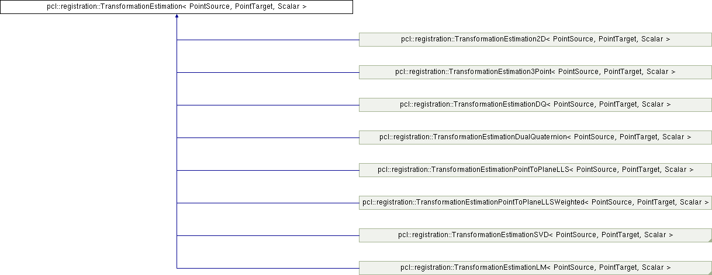

# ICP In PCL
## Pipline
1) Selection: The sampling of the input point clouds.
   ```c++
   // sampling 
   PointCloud<int> indices; UniformSampling<PointT> uniform_sampling; 
   uniform_sampling.setInputCloud (cloud);
   uniform_sampling.setRadiusSearch (0.05f);
   uniform_sampling.compute (indices);
   ```
2) Matching: Estimating the correspondences between the points in the subsampled point clouds.
   ```c++
   #include <pcl/registration/correspondence_estimation.h> (...)
   CorrespondencesPtr corresps(new Correspondences);
   CorrespondenceEstimation<PointT, PointT> est;
   est.setInputSource (source_cloud);
   est.setInputTarget (target_cloud);
   est.determineCorrespondences (*corresps, max_dist);
   ```
3) Rejection: Filtering the correspondences to reduce the number of outliers.
   ```c++
   #include <pcl/registration/ correspondence_rejection_distance.h> (...)
   CorrespondenceRejectorDistance rejector;
   rejector.setInputSource<PointT> (cloud_src);
   rejector.setInputTarget<PointT> (cloud_tgt);
   rejector.setInputCorrespondences (corresps_in);
   rejector.setMaximumDistance (max_dist);
   rejector.getCorrespondences (corresps_filtered);
   ```
4) Alignment: Assigning an error metric, and minimizing it to find the optimal transformation.
   ```c++
   #include <pcl/registration/ transformation_estimation_point_to_plane_weighted.h> (...)
   TransformationEstimationPointToPlaneWeighted <PointXYZ, PointXYZ, double> te;
   te.setWeights (correspondence_weights);
   te.estimateRigidTransformation (*cloud_src, *cloud_tgt, *corresps_filtered, transform);
   ```

5) Termination criteria: termination criteria for the transformation refinement process.
   ```c++
   #include <pcl/registration/default_convergence_criteria.h> (...)
   DefaultConvergenceCriteria<double> conv_crit (iteration, transform, *correspondences);
   conv_crit.setMaximumIterations (30);
   conv_crit.setMaximumIterationsSimilarTransforms (3);
   conv_crit.setTranslationThreshold (5e-3);
   conv_crit.setRotationThreshold (cos (0.5 * M_PI / 180.0));
   conv_crit.setRelativeMSE (0.01);
   do { (... ICP iterations ...) } 
   while (!conv_crit.hasConverged ())
   ConvergenceState why_conv = conv_crit.getConvergenceState ();
   ```

## Usage Example
```c++
// TODO set terminanation criteria

// Align
pcl::IterativeClosestPointNonLinear<PointNormalT, PointNormalT> reg;
reg.setTransformationEpsilon (1e-6);
// Set the maximum distance between two correspondences (src<->tgt) to 10cm
// Note: adjust this based on the size of your datasets
reg.setMaxCorrespondenceDistance (0.1);  
// Set the point representation
reg.setPointRepresentation (boost::make_shared<const MyPointRepresentation>(point_representation));
reg.setCorrespondenceEstimation (est);
reg.addCorrespondenceRejector (rejector);

auto conv_crit = reg.getConvergeCriteria();
// do seting for conv_crit

reg.setInputSource (points_with_normals_src);
reg.setInputTarget (points_with_normals_tgt);
//
// Run the same optimization in a loop and visualize the results
Eigen::Matrix4f Ti = Eigen::Matrix4f::Identity (), prev, targetToSource;
PointCloudWithNormals::Ptr reg_result = points_with_normals_src;
reg.setMaximumIterations (2);
for (int i = 0; i < 30; ++i)
{
  // save cloud for visualization purpose
  points_with_normals_src = reg_result;
  // Estimate
  reg.setInputSource (points_with_normals_src);
  reg.align (*reg_result);
  //accumulate transformation between each Iteration
  Ti = reg.getFinalTransformation () * Ti;
}
```
## Pcl Icp Inheritance


## Implementation Details
The align method
```c++
template <typename PointSource, typename PointTarget, typename Scalar> inline void
pcl::Registration<PointSource, PointTarget, Scalar>::align (PointCloudSource &output, const Matrix4& guess)
{
  // init correspondence_estimation_
  if (!initCompute ()) 
    return;
  // ...
  // The most important function here
  computeTransformation (output, guess);
  // ...
}
```
The computeTransform
```c++
pcl::IterativeClosestPoint<PointSource, PointTarget, Scalar>::computeTransformation (
    PointCloudSource &output, const Matrix4 &guess)
{
    // Estimate correspondences
    if (use_reciprocal_correspondence_)
      correspondence_estimation_->determineReciprocalCorrespondences (*correspondences_, corr_dist_threshold_);
    else
      correspondence_estimation_->determineCorrespondences (*correspondences_, corr_dist_threshold_);
    for (size_t i = 0; i < correspondence_rejectors_.size (); ++i) { ... }
    // Estimate the transform
    transformation_estimation_->estimateRigidTransformation (*input_transformed, *target_,
        *correspondences_, transformation_);
}
```
Gradient and Optimization
PCL中无法加kernel, pcl nonlinearicp 使用了Eigen::LM optimizer, 使用numerical df 计算gradient.
关于优化部分的知识, 参考numerical_optimization.md.

### Transformation Estimation
Inheritance



可分为两种Error metric:
$$
\begin{aligned}
E_{point-to-point}(T) &= \sum_{k=1}^{N} w_k || T p_k - q_k ||^2 \\
E_{point-to-plane}(T) &= \sum_{k=1}^{N} w_k ((T p_k - q_k) \cdot n_{q_k})^2
\end{aligned}
$$

#### Closed-form solution of absolute orientation using unit quaternions
定义两片需要计算相对位置关系的点云分别为$\{r_{l,i}\}$和$\{r_{r,i}\}$. 则有:
$$
  r_r = sR(r_l)+r_0
$$
从而有:
$$
e_i = r_{r,i} - sR(r_{l,i}) - r_0
$$
1. 去中心化, 将两边的中心都移动到原点:
$$
\begin{aligned}
  r_{l,i}' = r_{l,i} - \frac{1}{n}\sum_{i=1}^n r_{l_i} \\
  r_{r,i}' = r_{r,i} - \frac{1}{n}\sum_{i=1}^n r_{r_i} \\
\end{aligned}
$$
经过计算可以得到我们需要最小化的能量等价于最小化如下能量(能量不相等, 但最小化等价):
$$
\sum_{i=1}^n ||r_{r,i}' - sR(r_{l,i}')||^2
$$

2. 能量的展开分解和scale的计算
展开能量, 我们有:
$$
\sum_{i=1}^n ||r_{r,i}'||^2 - 2s\sum_{i=1}^nr_{r,l}' \cdot R(r_{l,i}') + s^2 \sum_{i=1}^n ||r_{r,i}'||^2
$$
也可以表示为:$S_r - 2sD + s^2S_l$, 配方有:
$$
(s\sqrt{S_l} - D/\sqrt{S_l})^2 + (S_rS_l - D^2)/S_l
$$
从而有:
$$
s = \sum_{i=1}^n r_{r,i}' \cdot R(r_{l,i}') / \sum_{i=1}^n ||r_{l,i}'||^2
$$
出于对称和计算的考虑, 改变能量的表示:
$$
e_i = \frac{1}{\sqrt s} r_{r,i}'- \sqrt{s} R(r_{l,i}')
$$
从而有:$\frac{1}{s}S_r - 2D + sS_l$, 即: $(\sqrt{s}S_l - \frac{1}{\sqrt s}S_r) + 2 (S_lS_r - D)$, 相应的有:
$$
s = (\sum_{i=1}^n ||r_{l,i}'||^2 / \sum_{i=1}^n ||r_{r,i}'||^2)^{0.5}
$$
直观理解:旋转不改变模长, 因此scale可以以这种方式计算得到.
最小化该能量也即最大化:
$$
\sum_{i=1}^n r_{r,i}' \cdot R(r_{l,i}')
$$

3. Rotation的计算
将R转为四元素表示则有
$$
\sum_{i=1}^n r_{r,i}' \cdot R(r_{l,i}') = \sum_{i=1}^n (\dot{q} \dot{r}'_{l,i} \dot{q}^*) \cdot \dot{r}_{r,i}'
$$
这里$r=[0 \: x \: y \: z]$, 根据四元素的性质, 我们有:
$$
\sum_{i=1}^n (\dot{q} \dot{r}'_{l,i} \dot{q}^*) \cdot \dot{r}_{r,i}' = \sum_{i=1}^n (\dot{q} \dot{r}_{l,i}') \cdot (\dot{r}_{r,i}' \dot{q})
$$
定义
$$
\begin{aligned}
\dot{q} \dot{r}_{l,i}' = \bar{R}_{l,i} \dot{q} \\
\dot{r}_{r,i}' \dot{q} = \hat{R}_{r,i} \dot{q}
\end{aligned}
$$
则有:
$$
\begin{aligned}
 \sum_{i=1}^n (\dot{q} \dot{r}_{l,i}') \cdot (\dot{r}_{r,i}' \dot{q})
 &= \sum_{i=1}^n \dot{q}^T \bar{R}_{l,i}^T \hat{R}_{r,i} \dot{q}\\
 &= \dot{q}^T (\sum_{i=1}^n N_i) \dot{q}\\
 &= \dot{q}^T N \dot{q}
\end{aligned}
$$
> It is easy to verify that each of the $N_i$ natrices is symmetric, so N must also be symmetric (as $r_0 = 0$, $\bar{R}_{l,i}$ and $\hat{R}_{r,i}$ is antisymmetric matrix).

接下来的求解与PCA类似, $\dot{q}^T$为单位向量, 因为$N$为对称矩阵, 故可以分解为:$N = UDU^T$， 这里$U$是由eigen vector组成的正交阵. 从而有单位阵$u = U^T \dot{q}$, 从而:
$$
\dot{q}^T N \dot{q} = u^TDu
$$
由此可知当$\dot{q}$为$N$的最大eigen vector时取最大值.

#### 优化的方法
之所以提出优化的方法, 是因为二次的Error Metric并不够鲁棒, 除了优化Correspondences(使用RANSIC或一些其他方法移除错误的Correspondences), 还可以使用非线性的Error Metric, 来提高ICP的鲁棒性. 若使用非线性的Error Metric, 将无法再使用直接的方法求解Transform, 需要用到优化.
>Many attempts have been made to widen the basin of convergence of the ICP algorithm, and these largely amount to introducing robust estimation. This is difficult with standard ICP, as no closed-form robust estimate of the T step is known, so authors have used either a nonlinear or RANSAC-based estimator [26, 18, 22], or exclude (Winsorise) points with large errors at the C step [3]. —— Robust Registration of 2D and 3D Point Sets

##### LMICP
给定两个点云集合, 标记为: $\{m_i\}_{i=1}^{N_m}$和$\{d_i\}_{i=1}^{N_d}$, 配准的最优化Error定义为:
$$
E(a, \phi) = \sum_{i=1}^{N_d} w_i \epsilon^2(|m_{\phi (i)} - T(\mathbf{a};\mathbf{d_i})|)
$$
这里, $w_i$表示权重, $T(a;d_i)$表示对$d_i$应用变换$a$. $\epsilon^2(|x|)$是`error function`. 常用的有:
$$
\begin{aligned}
Lorentzian: \quad \epsilon(r) = \log(1+\frac{r^2}{\sigma}) \\
Huber: \epsilon(r) = \left\{
\begin{array}{lr}
r^2 \quad \quad & r < \sigma \\
2\sigma |r| - \sigma^2  & \mathrm{otherwise}
\end{array}
   \right.
\end{aligned}
$$

一般的ICP类算法, $\phi(i)$选取与相互间距离最小的点即:
$$
E(a) = \sum_{i=1}^{N_d} w_i \min_j \epsilon^2(|m_j - T(\mathbf{a};\mathbf{d_i})|)
$$
为了方便表示, 我们定义:
$$
E(a) = \sum_{i=1}^{N_d} E_i^2(a), \quad E_i(a) = \sqrt{w_i} \min_j \epsilon(|m_j - T(\mathbf{a};\mathbf{d_i})|)
$$
定义向量$\mathbf{e(a)} = \{E_i(a)\}_{i=1}^{N_d}$, 从而有$E(a)=||\mathbf{e(a)}||^2$
Levenberg-Marquardt算法, 是gradient descent 和 Gauss-Newton算法的结合. 使用迭代的方法优化Error, 假设当前的估计是$a_k$, 那么我们要求一个$a_{k+1}$使得误差$E(a)$减小, 将$E(a+\mathrm{x})$展开有:
$$
E(a+\mathrm{x}) = E(a) + (\nabla E(a) \cdot \mathrm{x}) + \frac{1}{2!}((\nabla^2 E(a) \cdot \mathrm{x}) \cdot \mathrm{x}) + h.o.t
$$
用$\mathbf{e}$来表示, 我们有:
$$
\begin{aligned}
E(a) &= \mathbf{e}^T\mathbf{e} \\
\nabla E(a) &= 2(\nabla \mathbf{e})^T \mathbf{e} \\
\nabla^2 E(a) &= 2(\nabla^2 \mathbf{e})\mathbf{e} + 2(\nabla \mathbf{e})^T \nabla \mathbf{e}
\end{aligned}
$$
将$N_d \times p$的 Jacobian matrix $\nabla \mathbf{e}$定义为$J$ (这里J使用分步积分进行计算), $J_{ij} = \frac{\partial E_i}{\partial a_j}$, 由Gaussian-Newton approximation, 将$(\nabla^2 \mathbf{e})\mathbf{e}$忽略, 有:
$$
E(a+\mathrm{x}) \approx \mathbf{e}^T\mathbf{e} + 2\mathrm{x}^T J^T \mathbf{e} + \mathrm{x}^T J^T J \mathrm{x} 
$$
从而令$\nabla_\mathrm{x}E(a+\mathrm{x})= J^T\mathbf{e} + J^TJ\mathrm{x} = 0$, 有$\mathrm{x} = -(J^TJ)^{-1}J^T\mathbf{e}$. 
而对于gradient descent算法可以得出$\mathrm{x}=-\lambda^{-1} J^T \mathbf{e}$. 在Levenberg-Marquardt 算法中将两者结合起来:
$$
\mathrm{x} = -(J^TJ + \lambda \mathrm{I})J^T\mathbf{e}
$$
>The art of a good Levenberg-Marquardt implementation is in tuning λ after each iteration to ensure rapid progress even where the Gauss-Newton approximations are poor. Details of such strategies may be found in [14, 17]. —— Robust Registration of 2D and 3D Point Sets

对于使用了kernel的情况:
$$
\begin{aligned}
E &= \frac{1}{2}\rho(f^T(x) f(x)) \\
g(x) &= \rho' J^T f(x) \\
H(x) &= 2 \rho'' J^Tf(x) f^T(x)J + \rho'J^TJ
\end{aligned}
$$

##### Fast ICP by distance transform
利用链导法则加入预计算, 提速求导过程. Distance transform定义为: $D(\mathrm{x}) = m_j - \mathrm{x}, \quad \min_j \parallel m_j - \mathrm{x} \parallel$. 从而令$D_\epsilon(\mathrm{x}) = \epsilon^2(|D(\mathrm{x})|)$, 我们的有:
$$
\begin{aligned}
D(\mathrm{x}) &= m_j - \mathrm{x} = m_j - T(\mathbf{a};\mathbf{d_i}) \\
D_\epsilon(\mathrm{x}) &= \epsilon^2(|D(\mathrm{x})|)
\end{aligned}
$$
Error可以表示为:
$$
E(\mathbf{a}) = \sum_{i=1}^{N_d} w_i \min_j \epsilon^2(|m_j - T(\mathbf{a};\mathbf{d_i})|) = \sum_{i=1}^{N_d} w_i \epsilon^2(|D(\mathrm{x})|) = \sum_{i=1}^{N_d} w_i D_\epsilon(\mathrm{x})
$$
从而有:
$$
\nabla_a E(\mathbf{a}) = \sum_{i=1}^{N_d}\nabla_{D(\mathrm{x})} D_\epsilon \cdot \nabla_\mathrm{x} D(\mathrm{x}) \cdot \nabla_\mathbf{a} \mathrm{x} = \sum_{i=1}^{N_d}\nabla_\mathrm{x} D_\epsilon \cdot \nabla_\mathbf{a} \mathrm{x}
$$
在实现中, 对根据需要配准的目标点云, 预计算出离散化(栅格化的方法)的$D_\epsilon(\mathrm{x})$, 并计算出其偏导$\nabla_{\mathrm{x}}D_\epsilon$, 从而加速整个迭代的过程.

## Reference
>http://www.pointclouds.org/documentation/tutorials/registration_api.php#registration-api
>Registration with the Point Cloud Library Dirk Holz, Alexandru
>https://www.cse.iitb.ac.in/~cs749/spr2017/lecs/03_points.pdf
>https://www.robots.ox.ac.uk/~cvrg/michaelmas2004/fitzgibbon01c.pdf