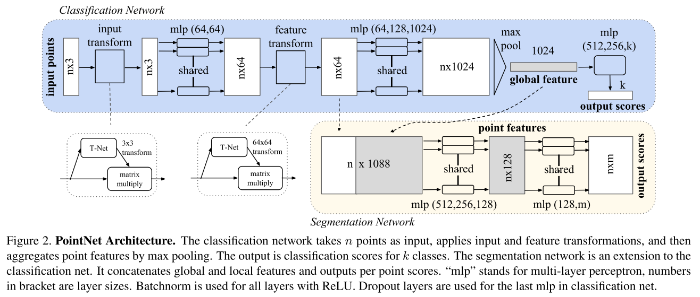

# Point Net
概述: 输入是包含n个点的三维点云（nx3) , 原始数据通过一个3D 空间变换矩阵预测网络 T-Net(3), 估计出3x3的变换矩阵T(3) 并作用在原始数据上, 实现数据的对齐. 对齐后的数据会以点为单位, 通过一个共享参数的双层感知机模型进行特征提取 . 每个点提取出64维的特征, 再通过特征空间变换矩阵预测网络 T-Net(64) 预测64x64的变换矩阵, 作用到特征上, 实现对特征的对齐. 然后继续利用三层感知机（64,128,1024）进行以特征点为单位的特征提取, 直到把特征的维度变为1024, 继而在特征空间的维度上进行Max Pooling, 提取出点云的全局特征向量. 

注: 网络的一般结构是: 提特征-特征映射-特征图压缩(降维)-全连接

第一个直接处理点云的深度学习框架, 作者提出并解决的问题: ①无序的问题. ②点云Transform的问题.
论文可分为如下几个部分进行阅读:
1. Symmetry Function for Unordered Input.
2. Local and Global Information Aggregation.

## Symmetry Function for Unordered Input
为了排除顺序对训练的影响, 作者定义了一个symmetric function, 来处理输入的点云数据.

## Reference
> https://blog.csdn.net/oliongs/article/details/82698744
> https://blog.csdn.net/qq_15332903/article/details/80224387