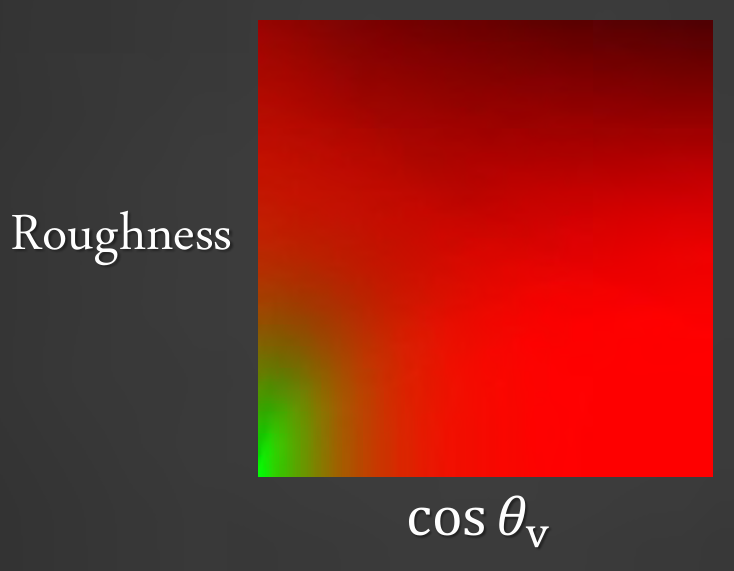

## IBL - Split Sum

$$
\begin{aligned}
\int_H L_i(l)f(l,v) \cos \theta_l d\theta_l &\approx \frac{1}{N}\sum_{k=1}^N\frac{L_i(l_k)f(l_k, v)\cos \theta_k}{p(l_k,v)}\\
&\approx \left(\frac{1}{N}\sum_{k=1}^N L_i(l_k) \right) \left(\frac{1}{N}\sum_{k=1}^N\frac{f(l_k, v)\cos \theta_k}{p(l_k, v)}\right) \\
\end{aligned}
$$

* 1st sum stored in cubemap mips
    * Pre-filter for specific roughness’s 
    * Fixed distribution, assume n = v
    * Loses stretched highlights

    $$
    \frac{1}{N}\sum_{k=1}^N L_i(l_k) \approx \mathrm{Cubemap.sample(r, mip)}
    $$

* 2nd sum stored in 2D lookup texture(LUT)
    根据$F(v,h) = F_0 + (1-F_0)(1 - v\cdot h)^5$, 有:
    
    $$
    \int_H f(l, v) \cos \theta_l d \theta_l = F_0 \int_H\frac{f(l, v)}{F(v, h)}(1 - (1-v\cdot h)^5) \cos \theta_l d \theta_l + \int_H\frac{f(l,v)}{F(v,h)}(1-v \cdot h)^5 \cos \theta_l d \theta_l
    $$
    
    这里$f(l,v) = D F G$, 在不考虑$G$的情况下, 积分只与roughness和$\cos \theta_l$有关, 可以预计算:

    $$
    \frac{1}{N}\sum_{k=1}^N\frac{f(l_k, v)\cos \theta_k}{p(l_k, v)} \approx \mathrm{LUT.r \cdot F0 + LUT.g}
    $$
    
    

Blender 中的实现
    `source\blender\draw\engines\eevee_next\shaders\eevee_lut_comp.glsl`

## reference
[基于预计算的实时环境光照(Precomputed Real-time Environment Lighting)](https://www.cnblogs.com/KillerAery/p/15335369.html)
Games 202 Lecture_05