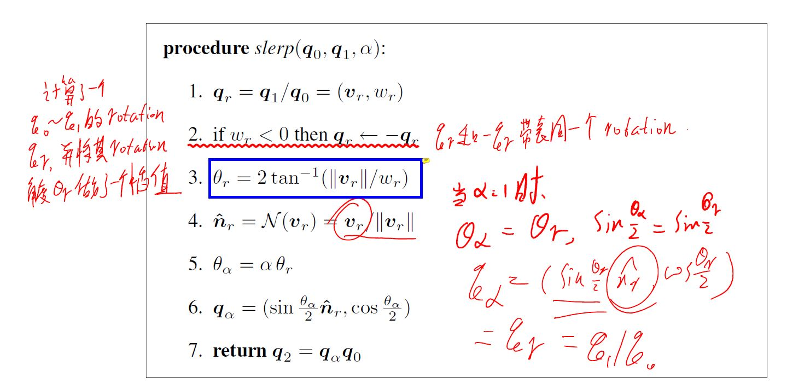

---
tag:summary/basic_theory
---
# 四元素小结
## 四元素基本概念
四元素在复数空间可以表示为:$\dot{q} = q_0 + iq_x + jq_y + kq_z$, 四元素的乘积可以表示为其各个分量的乘积, 我们定义:
$$
\begin{aligned}
    &i^2 = -1, \: \: \: j^2 = -1, \: \: \: k^2 = -1;\\
    &ij = k, \: \: \: jk = i, \: \: \: ki = j;\\
    &ji = -k, \: \: \: kj = -i, \: \: \: ik = -j;
\end{aligned}
$$

## 四元素相乘
### 乘法的定义
定义$\dot{r} = r_0 + ir_x +jr_y + kr_z$, 我们有:
$$
\begin{aligned}
\dot{r} \dot{q} &= (r_0q_0 - r_xq_x - r_yq_y - r_zq_z) \\
&+i(r_0q_x + r_xq_0+r_yq_z-r_zq_y)\\
&+j(r_0q_y - r_xq_z + r_yq_0 + r_zq_x)\\
&+k(r_0q_z + r_xq_y -r_yq_x + r_zq_0)
\end{aligned}
$$

也可以通过矩阵相乘来表示:

$$  
\dot{r} \dot{q} = \begin{bmatrix}
r_0 & -r_x & -r_y & -r_z\\
r_x & r_0 & -r_z & r_y\\
r_y & r_z & r_0 & -r_x\\
r_z & -r_y & r_x & r_0
\end{bmatrix} \dot{q} = \hat{R} \dot{q}
$$

或者有:
$$
\dot{q} \dot{r} = \begin{bmatrix}
r_0 & -r_x & -r_y & -r_z\\
r_x & r_0 & r_z & -r_y\\
r_y & -r_z & r_0 & r_x\\
r_z & r_y & -r_x & r_0
\end{bmatrix} \dot{q} = \bar{R} \dot{q}
$$
可以看到$\hat{R}$与$\bar{R}$的区别是其左下三角矩阵被转置了.
定义$\dot{q}$的共轭四元素$\dot{q}^* = q_0 - iq_x - jq_y - kq_z$.
有:$\bar{R}^T = \bar{R}^*$

四元素点乘
$$
\dot{p} \cdot \dot{q} = p_0q_0 + p_xq_x +p_yq_y + p_zq_z
$$

### 重要的性质
1. The magnitude of a product is just the product of the magnitude.
$$
\begin{aligned}
&(\dot{q}\dot{p}) \cdot(\dot{q}\dot{r}) = (Q\dot{p})\cdot(Q\dot{r}) = (Q\dot{p})^T(Q\dot{r}) \\
&=\dot{p}^T Q^TQ \dot{q} = (\dot{q}\cdot\dot{q})(\dot{p}\cdot\dot{r})
\end{aligned}
$$

2. 
$$
    (\dot{p} \dot{q}) \cdot \dot{r} = \dot{p} \cdot{\dot{r} \dot{q}^*}
$$

四元素的逆, 只需将实部或虚部取反即可.
>Taking the inverse of a quaternion is easy: Just flip the sign of v or w (but not both!).

## 旋转的表示
旋转保点积不变，寻找一种可以将纯虚四元素映射到纯虚四元素(实部为0, 虚部表示3d空间中的向量). 并保持点积和叉积不变的四元素, 则可以用它来表示旋转.
>Rotationd and reflections preserve dot product. Refelection change the sense of a cross product: a right-hand triad of vectors is changed into a left-hand triad. Thus we can represent rotation by unit quaternions if we can find a way of mapping purely imaginary quaternions into purely imaginary quaternions in such a way that dot products are preserved, as is the sense of cross product.

虽然任意的单位四元素保持点积，但无法将纯虚四元素映射为纯虚四元素, 所以简单的四元素乘积无法表示旋转. 这里，我们使用如下形式:
$$
    \dot{r}' = \dot{q} \dot{r} \dot{q}^* = (Q\dot{r})\dot{q}^* = \bar{Q}^*Q\dot{r} = \bar{Q}^TQ\dot{r}
$$
通过计算我们可以得到
$$
\begin{aligned}
    R(\dot{q}) &= \bar{Q}^TQ = \begin{bmatrix}
    q_0 & q_x & q_y & q_z\\
    -q_x & q_0 & -q_z & q_y\\
    -q_y & q_z & q_0 & -q_x\\
    -q_z & -q_y & q_x & q_0 \end{bmatrix}
    \begin{bmatrix}
    q_0 & -q_x & -q_y & -q_z\\
    q_x & q_0 & -q_z & q_y\\
    q_y & q_z & q_0 & -q_x\\
    q_z & -q_y & q_x & q_0
    \end{bmatrix} \\
    &= \begin{bmatrix}
    \dot{q} \cdot \dot{q} & 0 & 0 & 0\\
    0 & (q_0^2 + q_x^2 - q_y^2 - q_z^2) & 2(q_xq_y-q_0q_z) & 2(q_xq_z+q_0q_y)\\
    0 & 2(q_yq_x+q_0q_z) & (q_0^2-q_x^2+q_y^2-q_z^2) & 2(q_yq_z-q_0q_x)\\
    0 & 2(q_zq_x-q_0q_y) & 2(q_xq_y+q_0q_x) & (q_0^2-q_x^2-q_y^2 + q_z^2)
    \end{bmatrix}
\end{aligned}
$$
从而可用$\dot{q}$来表示为一个旋转. 也可以知道:
$$
\dot{r}'' = \dot{p} (\dot{q} \dot{r} \dot{q}^*) \dot{p}^* = (\dot{p} \dot{q}) \dot{r} (\dot{q}^* \dot{p}^*) = (\dot{p} \dot{q}) \dot{r} (\dot{q} \dot{p})^*
$$
从而有$R(\dot{p}\dot{q}) = R(\dot{p})R(\dot{q})$ 
经过推导可以知道, $\dot{q}$也可以表示为: $\dot{q} = \cos \frac{\theta}{2} + \sin \frac{\theta}{2}(i\omega_x + j \omega_y + k \omega_z)$.

## Application
### 四元素插值

### IMU Gyro读数与四元素
陀螺仪的输出为x,y,z轴此刻的角速度读数$\vec{\omega}$, 经过$\Delta t$后三轴的旋转为欧拉角$\vec{\theta}$:
$$
\vec{\omega} = \left[\begin{matrix} \omega_x\\\omega_y\\\omega_z \end{matrix}\right]
\vec{\theta} = \vec{\omega} \cdot \Delta t  = \left[\begin{matrix} \theta_x\\\theta_y\\\theta_z \end{matrix}\right]
$$

旋转四元素:
绕$\vec{\mathbf{k}}$轴旋转$\theta$角的四元数表示为:
$$
\mathbf{q} = \left[\begin{matrix}
\cos \left( \theta/2 \right) \\
\vec{\mathbf{k}} \cdot \sin \left( \theta/2 \right)
\end{matrix}\right]
$$

当$\Delta t \rightarrow 0$时, $\theta \rightarrow0$, 此时我们可以用一阶Taylor展开近似表示$\mathbf{q}$ :
$$
\mathbf{q} = \left[\begin{matrix}
\cos \left( \theta/2 \right) \\ 
\vec{\mathbf{k}} \cdot \sin \left( \theta/2 \right)
\end{matrix}\right]  
\approx \left[\begin{matrix}
1\\
\vec{\mathbf{k}}\cdot \theta/2
\end{matrix}\right]=
\left[\begin{matrix}
1\\
\frac{1}{2} \cdot \vec{\theta}
\end{matrix}\right]
$$

## Reference
Computer Vision: Algorithms and Applications
Closed-form solution of absolute orientation using unit quaternions
http://www.fenngming.xyz/imu_gry/