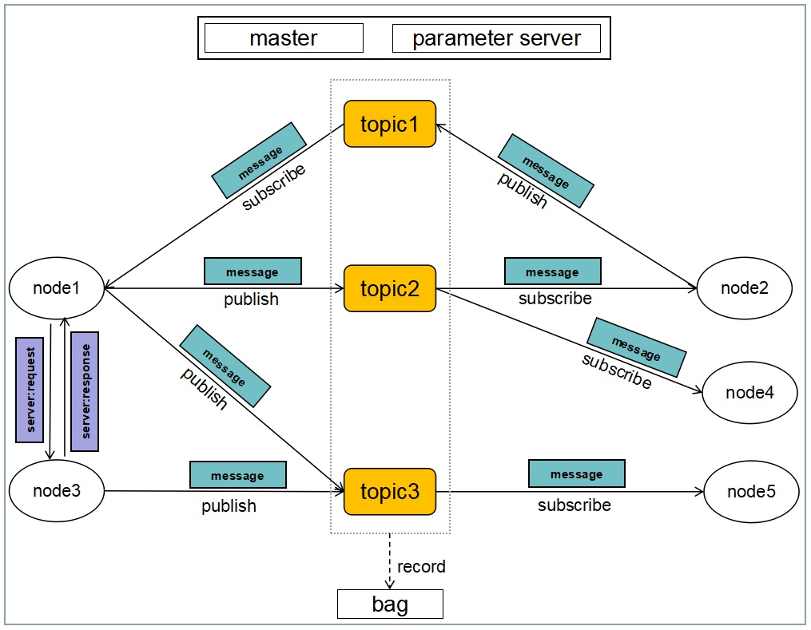
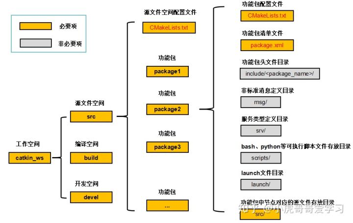
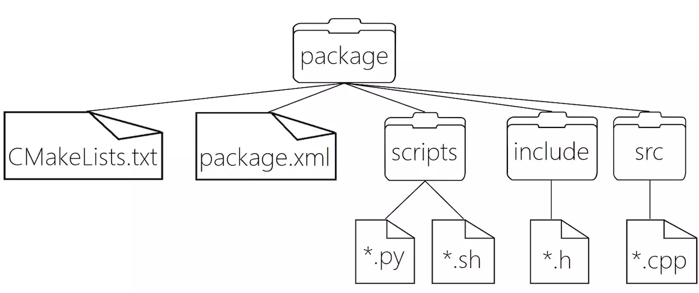
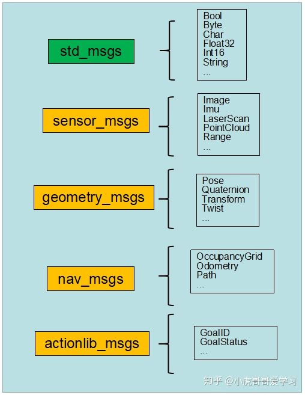
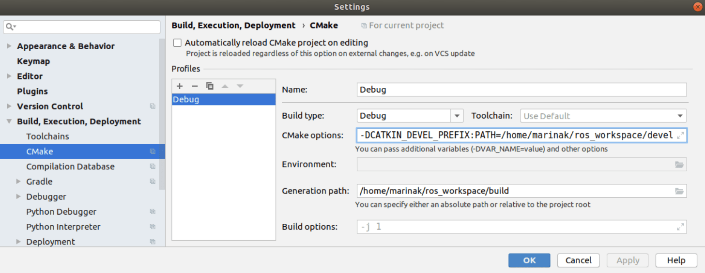
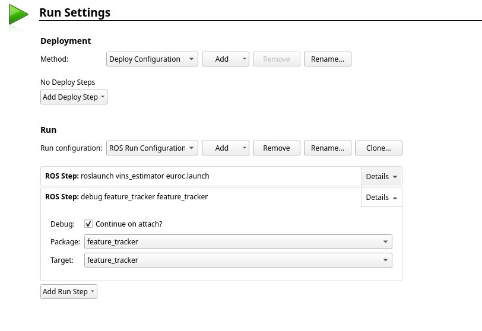

# Ros

## Basic concept

ROS会创建一个连接所有进程(节点)的网络, 其中的任何进程(节点)都可以访问此网络, 并通过该网络与其他进程(节点)交互, 获取其他进程(节点)发布的信息, 并将自身数据发布到网络上, 这个计算图网络中的节点(node)、主题(topic)、服务(server)等都要有唯一的名称做标识.

## Install
flow the wiki: http://wiki.ros.org/kinetic/Installation/Ubuntu

```bash
# ros repository does not have a Release file
vi /etc/apt/sources.list.d/ros-latest.list
```
将`deb http://packages.ros.org/ros/ubuntu`改为`deb [trusted=yes] http://packages.ros.org/ros/ubuntu`

## Ros workspace


* src源文件空间: 这个文件夹放置各个功能包和一个用于这些功能包的CMake配置文件
* build编译空间: 这个文件夹放置CMake和catkin编译功能包时产生的缓存、配置、中间文件等
* devel开发空间: 这个文件夹放置编译好的可执行程序, 这些可执行程序是不需要安装就能直接运行的

目录件结构:
* include/<package_name>功能包头文件目录
* package.xml: 包括了package的描述信息
    * package.xml: 包括了package的描述信息
    * opt.authors, url's, dependencies ,plugins, etc...
* msg非标准消息定义目录, ROS系统提供了很多标准类型的消息可以直接使用, 如果你要使用一些非标准类型的消息, 就需要自己来定义该类型的消息, 并把定义的文件放在这里.
* scripts可执行脚本文件存放目录
* srv服务类型定义目录
* launch文件目录

__Package__ 是ROS软件的基本组织形式，<u>*catkin编译的基本单元，一个package可以包含多个可执行文件node*</u>. package的特征: 包含CMakeLists.txt和package.xml.


__消息__ ROS中一个进程(节点)发送到其他进程(节点)的信息, 消息类型是消息的数据结构, ROS系统提供了很多标准类型的消息可以直接使用, 如果你要使用一些非标准类型的消息, 就需要自己来定义该类型的消息. 消息以`.msg`为扩展名. 如:
```python
int32 trajectory_id
int32 submap_index
int32 submap_version
geometry_msgs/Pose pose
```

__Topic__ 等价与一个平台, 类比QQ群, 一对多间接传递消息.

__服务__ 服务跳过了`Topic`, 类比QQ私聊. 服务是ROS中进程(节点)间的请求/响应通信过程, 服务类型是服务请求/响应的数据结构. 服务类型的定义借鉴了消息类型的定义方式. 区别在于, 消息数据是ROS进程(节点)间多对多广播式通信过程中传递的信息; 服务数据是ROS进程(节点)间点对点的请求/响应通信过程传递的信息. 

Ros包含丰富的标准类型消息


Catkin会在工作空间catkin_ws/src/下递归的查找其中的每一个ROS的package. package中有package.xml和CMakeList.txt文件, Catkin编译系统依据CMakeList.txt文件生成makefiles, 放在catkin_ws/build. make刚刚生成的makefiles文件, 编译链接生成可执行文件, 放在catkin_ws/devel.


## 常用命令
### 节点管理
启动节点
```bash
# Rosrun只是简便了操作, 也可以直接找出下面的命令进行操作
# /opt/opt/ros/indigo/lib/turtlesim/turtlesim_node
rosrun [package name] [node name]
# 批量启动节点
roslaunch [package name] [file]
```

查看节点
```bash
rosnode list
rosnode info [node-name]
# 查看节点之间的发布订阅关系
rosrun rqt_graph rqt_graph
```

终止节点
```bash
rosnode kill [node-name]
# 还可以用 Ctrl-C 命令终止节点. 但使用这种方法时可能不会在节点管理器中注销该节点,
# 因此会导致已终止的节点仍然在 rosnode 列表中. 此时可以使用下面的命令将节点从列表中删除:
rosnode cleanup
```
__roscore__ 用于启动节点管理器, 这个命令会加载ROS节点管理器和其他ROS核心组件

### Msg管理
```bash
# 消息类型详情
rosmsg show [message-type-name]
# 用于列出所有消息
rosmsg list
# 列出功能包的所有消息
rosmsg package [package name]
# 列出所有具有该消息的功能包
rosmsg packages
```

ROS提供消息记录包相关的命令行工具
```bash
# 录制、播放和执行操作
# 使用rosbag info检查看它的内容
rosbag info <your bagfile>
# 回放bag文件以再现系统运行过程
rosbag play <your bagfile>
rosbag play -r 2 <your bagfile>
# 录制数据子集
rosbag record -O subset /turtle1/command_velocity /turtle1/pose
```

### Topic管理
```bash
rostopic list -h
# 查看某个话题上发布的消息
rostopic echo [topic-name]
# 查看消息类型
rostopic type [topic-name]
# topic 的带宽
rostopic bw [topic name]
# 用于显示topic的发布频率
rostopic hz [topic name]
# 输出活动主题、发布的主题、主题订阅者和服务的信息
rostopic info [topic name]
# 通过命令行将数据发布到主题
rostopic pub </topic_name> <message_type> <args>
```

### Srv服务管理
```bash
# 通过命令行参数调用服务. 
rosservice call </service_name> <args>
# 根据服务类型查询服务. 
rosservice find <service_type>
# 输出服务信息. 
rosservice info </service_name>
# 用于列出活动服务清单. 
rosservice list
# 输出服务类型. 
rosservice type </service_name>
# 输出服务的ROSRPC URI
rosservice uri </service_name>
```

__参数服务器(parameter server)__ 能够使数据通过关键词存储在一个系统的核心位置. 通过使用参数, 就能够在节点运行时动态配置节点或改变节点的工作任务. 参数服务器是可通过网络访问的共享的多变量字典, 节点使用此服务器来存储和检索运行时的参数.

```bash
# 列出参数服务器中的所有参数
rosparam list
# 获取参数服务器中的参数值. 
rosparam get <parameter_name>
# 设置参数服务器中参数的值. 
rosparam set <parameter_name> <value>
# 将参数从参数服务器中删除. 
rosparam delete <parameter_name>
# 将参数服务器的参数保存到一个文件. 
rosparam dump <file>
# 从文件将参数加载到参数服务器. 
rosparam load <file>
```

## setup ros in clion
1. CLion needs to be informed of the ROS-specific environment variables. These variables are retrieved in the current shell when you source the workspace by running:
`source ./devel/setup.bash`.

2. Then launch the IDE from the same shell. by running: 
`sh PATH_TO_CLION/bin/clion.sh`

3. open ros project in clion.
open cmake file

4. set build paths to the catkin workspace
    * 设置输出目录为`workspace_folder/build`
    * 并在cmake options中添加`-DCATKIN_DEVEL_PREFIX:PATH=workspace_folder/devel`


5. work with launch files.
可以通过命令行执行launch文件, 利用`Run | Attach to Process`, attach到进程. 对于单个节点, 应该直接执行可执行文件.

注意: clion中1个package只能有一个executable.

## ros setting for qtcreator
下载安装[qtcreator-ros](https://github.com/ros-industrial/ros_qtc_plugin), 通过`new project`导入ros workspace, 编译使用catkin, 然后即可进行编译、运行(rosrun & roslaunch)和调试.


在调试时, 终端变为`Ros Terminal`, 可能会遇到无法attach的问题, 通过如下命令解决:
```bash
echo 0 | sudo tee /proc/sys/kernel/yama/ptrace_scope
```

## Ros package创建
常用工具: `rospack`, `catkin_create_pkg`, `catkin_make`, `rosdep`, `rqt_dep`.

流程:
1. 创建工作空间
```bash
#新建工作空间文件夹
mkdir catkin_ws

#在catkin_ws目录下新建src文件夹
cd catkin_ws
mkdir src

#初始化src目录，生成的CMakeLists.txt为功能包编译配置
cd src
catkin_init_workspace

#切回catkin_ws目录，对该工作空间执行一次编译
cd ~/catkin_ws
catkin_make

# 编译单个功能包
catkin_make -DCATKIN_WHITELIST_PACKAGES="你的包名"

#环境变量配置，使新建的catkin_ws工作空间可用
source devel/setup.bash
```

2. 创建功能包
```bash
#在catkin_ws/src/下创建取名为hello_world的功能包，
#ROS功能包命名规范：只允许使用小写字母、数字和下划线，
#且首字符必须为一个小写字母。
cd ~/catkin_ws/src/
catkin_create_pkg hello_world
```
目录结构如下:
```
ros
├── hello_world
|   ├── src
|   |    ├── hello_world #package
|   |    └── ...
|   ├── devel
|   └── build
```

3. package 源码编写
在`ros/hello_world/src/hello_world`下创建cpp文件.

4. CMake配置
添加对ros的依赖, 并用专用的宏来生成msg, srv等专用功能文件.
cmake reference
```cmake
# 规定catkin编译的规则，源文件，依赖項，目标文件
cmake_minimum_required()  #指定catkin最低版本  
project()                 #指定软件包的名称
find_package()            #指定编译时需要的依赖項
add_message_files()       #添加消息文件
add_service_files()       #添加服务文件
add_action_files()        #添加动作文件
generate_messages()       #生成消息，服务，动作
catkin_package()          #指定catkin信息给编译系统生成CMake文件
add_library()            #指定生成库文件
add_executable()         #指定生成可执行文件
target_link_libraries()  #指定可执行文件去链接哪些库
catkin_add_gtest         #添加测试单元
install()                #生成可安装目标
```

基本样例:
```cmake
find_package(catkin REQUIRED COMPONENTS roscpp std_msgs)
include_directories(
    ${catkin_INCLUDE_DIRS}
)

add_executable(zsw_helloworld_node src/zsw_hello.cpp)
target_link_libraries(zsw_helloworld_node ${catkin_LIBRARIES})
```

5. package.xml配置
  package.xml中需要指明, package的依赖关系, 基本样例:
    ```xml
    <package format="2">
      <buildtool_depend>catkin</buildtool_depend>
      <build_depend>roscpp</build_depend>
      <build_depend>std_msgs</build_depend>
      <build_export_depend>roscpp</build_export_depend>
      <build_export_depend>std_msgs</build_export_depend>
      <exec_depend>roscpp</exec_depend>
      <exec_depend>std_msgs</exec_depend>
    </package>
    ```

6. compile
在workspace下调用`catkin_make`.

## Ros launch使用
使用`.lanuch`文件, 可以方便多参数的批量导入, 多个节点的批量运行. `.launch`文件采用xml标记语言编写.

* `<launch>`顶层标签
* `<node>`节点标签
每个node标签里包含了ROS图中节点的名称属性name、该节点所在的包名pkg、节点的类型type（type为可执行文件名称，如果节点用c++编写；type为*.py，如果节点用python编写）、调试属性output（如果output=“screen”，终端输出信息将被打印到当前控制台，output="log"存入ROS日志文件）, args节点运行时的参数.
```xml
<node name=”xx” pkg=”xx” type=”xx” output=”xx”
    args="-d $(find cartographer_ros)/configuration_files/demo_2d.rviz">
...
</node> 
```
* `<include>`标签, 导入另一个`.launch`文件, 方便模块化管理.
* `<remap>`标签, topic名称重新映射. 根据放置在launch文件的层级不同，在相应的层级起作用. 该标签被包裹在`<node>`标签之下, 只对该node有效.
```xml
<remap from=”orig_topic_name” to=”new_topic_name”/>
```
这里, 解释一下: 对于发布者(advertiser), `from`是原始发布的topic名称, `to`是需要转变成的topic名称. 而对于接受者(subscriber), `from`是接受者原来需要接受的topic名称, `to`是当前需要接收的topic名称.

* `<param>`标签, 在参数服务器中创建或设置一个指定名称的参数值.
```xml
<param name=”param_name” type=”xx” value=”xx”/>
```
* `<rosparam>`标签, 从yaml文件中一次性导入大量参数到参数服务器中.
```xml
<rosparam command=”load” file=”$(find pkg_name)/path_to_file.yaml”/>
```
* `<arg>`该xml文件中的变量定义, 方便可以在后面复用.
```xml
<arg name="config_path" default = "$(find feature_tracker)/../config/euroc/euroc_config.yaml" />
<param name="config_file" type="string" value="$(arg config_path)" />
```
* `<group>`标签, 将node分组, 方便管理.
```xml
<group ns=”group_one”>
< node ... />
< node ... />
</group>
```

使用launch文件时会自动启动roscore, launch文件使用:
```bash
roslaunch <pkg_name> <file_name.launch>
```

`pkg_name`的意义是指定pkg中的launch文件, 不同的pkg中可能有相同的launch文件.

## ros imu数据可视化
imu数据控制台打印输出, 查看frame_id:
```bash
rostopic echo /imu0
```
输出:
```
---
header: 
  seq: 9408
  stamp: 
    secs: 1403636586
    nsecs:  48555500
  frame_id: "imu4"
orientation: 
  x: 0.0
  y: 0.0
  z: 0.0
  w: 1.0
orientation_covariance: [99999.9, 0.0, 0.0, 0.0, 99999.9, 0.0, 0.0, 0.0, 99999.9]
angular_velocity: 
  x: -0.328820031076
  y: -0.482409005251
  z: 0.100530964915
angular_velocity_covariance: [0.0, 0.0, 0.0, 0.0, 0.0, 0.0, 0.0, 0.0, 0.0]
linear_acceleration: 
  x: 8.556302125
  y: -0.236994041667
  z: -4.731708625
linear_acceleration_covariance: [0.0, 0.0, 0.0, 0.0, 0.0, 0.0, 0.0, 0.0, 0.0]
---
```
启动rviz: `rosrun rviz rviz`, 设置 `Global Options` → `Fixed Frame`为 imu的frame_id即`imu4`, 添加imu可视化即可.

imu曲线: `rosrun rqt_plot rqt_plot`, 选择对应的值即可`/imu0/...`.

## Ros tf
tf数据可视化
```bash
rosrun rqt_tf_tree rqt_tf_tree
```

打印两个坐标系之前的transform
```bash
rosrun tf tf_echo [reference_frame] [target_frame]
```

## Ros和Anaconda python不兼容的问题
Ros 使用的python版本是2.7, 而Anaconda我用的是3.7.
由于环境变量是单独的, 所以每次使用都需要重新配置`.bashrc`, 很不方便, 解决方法如下:

在安装完anaconda后, `.bashrc`中多了如下配置:
```bash
# added by Anaconda3 2018.12 installer
# >>> conda init >>>
# !! Contents within this block are managed by 'conda init' !!
__conda_setup="$(CONDA_REPORT_ERRORS=false '/opt/anaconda3/bin/conda' shell.bash hook 2> /dev/null)"
if [ $? -eq 0 ]; then
    \eval "$__conda_setup"
else
    if [ -f "/opt/anaconda3/etc/profile.d/conda.sh" ]; then
# . "/opt/anaconda3/etc/profile.d/conda.sh"  # commented out by conda initialize
        CONDA_CHANGEPS1=false conda activate base
    else
        \export PATH="/opt/anaconda3/bin:$PATH"
    fi
fi
unset __conda_setup
# <<< conda init <<<

# >>> conda initialize >>>
# !! Contents within this block are managed by 'conda init' !!
__conda_setup="$('/home/wegatron/opt/anaconda3/bin/conda' 'shell.bash' 'hook' 2> /dev/null)"
if [ $? -eq 0 ]; then
    eval "$__conda_setup"
else
    if [ -f "/home/wegatron/opt/anaconda3/etc/profile.d/conda.sh" ]; then
        . "/home/wegatron/opt/anaconda3/etc/profile.d/conda.sh"
    else
        export PATH="/home/wegatron/opt/anaconda3/bin:$PATH"
    fi
fi
unset __conda_setup
# <<< conda initialize <<<
```


## reference
[知乎-ros-catkin](https://zhuanlan.zhihu.com/p/49601150)
[Ros系统整体架构](https://zhuanlan.zhihu.com/p/64559374)
[Ros Helloworld](https://zhuanlan.zhihu.com/p/64561055)
[Ros常用命令及使用](https://blog.csdn.net/qq_37193603/article/details/72901716)
[ros-setup-clion](https://www.jetbrains.com/help/clion/ros-setup-tutorial.html)
[Ros launch的使用](https://zhuanlan.zhihu.com/p/64600850)
[解决Ros和Anaconda python版本不兼容问题](https://www.twblogs.net/a/5c9267e5bd9eee35cd6b9cbe/zh-cn)