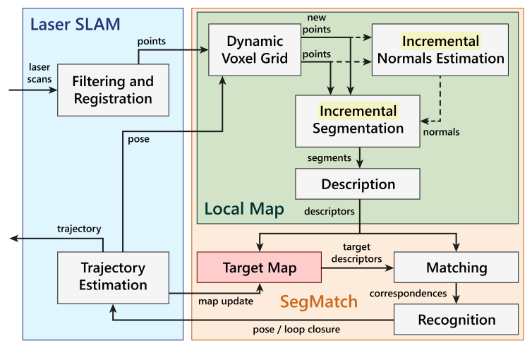
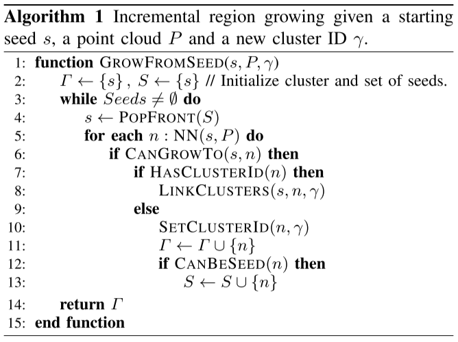

## SegMatch: Segment based loop-closure for 3D point clouds
基于点云分割、 聚类, 特征计算, 识别的定位.

1. 点云分割、聚类
先分离地面点, 然后使用Euclidean clustering for growing segments.

2. 特征计算
采用中特征构成特征向量: Eigenvalue based, Ensemble of shape histograms, ...

3. 使用随机森林做聚类的识别训练.

4. 使用RANSAC, 选取最佳匹配, 根据匹配上的聚类和其中心计算Transform.

## Incremental Segment-Based Localization in 3D Point Clouds
实时对3D激光点云增量型地分割, 分割聚类. 通过聚类的点云进行识别, 匹配进行定位.
关键词: Dynamic Voxel Grid(DVG), Incremental region growing segmentation.
论文可分为如下几个部分
* 增量式点云分割聚类
* 识别匹配
* 实验&Performance

算法Pipeline

### 增量式点云分割聚类
DVG: 动态栅格, 局部地图点云数据保存在此动态栅格内, 新的点Insert进去. __只有当栅格内的点数超过一定阈值, 才认为这个栅格是有效的, 否则认为是噪声__.
这里, 之所以构建DVG, 也是为了方便动态更新, 根据论文中描述, 在进行动态更新时, 也维护了一个局部地图的kd-tree.
* 增量式更新DVG, Normal, Curvature.
为了更快速地更新voxel, 先确定所有新加入的点所属的voxel, 然后更新有变化的voxel. 
voxel信息更新:
$$
p \leftarrow\left(n \cdot p+\sum_{i=1}^{m} q_{i}\right) \cdot \frac{1}{n+m}, \quad n \leftarrow n+m
$$
voxel中每个点的covariance matrix $M_i$, 可增量更新:
$$
M_i = v_j v_j^T - \bar{v} \bar{v}^T, v_j \in N(p_i)
$$
curvature的计算($\lambda$是$M_i$的特征值):
$$
\sigma = \lambda_0(\lambda_0 + \lambda_1 + \lambda_2)^{-1}, \lambda_0 \le \lambda_1 \le \lambda_2
$$
另外, 当机器人移动时, 超出局部地图区域的voxel被移除.

* 增量式分割聚类(incremental region growing segmentation)
该算法的思想与`pcl::RegionGrowing`类似, 只是变成了增量式: 以新加入的点作为初始seed点.
算法伪代码:

__CANBESEED__: 根据点的曲率有小到大排序, 从最平坦的地方开始扩张, 曲率阈值筛选seed点.
__CANGROWTO__: 若点和其种子点的法向基本平行(点乘阈值), 则认为是可以被扩张的.

### 基于图结构的识别匹配定位
1. 对分割好的点云, 参考了"Semantic 3d scene interpretation: a framework combining optimal neighborhood size selection with relevant features(2014)"计算其特征向量. 通过特征空间中的最近邻搜索, 查找局部地图中每个segment的correspondense.
2. 为了使得correspondense更加可靠: 当局部地图上的一组segment与全局地图上的一组segment之间的相对距离小于阈值$\epsilon$, 则认为其是geometrically consistent, 才加入到图结构中.
$$
| d_l(c_i, c_j) - d_t(c_i, c_j) | \le \epsilon
$$
图结构, $\mathrm{V} = \{c_i\}, \mathrm{E} = {e_{ij}}$, 这里$e_{ij}$是consistent pair之间的边.

3. 在寻找grometrical consistency时, 可以通过缓存之前的信息来提升效率.
缓存并增量更新每一个segment的候选consistent segment:
$$
\mathcal{S}(c_i) = \{c_j \in \mathrm{V} | j \le i \wedge \Delta(c_i, c_j) \le \theta_{\Delta} + \epsilon\}
$$
局部地图上的某个segment中心移动超过$\theta_\Delta$时, 认为这个correspondense不在成立. 重新计算与其相关的consistency.

5. MPCS
6. feature vector.

## SegMap
使用了Data-driven descriptor来对点云进行分割, 聚类.

## Reference
> SegMatch
> Incremental Segment-Based Localization in 3D Point Clouds
> SegMap
[segmap 解析](https://blog.csdn.net/weixin_42048023/article/details/88366746)
[segmap source code](https://github.com/ethz-asl/laser_slam)