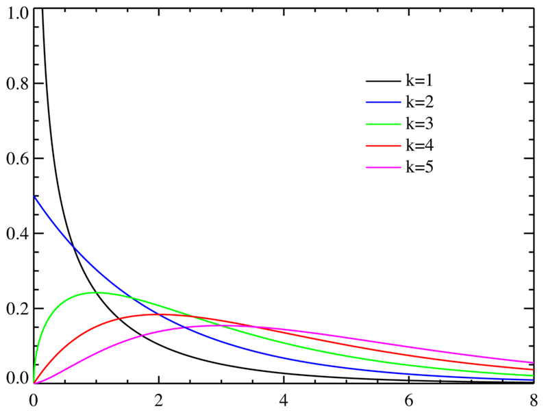

---
tag:summary/basic_theory
---
## 概率统计基础知识

发现利用概率统计相关知识, 可以优化一些工作:
1. 以概率统计的知识为基础, 一些参数的设置将更加合理和准确. 
2. 在算法测试时利用概率统计的抽样估计和检验, 能使得测试的结果更有说服力.

### 一些基础的概率分布
* 二项分布
是n个独立的是/非试验中成功的次数的离散概率分布, 其中每次试验的成功概率为p. 这样的单次成功/失败试验又称为伯努利试验. $X \sim b(n, p)$ 或 $X \sim B(n, p)$.

* 正态分布
    若随机变量$X$服从一个位置参数为$\mu$, 尺度参数为$\sigma$的正态分布, 记为: $X \sim (\mu, \sigma^2)$. 其概率密度函数为:
    $$
    f(x) = \frac{1}{\sigma \sqrt{2 \pi}} e^{-\frac{(x-\mu)^2}{2 \sigma^2}}
    $$

* $\chi^2$卡方分布
    若k个随机变量$Z_1, ..., Z_k$是相互独立, 符合标准正态分布的随机变量(数学期望为0, 方差为1), 则随机变量$Z$的平方和:
    $$
    X = \sum_{i=1}^k Z_i^2
    $$
    被称为自由度为k的卡方分布, 记作:
    $$
    \begin{aligned}
    X \sim \chi^{(k)}\\
    X \sim \chi_k^2
    \end{aligned}
    $$
    备注: 在vslam中, 若假设像素噪声u,v是独立的正态分布, 则投影误差为自由度为2的卡方分布, 在参数选取时有参考意义.
    
    卡方分布表:
    <table class="wikitable">
    <tbody><tr>
    <th>自由度k \ P value （概率）
    </th>
    <td style="background: #ffa2aa">0.95
    </td>
    <td style="background: #efaaaa">0.90
    </td>
    <td style="background: #e8b2aa">0.80
    </td>
    <td style="background: #dfbaaa">0.70
    </td>
    <td style="background: #d8c2aa">0.50
    </td>
    <td style="background: #cfcaaa">0.30
    </td>
    <td style="background: #c8d2aa">0.20
    </td>
    <td style="background: #bfdaaa">0.10
    </td>
    <td style="background: #b8e2aa">0.05
    </td>
    <td style="background: #afeaaa">0.01
    </td>
    <td style="background: #a8faaa">0.001
    </td></tr>
    <tr>
    <td>
 1
    
</td>
    <td>0.004
    </td>
    <td>0.02
    </td>
    <td>0.06
    </td>
    <td>0.15
    </td>
    <td>0.46
    </td>
    <td>1.07
    </td>
    <td>1.64
    </td>
    <td>2.71
    </td>
    <td>3.84
    </td>
    <td>6.64
    </td>
    <td>10.83
    </td></tr>
    <tr>
    <td>
 2
    
</td>
    <td>0.10
    </td>
    <td>0.21
    </td>
    <td>0.45
    </td>
    <td>0.71
    </td>
    <td>1.39
    </td>
    <td>2.41
    </td>
    <td>3.22
    </td>
    <td>4.60
    </td>
    <td>5.99
    </td>
    <td>9.21
    </td>
    <td>13.82
    </td></tr>
    <tr>
    <td>
 3
    
</td>
    <td>0.35
    </td>
    <td>0.58
    </td>
    <td>1.01
    </td>
    <td>1.42
    </td>
    <td>2.37
    </td>
    <td>3.66
    </td>
    <td>4.64
    </td>
    <td>6.25
    </td>
    <td>7.82
    </td>
    <td>11.34
    </td>
    <td>16.27
    </td></tr>
    <tr>
    <td>
 4
    
</td>
    <td>0.71
    </td>
    <td>1.06
    </td>
    <td>1.65
    </td>
    <td>2.20
    </td>
    <td>3.36
    </td>
    <td>4.88
    </td>
    <td>5.99
    </td>
    <td>7.78
    </td>
    <td>9.49
    </td>
    <td>13.28
    </td>
    <td>18.47
    </td></tr>
    <tr>
    <td>
 5
    
</td>
    <td>1.14
    </td>
    <td>1.61
    </td>
    <td>2.34
    </td>
    <td>3.00
    </td>
    <td>4.35
    </td>
    <td>6.06
    </td>
    <td>7.29
    </td>
    <td>9.24
    </td>
    <td>11.07
    </td>
    <td>15.09
    </td>
    <td>20.52
    </td></tr>
    <tr>
    <td>
 6
    
</td>
    <td>1.63
    </td>
    <td>2.20
    </td>
    <td>3.07
    </td>
    <td>3.83
    </td>
    <td>5.35
    </td>
    <td>7.23
    </td>
    <td>8.56
    </td>
    <td>10.64
    </td>
    <td>12.59
    </td>
    <td>16.81
    </td>
    <td>22.46
    </td></tr>
    <tr>
    <td>
 7
    
</td>
    <td>2.17
    </td>
    <td>2.83
    </td>
    <td>3.82
    </td>
    <td>4.67
    </td>
    <td>6.35
    </td>
    <td>8.38
    </td>
    <td>9.80
    </td>
    <td>12.02
    </td>
    <td>14.07
    </td>
    <td>18.48
    </td>
    <td>24.32
    </td></tr>
    <tr>
    <td>
 8
    
</td>
    <td>2.73
    </td>
    <td>3.49
    </td>
    <td>4.59
    </td>
    <td>5.53
    </td>
    <td>7.34
    </td>
    <td>9.52
    </td>
    <td>11.03
    </td>
    <td>13.36
    </td>
    <td>15.51
    </td>
    <td>20.09
    </td>
    <td>26.12
    </td></tr>
    <tr>
    <td>
 9
    
</td>
    <td>3.32
    </td>
    <td>4.17
    </td>
    <td>5.38
    </td>
    <td>6.39
    </td>
    <td>8.34
    </td>
    <td>10.66
    </td>
    <td>12.24
    </td>
    <td>14.68
    </td>
    <td>16.92
    </td>
    <td>21.67
    </td>
    <td>27.88
    </td></tr>
    <tr>
    <td>
 10
    
</td>
    <td>3.94
    </td>
    <td>4.86
    </td>
    <td>6.18
    </td>
    <td>7.27
    </td>
    <td>9.34
    </td>
    <td>11.78
    </td>
    <td>13.44
    </td>
    <td>15.99
    </td>
    <td>18.31
    </td>
    <td>23.21
    </td>
    <td>29.59
    </td></tr></tbody></table>

* t分布
    设 $X \sim N(0,1), Y \sim \chi^2(n)$, 且 $X,Y$相互独立, 则称随机变量$t = \frac{X}{\sqrt{Y/n}}$, 服从自由度为$n$的t分布, 记为$t \sim t(n)$.
    一般情况下, 样本的方差未知, 在估计时$t$分布很适用.
    

* F分布
    设$U \sim \chi^2(n1), V \sim \chi^2(n2)$, 且$U, V$相互独立, 则称随机变量$F = \frac{U/n_1}{V/n_2}$服从自由度为$(n1,n2)$的F分布, 记为$F \sim F(n1,n2)$.

### 估计
#### 点估计
以一个单一的取值，去近似的作为未知的参数的估计值. 以一个单一的取值, 去近似的作为未知的参数的估计值.
例如样本的均值$\bar{x}$, 可以用来估计总体的均值$\mu$, 样本的标准差$s$, 可以用来估计总体的标准差$\sigma$. 点估计方法有: 矩估计、最小二乘法、极大似然法.

#### 区间估计
对于未知参数$\theta$, 我们除了关注点估计$\bar{\theta}$外, 还希望估计出一个范围, 并希望知道参数$\theta$, 落在这个范围的可信程度, 这就是区间估计. 这样的区间即参数的置信区间.

* 置信区间: 就是一个包含统计量值的取值范围, 并且这个范围在一定的置信水平下包含参数 $\theta$ 的真实值.

### 假设检验

## Reference
[参数估计和假设检验](https://zhuanlan.zhihu.com/p/65566113)
