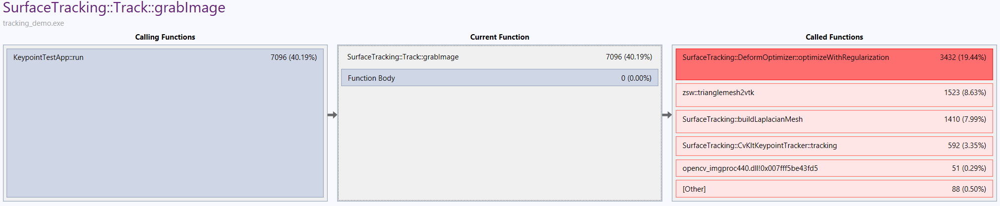
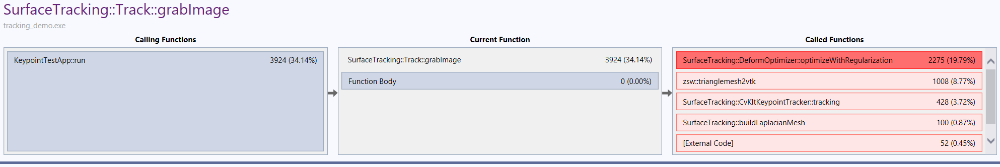
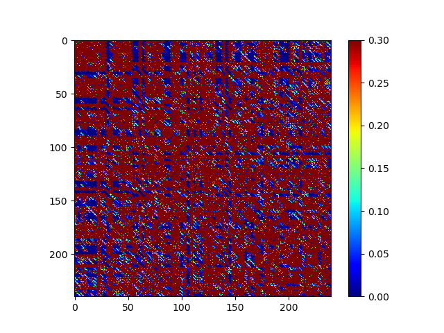

# Deformable Surface Tracking

## Basic Concept

通过跟踪少量特征点的跟踪+表面Mesh顶点之间的约束来恢复出整个Mesh的状态.

## Template-based Monocular 3D Shape Recovery using Laplacian Meshes
对于任意一对相连的三角形, 定义平面正则项约束(四个点构成相似四边形, 对于输入非平面的Mesh有另外处理):
$$
\begin{aligned}
\mathbf{0} &= w_1 \mathbf{v}_1 + w_2 \mathbf{v}_2 + w_3 \mathbf{v}_3 + w_4 \mathbf{v}_4\\
0 &= w_1 + w_2 + w_3 + w_4\\
1 &= w_1^2 + w_2^2 + w_3^2 + w_4^2
\end{aligned}
$$
算法分为两步: 

1. 特征点匹配, 并通过重投影误差和正则项约束优化, 剔除outlier(优化后重投影位置偏离较大的匹配).

2. 重投影误差+正则项约束+距离约束(一般材料延展性都有限制)优化求解.

### 🍒步骤①特征点匹配

优化目标函数定义为:
$$
\begin{aligned}
&\arg \min_{\mathbf{x}} \parallel \mathbf{Mx} \parallel^2 + w_r^2\parallel \mathbf{Ax} \parallel^2 \\
\Rightarrow &\arg \min_{\mathbf{c}} \parallel \mathbf{MPc} \parallel^2 + w_r^2\parallel \mathbf{APc} \parallel^2, \; &s.t. \quad \parallel \mathbf{c} \parallel = 1.\\
\Rightarrow &\arg \min_{\mathrm{c}} \parallel \begin{bmatrix} \mathbf{MP}\\w_r\mathbf{AP} \end{bmatrix} \mathbf{c} \parallel^2, \; &s.t. \quad \parallel \mathbf{c} \parallel = 1.
\end{aligned}
$$
这里, $\parallel \mathbf{Mx} \parallel^2$ 表示了特征点匹配的重投影误差:
$$
\begin{aligned}
&\mathbf{K}(b_1\mathrm{v}_{f,1} + b_2\mathrm{v}_{f,2}+b_3\mathrm{v}_{f,3}) = k\begin{bmatrix}u\\v\\1\end{bmatrix}\\\\
\Rightarrow &\mathbf{M}\mathbf{x} = 0 \quad \mathrm{with} \left\{\begin{aligned}\mathbf{M} &= \begin{bmatrix}b1\mathbf{H} & b_2\mathbf{H}& b_3\mathbf{H} \end{bmatrix}\\ \mathbf{H} &= \mathbf{K}_{2\times3} - \begin{bmatrix}u\\v\end{bmatrix}\mathbf{K}_3\end{aligned} \right.
\end{aligned}
$$


 $\parallel \mathbf{Ax} \parallel^2$是正则项约束(由$w$构成). 在我们的应用场景中, $\mathbf{c}$ 是控制点(跟踪到的特征点), $\mathbf{x}$ 是网格上所有的点, 它们之间可以互相转换计算.
$$
\left\{
\begin{aligned}
&\mathbf{c} = \mathbf{P}_c \cdot \mathbf{x}\\
&\mathbf{x} = \mathbf{P}\cdot \mathbf{c}
\end{aligned}
\right.
$$

这里, $\mathbf{P}_c$ 是一个$3N_c \times 3N_v$ 的矩阵, 在控制点(特征点)的位置为1, 其他点为0. $\mathbf{P}$ 可以由$\mathbf{A}$计算得到, 令
$$
\begin{aligned}
\mathbf{x} = \begin{bmatrix}
\mathbf{c}\\
\mathbf{\lambda}
\end{bmatrix}\\\\
\mathbf{A} = [\mathbf{A}_c | \mathbf{A}_\lambda]
\end{aligned}
$$
可以推出:
$$
\mathbf{P} = \begin{bmatrix}
\mathbf{I}\\
-(\mathbf{A}_\lambda^T\mathbf{A}_\lambda)^{-1}\mathbf{A}_\lambda^T\mathbf{A}_c
\end{bmatrix}
$$

这里求解时, 可以使用SVD分解替代Eigen分解.

__代码实现__

公式是上边这么写(看起来简单好理解), 代码实现时需要考虑:

①详细的步骤, 算法整体的输入输出, 环节的划分, 各个环节的输入, 处理方法, 以及输出.

②内存空间和计算性能(不要开太大的矩阵, 那些数据可以预计算/复用).

详细步骤:

1. 数据读取/加载: 3D triangle mesh data, camera intrinsic params, model frame.

2. 预计算$\mathrm{RegMat},\mathrm{CtrlMat},\mathrm{RegCtrCtrReg}, \mathrm{AP}, \mathrm{APtAP}$
   $$
   \begin{aligned}
   \mathrm{RegMat} &= \begin{bmatrix} ... & w_{i0} & ... & w_{i1} & ... & w_{i2} & ... & w_{i3} & ...
   \end{bmatrix}\\\\
   \mathbf{A} &= \mathbf{I} \otimes \mathrm{RegMat}\\
   \mathbf{P} &= \mathbf{I} \otimes \mathrm{CtrlMat}\\
   \mathrm{RegCtr} &= \mathrm{RegMat} \cdot \mathrm{CtrlMat}\\
   \mathrm{RegCtrCtrReg} &= \mathrm{RegCtr}^T \cdot \mathrm{RegCtr}\\
   \mathrm{AP} &= \mathbf{I} \otimes \mathrm{RegCtr}\\
   \mathrm{APtAP} &= \mathbf{I} \otimes \mathrm{RegCtrCtrReg}
   \end{aligned}
   $$
   这里$\otimes$是克罗内克积(Kronecker product), $\mathrm{RegMat}$ 行数为三角形pair的数量, 列数为网格定点数量.

3. 视频帧与参考帧之间的特征点匹配, 通过正则项误差来剔除outlier.

   ```matlab
     if isfield(params, 'RejectOulierIn2D') && params.RejectOulierIn2D
       inlierIdxs  = register_deformable_2D_2(LaMesh.RegCtrCtrReg, LaMesh.CtrlMat, matches3D2D);    
       fprintf('2D outlier rejection retains %d / %d matches \n', numel(inlierIdxs), size(matches3D2D,1));    
       matches3D2D = matches3D2D(inlierIdxs,:);
     end
   ```

   ​		在作者的Matlab代码中, outlier剔除部分, 优化的是$\min_\mathbf{c} \parallel \mathbf{BPc} - \mathbf{U}\parallel^2$, $\mathbf{U}$是匹配得到的特征点uv:

   ```matlab
     % Image term ||BP*x - U||^2
     BP  = computeImageTermMatrix(matches, P);
     BPt = BP';
     U = matches(:,7:8);
   
     % At the beginning, all the matches are inliers
     inlierIdxs = (1:size(matches,1))';
   
     for i = 1:params.nIters
       radius = computeRadius(params.startRadius, params.endRadius, i, params.nIters);
       imageWeight = 0.75 / (radius*radius*radius);
   
       for j = 1:params.sub_nIters
         inlierIdxsBefore = inlierIdxs;
   
         X = (imageWeight * (BPt(:,inlierIdxs) * BP(inlierIdxs,:)) + wAPtAP) \ (imageWeight*BPt(:,inlierIdxs) * U(inlierIdxs,:));
   
         % Find inlier matches
         inlierIdxs = findInliers(X, BP, U, radius);
   
         %fprintf('Iter %d, subiter = %d, #inliers / #total = %d / %d, radius = %f \n', i, j, numel(inlierIdxs), size(matches,1), radius);
   
         % If inlier matches before and after the optimization are the same, break
         if (numel(inlierIdxsBefore) == numel(inlierIdxs) && ~any(inlierIdxsBefore-inlierIdxs))
           break;
         end
       end % end of inner for
     end % end of outer for
   ```


### 🍈步骤②优化求解

优化目标函数:
$$
\arg \min_\mathbf{c} \parallel \mathbf{MPc} \parallel^2 + w_r^2\parallel \mathbf{APc} \parallel^2, \quad \mathrm{s.t.} \; C(\mathbf{Pc}) \preccurlyeq \mathbf{0}
$$
这里, $C(\mathbf{Pc}) \preccurlyeq \mathbf{0}$表示延展性约束, 防止Mesh形变之后中相邻的顶点距离太大. 

__代码实现__

c++代码使用了带约束的目标函数.

matlab代码将长度约束改为长度变化的惩罚项, 优化目标函数变为:
$$
\arg \min_\mathbf{c} \parallel \mathbf{MPc} \parallel^2 + w_r^2\parallel \mathbf{APc} \parallel^2 + w_l^2 \sum_{ij} \parallel d(\mathbf{v}_i, \mathbf{v}_j) -l_{ij}\parallel^2
$$
这里, $ij$是原距离小于一定阈值的Mesh edge, $\mathbf{v}_i, \mathbf{v}_j$最终可以用$\mathbf{c}$来表示.

```matlab
imageFunc = @(x)makeProbImageFunction(x, LaMesh.P, UR.camA, inlierMatches3D2D); % Function sum_i(di^2)
    %vid = matches(i,1:3) + 1;       % NOTICE: bary-centric matches use 0-based indices
    %bcs = matches(i,4:6);
    %uvs = matches(i,7:8);
    %prob= matches(i,9);

% lengthFunc = d(v_i, v_j) - l_{ij}
lengthFunc = @(x)makeEdgeLengthFunc(x, LaMesh.P, LaMesh.Trig.Edges, LaMesh.Trig.Lengths, params.lengthWeight, [], [], 1);

% Set up for fminunc
fminObjFun = @(x)makeObjFuncFMINUNC(x, imageFunc, params.smoothWeight^2 * LaMesh.APtAP, lengthFunc, theta);

%--------------------------------------------------------------------------------
function [f, G, H] = makeObjFuncFMINUNC(x, imageFunc, w2APtAP, lengthFunc, theta)
  [F1, J1] = imageFunc(x);
  [F2, J2] = lengthFunc(x);

  lambda = 0.2;
  
  f = lambda * F1'*F1 + theta * x'*w2APtAP*x + (1 - lambda) * F2'*F2;
  ...

```

## Optimization Correspondence using Graph Matching 

__使用graph matching来剔除outlier, 并计算Correspondence的概率(替换原步骤①).__

定义$C\in\mathbb{R}^{m \times n}$, $C_{ij}\in[0,1]$表示输入图像特征点与参考图像特征点之间的匹配概率. 定义$\psi:\mathbb{R}^3\to\,\mathbb{R}^3$表示参考Mesh到输入图像的Mesh之间的形变. 那么, 我们的优化目标函数就可以定义为:
$$
\begin{aligned}
&(C^*, \psi^*) = \arg \min_{C,\psi} \varepsilon(C,\psi),\\
&\mathrm{s.t.}\left\{\begin{aligned}
&C \succcurlyeq\mathbf{0}_{m\times n}, C \mathbf{1}_n \preccurlyeq \mathbf{1}_n, C^T\mathbf{1}_m \preccurlyeq \mathbf{1}_n\\
\parallel &\psi(\mathbf{p}_i^r) - \psi(\mathbf{p}_j^r) \le l_{ij}, \forall(i,j) \in E_{mesh}
\end{aligned}
\right.
\end{aligned}
$$
这里误差项包括: 视觉误差项$d_{app}$(特征描述算子之间的差异)和几何误差项$d_{geo}$(顶点之间相互距离的变化):
$$
\begin{aligned}
\varepsilon(C, \psi) &= \sum_{i,j}\sum_{a,b} d(\psi, i,j,a,b)C_{i,a}C_{j,b}\\
d(\psi,i,j,a,b) &= (1-\alpha)d_{app}(i,j,a,b) + \alpha d_{geo}(\psi, i,j,a,b)\\
d_{app}(i,j,a,b) &= \parallel f_i^r - f_a \parallel^2 + \parallel f_j^r - f_b \parallel\\
d_{geo}(\psi, i,j,a,b) &= \parallel \tau(\psi(\mathbf{p}_i^r)-\tau(\psi(\mathbf{p}_j^r))-(\mathbf{p}_a - \mathbf{p}_b) \parallel^2
\end{aligned}
$$
从而可以转化为:
$$
\varepsilon (C, \psi) = \mathbf{c}^T K(\psi) \mathbf{c}
$$
这里$\mathbf{c} \doteq \mathrm{vec}(C)$, $K(\psi)\in\mathbb{R}^{mn\times mn}$:
$$
K_{\mathrm{ind}(i,a), \mathrm{ind}(j,b)}(\psi) = d(\psi, i,j,a,b) - \kappa
$$
$\kappa$是一个足够大的值, 保证$K(\psi)$是负的, 防止陷入没有匹配的陷阱. 同时为了剔除误差较大的匹配, 加入重投影误差项, 最终表示为:
$$
\begin{aligned}
&\mathbf{c}^* = \arg \min_\mathbf{c} \mathbf{c}^T K(\psi)\mathbf{c} + \lambda \mathbf{c}^T e(\psi), \quad s.t. \quad \mathbf{c} \succcurlyeq \mathbf{0}_{mn}, B\mathbf{c}\preccurlyeq\mathbf{1}_{mn}\\
&e_{\mathrm{ind}(i,a)}(\psi) = \parallel \tau(\psi(\mathbf{p}_i^r)) - \mathbf{p}_a\parallel^2
\end{aligned}
$$

这里, 倒是像一种考虑延展性约束的光流跟踪了.

__代码实现__

1. 数据读取/加载: 3D triangle mesh data, camera intrinsic params, model frame.
2. keypoint match
3. 构建矩阵K
4. 优化

```matlab
% Computing matches
% find candidates of each input point's matches(1 to n \le 5)
[matches, group1, group2, similarity] = this.FilterMatches(points2DInp, descrsInp, curMeshCoords3D, geoTol);

% fuse projetion error into similarity
affinity = this.buildAffinity(matches, similarity, points2DInp, curMeshCoords3D, this.alpha);

%--------------------------------------------
function affinity = buildAffinity(this, matches, similarity, points2DInp, curMeshCoords3D, alpha)
	%% build graph
	
	% compute Euclidian distance between each pair of keypoints
    adjInp = this.buildAdjacent_Threshold(points2DInp);         
    points2DTplProj = this.CalcTplProject(curMeshCoords3D);
    
    s = mexBuildAffinity(this.K, matches, similarity, points2DTplProj, points2DInp, this.adjTpl, adjInp, alpha);
    s = s';
    nMatches = size(matches,1);
    affinity = sparse(s(:,1), s(:,2), s(:,3), nMatches, nMatches);
end
```

```c++
void mexFunction( int nlhs, mxArray *plhs[], int nrhs, const mxArray *prhs[]) {
	//...
	dTplX = pPoints2DTpl[i - 1] - pPoints2DTpl[j - 1];
    dTplY = pPoints2DTpl[i - 1 + nPoints2DTplRow] - pPoints2DTpl[j - 1 + nPoints2DTplRow];
    dInpX = pPoints2DInp[a - 1] - pPoints2DInp[b - 1];
    dInpY = pPoints2DInp[a - 1 + nPoints2DInpRow] - pPoints2DInp[b - 1 + nPoints2DInpRow];
    edge1 = A1[(i - 1) + (j - 1) * nTplAdjRow];
    edge2 = A2[(a - 1) + (b - 1) * nInpAdjRow];
        
    if (edge1 > 0.0 && edge2 > 0.0) {
    	errGeo = sqrt((dTplX - dInpX) * (dTplX - dInpX) + (dTplY - dInpY) * (dTplY - dInpY));
        affGeo = tmp * max(0.0, (projTol - errGeo));
        //...
    }
    // ...
}
```

## Lock Down Implementation

Lock Down的实现方案又两种: ① 使用密集的光流跟踪(跟踪每一个像素点); ②使用稀疏的特征点匹配+表面形变优化去估计其余顶点位置.

### 方案一、Dense optical flow

TODO DIS光流方法.

### 方案二、Keypoint tracker + Deformable surface optimization

Deformable surface optimization既可以用ARAP, 也可以用更鲁棒的上述介绍的方法, 这里采用后者.

对于Lock Down这样的应用, 我们并不知道Mesh的真实坐标, 也不知道相机的投影矩阵. 所以需要对相应的公式做一些改动, 调整为2D图像坐标下进行建模计算.

#### 数据预处理

读取参考帧(Reference frame), 标记用户感兴趣区域, 并检测特征点, 均匀三角化.

对Mesh的每对三角形构建正则化约束:
$$
\begin{aligned}
\mathbf{0} &= w_1 \mathbf{v}_1 + w_2 \mathbf{v}_2 + w_3 \mathbf{v}_3 + w_4 \mathbf{v}_4\\
0 &= w_1 + w_2 + w_3 + w_4\\
1 &= w_1^2 + w_2^2 + w_3^2 + w_4^2
\end{aligned}
$$
🌀__我们先根据每个三角形计算出$w_1, w_2, w_3, w_4$构建 $\mathbf{A}_{min}$, $\mathbf{A} = \mathbf{I}_{3 \times 3} \otimes \mathbf{A}_{min}$. __

可以先令$w_4 = 1$, 计算出$w_{1,2,3}$, 再将$w$归一化.   _验证:_$\begin{bmatrix}\mathrm{v}_1 & \mathrm{v}_2 & \mathrm{v}_3 & \mathrm{v}_4 \\ 1 & 1 & 1 & 1 \end{bmatrix} \cdot w = 0$.

与论文《Template-based Monocular 3D Shape Recovery using Laplacian Meshes》一样, 对于M.esh中的顶点, 可以分为被跟踪的特征点$c$和其他点$\lambda$:
$$
\left.
\begin{aligned}
\mathbf{x} = \begin{bmatrix}
\mathbf{c}\\
\mathbf{\lambda}
\end{bmatrix}\\
\mathbf{A} = [\mathbf{A_c} | \mathbf{A_\lambda}]\\
\min \parallel \mathbf{A_c c} + \mathbf{A_\lambda \lambda} \parallel^2
\end{aligned}\right\} \Rightarrow 
\left\{\begin{aligned}
\mathbf{c} &= \mathbf{P}_c\mathbf{x}\\
\mathbf{x} &= \mathbf{P} \mathbf{c}\\
\mathbf{P} &= \begin{bmatrix}
\mathbf{I}\\
-(\mathbf{A}_\lambda^T\mathbf{A}_\lambda)^{-1}\mathbf{A}_\lambda^T\mathbf{A}_c
\end{bmatrix}
\end{aligned}
\right.
$$
这里, 事实上我们想要优化计算的是$\mathbf{x}$, 之所以将$\mathbf{x}$转化为$\mathbf{c}$是为了减少计算量, 另外并不是$\mathbf{c}$中每个顶点都能跟踪得上, 这个不影响. 在计算步骤:

* 构建$A_{min}$, _验证:_ $\mathbf{A}_{min} * \mathbf{x} = 0$
* 计算$\mathbf{P}_{min} = \begin{bmatrix}\mathbf{I}_{min}\\-(\mathbf{A}_{min\_\lambda}^T\mathbf{A}_{min\_\lambda})^{-1}\mathbf{A}_{min\_\lambda}^T\mathbf{A}_{min\_c}\end{bmatrix}$,  _验证:_ $\mathbf{x} = \mathbf{P}_{min} \mathbf{c}$, $(\mathbf{A}_\lambda^T\mathbf{A}_\lambda)\lambda + \mathbf{A}_\lambda^T\mathbf{A}_c = \mathbf{0}$
* 计算$(\mathbf{A}_{min}\mathbf{P}_{min})^T(\mathbf{A}_{min}\mathbf{P}_{min})$
* 计算$(\mathbf{AP})^T\mathbf{AP}$, _验证:_$ (\mathbf{AP})^T\mathbf{AP}\mathbf{c} = \mathbf{0}$

🌀同理, 计算$\mathbf{P}_{min}$,  $\mathbf{P} =\mathbf{I}_{3\times 3} \otimes \mathbf{P}_{min}$.


矩阵乘法, 这里$\mathbf{A}$是一个非常稀疏的矩阵. 可以使用稀疏矩阵减小矩阵相乘计算量, 求逆之后也有很多本应该为0但非0的项.

求解逆矩阵耗时对比:

| 计算方式                                    | 耗时(ns) |
| ------------------------------------------- | -------- |
| `Eigen::MatrixXd.inverse` 内部为LU分解计算  | 270,330  |
| `Eigen::LDLT`  Dense矩阵ldlt分解            | 281,049  |
| `Eigen::SimplicialLDLT ` Sparse矩阵ldlt分解 | 72,301   |

这里是对一个大小为$1120 \times 1120$的矩阵求逆.

优化结果:





#### 特征点匹配

这里使用opencv的GFTT来检测特征点, 然后使用KLT来跟踪. Graph Matching方法相对复杂, 这里使用相对简单的《Template-based Monocular 3D Shape Recovery》论文中的方法剔除outlier, 优化目标函数: 
$$
\arg \min_\mathbf{c} \frac{1}{2} [\parallel \mathrm{diag}(\mathbf{w}_m) \cdot (\mathbf{c}-\mathbf{c}') \parallel^2 + w_r^2\parallel \mathbf{APc} \parallel^2]
$$
求偏导:
$$
\begin{aligned}
&\nabla = \mathrm{diag}(\mathbf{w}_m^2)(\mathbf{c}-\mathbf{c}') + w_r^2 (\mathbf{AP})^T\mathbf{APc}\\
\nabla = 0 \quad \Rightarrow \quad &[\mathrm{diag}(\mathbf{w}_m^2) + w_r^2 (\mathbf{AP})^T\mathbf{AP}] \cdot \mathbf{c} = \mathrm{diag}(\mathbf{w}_m^2) \cdot \mathbf{c}'
\end{aligned}
$$


上述公式存在尺度问题, 无法得到结果. 使用如下公式:
$$
\begin{aligned}
&\arg \min_\mathbf{c} \frac{1}{2} [\parallel \mathbf{Mc} \parallel^2 + w_r^2\parallel \mathbf{APc} \parallel^2]\\
&\mathbf{Mc} = \begin{bmatrix}1 & 0 & -u_0 & 0 & 0 & 0 & ...\\ 0 & 1 & -v_0 & 0 & 0 & 0 & ...\\0 & 0 & 0 & 1 & 0 & -u_1 & ...\\ 0 & 0 & 0 & 0 & 1 & -v_1 & ...\end{bmatrix} \begin{bmatrix} x_0\\y_0\\1\\x_1\\y_1\\1\\ ...\end{bmatrix}\\
\end{aligned}
$$

归一化后:
$$
\mathbf{M} = \begin{bmatrix}\frac{1}{\sqrt{{{{u_0}}^{2}}+1}} & 0 & -\frac{{u_0}}{\sqrt{{{{u_0}}^{2}}+1}} & 0 & 0 & 0 & 0 & 0 & 0\\
0 & \frac{1}{\sqrt{{{{v_0}}^{2}}+1}} & -\frac{{v_0}}{\sqrt{{{{v_0}}^{2}}+1}} & 0 & 0 & 0 & 0 & 0 & 0\\
0 & 0 & 0 & \frac{1}{\sqrt{{{{u_1}}^{2}}+1}} & 0 & -\frac{{u_1}}{\sqrt{{{{u_1}}^{2}}+1}} & 0 & 0 & 0\\
0 & 0 & 0 & 0 & \frac{1}{\sqrt{{{{v_1}}^{2}}+1}} & -\frac{{v_1}}{\sqrt{{{{v_1}}^{2}}+1}} & 0 & 0 & 0\\
0 & 0 & 0 & 0 & 0 & 0 & \frac{1}{\sqrt{{{{u_2}}^{2}}+1}} & 0 & -\frac{{u_2}}{\sqrt{{{{u_2}}^{2}}+1}}\\
0 & 0 & 0 & 0 & 0 & 0 & 0 & \frac{1}{\sqrt{{{{v_2}}^{2}}+1}} & -\frac{{v_2}}{\sqrt{{{{v_2}}^{2}}+1}}\end{bmatrix}
$$


求偏导:
$$
\begin{aligned}
\nabla &= \mathbf{Qc}\\ 
\mathbf{Q} &= \mathbf{M}^T\mathbf{M} + w_r^2(\mathbf{AP})^T\mathbf{AP}
\end{aligned}
$$
这里$\mathbf{M}^T\mathbf{M}$可以表示为:
$$
\begin{pmatrix}\frac{1}{{{{u_0}}^{2}}+1} & 0 & -\frac{{u_0}}{{{{u_0}}^{2}}+1} & 0 & 0 & 0 & 0 & 0 & 0\\
0 & \frac{1}{{{{v_0}}^{2}}+1} & -\frac{{v_0}}{{{{v_0}}^{2}}+1} & 0 & 0 & 0 & 0 & 0 & 0\\
-\frac{{u_0}}{{{{u_0}}^{2}}+1} & -\frac{{v_0}}{{{{v_0}}^{2}}+1} & \frac{{{{v_0}}^{2}}}{{{{v_0}}^{2}}+1}+\frac{{{{u_0}}^{2}}}{{{{u_0}}^{2}}+1} & 0 & 0 & 0 & 0 & 0 & 0\\
0 & 0 & 0 & \frac{1}{{{{u_1}}^{2}}+1} & 0 & -\frac{{u_1}}{{{{u_1}}^{2}}+1} & 0 & 0 & 0\\
0 & 0 & 0 & 0 & \frac{1}{{{{v_1}}^{2}}+1} & -\frac{{v_1}}{{{{v_1}}^{2}}+1} & 0 & 0 & 0\\
0 & 0 & 0 & -\frac{{u_1}}{{{{u_1}}^{2}}+1} & -\frac{{v_1}}{{{{v_1}}^{2}}+1} & \frac{{{{v_1}}^{2}}}{{{{v_1}}^{2}}+1}+\frac{{{{u_1}}^{2}}}{{{{u_1}}^{2}}+1} & 0 & 0 & 0\\
0 & 0 & 0 & 0 & 0 & 0 & \frac{1}{{{{u_2}}^{2}}+1} & 0 & -\frac{{u_2}}{{{{u_2}}^{2}}+1}\\
0 & 0 & 0 & 0 & 0 & 0 & 0 & \frac{1}{{{{v_2}}^{2}}+1} & -\frac{{v_2}}{{{{v_2}}^{2}}+1}\\
0 & 0 & 0 & 0 & 0 & 0 & -\frac{{u_2}}{{{{u_2}}^{2}}+1} & -\frac{{v_2}}{{{{v_2}}^{2}}+1} & \frac{{{{v_2}}^{2}}}{{{{v_2}}^{2}}+1}+\frac{{{{u_2}}^{2}}}{{{{u_2}}^{2}}+1}\end{pmatrix}
$$

这里需要对$\mathbf{M}$做归一化处理. 找出$\mathbf{Q}$最小的eigen vector, 然后恢复$uv^*_i = [\frac{x_i}{z_i} \; \frac{y_i}{z_i}]$.


这里其实也是求解:
$$
\arg \min_\mathbf{c} \frac{1}{2} [\parallel \begin{bmatrix}\mathbf{M}\\ w_r\mathbf{AP} \end{bmatrix} \mathbf{c}\parallel^2
$$
对矩阵$\mathbf{G} = \begin{bmatrix} \mathbf{M}\\ w_r\mathbf{AP} \end{bmatrix}$ 进行SVD分解, 求出其最小奇异值对应的向量即可(可以减少部分计算量).  但该矩阵维度更大, 且测试发现矩阵维度较大时(1000 x 1000)SVD分解耗时会更多.

使用稀疏矩阵减少矩阵相乘和分解的计算量. https://github.com/yixuan/spectra

| 求解目标                  | 求解方式                                                    | 耗时(ms) |
| ------------------------- | ----------------------------------------------------------- | -------- |
| $\mathbf{G}_{m \times n}$ | `Eigen::BDSVD`                                              | 319      |
| $\mathbf{G}^T\mathbf{G}$  | `Eigen::Eigen::SelfAdjointEigenSolver`                      | 17       |
| $\mathbf{G}^T\mathbf{G}$  | `Eigen::BDSVD`                                              | 333      |
| $\mathbf{G}^T\mathbf{G}$  | `Spectra::SymEigsSolver<Spectra::DenseSymMatProd<double>>`  | 1        |
| $\mathbf{G}^T\mathbf{G}$  | `Spectra::SymEigsSolver<Spectra::SparseSymMatProd<double>>` | 4        |

这里$m$是三角形对的数量, $n$是控制点的数量, $m \gg n$  (这里m=10165, n=240).  

测试机配置: `windows` , `Intel(R) Core(TM) i7-9700F CPU @ 3.00GHz   3.00 GHz` , `RAM 32 GB`

然而对于我们所用矩阵, 不收敛. 考虑使用lapack. 需要计算特征值的矩阵(这里取了abs).



-[x] triangulation 细化

速度提升优化 

​	减少控制点, [x,y] 💠☑️

​	svd替代eigen分解

​	分开求解

特征点跟踪优化

​	特征点分布不够均匀 💠 动态计算[min distance]

​	特征点丢失恢复

控制点位置计算优化

​	优化迭代剔除outlier  💠

Test Suit, 测试程序

​	添加参数 💠

​	绘制显示 [PR]

🫐介于Graph Matching的方法, 可以考虑加入几何项的光流跟踪, 或许可以一步到位得到匹配.

#### 🍋最终优化求解(废弃)

在得到较为准确特征点匹配之后, 我们就可以组件由重投影误差+正则项约束+距离约束组成的优化目标函数:
$$
\begin{aligned}
\arg \min_\mathbf{c} &\frac{1}{2}[\parallel w_m\odot(\mathbf{c}-\mathbf{c}') \parallel^2 + w_r^2\parallel \mathbf{APc} \parallel^2 + \sum_{ij} \parallel \frac{w_l}{l_{ij}}[d(\mathbf{v}_i, \mathbf{v}_j) -l_{ij}]\parallel^2]\\
d(\mathbf{v}_i, \mathbf{v}_j) &= \sqrt{\parallel \mathbf{v}_i - \mathbf{v}_j\parallel^2} 
\end{aligned}
$$
由于不用做投影, 可以直接计算匹配点位置误差, $w_m \in [0,1]$是匹配的可靠度, 可以根据使用的匹配方法的error计算. 

🌀前两项的$Jacobian$可按照上一步的方式计算, 后一项可由链式法则推导得到.
$$
\begin{aligned}
f_{ij} &= \parallel d(\mathbf{v}_i, \mathbf{v}_j) -l_{ij}\parallel^2\\
\frac{\partial f_{ij}}{\partial \mathbf{v}_i} &= w_l^2 \cdot [d(\mathbf{v}_i, \mathbf{v}_j) - l_{ij}] \cdot \frac{1}{d(\mathbf{v}_i, \mathbf{v}_j)} \cdot (\mathbf{v}_i)\\
\frac{\partial f_{ij}}{\partial \mathbf{v}_j} &= w_l^2 \cdot [d(\mathbf{v}_i, \mathbf{v}_j) - l_{ij}] \cdot \frac{1}{d(\mathbf{v}_i, \mathbf{v}_j)} \cdot (-\mathbf{v}_j)\\
\frac{\partial \mathbf{v}_i}{\partial \mathbf{c}} &= \mathbf{P}_{i}
\end{aligned}
$$

__单纯使用特征点跟踪constraint和edge length constraint无法避免flip的问题.__


## 数据测试


## 性能优化

$\mathbf{P}$求解矩阵运算较为耗时, 可以通过优化元素的排序, 利用稀疏性, 来提高效率. 优化前 


## 特征点跟踪优化

使用其他更优的跟踪方法:

DIS

[Sparsity Model for Robust Optical Flow Estimation at Motion Discontinuities](https://xiaohuishen.github.io/assets/cvpr10_sparsityforflow.pdf)

[EpicFlow: Edge-Preserving Interpolation of Correspondences for Optical Flow](https://openaccess.thecvf.com/content_cvpr_2015/papers/Revaud_EpicFlow_Edge-Preserving_Interpolation_2015_CVPR_paper.pdf)

[Efficient Coarse-to-Fine PatchMatch for Large Displacement Optical Flow](https://www.cv-foundation.org/openaccess/content_cvpr_2016/papers/Hu_Efficient_Coarse-To-Fine_PatchMatch_CVPR_2016_paper.pdf)

https://github.com/YinlinHu/CPM


sift flow

https://stackoverflow.com/questions/24762875/optical-flow-vs-keypoint-matching-what-are-the-differences

## Reference

> Template-based Monocular 3D Shape Recovery using Laplacian Meshes
>
> Deformable Surface Tracking by Graph Matching
>
>  [code&data](https://www3.cs.stonybrook.edu/~hling/code/deformable_graph.zip)

